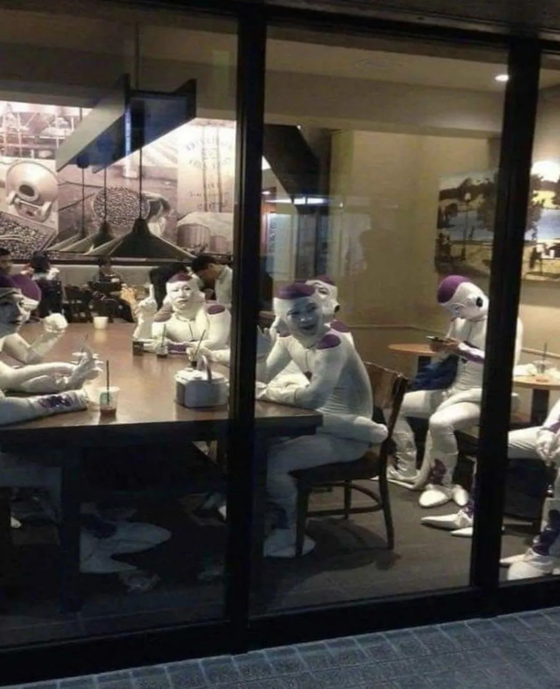
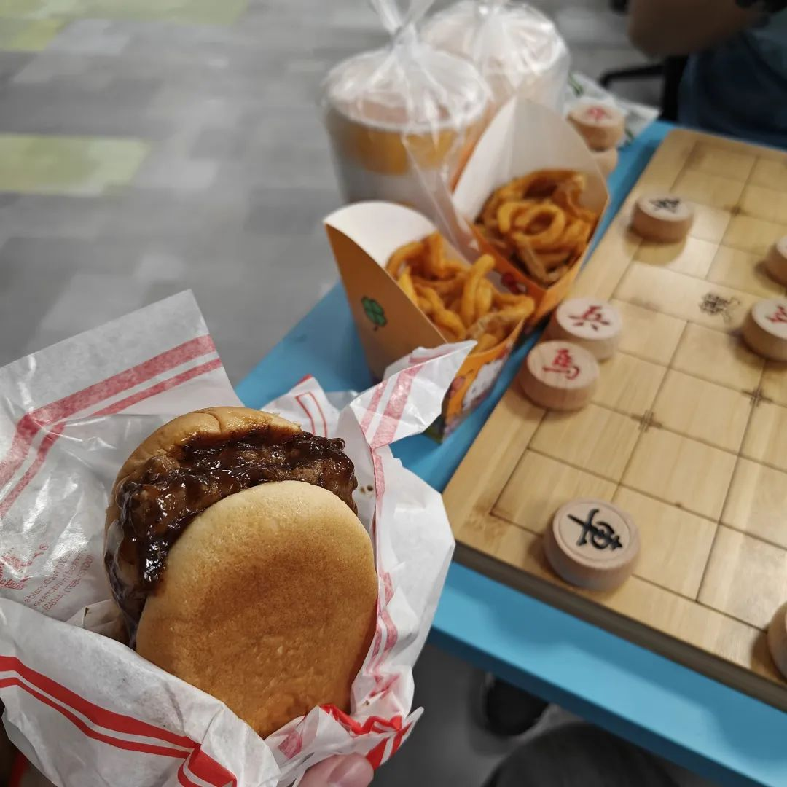

本文是张衔瑜第291篇推文

共计1441个字，3张图

阿房宫赋里有一句“一日之内，一宫之间，而气候不齐”原本指代着在阿房宫里有很多很多的建筑，以至于东边日出西边雨，大到一天的天气变化都觉得只要是发生在阿房宫身上的，没有什么值得稀奇。

这两天都觉得很困，新买的各种物品又还没有送过来。在心里骂这里的快递慢得出奇，事实上我自己的科研进度也没看到快到哪去：等细胞长起来、等代码自然而然把自己跑顺。

有眼窍的人都知道，这是不可能的事情。

今晚吃饭的时候，照例还是我们几个每天来加班的人。今天讨论的话题已经不是：为什么我们加班又多 却还是最累。今天他们交流到一半我开始突然琢磨：我是谁 旁边的人是谁 为什么我们坐在一起吃饭。形式上来说，我当然知道这是我的师兄师姐好朋友，我们来吃饭是因为食堂周末不开，正好到点了大家也都饿了，那就来吃饭吧。

但我的问题不是这个。我的问题就好像本源上惊鸿一瞥的那种，为什么我要坐在这里吃饭为什么不去外面吃为什么要吃，为什么是我的师兄师姐我们熟吗我们认识吗？以及，我在做什么呢？我在吃饭的确没错，可是，好像我也不能一下说白道明哪里出问题了。有点像怪核给人的熟悉而又异常感。

之前看得多的是有一个地方频道的新闻播报，今天在哪发生了工厂泄露请周围居民回避、新年的钟声敲响了，人人脸上洋溢着幸福又富足对表情。

咨询了另一位朋友有没有类似的感觉，朋友问是不是好像从现在的生活里解离了出来。通过问题我可以知道，对方应该，没有过类似的经历。

今早做梦，梦到大雪天开车出门，左舵车。在高架绕行的时候想一会儿应该去哪，结果三个出口都指向河南某地名。突然岔开路口下高速去，盘山下楼，对向来车对我们喊：别下去啊，底下好危险。我傍着山体开下去，蹭掉了路边的小石子。开到尽头，挑高的木架看到对面是安静温馨的暖黄光屋子。后边来车追尾了在断头路上的我，兴许是刹车不稳吧。我的碰头从那辆车上下来。我们一起痛骂这个世界，好像周围有鬼，值得一顿痛骂来把鬼赶走似的。

梦醒了，又继续睡。继续睡的时候已经开出来了。开到寺庙旁下车走入。道长帮我走过任脉附近四条经络心包络之类的，我不太懂。于是说，我不懂，然后转身上二楼。二楼的人们在抄写誊写经书。我看有一处笔酣墨饱的座位，就在那坐下来和人一起抄经。

靠着墙壁。如果墙壁是毛毛絮絮的类型，则有机会和我感受到双耳不同带来的混沌感：一只耳朵里是安静、一只耳朵里是低频 连续 不假思索的噪音。这种噪音有别于白噪音，低分贝、低频、低语式的最容易令人感觉地毯的存在。

没道理永远是一个样子。

没道理永远在变化中。

讨论变化的学问，那就是易。易固然是一种认识论，但如果使用这种变化，则到了超越的程度。超越之后就意识到，变化是可以被规范的，变化是生就的。变化是没有尽头的：像泰勒级数泰勒展开一样，只看你的计算精度需要描述到哪一级罢了。

可以，和随时都可以；有得吃，和不用算着钱吃；希望认识的朋友都能早早明白焰色反应的原理，并且明白能级还会不断裂分的量子规律。

你看这个囷囷焉想不想困困嫣。

都护在燕然。

倘若施主不懂佛法，贫僧也略懂一些拳脚。看是安心坐而论道，还是拳脚场上分高低。

下扶梯的时候，顺势在扶梯上坐了下来。下扶梯有一分钟的时间。站也是一分钟、坐也是一分钟。生活也是如此。

复兴了一些传统体育技能，比如下象棋和下围棋。感觉对于“势”和“式”的理解又多了一些。好想看一部讨论体术与符文的玄幻小说，但似乎最近已经不多这个题材里我能看得上的了。或许，早就不复当年辰东、天蚕土豆、唐家三少、江南和梦入神机他们斗仙斗法的时代了吧。

