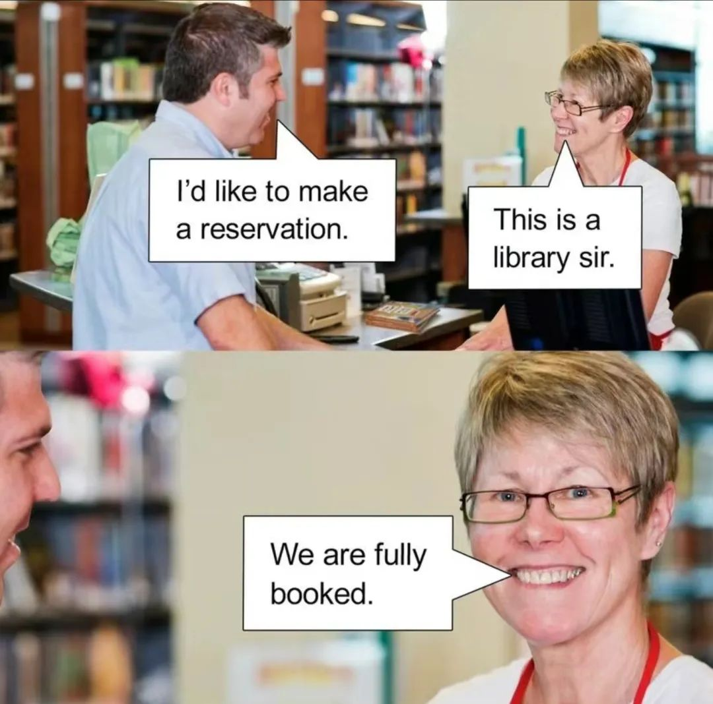

本文是张衔瑜第294篇推文

共计2209个字，7张图

喜欢说一些抽象但是具体的话。和国人说这些的时候大家都会会心一笑，和老外也会，只不过笑不了那么会心。

搞抽象这种事情每次都喜欢拿出来大说特说。纪晓岚会把白天骂人的话回去写下来，虽然像个野史资料但似乎是真的。阅微草堂笔记写了各种志怪的东西，前年过年的时候我还拿着这本书坐在房间里看了蛮久。也许现在对玄学了解深刻很多之后去看，又是不一样的感觉罢。

年前去剪头发。理发师看起来也迷迷糊糊的，料别人见我如是。理发师问我剪个什么样的，那会儿和Hio出门之前我们讨论过这个事，就说当别人给你一道选择题的时候，有时候其实别人已经选好了答案，只是来给你猜一下看能不能我们猜得一样。所以晚上我问她吃什么的时候，她说喵喵喵？我本来也想跟理发师喵一下的，又觉得这样还是有点暧昧不清，不讲道理。又有点想引导一下理发师，毕竟不管最后怎么样理发师都会按照理发师所想的的那种样子去剪。

于是，我和理发师说剪个过年的。期间无交流，结果还不错。

过了两天我和同桌出门吃过年的预备餐。同桌问我吃什么？我闻要不要先理个发，你看这边关门早，于是又带他去了那家理发店。他问我怎么跟Tony沟通的，但他也不听我说什么，就直接跟理发师说这边推一下那边剪短之类的。等他briefing完，又转回头来问我是怎么说的。我说，剪个能过年的喜庆的，能保到二月二的。同桌于是对我指指点点，说我不应该给人这么不清不白的指示，那什么叫过年的发型呢？

他不知道我是在攻陷Tony老师的mind palace毕竟这样才比较合理。店里太挤了，我去隔壁华人新年市集上买了点瓜子站在垃圾桶边嗑。同桌一会出来一脸惊讶，说刚刚那老哥问我是不是xx学化学的，还在洗头呢当然那眼睛都瞪直了说你怎么知道。我说我上次来什么也没说啊，以前也来过一次但那都七个月前我过博士资格考试的时候了。

那一次也很抽象。店里要关门了碎头发都扫完了，我走进去问老板能剪吗？老板说按规定是下班了。我说我明天有个重要的会议报告要去讲，能不能帮帮忙？我跟6+1兄弟一起来的 老板看了看，招手叫几个弟兄来干活了。洗剪吹操作完，老板说他的钱得你来付，这才像话。我是看在你的面子上，又给他理了个发。

肚子好饿，去国货超市思家客的熟食档口买夜宵。熟食档口老板正往里收所有的东西。我说老板我想吃肉夹馍，老板说没有了。我问那你们有什么，她问你要什么？我一下子火就来了，我要的你没有 你又问我要什么，这不是典型的无效沟通吗？

我也生气了，我说给我我能吃饱的，夜宵嘛，你懂的。档口老板说有小煎包你吃不吃，我又想瞄一下，结果说了句你看着来呗，什么都装点。老板说，这个小煎包五块钱十个，给你随便抓五块钱的吧然后哐哐装了快二十个，我说我还想换点口味吃煎饺，本意是搭配起来大概十个就差不多了，老板又哐哐装了一大袋，贴了个五块钱在上面。这明天的早饭都有了。快说，谢谢白案侠。

学校旁边新开了家印度餐厅，飞各种飞饼。我总想去试一试，于是拉上我们组的泰米尔师兄和印裔师兄一起去吃。他们帮我点完，我觉得好吃。但我觉得他吃的更好吃，是两张飞饼然后放上肉材接着刀切磋的一道宽度适中而且刀刀见肉的硬菜。师兄吃的鸡肉kotum prata，我寻思着要不吃个羊肉的。侍应生过来，说我们没有羊肉的了。害怕我听不懂，又用泰米尔语告诉了我的同伴并再次告诉了我。我努了努嘴对旁边的fair price平价超商连锁：或许，超市就在旁边，你们可以去买吗？

侍应生以一种匪夷所思又好像被点拨了的表情离开了。最终还是没吃到。后来我又去过四五次，每次一进屋，侍应生就进屋去找羊肉，然后跟我说有羊肉。我也的确每次都点，这是这里最好吃的东西了。直到我又再次点单，用印度口音的英语点mutton kotum prata, 侍应生笑出了声。我说你冷静点，先别笑。然后跟我朋友用泰米尔语确认，我看我朋友连忙摆手。后来才知道原来侍应生想说他不是故意的，只是一个玩笑，让我不要觉得被冒犯到。我说我也只是来吃饭啊没想给别人制造麻烦。他们菜单上有羊肉这个剁飞饼嘛。

辞采华丽的朋友来我这玩，说不好意思来晚了，今天给恁拜晚年。我一听这人说话就不太对劲，于是笑眯眯地问，怎么样啊(拍肩)我的晚年还幸福吧(又拍肩)你来得正是时候，帮我去饮水机打壶热水然后去烧至85℃保温，然后取一颗小青柑半切新会陈皮然后70℃左右过一遍里面的普洱洗茶最后沏一盅给我。朋友，说慢点等我记一下。

中文的硬菜喜欢吃黄焖鸡。黄焖鸡里面的哲学很多，那是一种生活哲学。这个东西imply烂也没关系。从土豆黄焖鸡的角度来说，就是要烂，越烂越好。不烂不痛快。不烂的话长链淀粉都还没破碎成支链。

i人相处的确很愉快。但两个i人吃完一餐之后，没办法叫服务生，只能期待服务生过来把盘子撤下去才能上冰淇淋。这就得点先找个人眼神对视。那情形也很简单，就好比两个人都凑不出一张嘴，也没有一支能举的手。

每天接梗找乐子实在好玩。身边的博士生们多的是喋喋不休碰到一件事可以讲好久好久，就好像前因后果都要讲给你。比如我只是欠钱然后随缘拿了个现金给人。这个朋友不知道是不是英国人毕竟法语比英语流利，然后从英镑讲到先令，从女王讲到老王子什么时候能印新的硬币说这可能是最后一版。

头脑爆炸地感觉到一些异物入侵，就像introduce drug to stomach. 很崩溃的情况。好在可以胡言乱语，永远不会有人知道我能接多少梗。像练到于谦捧一切的那种水平。
