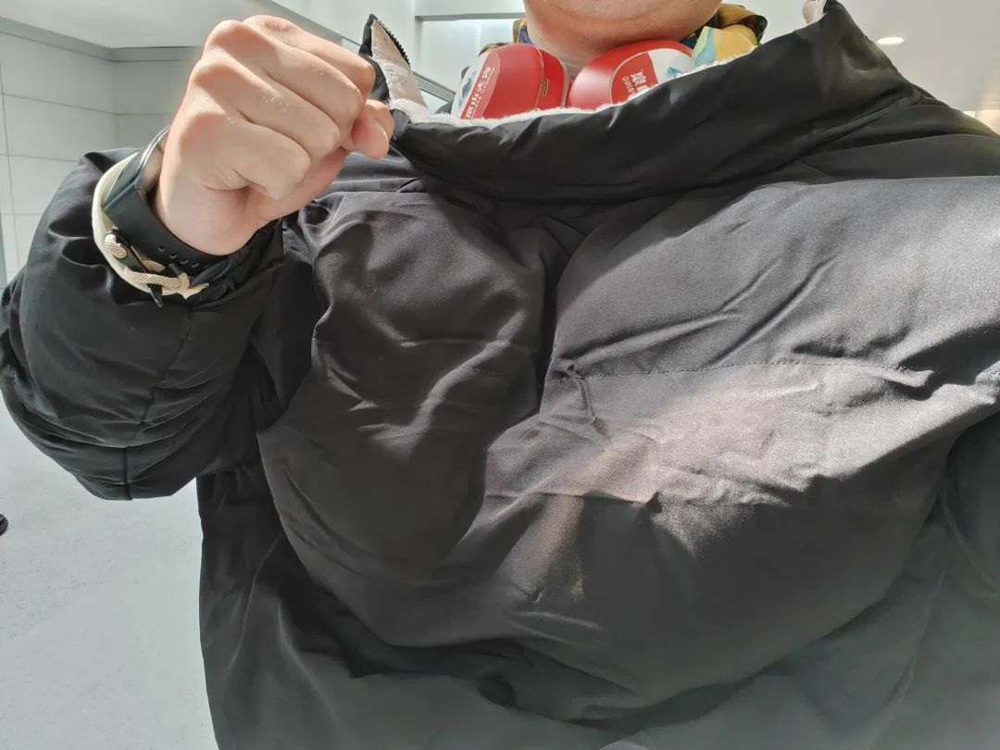
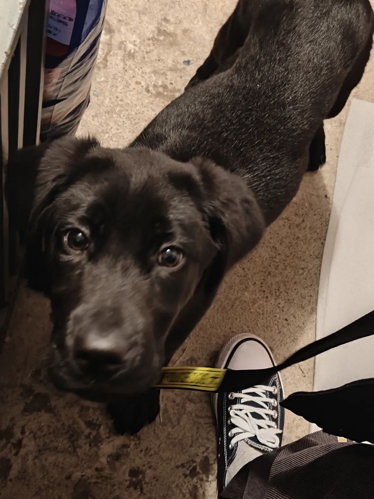
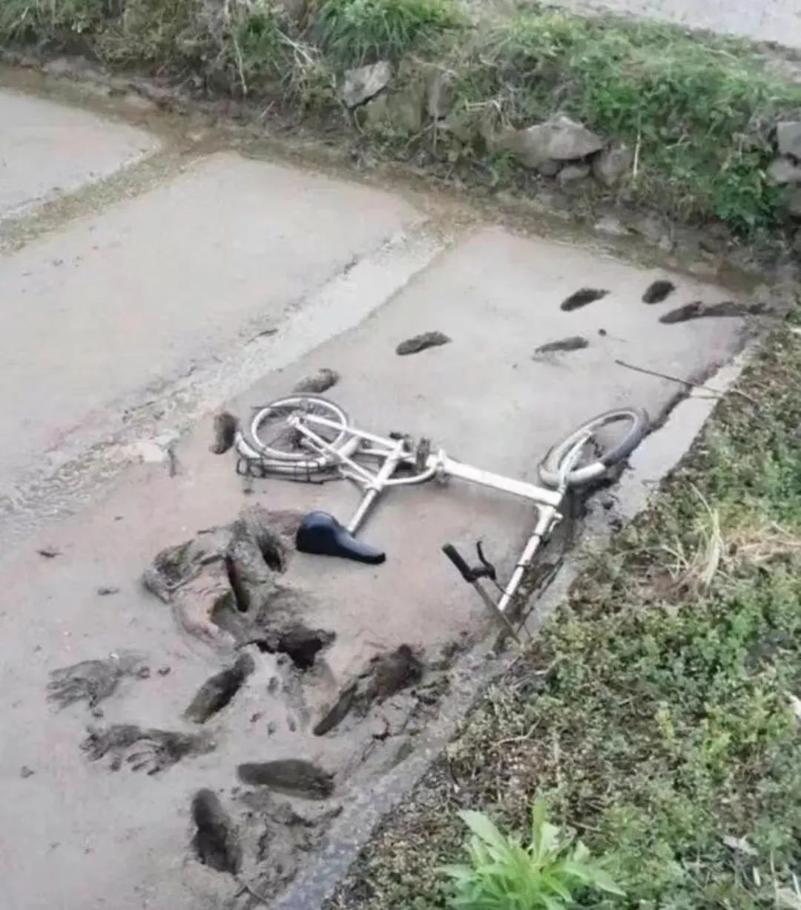
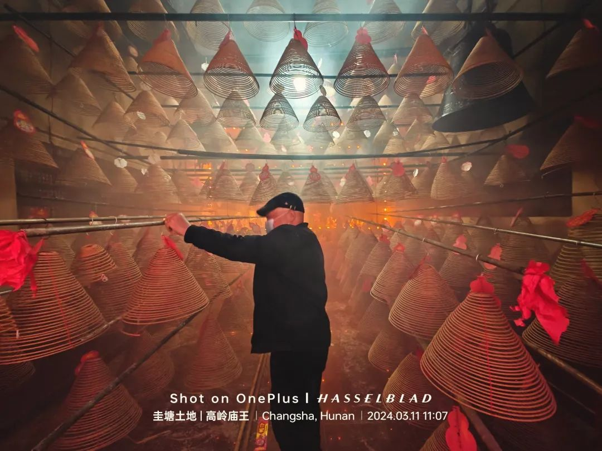
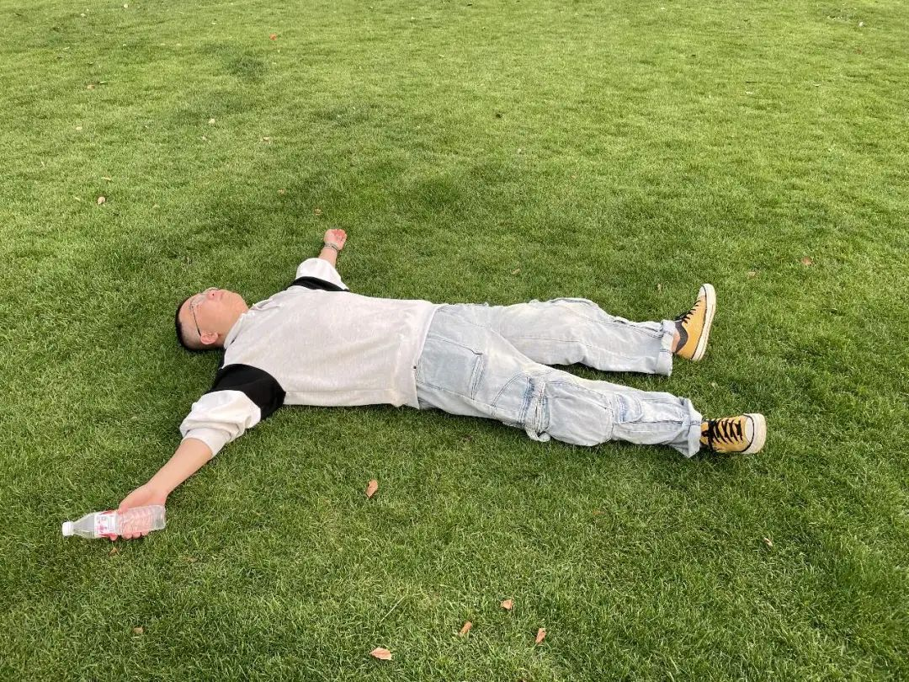
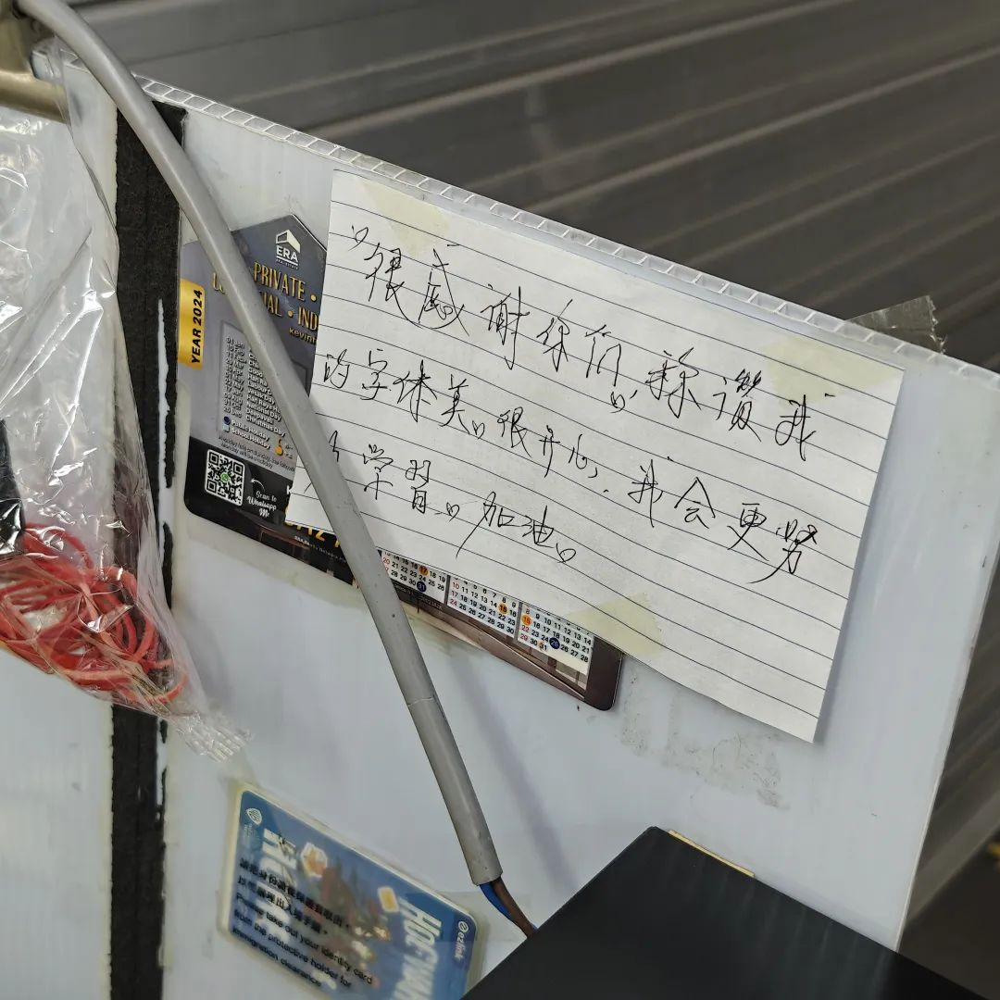
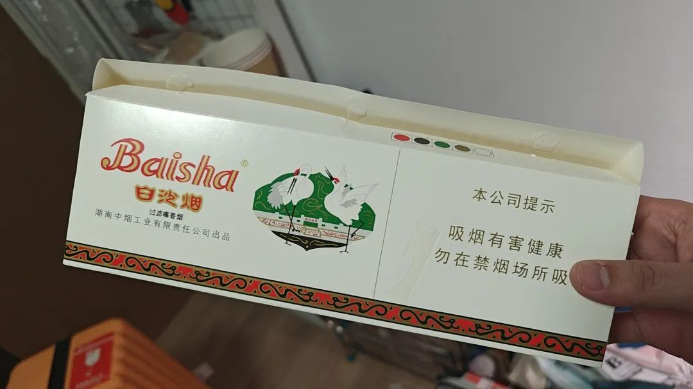
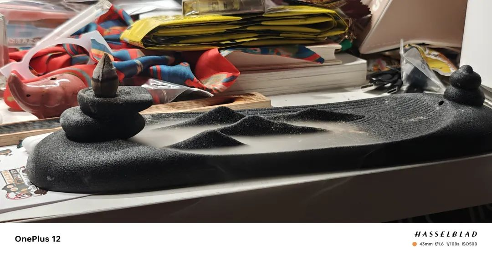

本文是张衔瑜第295篇推文

共计4273个字，8张图

没写推文的这段时间，回国了一趟。一个月的时间，三月份。我最喜欢的气温变化。这种变化让人感觉到周遭世界绝非一成不变，人，也随之变化。

昔我往矣，杨柳依依。

今我来思，雨雪霏霏。

回国的时候在上海转机，好朋友嘎嘎和寿司来接我。下飞机的时候，我穿短袖，机场操作廊桥对接的大哥穿着厚棉袄接近绿军大衣的程度。我早知道事情不简单。

换上了秋裤和卫衣，这是前年十一月底我的打扮。去停车场的时候，闻到空气里干冷的味道，就像抽到了好烟一样地猛吸。我就知道寒冷的空气是不一样的，彼时上海冰点，披上了嘎嘎未婚夫的大棉袄。寿司挖苦说这都是霾的味道。笑，冷的霾我都觉得好闻。

回家。洗上热水澡。现在说起来已经没有了当时的激动。热水澡，冷天的热水澡就是和热天的不一样。冷天的热水澡，全身上下每一个细胞都在欢呼雀跃，跳起来，然后安逸地落下去。干了的跳跳糖在口腔里炸开。一样的感觉。整整21个月我没有过过冬天了。

开心地和朋友打了一通宵的麻将，大籽的麻将连摸三把杠上花，冰皮生日蛋糕和牛油烧烤外卖。长沙的生活谁不羡慕。忘记续费了，天黑着，就把手机灯打开。没办法打骰没关系，对着台面一记爆锤。朋友们的精神状态和生活智慧遥遥领先在在新加坡的我。

在新加坡的时候就和同桌研究了好久抚慰犬。申请复杂，所以去领养回来了一只拉布拉多。黑色的拉布拉多，四个月大，她的生日是我一年中可以过的另外一个生日。

每天离不开的，遛狗、铲屎、喂水。我很小的时候就想养小狗，大概是小学的时候了。等真正有小狗的时候，知道每天要面对什么：每次过斑马线都拉屎、带出门吃饭的时候在我裤子上留下一滩口水、以及在她捡地上东西吃的时候掰开她的嘴。

初学打麻将的人也知道，这是从混乱中建立秩序。虽然不能决定下一张来什么牌，但是可以决定现在弃什么。人生也是如此。

狗生也未必明了。她也不知道为什么有人对她好一阵，过一会儿就不见了。离开长沙前，我送她去了一个新的爱狗的家庭，我觉得她在那里比在我家要幸福好几倍。她也不知道为什么会把她关在车尾箱里，为什么有时候不走路，也可以坐在电动车上飞快闪过周边的景色。

我在长沙真的很喜欢骑共享电动车，租、还，到了一个地方，然后就去做我的事了。小狗的名字是花花，每次抱她坐到踏板上的时候，她都会调整座位到能看到前方的位置，时而左边看看、时而右边看看。

和山林小粒儿去烈士公园的时候，看到了一只漂亮的蝴蝶犬。牵绳子的人说她是法国来的。我和蝴蝶犬说Bonjour 和 Très bien 这是我为数不多会的法语。她对我也不理睬。发现摩登女郎也未必懂礼貌。

日子过得很快，气温也变化很快。长沙这一天能体会到四季的地方。我在备忘里写：热到穿短袖，又给冷风披上外套，这样的天气能溜溜街实在太舒服了。

想想一个月，我能遛街的机会其实不多。很多要做的事情都在头几天和最后几天才做。中间的时间。上秤，这个月瘦了八斤。除了狗勾一直陪着我，就是焦虑一直陪着我。在下雨的日子里和小狗遛弯，回家就没日没夜地工作。放了一个人体工学靠凳在床上，有时候靠凳就倒下来，等我醒的时候也不腰疼。只是保持着工学睡姿。怎么不说是一种工学院的博士生。

在岳麓山前山和豆老师走了个肾盂的形状，又从后山和TL6+1走了条横插腰线的样子。花花没和我一起，因为我本来想给她取名悠悠，但花姐对悠闲的生活不屑一顾，只想去春天里找快乐。于是吃坏了肚子。要吐了就歇着吧，所以两次上山都没有带她。

清明节一直是我喜欢的节日，因为活人们都在打鬼港。去坟上排了三根七星，边排边说这是鬼子烟，虽然不是缴获来的但也给您抽抽。抽得不如白沙快。我哥解释说这是外烟卡喉咙。祭如在。这的确是祭祀最妙的地方，好像人还在，所以准备祭品的时候要带对方喜欢吃的东西。外婆让我别带水果，说反正别人在世的时候也不爱吃。敢情好。

去山上的时候正碰上烧山。我是提前去的，所以当地正准备迎接将来的清明节，为了防火就先把消防车开到山下，山上先点火把可能将来会引发山火的地方都先烧完。我管它。我照样在碑前点根雪茄，然后烛一对、香三根、鸡鸭鱼肉蛋奶小零食。长辈在坟前絮叨个不停，被其他人制止。我马上声援：没关系！说个痛快！不在这里说还等着回去说啊，不要在别人背后说人是非，要说就当面说。感觉是做了一件值得骄傲的事，先记下来。

长沙的人情味也很重。二月二，龙抬头，我去给土地公过生日。兴旺的土地庙，案桌工作的都是志愿来帮忙的修德之人。湘阴的鼙鼓打得我站在旁边看了半晌，庙堂里挂满了人丁敬进的盘香。流水席也都免费，全来自香客们。

旁边的老奶奶说外面的席都从九点钟就进座了。我看着庙前搭的戏台子，午时到，过完海的八仙们也准备粉墨离场了，于是和哥哥抽了两条板凳去外婆旁边坐下来，看她外向地和一万个人打招呼，又坐到八仙桌前来吃饭。怎么不快乐呢，喊舅舅请我剪头发，救命恩人请个剪头发难道请不起吗？

长沙生活的确自由自在。和花花去河边溜达的时候，她硬要去草堆里打滚。我闲着也是闲着，就引诱她然后把她对水里一扔。小场面，拉布拉多是水性猎犬，谁信她不会游泳。基因也是要觉醒的，不然怎么当导盲犬。

原以为，有好多事情要去做：比如要去吃一次水风井小钵子蒸菜、比如要去搓一顿搞不好火锅、比如要去一次橘子洲头。每次去橘子洲头都是拖到最后。离开长沙的前一天，暖风熏得游人醉，和阿董在神职人员旧所前的草坪上躺下来。她妈妈有个很精妙的理论，说人要养精气神，就去找棵树抱一抱。抱树教。去找一棵最大的树抱一抱。很不错。于是我找了一棵三株同气合欢的大树去加入，听听树们开会的时候讲了些什么良心话。

我回家之后极少用索尼的头戴式大耳机了。也偶尔会拿出去，偶尔在家用一用，但大多数时候都不用。不是因为对歌曲没有需求，而是因为觉得旁边的声音是我爱听的，不是那种我每天不爱听的只想要你别讲了。返校之后我又随它去了，长在我耳朵上就长在我耳朵上吧。

除了一直要工作之外，偶尔快乐的生活的确有种目不暇接的感觉。一家人和花花去茶亭看惜字塔，敬惜字纸，据说塔顶的树是雷击之后自然生长在塔尖的。晚上回城，芙蓉路暴雨。八一桥嗦个粉，去接山林小粒儿下班，又去TL6+1家跟赌场气氛组打会儿牌，再邀到豆老师遛弯到潮宗街听常德夜宵摊老板颠勺和路人脚踏麻石街天下小雨。

我的确觉得人自己的生活是宝贵的。只要这些是和人相关，我没提到的社会时钟之类，再怎么样也都会回到吃喝拉撒睡。话可以乱说，感受不会骗人。有没有觉得今天也是悠闲自在的一天。快递店老板每次见到小狗都要搓好久的脸。小狗的确很讨喜，虽然也已经快三十斤了。

我三十斤的时候在干什么？明天得去看看那个人类小宝宝了。

返校四天，听的八卦能有十斤重。希望朋友们少跟我讲八卦，多做一些有趣的事情。有趣的八卦也还是可以听一听，但我更喜欢像在长沙时候的各种程度上的有趣。送狗勾去新家的时候，毋宁说他们在考察自己家能不能还收养小狗 当他们家的第三个小孩，同时我也在观察他们，看他们是不是会真的好好对待小狗。和男主人侃大山的时候，他评价我是个接地气的人。我说我的确对表面功夫不感兴趣尽管也有一些经验，但毕竟我不真的喜欢那样。

与其说我们去高档餐厅消费，在精致的人造庄园里看盆栽长得多好、观察学习木雕如何精致，我更喜欢在岳麓山上跟树林里不知道那个带音响的傻逼一起唱“迎着风暴、漩涡”。把活干完，在快递点碰到楼下的大爷于是跟他推荐东方树叶啊不含糖，我给你买一瓶试试，你不喜欢就拿去给孙女喝。

两个月前，在新加坡买老伴豆花的时候，看到老板留了一个繁体中文的便签在墙上，大意是“哪位顧客遺失的鎖匙，請聯絡我們的店員”一张便条。我边买豆花，边夸了老板十分钟，夸得Hio在旁边豆笑得走气。的确很好看的一手字，不管在新加坡还是在国内，手写便条还会认真写好我都会来夸，这跟在哪里没关系。

他们家是两个人轮班，一个奶奶坐早上、一个奶奶坐晚上。字是早上那个奶奶写的，夸是跟晚上这个奶奶夸的。我一直觉得晚上的这个奶奶为人有点尖酸刻薄，但一去夸她，她反而不知道怎么办才好，于是我就一直夸，反正也不是夸她。今天路过的时候她已经忘记我了，因为我看到留了一张新的便条。她解释新便条说是之前一个中国人在这里称赞了好久她的同事，于是她的同事回了一封信。我说你不用解释前因后果了，我就是上次来夸的那个中国人。

小事累积起来的才是生活，一些连接我都能记很久。这次到新加坡报税了两条烟，一条是各种牌子杂合起来的，另一条是软白沙，一盒二十根 只要十块钱。被揶揄，为什么不带点好烟，这么差的烟说难听点连高中生都不抽。我每次都愿意不厌其烦地解释，这个烟就是我两个过世了的祖辈都抽的烟，有时候点根劳白沙，就好像又在说话一样。记忆里就是如此，相顾无言的样子，我看着烟飘来飘去、烟灰弹来弹去。

盛大的、满面红光的，跟我关系不大。三月买了两副大籽的象棋回家，跟老爹和老舅下了估计得有一百盘。下得输赢无所谓，重点是很快乐。过年打牌的时候都会把“十勾圈凯尖”和“飞机带翅膀”大声喊出来，下象棋就更加了：仙人指路、天马行空、五七炮、沉底炮、盘头马、巡河车、沿河十八打、两头蛇、袖里藏刀、单马擒王。有些快乐就是一些思维上的体操，越搞越来劲。有些棋也知道必输，那有什么关系呢，又不较真，大不了一顿早饭钱之类的，兑不兑现都不重要。

经常被人问到以后的打算，短期打算我说去冷的地方，长期打算我说在长沙的数字游民。游民游侠，游民星空是我最早去下载盗版游戏的地方。油漆工，游来游去，这里瞧一瞧，那里漆一漆。和信从碧湘街走过落星田，走到盐道坪，走到小吴门，我说我不喜欢每天如常不是指需要如何强烈的动荡起伏，而是不要毫无想象力和生命力地闭塞和干燥。

在实验室开了一管新的细胞，英国的同事跟我说Sorry,I took your space. 我说 doesn't matter. This is university, confirm there should be enough elsewhere for spaceship in the universe. 同事大笑，我说不信的话去问马斯克吧！我从来不说假话。

戏说不是胡说。就像养狗的时候，每天给小狗要捡四到五次屎，每天养细胞反正也是在喂。这都不用看紫微斗数子女宫，反正有什么东西一直占着。

再写的东西也都是旧事重提，还不如让大语言模型给我一个数字孪生，复刻我的讲述习惯。我的好恶都写在里边，没有什么好回避的。感觉到的好恶在驱使着人应激地走向对自己更好的方向，好吃懒做就是我直言不讳的优哉游哉。

新买的香台一定要拿出来说说。沉香，点燃之后可以香气下沉，看起来就像远山一样，这是我现在看不到的样子。雾气氤氲，能想象到去踏青登高，和朋友插科打诨我猜前面一定有树林和锈湖不然怎么说这般光景。我已经能想象到那种快乐了。最近每有人给我讲八卦我就点根香，每有人喋喋不休我就假装在听然后实际上看雾。下次找我讲八卦或者算卦的人请自备香烛烟草。

