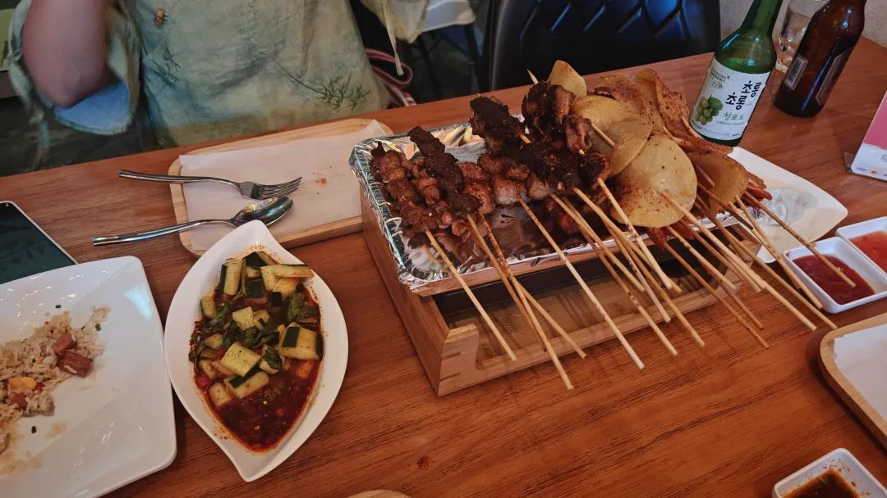
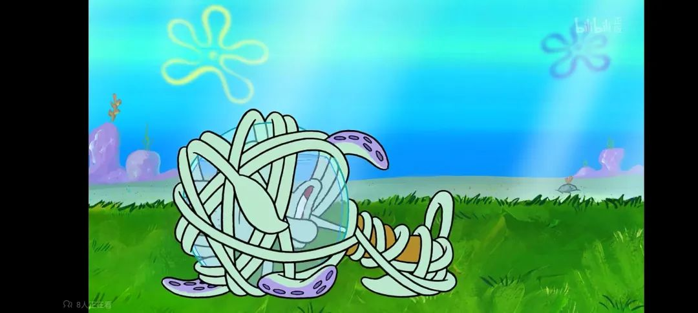

本文是张衔瑜第299篇推文

共计3186个字，4张图

梦中醒来，记下最后的场景：

鲁磨路还是摆着摊的样子，就像回到了2016年。高高低低的红顶蓬灰铁架，一筐筐的人 被搂在一个个摊锅前，不动不弹。我走在油泞的夜宵摊和临街店面之间。

现在也能想起当时的两个摊贩：一个卖肉夹馍的、一个卖炒饭的。后来又多了一个卖潮汕生滚粥的、一个卖绝味花甲粉的。卖肉夹馍的摊子是夫妻档，男摊主揉馍馍 每次都把馍拧到最前面，女摊主则守着那口釜，有个护着小半边的铁板 硬连接在满是刀光剑影的砧板上。每次点完肉夹馍，我都会把本要切进去的辣椒拿去旁边烤米豆腐的铁板上过一道，然后再拿回来，让老板给我涝肉切进肉夹馍里。后来我更离谱一点，就在隔壁卖炒饭那里要一个炒方便面，然后去肉夹馍的摊子上说给我加两块钱的肉。老板最开始还愣了一下，问我两块钱的肉是多少肉，我说就是两勺你那锅里的肉，你看值多少钱。老板狐疑地看着我，后来总算发现我在诓他们了。

做梦的时候没梦到这么多，也可能是没想起来。没有素材的梦，就很难渲染。或者说这一块很难触及，封着很久，以致于上一段里都忘记了鸡蛋灌饼和烤冷面。刚刚才想起来。

大差不差，每个地方都是这些。做梦只梦到了去临街的小店里，要了四串五花肉和一串羊肉串，后来又补了一串红肠。旁边立着个木桶，齐腰高，里面酿着的红肠酒。天知道里面是些什么东西。还没吃到呢，梦就醒了。

但没关系，也可以醒着梦游。

最近最深的感触，要数在一边推导大六壬时，一些警觉浮上心头。术数本无偏颇，天气也好各种杂事也罢，本是什么都能推衍的。除了别人找我算的之外，我自己平常不怎么在自己的事情上起卦。我不信那些说起卦耗蓝的，不然也就不存在射覆一说。频繁自用术数的真正危害，在于会使人的自我决策能力受到损害。

譬如今天就该拿主意，去吃烧烤还是去吃泰餐，得拿个主意；未来一年是继续在海外漂着，还是回家；队友们都等着你呢，下一轮比赛如何安排上场队员。有些事本来自己就可以拿主意，虽然不一定每时每刻都举足轻重地吹哨，但独立的人格本是既不刚愎自用又不轻易左右。术数的准确性越高，越引得人诱惑地往后者走去，越发失能一个人的果断。水平愈高，愈能感觉到这里边的审慎。

我只在极小的事或极大的事情上起课，中间的事一概放归自己。极小的譬如寻物，我的狗丢了/护照找不到了，又如明天天气怎么样，又如快递什么时候到。极大的事很难说，讲究福临心至而不是刻意强求。剩下的事就看谁来找我，毕竟也不是所有人都要遵循这种自定义的规则，我也有怠惰的时候。算是看得越多，越觉得不可亵玩，要么就干脆放在完全不动脑子的地步。所以我现在不怎么看天气预报了。

说来轻巧，但不可得的经验并不一定需要经由我而得到注脚。这点很重要。

符号化地来说，术数本身是稠密的。稠密的数学概念可以简单说说，比如有理数集和无理数集都在实数集上稠密，但几乎所有的实数集都是无理数。这和我们的常识一致，即无理数比有理数多得多。但为什么有理数集在实数集上还是稠密的呢？

所以，我们姑且可以认为经过特征工程后的人生有着它的数字孪生。经过multi modality调谐之后的生活能偏导去某一个子空间。倘若所课之事服从于课体构造之分布，故而可以认作该映射成立，或，需要校准。解制即得解。

我自然还没到可以构建函数的程度。但是，解函数题这件事本身，可以把抽象思维方法在一次又一次地体操中强化审美。换元、构造、数形结合，这些思想都是具有对称美的事情。这比当下一道题来得更为珍贵，而不是一道题。这里面的差别，就跟平光镜换近视眼镜，近视眼镜上还加色弱矫正一样有趣。

话又说回来，太阳不是被公鸡叫出来的。讲得再美丽，雄鸡一唱天下白，太阳也不是被公鸡叫出来的。只要能承认这一点，应该就不会走偏。

所有的原理都很简单。有人的地方就有例外。笑，我说话也开始变得南腔北调了。

笑晕头。洗澡经常会引动手表，每次切换进不同的应用。时常让我洗着洗着澡停下来，因为像是听到了什么窸窸窣窣的声音。通常是训练模式或者放松模式。奇怪的声音说要调节我的肩颈。谁听了都要左顾右盼。

更离谱的是，会乱拨电话。好在我不喝酒，所以也不存在喝了酒就打电话给天南海北的人。最绝的要数第二天翻电话簿的时候，看到昨天晚上主叫拨出了一个电话。那个名字我都几万年没见过了，更别提深更半夜打电话。算算时间才想起来应该是在洗澡，不然任谁也不会已经博士晚期了还半夜打电话给高中学校外面社区路边摊的烧烤老板(没错那个电话打给了马甲冲烧烤)我从高二开始就没吃过那个摊子了。

今天又梦到了食物，是一个档口的老奶奶，看着很和蔼 实际上端着一盘硕大的煎饺和调好的辣子碟但就是不给我。我人都要毛了你怎么还不把煎饺给我，看着皮薄馅大的煎饺蒸饺一半一半，白菜馅的我都不用吃到瞟一眼就能看到但怎么还不给我。气醒了，于是去思家客买了一份锅贴和一份煎饺。看到旁边香芋地瓜丸，顺手也捎了一份。

每天的实验都有新的能让人气笑的成分啊(笑)蛮佩服象棋界各位取名字的天才，据不完全统计，现在已经知道的各种杀法包括：屏风马单提马拐角马盘头马、雷公炮信手炮列手炮金钩炮琵琶炮、横车高车双龙取水大刀剜心、士角炮马后炮沉底炮、天马行空仙人指路沿河十八打、急进中兵单马擒王回马金枪回首望月、袖里藏刀两头蛇、巡河车挂角马双马饮泉二鬼拍门铁门栓铁滑车、老兵搜山炮碾丹砂三子归边、浪子燕青坐堂、牛头滚。相比起来下围棋的人就内敛很多，也可能是我没那么了解。但印象中也很多，除了中国流之外，还有我以前经常下的双飞燕和手筋金鸡独立。围棋比象棋还是迂回很多，可以交涉的部分更多：象棋像力士的推搡，而围棋就像维摩诘经辩。

朋友问到我说毕业旅行去哪里？我想了想，能列出来的，除了大兴安岭，其实都没有那么想去。东南亚的巴厘岛 兰卡威 芭提雅 马六甲仙本那亚庇，甚至远一点的新西兰墨尔本、斯里兰卡、花莲，也就是想一想罢了。只是因为没去过所以去一下，有多向往，几乎谈不上，能去就去 不去也没什么遗憾 不去就不去。柏威夏寺的确很想一去，比前述几个地方更高一个层级，但毕竟现在去那里还有点危险。

关于毕业后，除了大兴安岭、去很冷和回长沙，其余的打算都是道听途说的社会建议，我觉得没什么抵触于是都接了过来。好比我对这里的规划就像一家旅店，很多旅客来了又走，但登记了一个住户。我这家旅店台本很明确，给每个住户都记录了住房时间，有的还住在这，有的已经离开了，有的预定了房间 正在来的路上。但至于他们要住多久，那还不是他们想住多久就住多久，我不收他们的钱但也乐得懒得赶人走。只有有些我的确很感兴趣的重点旅客过来，才值得我走出去在大堂合影：柏威夏寺和大兴安岭就是如此。朋友一直怂恿我去泰姬陵，去就去呗有机会就走一趟，没机会也就没有。那就是爱住多久住多久，也不留也不赶。

这算不算路径依赖呢？我觉得不算。这无关任何上升下降，不过是一些思想短暂过路，生命周期和“乌蒙山连着山外山”差不多。你提，我知，也能唱，也有可能自己搜来听。但这毕竟不是沼泽，不是寸铁。只是我的耳机里现在没在听歌，也没打算建一个歌单，所以怎么着都行。

我理解的是，这不是我最在乎的事。你的人文还在乎吗？你的风光还在乎吗？你的侧写还在乎吗？你的吉他还有意义吗？你的空气清新机是开的第二档吗？我也不期待答案。

最近给我的一个算法写说明的时候，写其中一步，说这里具有次模函数submodular function的性质。简单来说，如果定义东南亚旅游作为目的，那么去过的地方越多，剩下的地方对于你的吸引就越小。事情不非得如此，譬如我现在只去过新加坡和新山(当然雕门岛并不在新山 就算新加坡和马来西亚柔佛州)，但并不妨碍我对东南亚其他的地方兴致平平。

倘若次模函数叠合其单调非负的特性，不管是单调递增还是单调递减，都能很好地引出贪婪算法。有评价说贪婪算法是最符合人类直觉的算法。我反而觉得，消解贪婪算法的目的性反而把算法本质上所吹毛求疵的浑身解数的那些都甩到了垃圾桶里去。这才是人文思考的笑里藏刀。

擦了一下耳塞。搁笔于此。
