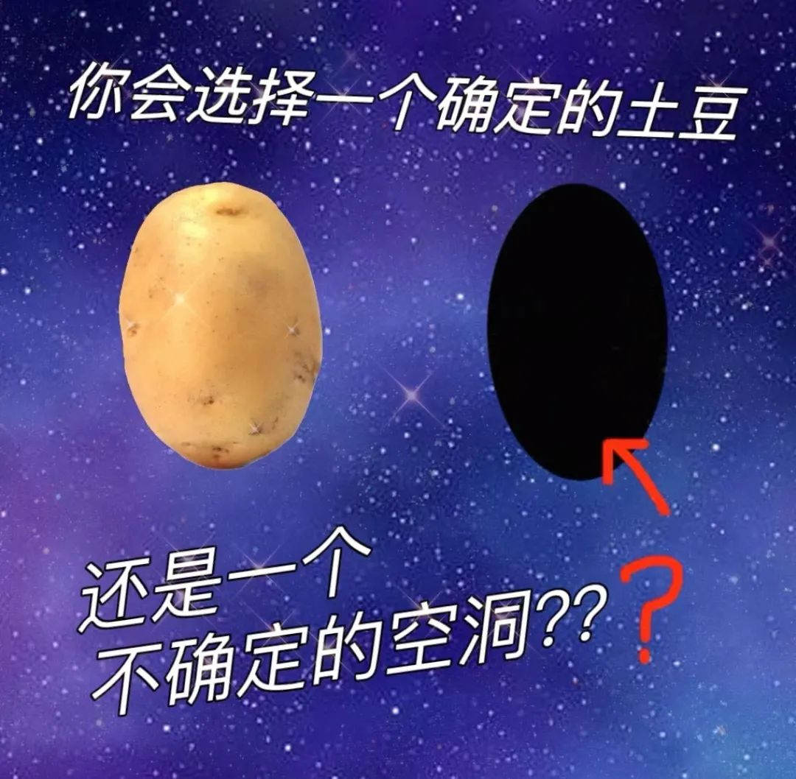

> Core t (s)   Wall t (s)        (%) Time:   249707.899    41618.025      600.0 11h33:38 (ns/day)    (hour/ns) Performance:       20.760        1.156

核时一位十一个半小时的作业，加速程度百分之六百。可即使是这样，每天也只能算20个纳秒，意味着每纳秒都要不止一个小时。

