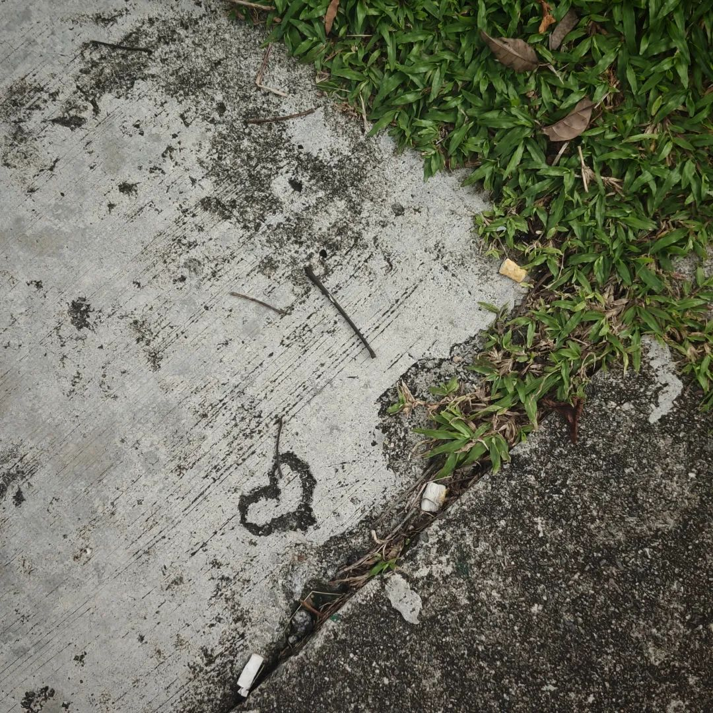

本文是张衔瑜第306篇推文

共计1817个字，1张图

打胡须膏的时候，感觉打得不够匀称。于是又从手心揩了一些，感觉还是不够匀称。于是把脸上已经打好的用清水洗完。重新来一遍。

胡须膏的确可以重来一遍。我不用电动的，就一直手动清理。因为感觉这样清理得比较干净，似乎自己的主动更多一些。于是情理上来说不会选择电动剃须刀。好像四月返校以来，理胡子的频率明显下降。

胡须膏可以再抹，没关系。但是落日过了就过了。今晚落日时分，房间里保持着白天不开灯的习惯。无厘头的《回魂夜》结束，多少是一部无聊的电影。随手给了个豆瓣评分。想起来这部电影还是当时初中暑假补课，蜷缩在深绿和米黄相间的被单里。学习机是朋友的，按推算来说，当时我应该在看《神墓》或者《武动乾坤》，分别被重命名为《昆虫记》和《海底两万里》 。每次聊天的时候，都说我在看什么初中生必读名录。于是我把我的学习机和朋友的互相借着玩。当时只看到大概20分钟左右，隔壁寝的兄弟就偷偷跑来，把学习机换了回去。有过了几天，一个矮胖的朋友说他当晚吓得睡不着觉，于是跑到一个室友床上抱着睡。记得不错的话，应该是被抓了深夜违纪。

虽然偶尔会倍速快进，但当时看来先锋的一些处理和表达，现在看来也不过尔尔。我总是对这些很挑剔。就像一些有保质期的食品一样，即使描述当时这个食品多么具有先进理念：绿色水果、人造肉、跑地鸡，也好像什么也没有说。这部电影看完，是今天看完的第三部电影了。

窗外望去，新加坡正在蓝调时刻。我的窗户朝北，西面被另一幢大楼挡住。只能朝东看蓝调朦胧而又清晰地被这座城市的灯光给挑剔。地铁到了地面上，就叫轻轨。轻轨散出的暖黄光让人已经闻到了一股人味。配合组屋亮起的走廊灯，白昼把日历又翻了一页，五月十二晚上的月相名叫“宵”。

有位好朋友🎵学古琴。我们聊起古琴话题，也是因为《良宵引》。今天黄历说什么也不适合，于是去剪头发的朋友剪毁了来找我问怎么骂人，洗鞋子洗坏了的朋友来找我问怎么讨回公道。今天很多店铺里的人都懒洋洋的。像睡了觉，就不会醒。

昨晚和今早看了两部杨德昌的电影，《一一》和《青梅竹马》。杨德昌是事实意义上的手术师，解剖生活。借用电影里的话，电影实际上延长了人们生活三倍，把没能经历的事情放到面前，让人看到自己看不到的后脑勺。蛮精彩的，也许是看到杨德昌把生活中没吵的架、没流的泪，都放在了电影里。除了有太多想借电影内核来发挥的话，我也蛮喜欢音画不同步和那些空镜。这两个是一回事，意味着视与觉分离，看到此而心在汪洋、观自在而心寥廓。要么思觉错乱，要么思觉不胜，总之思觉并非一致。我以为这些都是高明，以流畅和完整的线性与非线性来延展生活。有觉得看完之后，自己又老了一些(衰玫瑰

今天是哈芝节，新加坡法定节假日。本在今天的气相色谱质谱联用培训，也由实验员提醒而改到了明天。明天很好。昨天把周末要聚的局也都聚完了。所以今天既没有朋友的事也没有工作的事。我好像已经好多年没有享受过这样不需要和人进行线下任何情绪沟通的一天了。房东出去旅游了，比我大十六岁的室友也出门了，我猜他是打工去了。

潇洒地睡了不需要闹钟的觉，看了三部电影。在犹豫第四部是接着看杨德昌还是看是枝裕和，朋友推的《自由作家》和小红书推荐给INFJ的《海边的曼彻斯特》暂时也没打算看，projector也没有上什么新。好在🍒及时打断施法。上次他在赛里木湖给我打电话，今天在华科西一食堂。我问他怎么这么快到武汉了。又要他把视频镜头转向前方。看到青年园和化学楼的碎影，和一个和我在华科骑了两年半相差无几的电动车飞驰过去。我说，这明摆着就是我的车。

想当时在武汉大雪时在西操东南角的上坡把车头摔歪了。毕业后，请玥学长帮我处理了这辆车，换了电瓶。我想，三四年过去了，也许是又换了新电瓶才能跑这么快吧。

🍒贡献了我今天为数不多跟人在线上的情绪交流。当他走到南大门前摆的毕业展时，我顿时感觉到一阵劣质。不是那种贫穷而干净的舒适，而是一种思维缺失的呆板和眼屎。我于是开始和他说起华科笑话，在他往回走的时候拍到主席雕像，我说主席扬起的手就是想抡起一巴掌弹走这些不成器的东西。在他的镜头游走下，我实在感觉各种尴尬癌和无聊。原来在看完电影后气顺了，现在在打视频时气堵了。这就是视听艺术。

依然不需要什么交流，有人给我发消息就回一下。把房间里的灯，从冷亮的writing改成了暖黄的leisure。不知道这么好的一盏双灯最后会留给谁。

看一张前天在路上来的一角。

下次也不知道什么时候才能有机会自己待这么久，不和线下的人接触。应该很难做到。
