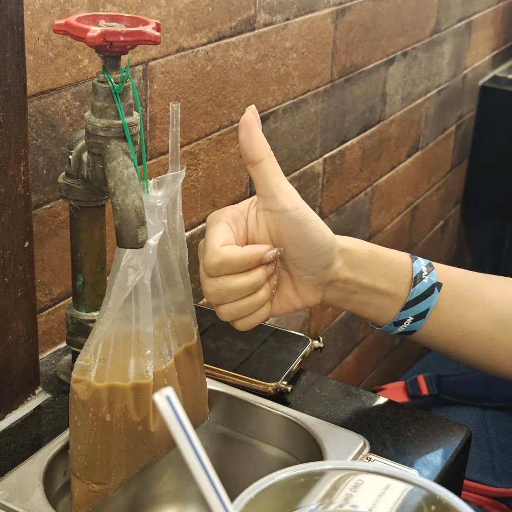
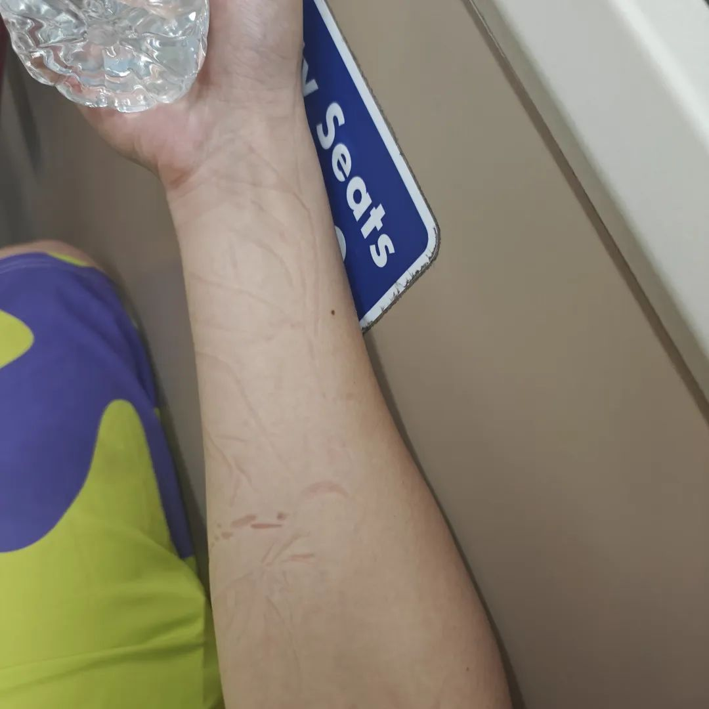
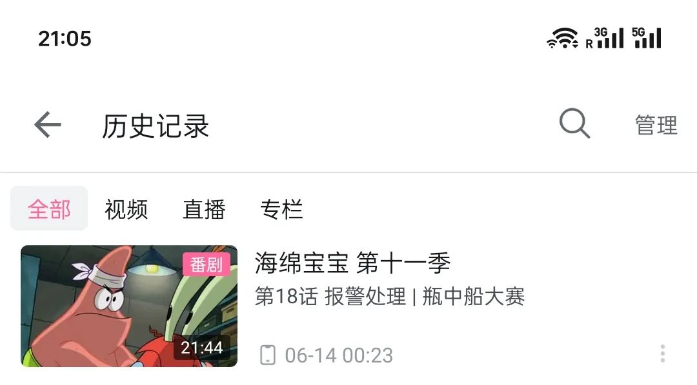

本文是张衔瑜第309篇推文

共计2068个字，3张图

女儿到新加坡，带了一个贵州的风筝过来。风筝是来自一个民俗博物馆的，上面有贵州丹寨的蜡染图案，还有一些彩色的线。是我选的图案，不过还没来得及研究。

聊完了最近的跌宕起伏。女儿说想去赌场看看。于是我们放下行李往赌场去。以下这部分是我在赌场里面坐在没人坐的老虎机位子上写的。

———— 分割线 ————

和女儿在赌场里。女儿睡着了。我在旁边看着包，写下这些。赌场的确是一个不应该开放的地方。人们把自己的金钱交给概率和电脑游戏。

赌场只是压缩了的人生。人生毕竟也是一场豪赌。出生在怎样的家庭，和谁恋爱。赌场反而比人生更简单，人生比赌场荒谬多了。

我能看懂的只有骰宝和德扑。没道理去把经历了荒谬得来的人生，又脱手交给另一个层面的荒谬。看到很多人对着程序化的屏幕一阵狂敲。我试了试能不能关掉声音，不能。我想，赌场还是留了一手的，把会给普通人以反馈的声响留下来，把我这种人生赌徒劝离。我想，这样的声音反馈，赌到了多少之后狂暴的刺啦声和进行曲 ，会让普通人更沉浸。而如果我做什么很冒险而鲁莽的决策，这种低劣的图像和反馈只会让我觉得恶心。我的赌性和这里杀红了眼杀得血流成河的人不同。在我看来赌场跟小孩子过家家没什么区别，只不过地方高级一点，更像成年了的小孩。

面对人生才是豪赌啊！

张衔瑜在凌晨的赌场如是说。

女儿已经睡熟了。感觉赌场的椅子对颈椎不好。不过没关系我看着表，毕竟明天还可以去做按摩正回来。别太久就没关系。

新加坡是很多时候都把人当成小孩子一样的。在学校读博的时候我如是感觉，在赌场看到“负责任赌博计划”和“新加坡公民收门票 外国人免费”时也如是认为。

———— 分割线 ————

人生的豪赌更令人揪心。最近在帮表弟参谋填报高考志愿也是如此。有那么几个节点很可怕，在手上有一点资本而又信息芜杂的时间，就要做出怎么称呼重要都不为过的决定。

相信自己所相信的东西，和，不相信自己所相信的东西。的确很令人想起先民求雨。曾有人发现仪式之后可以得雨，而后每每求雨就向仪式去寻找教训。现代人工直接对积雨云发射降雨弹。到现代知识水平上，人们当然知道怎么做是有效的。但在具体时候，真不知道能怎么做，又或怀疑哪个参与仪式人员心不诚。人生不啻一次各种冒险。我每每在这时候都感觉沉重得喘不过气来，但又得按着自己在桌上被迫成长地参与赌局。没有人知道，却又可以推衍，却又承认误差。未来是确定的好还是不确定的好呢？也许像我这样放不下又揪着心，还把自己摁在赌桌前的人最挣扎罢。

送女儿到场馆后，我从新加坡的东部等车到西部。因为觉得应该看看世界多了解了解，但脚实在疼得没法走，所以选择了坐车。

等车的时候，喝完水，好像能听到喉头的响声。好像还有一个人也在长出气，如鲠在喉，鱼说话了。长长的公交车等待时间，发动的引擎震得我的牙齿一直打颤。

有时候我讨厌见微知著，就像耳朵灵光的人会听到很多杂音。如果对这些视而不见或者充耳不闻是不是会好一点。除山中贼易，破心中贼难。耳朵可以拿耳机或者棉花塞起来，眼睛可以拿布罩起来，就连排泄都既可以去做造口手术 也可以做封口手术。但思考不会停下。一旦感悟过的世界变化了，那就是变化了。除非官能老化或者被蒙上一凿子，不然没法退行。

感觉对向来车正在冲向我，而我听完了一整部《兰心大剧院》。一个小时以来，动弹不得。等快下车的时候，水杯已经拧得紧紧的死死的，像一些妄执一样。人不仅会利用外物来搞各种破坏，也会给物品附加不着边际的价值，倒上各种情绪废料。

上周在液相色谱前听寸铁/腰，朋友满脸不信地看着我“这什么摇滚啊？哪里摇哪里滚？”我也动弹不得。

有很多想说的和想写的。一些已经写完了，就静静地在我手机里躺着。除了我自己去扫扫墓，看看有没有冒烟或者别的变化，再就放点贡桌上。也许永远也不会有人知道这些，也许明天就知道(如果船不开走)。

今天毕竟很困很困。在公交车上一会儿头就低着头，但也不会就睡着，因为有更多事。我以为我对自己的剖析比所有人对我都狠。我试过把刀了我的刀子送到别人面前，教人怎么握刀也在我身上挠不出太多动静。可能我从五年级到现在写了很多年日记又写了几年公众号，早就左右互搏把自己各个棱角都刀了遍才形成的现在我自己。我知道刀在哪，但只有我自刀才下手最准最疼。至少目前还是我自己最准最狠。并不是太乐意总是这样。而且，也觉得不能一直就被兜着。

六月马上就要过完了。发生了好多事的六月啊。再过几天也要换月将了，壬老头是有点期待。

希望下个月，呼，被被子刮了眼睛。希望下个月会过去的，就像时间的隽永属性一样。用词就懒得考究了，爱说什么是什么。不然又像上次写公众号发出各种无语的天问一样问东问西，问这个何必问那个何必。

要是能有一些庸俗的爱好就好了。也许也能培养一些。海绵宝宝是我从博士复学后到现在一直在看的动画，也包括黑暗理论解析。不过海绵宝宝本身就很值得一看。今天打开，发现已经上次看还是6.14，过去半个月了。第十一季快看完了，剩下B站没有版权，那大概找新的会有点纯享也有点孤单罢。等海绵宝宝看完，应该也就快七月过完了？btw这几集还挺有想象力的，比第十季好很多。

