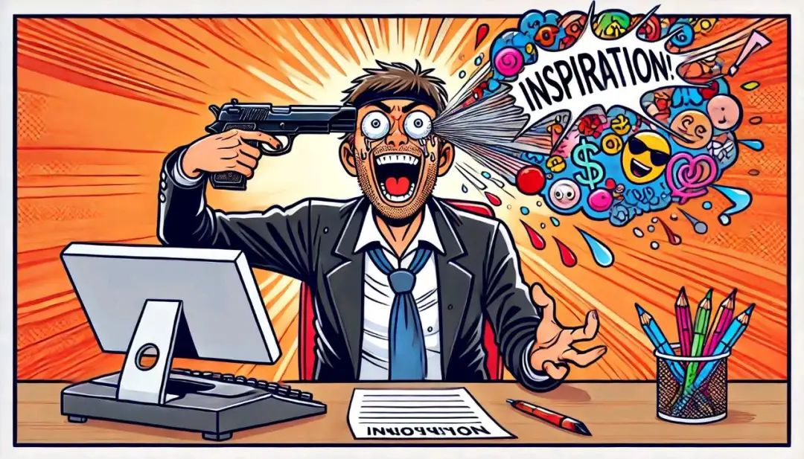
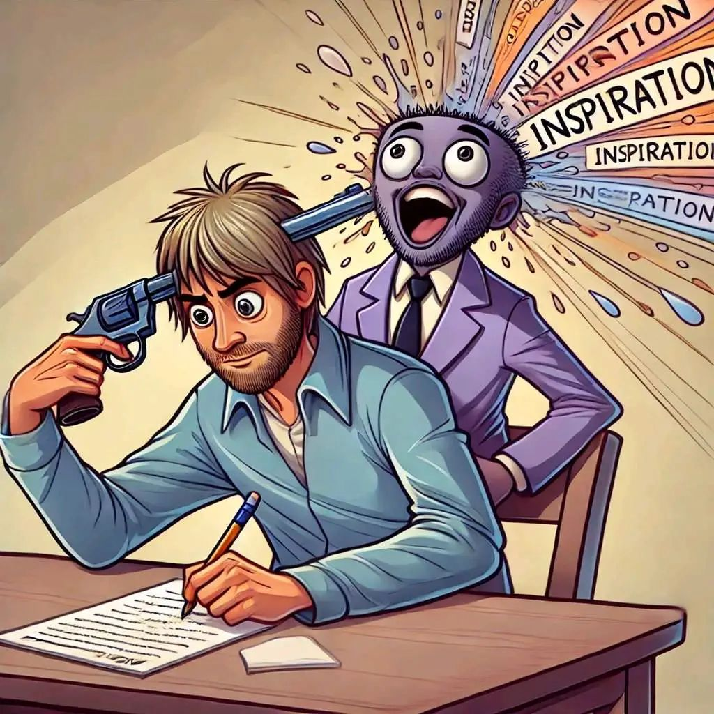
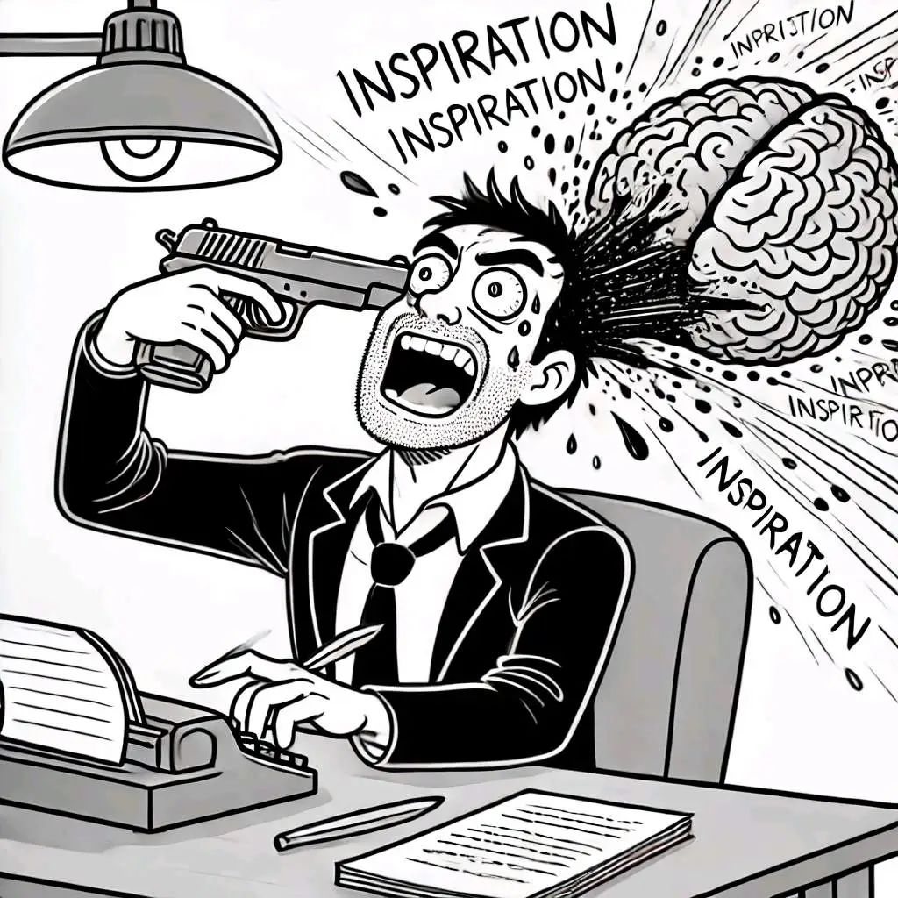
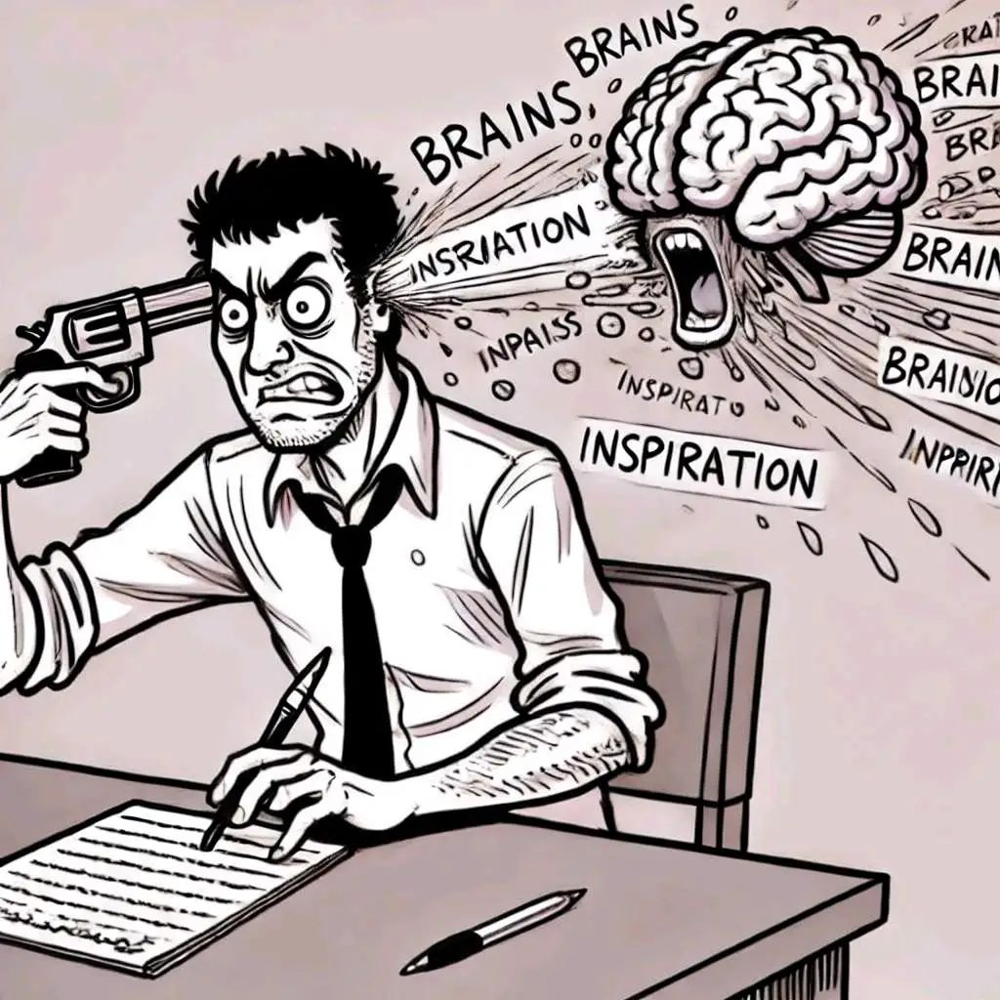

本文是张衔瑜第310篇推文

共计2008个字，4张图

暴雨。在暴雨的间隙和师兄出门去给实验室买花。我不懂他是怎么想到这件事，他不懂后 问我能去哪里买。看看时间，当机立断打车去远东花市。

花市一楼是盆栽，二楼有包好的也有鲜切花。第一次是快关门的时候进来看看，第二次是过来买最新鲜的紫鸢尾 花语长久思念。这是第三次，写到这的时候睡着了，很闷地睡着了，灯没关耳塞也没戴。快说谢谢思诺思。当时没睡着，选了比组里人数要多的捧花，拿了个免费的冰淇淋。

下午再度大雨。做了一些还有两周才能揭秘的事情。

走在路上就会被朋友叫住，食堂、教学楼、田径场、小超市。我不看人地在走路，也可能是找累了。朋友们倒是很快地发现了我。没看到的朋友匆匆一别打招呼，只好又补个道歉：我在路上想一些难过的事。今天脚疼得每走一步路都像筋膜炎死缠烂打，光走着就让人够费劲了。

导师终于把我的毕业论文反了回来。没改什么也没什么要改的，于是口头和我说了说。我也想接着改下去。可好像又没有那么多能量从第一条意见回复到最后一条。于是开始先改致谢吧。在努力回想一些人和他们的名字。明明一起做过什么都记得，性格特征哪怕面孔都不止几面，有些人我甚至知道酒瓶放在卧室窗台上从最左边开始第三瓶是百利甜，但就是忘记了。忘性好大。

另一个导师也把意见返回回来了，基本是前面提出了什么问题，后面也跟着说这里有问题，然后再指出些别的。也就是说，基本上我的问题还是那一些。就像历史总是重演。盘逻辑不是我现在能耐心抽丝剥茧下去的东西了。

今天给两个朋友，在不同场合看了2023年和2019年的年终总结100图。我觉得我留下点什么的时候才算是做一些生活边角的神经元复健，好让它们从凋亡慢慢复苏一些。其实肉眼可见地，这些神经元就是已经死亡了。我给他们做复健、搞康养，试着唤醒机能，也不过是人为干预下制作出来一些人工神经元，也许有时候像人、也许有时候差得很远。今天开会，合作者说起大语言模型过度自信且幻觉，我觉得我的那些人工神经元也是一样。有时候甚至分不清成分，这是人工的吗？这是天然的吗？也许天然的和人工的，在营销语境下天然有区别。我已经看见了还有多长的路要走，但千头万绪也还是扯淡。

至少，不能寄希望于，有人能在生活体察层面上给我提出什么完全我料想不到的东西或者辩证一套机理让我哑口无言。在这里越走越远，最后还是只能生成一张有六七个手指头的人的肖像。即使现在，也很简单就能分辨出来，到底哪个是真的生成模型生成的人物，哪个是真的人类肖像。

“之前有时候他们会在牛奶上撒巧克力沫”

“可能今天售罄了吧”

—— 今早七点二十，和朋友吃麦满分

乌泱泱的人群涌上地铁。如果不是有必要，为什么要去地铁上和人摩肩接踵呢？

做梦梦到坐长途大巴，去登机。车站也是灰白的立面。梦到第一排有我认识的人，和另一位朋友坐在一起，眼睑带泪痕结晶成的盐。我走到了最后一排，看着前面远远的人。车开进了一道光幕，所有的一切都变得白茫茫 像在雾里。

梦到小时候我很熟悉的一张桌子。那张桌台前段时间整理资料的时候老爸还把它搬到楼上来过。梦到我还睡在那张床上，时间是凌晨四五点。现实时间也是凌晨四五点。我本来迷迷糊糊地在听着歌看显示屏上的MV，突然一阵风把显示屏吹倒了。我站起身来，拿着三种各不相同 大小不同的湿巾擦桌子上的灰。桌子上好多灰，擦了又擦，擦了又擦。擦过的湿巾不知道扔到哪去了。最后也没有擦完。我扶起显示屏。显示屏已经碎了，一道深红色的暗杠、碎屏和各种烂点。现在想起来，这个梦还蛮符合物理规律。

忘性大到这篇推送今天是第三天了。但还没有写完。

因为有张2016年收到的图。但我完全找不到在公众号的哪里。找了好久试过了翻所有我能想到的推送都没有找到。图上是，写作人用手枪打自己，然后灵感迸出来。是一张漫画，或者叫memes沙雕图也可以。是素色勾线的，一个人在写作，一只手用手枪对着自己的一边太阳穴，另一只手写作，另外一边太阳穴本来脑浆要迸出来的地方，成了迸发出来的灵感。大概就是这张图，找不到了。只好生成四个。

生成的少了当初的那份平静发疯的恬静。也许等我有时间了就能来找这张图在哪。

最近总会说出一些让人眼前一黑的话。开会，我说今天主题是解决这个问题。两边人马聊过之后，问我还有没有什么问题。我说今天要解决的矛盾是这个，我们怎么办。两边人都沉默。

一个长发人和一个光头，我们三个人在路上走。长发人对迎面走来的人努了努嘴，说自己以后也要染这个颜色。我说你快做，别等到以后像我们一样没有头发了都没本钱做这个事。光头老哥四处乱看，问我们，那他能说什么呢？

有个老铁昵称叫不躲，据说已经用了十几年了。有个好朋友叫不念，另一个和前二不在一个圈子里的叫不懂。之前我的微信名是医学奇迹，现在是不管。还有个朋友听说了我们的事之后，决定叫不帅。事情似乎总是反着来。下次我要么叫不藏好了。

只要讲起我自己的事，每个人都把头摇到旋转蒸发 觉得实在是太疲劳了。我也有点累了，写到这里吧。

有好多要写的，又忘记了。本来打算写扫街去了穆斯塔法一个马来西亚印裔的各种小商品大楼。可惜没逛完。也不算扫街，是帮人买东西。以为终于不用挂只有碎碎念了。实际上还是在一直碎碎念。
