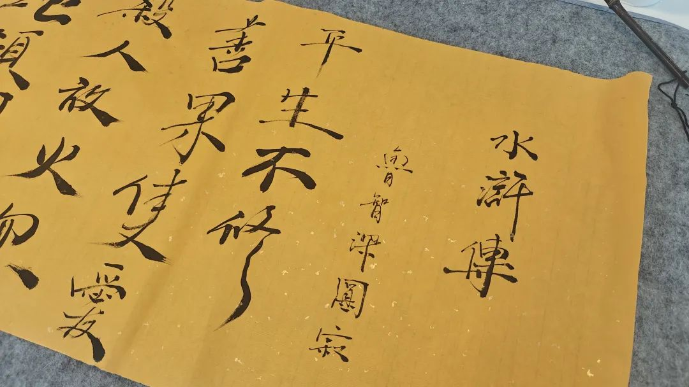
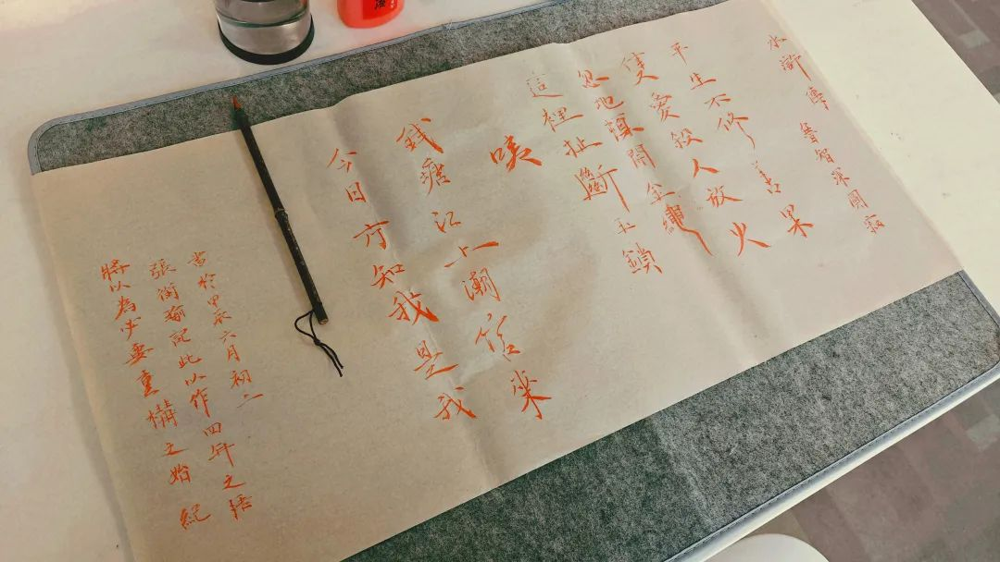

> 平生不修善果，只愛殺人放火 忽地頓開金繩，這裡扯斷玉鎖 咦！ 錢塘江上潮信來，今日方知我是我

This verse, though not easily
translated, encapsulates deep realization. It speaks of living a life of
absurdity. Suddenly, break free from all shackles that constraints. The tides
of river are surging, and only today do I truly understand who I am.

