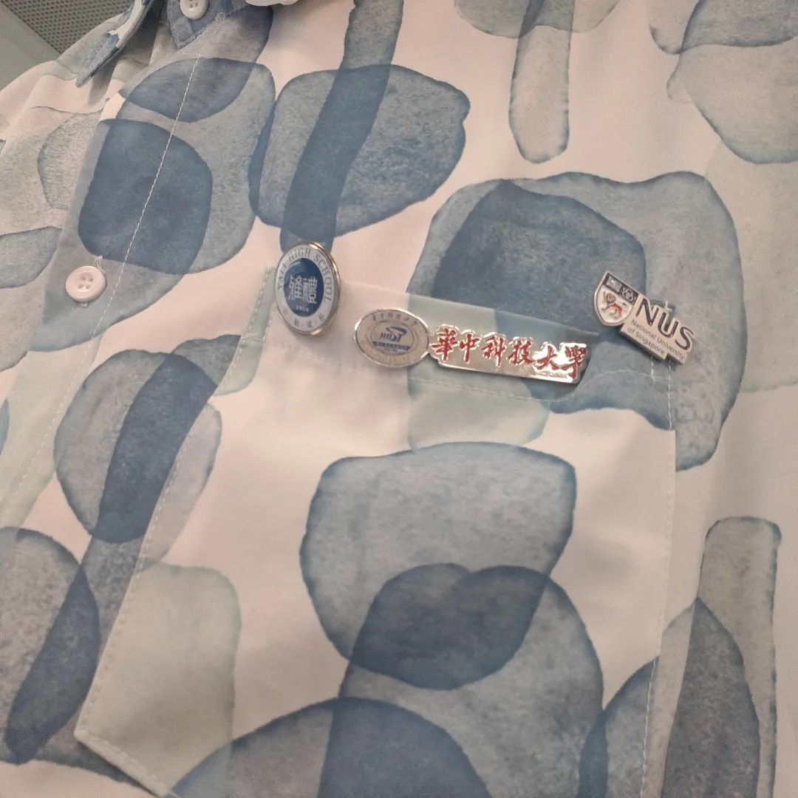
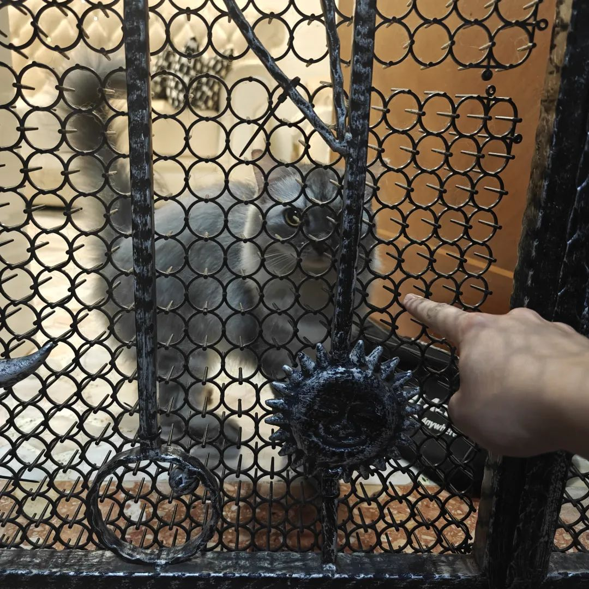
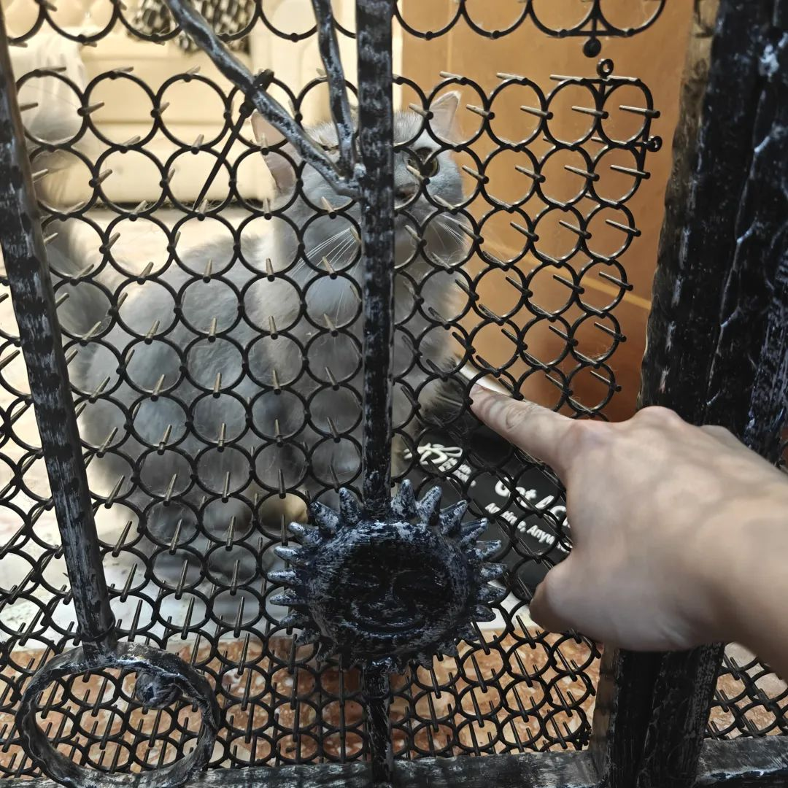
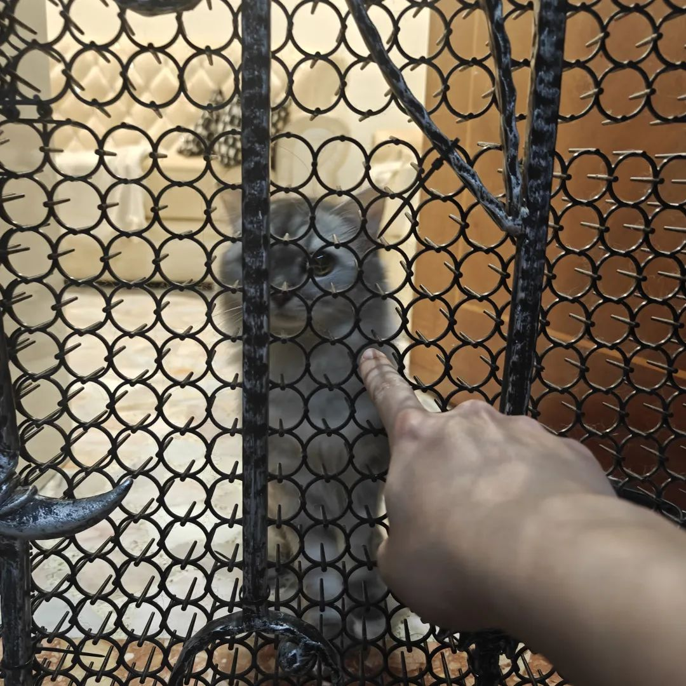
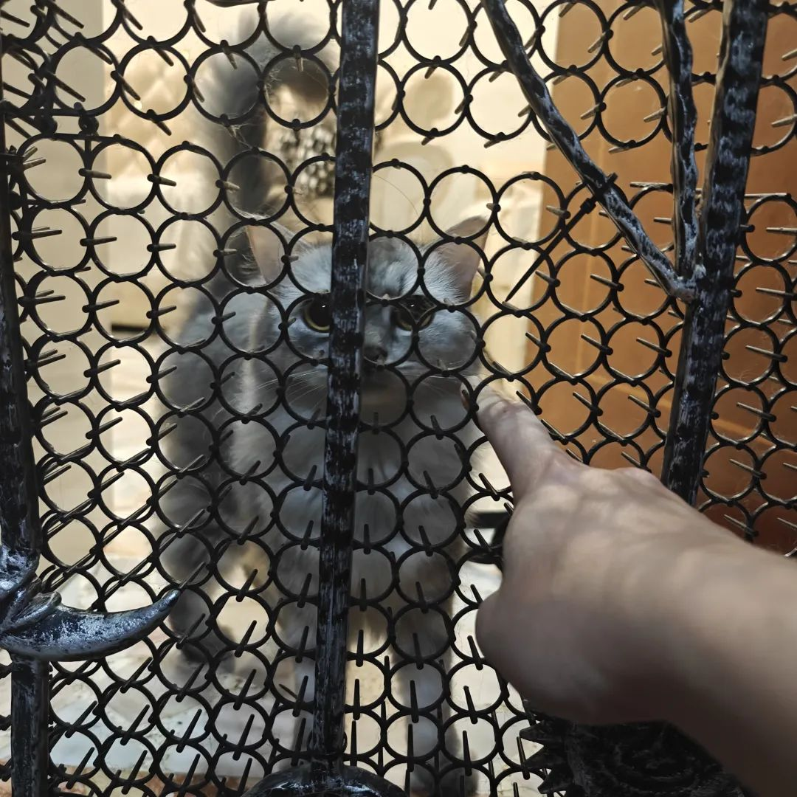

本文是张衔瑜第312篇推文

共计2374个字，5张图

在听周云蓬，所以写了这个名字。

今天收到一个峰会邀请，一看举办时间，正是和乌镇戏剧节冲突的时候。于是选择了乌镇戏剧节，尽管完全不知道有没有机会去。但如果冲突了，就会错过的吧(多少)

如果还能许愿，就去听听周云蓬。

看不见了的歌手。人们好像很容易把人标签化。就像，一个不允许公开唱歌的歌手，一个眼睛看不见了的歌手，一个唱词含混不清的歌手。在书法上也是这样。文如其人，墨涵其志。已经倦怠了，就像看到贾政那句“世事洞明皆学问，人情练达即文章”，看着就已经觉得，离我的生活好近但我想走开又得走好长。很需要一段休息。

今天不经意间问另一个经历有些许相似的朋友，也从本科之后直接读完了博士，几天前交过论文。问是因为我已经想了很久，问“你觉不觉得，我们跳过的那些年，总会用另一种方式回到身边”朋友说是呀，前几天也被其他人问除了读书还有没有别的活动。没说几句，就又接着开会了。

昨天去揩油了另一个朋友的毕业典礼。不能喧宾夺主是真。但我也戴上了雅礼、华科和NUS的三个校徽。把朋友的毕业时当成了我的毕业时。不仅是因为也要交论文了，也因为，明年完全未知。投入得不少，也没像以前一样地周到，想朋友是不是喜欢这些毕业仪式。有私心，我想，我没有那么高的情绪动力明年再来参加一次毕业典礼。借口是给想着的事和人的秉性找的，要什么借口就能有什么借口。最简单的事了。

有些该说的事没说了。主要是，也解释不了我为什么知道这些。能解释明白。但解释也很无力。存心的言语背后都藏着诉求。我先让自己不至于从凌晨十二点下班的工作中散架。

开车去城东，跨过一座新的斜拉桥。车到岭前没有路了，只见一个倒反在地上的穹隆。往前冲，任何努力，都只会让人回到原地。没有任何改变。

回住处后，一整个施工队的人都在房间里坐着。静静地看着。每个人的视线互不相交，像六芒星或者十八边形，各自盯着一个点。不作声。不作数。

他们说要开工了。

瞥过，一整个墙面的拐边角上全是钉子，各个方向。大叔拿了个球磨机过来，用脚发动，像是踹醒了一只嗷嗷的小怪兽。我试了好几次，球磨机在地上自转，很勉强，抬起球磨机。割墙壁的时候，在糊着千层厚厚腻子的墙壁刮了两下，露出木质的边缘结构。我思忖着原来到底是个怎么样的装修顺序。现在看起来好像是先有墙体，后装角木护体，钉上十万颗钉子，最后有的外面刮白。刮白好厚，于是看起来就像刮白又恶趣味的钉满了钉子。

我出门，把整个院子里的小朋友都赶了回去。

我以为是晚上，结果07:08，说不上是个什么时间。有点安静又有点吵。

我见青山笑嗬嗬。我也笑着离开。心满意足。

情绪坐上了过山车。周二在实验室待到凌晨一点，像生了很多气一样飞奔去赶最后一班车。跑着跑着，像要顶穿路上的雨棚，手臂和肩背也扩展出一些并非实质物质的高维阴影。

我以为周三就会胀气的篮球爆得内皮外翻轮飞廓反。结果周三收到了一袋子物品。打开其中一个盒子，里面有七八个用完了的烟嘴，这周唯一一次觉得放下了那些糟糕的事和烦心的左思右想，安心而轻松地笑了半分钟，因为有很懂我的人。又拿起相机，闻到皮子上的熟悉味道。于是又苟过了一天。

梦到二楼阳台上站着人，探出身来跟我说什么，但是跳台又不是能承托人的那种。我手里多了一个劣质的锈红色塑料袋，里面装着很多东西。我托在手上，但看到提手的边缘有些黑色的焦化了的样子。我忙吹吹气。不一会儿，就看到了火苗，我赶紧扑，再把袋子里的东西都抖出来。袋子里的是纸钱。黄裱纸钱散了一地，铺满了硬化的水泥路面，顿时生长的整个交叉路口都在燃烧。

还是很疼。只要不在专注地做什么，即使是在专注地腹诽合作人怎么推给我这么无聊的活手上又还是接着干，也不会觉得有多疼。十二点，快步下班走去公交站，也只会觉得是有点不舒服，但还是比路上其他人走得快。

直到回房间，坐下来，听周云蓬。坐了一会儿，写了点。朋友叫我去送东西，于是起身。下不了楼。还蛮想去朋友那的，毕竟那里的隔壁，有只小猫叫Yuki，昨天去拿东西的时候遇到了。小猫完全不怕生。我像个深夜偷猫的怪人一直在外面伸手。小猫也不敢靠的太近，门上都是向内的倒刺。

最怕把自己的想法不着边际且不分场合地到处投射。像随地大小便的小狗。

还在改毕业论文。把致谢里加上了我工位这层楼的清洁工。今天我一瘸一拐地做完实验又赶忙带包出去开会，据说来自印尼的清洁工大叔正拿着大夹子和聚苯乙烯塑料袋进门，问我吃没吃午餐。这层楼，生活上不感谢他是完全说不过去的。每次我都二三十个包裹地哐哐拆然后全扔在垃圾桶旁，都靠大叔捡了去。我至今没有完整地看到过他是怎么把这些垃圾扔下楼的。只期待他，如果将心比心在国内的清洁工，可以拿废品去换一笔钱，倒是没有那么歉疚。像之前住紫菘，每次都会专门把能捡了去卖的东西单独留在一个地方。

像每天交流很多事一样。每天也忘记很多要做的事。如果没有日程提醒，我无异于气象站里飘着的小旗子。跟人平静地说一件我觉得需要做的事情时被挂了电话。又接着平静地去做接下来的事。觉得跟另一个人可能讲了很过分的话，接下来又觉得我很苛责自己但没必要把别人说得这么狠。只有小孩子才会玩变形金刚人聚在一堆，然后怂恿别的小孩说你不玩变形金刚我们不跟你一起走，快点叫你家里人去买玩具吧。给人道歉，因为忘记事情了。别人给我道歉，因为的确差了些。给人说谢谢，但别人回消息的时候我又没把剩下的话听完。答应给人帮忙，但又像我把自己代入角色去了。找别人帮忙，结果围了一堆人到我旁边来。看到实验台人太多，我说我社恐了。跑去楼下实验室躲躲，人还是很多。

打开小说，之前被点评“看不了太多感叹号的文本”，我解释道“反正玄幻小说看了章标题和开头就知道后面是什么了，修仙就是神挡杀神佛挡杀佛”现在看起来解释真多余啊。可以思考到细节的不是吗？空空的触角伸过去，任何一个眼明心亮的人都可以看得见吧。

慢慢淡化老年斑。

慢慢听周云蓬的祁连山和焉支山。
