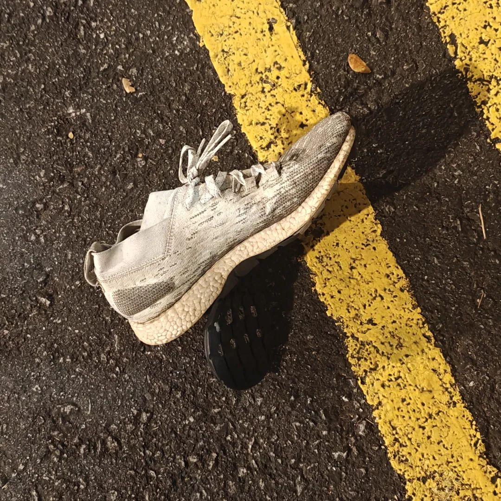

本文是张衔瑜第315篇推文

共计2003个字，4张图

回头看一些刚醒之后写的笔记，那些印象不深的，就意外地变成了扩写句子。给定关键词，想象或悬揣，变成新的一段。

去游泳。但不是在泳池，有点像已经荒废了的老动物园，有海豚又像水族馆。空白的天穹和繁复的墙壁，好像有口臭的鳎目鱼说，这里太小了，不能抗雨。

彩虹一桥，在墙壁上飞过去了。

去朋友单位，朋友被留值在单位。兔唇的守门人说话也漏风。没听清到底是让我进去还是不进去。我的脚又不长在履带上，不需要按照固定轨道的。

回家，不敢开燃油车。具体原因不明。但最后还是开了。在油箱外边用火柴催发了发动机，同样是冲程和气缸，谁比谁不寒碜。人们不懂我的逻辑。我只恨没有多存货，再多几升汽油烧晕不长眼的人。

逍遥游有云：

举世誉之而不加劝，举世非之而不加沮。

等如果可以不用在乎外形(这两个字拆开理解)对于内里的投射与影响。也许这个人也就已经在轻松走路的时候坚定而有方向吧。很了不起的是，当我意识到一些需要改变的时候，发现早已经有人在前面，而且留下了极高文哲思辨的内容，就越来越觉得渺小和道阻且长。

无聊看视频的时候，看到温铁军说到农业里，800mm等降水量线正在北移，比如陕西榆林的降水量就已经到了800mm，这很吓人。以往学地理时候的南北分界线，等降水量线与秦岭淮河。看来这个就像人们以过去的易经推演反映神州大地一样，到现在都需要调校了。所以我给人起课之前也都是先调校一翻，这个可以继续下去。

酒精不能解决的问题，牛奶也不能。

灭六国者，六国也，非秦也。族秦者秦也，非天下也。嗟夫！使六国各爱其人，则足以拒秦；使秦复爱六国之人，则递三世可至万世而为君，谁得而族灭也？秦人不暇自哀，而后人哀之；后人哀之而不鉴之，亦使后人而复哀后人也。

梦见抄作业。像很久以前学声乐的时候，老师给一个基准音，然后弹一段乱七八糟的东西，让我们在五线谱上写出来刚刚谈的是什么。我完全抄了同学的练耳。

梦见去接一个刚脱罪的人出狱。三十年了，这个朋友是我的发小，但印象中并不认识。这个罪名现在都已经取消了，而发小是最后一批有关这个罪名的罪犯。我是来接出狱的。在监狱门口，等狱卒送出来，我于是给了发小一封现金，发小拿出来看了看，手机也不大会用。

理着个监狱头，穿着厚重着像呢子毯子一样的衣服，边缘已经脱线卷曲。

发小刚出门，就被人拎走了包。也不知道求救，若有所思地看着拎包的人扬长而去。我于是赶紧呼人。狱卒从铁门里又探出大半个身子来没好气地接着数落发小也数落我，说你赶紧教给点生活技能。

我也没放在心上，问，想吃点什么。递了根烟，发小还是一副没缓过神来的样子。说想吃小笼包，说吃前门东大街。我知道那是我们都很熟的地方。一起来接出狱的人骑上边三轮小斗，小黄车嘟嘟地先走了。

发小是在拼车上的士的时候被人拎走的包。我去呼完帮忙追包的人出来，我说车牌号是云AZ6187。等我出来又到处探的时候，发小已经不见了。灰白的街道上弥漫着工业灰尘和一两抹明快的人。事实上我也不太担心，想，这就是发小家附近，应该不会走丢。于是我径直去了餐厅。

前来的人已经入席了，只是没开始吃。就是前面那两个骑着小黄车边三轮的人。我们好像都很放心她能找过来。其实我还是不太放心。餐席上没有小笼包这回事。

前来的两个人也算是发小，都是原来比较亲密的人。虽然没聊什么近况，但沉默中的打量，也知道最近怎么样。我顺便绕了绕旁边几家店。店与店之间挨得紧密，像骑楼一样，但隔断的墙壁像一把钢刀，把街道磷碎成一段一段。

我回了桌上。还是有一搭没一搭地。刚出狱的发小鬼魅般地隐现，好像那里本来就有个人，只是发小把自己的透明度降低了些。发小裹着一件新且不合身的厚卫衣，衣服标签还撕拉挂在帽沿。我们恍然大悟，原来是太冷，去买了件厚衣服。钱包刚被拎走了，就姑且认为是买的吧。

吃了会儿，兴许是吃得有点暖和了，于是脱下厚卫衣的外套，转跑去去楼下疯了。我们在二楼待着，也能依稀听到发小小楼之后逮着人就问的话“你敢信吗他们竟然把豆豉和小鱼一起蒸”、“蒸笼上大无语怎么糕点底下要垫一层面膜”

我听到之后，也在仔细端详桌上的菜是不是这样。通常我完全不会关心这些。大家都说，你看这发小刚出狱的样子啊，啧啧啧，这样的病患最难照顾了——在监狱里完成了原子化，现在却得慢慢变得社会化了。

发小从旋转楼梯里噔噔噔上楼来，还是笑脸盈盈地。发小手里揣着个半熟的玉米，说刚刚在厨房里拿的，厨师竟然说玉米是是免费诶。然后神采飞扬又手舞足蹈地向我们描述厨房里的镀铬不锈钢案板和冷冻柜有一半手臂大小的柜锁。

发小一直说着。一位宾客愤然离席。兴许是完全受不了被这样信息和情绪输出。发小还是没有住嘴的意思。

这个梦醒了之后，觉得还蛮像一出小情景剧。很短，而且什么也不知道。爱死机和伦敦生活都是这样，好像完全不用前言铺垫，随时可以上阵然后跟着故事情节下行。

能做梦，生活的尺度好像就又延长一些了。生活的事情下次再细写。也可能是下下次。
