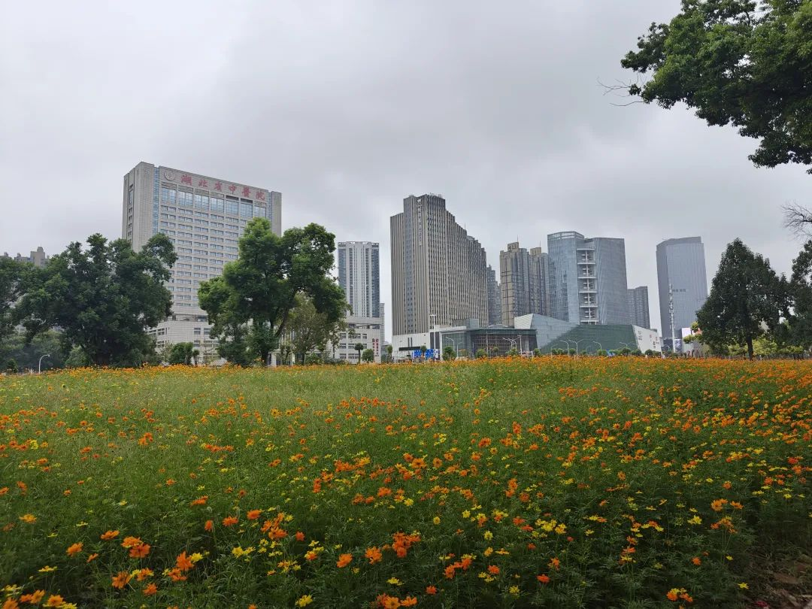
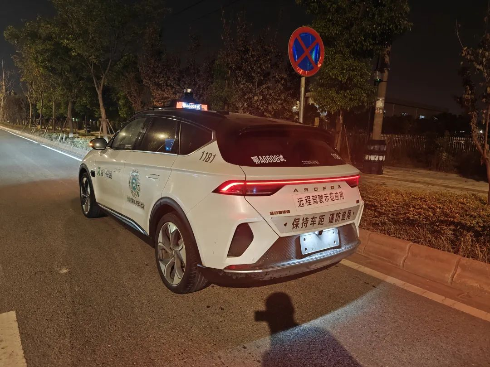

本文是张衔瑜第319篇推文

共计3413个字，32张图

在武汉回长沙的动车上写下最近两周的推文：一周在长沙，一周在武汉。

接上一篇写到好喜欢长沙苍翠欲滴。预想的轻松完全没有出现，每天依然忙得连轴，倒不全是在玩。

玩是一方面，也抽时间去中医学院配了点中药。医生看了看我的头发和之前在这的病历，说：“找个女朋友你就什么事都好了。”和我有合作的另一个医生也这么说。我想，吃药可不简单多了。头发只是一个物件，不算什么大问题。为了解决小问题，而不顾把我自己人生大问题代入二人世界中，未免太草率。

吃了几天，我自己没觉得效果很大。等吃完再说。

长沙几天虽然很累，但吃得很好。吃得不多，但也吃得很好。

抽空去了两家琴房。因为想在静修的时候练练古琴，你看古琴这个东西又不吵。接触了两位不同的古琴老师，一个在琴房里，另一个是自己办一些雅集。两个人都分别有自己的坚持，就像文士清流一样，都分别有自己的说法。一个告诉我说没有辩证法，只有好或者不好；另一个有些不同政见。虽然我对未来不置可否，但两位古琴老师逗从不同方面给我勾勒起了对古琴人士的偏见：有一些旧时雅士的样子。

好朋友登登来长沙过生日。吃过烂屋子之后，打了一会德扑，于是我们六个人一起上天台唱歌吃夜宵。长沙的凌晨没有很热，唱歌聊天，说说心里的烦恼，是件很轻松的事。即使，烦心的事也不会因为大家互助着purify苦水而解决，但别人的生活态度就已经很值得向往了。

一周打了好多麻将。

两度上岳麓山。岳麓山梅开二度。一次和二xuan&另一位湖大新生一起从超算登麓巷上山，另一次和一位长辈从岳王亭上山。

第二次上山是为了拜访云麓宫的道长。想着有没有机会，去云麓宫静修一段时间。老道长和小道长人都很好，道观饭菜也很好吃，比我心理预期好多了。有鱼有肉，的确很好。山上的人也都不着急。老道长知识很丰富，我们就像和专家论道一样，从儒释道一直讲到基督教的原罪与团契、伊斯兰教默罕穆德、和印度教与婆罗门。跟不止拘泥在自己宗教的老道长聊天还是很增长知识。老道长邀请我有空来打打拳，我顺藤摸瓜说想来住几天，老道长说好。于是约了中秋之后去。

其实心里在犹豫。不是因为道观，而是岳麓山来往的人好多。云麓宫说清净也很清净，说嘈杂也是很多人。自从岳麓山看日出这个项目被游客开发出后，云麓宫就被作为一个观景点被列了出来，甚至，人们吵得道观里睡不着，只能一阵道系输出。心静也能自然凉，没事就在岳麓山跑来跑去就完了。我还没有下决定去。道观的饭的确不错。

拍了一张很好看的小猫喝水。倒影的树很像一片猫薄荷。所以说原来水里的猫薄荷也会吸引小猫啊(心里笑

不算匆忙地，周一到了武汉。因为早之前论文被拒了，想看看有没有别的出路/建议。正说着，博后基金也拒了。想想也挺好，前者我觉得还需要争取一下，后者就那样呗毕竟我也不大看得上自己现在就做出是否继续博后的计划。现在除了做静修以外的其他大事，不是说今天到不到武汉或者吃不吃私房菜这种小事，而是从几个月一两年的角度来说，除了静修，都是小事。

老师还是和以前一样有学者的书卷气。作完报告后，和师姐在鲁磨路上夜宵。聊了很多以前的事。聊了新近博士毕业后人生到了新一阶段角色转变中的烦恼。以前在组里的时候很熟，但即使后来没有联系，也是我毕业后刚加上微信，也没觉得怎么不妥。除了给我安利去瑞典静修外，我们聊出了一个很重要的结论，亦即，不能沉迷于混乱的秩序。我有点习惯性在重复论证我如何能在复杂的生活中找到最短解决路线的能力：就好像这几天 组的局一直满到了吃夜宵。虽然的确做到了周旋和游刃有余，但持续用事实去证明自己的能力，达成这些事实让人一直沉湎于无序中。这个讨论的结果对我来说很有用。

几张华科的图和西一的西瓜凉粉。

在武汉的周二周三，是我最近一两个月以来，第一次三餐全吃 甚至还有夜宵。卡喉咙的热干面依然卡喉咙。

在武汉卷烟厂见到了一些古老的包装，以及一些概念性的 并没有上市的包装。还挺有趣。

从东西湖区的金银潭回学校，打算再处理一些事情。想走晴川桥来着，结果司机在大桥才叫醒我。我一直有感觉这次到武汉，大家都很peaceful，连我坐车都可以睡觉了，也不按喇叭。今天在高架上一路拉红，我也就着武汉的小风睡着了。堵是真的狠堵。但放以前，我虽然也不能飞过去，但我一定会表明自己的态度(笑)可现在都安安静静，我甚至连拼车的人说话都不放在心上。醒了之后，问，怎么还在高架上？但跟在这里生活的人说时，他们都摇摇头。

和好多人见了面，大家都有自己的生活。这就是为什么我给这次的标题写「很精彩」因为以前也许大家还很相似，但若干年后，都只剩感慨。我没觉得谁的生活是一成不变，也没有谁会面对即使一成不变的生活时 自己一成不变。命运的不可捉摸就在一段行走中变得具体了起来。

去见了很多人，带了我四年的辅导员，悄悄结婚然后给我补发了喜糖喜烟；看了眼当时毕业情况的花名册，疫情改变了好多人，好多无法预知的事；去见了还在校内读博的朋友，有很多关于自己身份和校内来去的唏嘘；和导师还有已毕业拿了教职的师兄吃饭，他们俩聊高校职称晋升时聊得我直接把他们把我聊焦虑了这一点说了出来；找以前在新加坡接待过的几个朋友，吃了顿武昌鱼。好吃。

去早已在纺大找到教职的师兄那儿，和师兄约刚进校的硕士生们吃饭。觉得原初的样子好懵懂，原初的样子，不管是科研还是人生经历，都如白纸往下续写。年纪和年级，年轻的样子都是没法开历史倒车的。和那天在长沙忘浮沉民谣小酒馆时的感觉好像。

武汉下起了小雨，凉风飕飕真的很舒服。一层秋雨一层寒。太舒服了，朋友又还没来，于是在汉阳杨泗港大桥下 拦河堤的江滩随便找了个堤边的长椅就睡了下来。公园二十分钟理论，一下就睡着了，感觉好正常。也好舒服。我睡了四十分钟。简简单单地躺着，又不是什么景点，只是武汉的江滩公园。等天色慢慢黑下来，才懒懒散散地往河水活鱼馆去等朋友几个来点菜。

醒来之后还有一只小狗在旁边。看起来像是走失了。我搜了下汉阳流浪猫狗救助中心。问来吃饭的朋友说你养不养，他说不！我又看了看小狗，问要不要去找找你的主人在哪里。小狗有点呜咽。后来笃定地朝一个方向去了。

溜达累了的时候，又在华科找了师生服务中心外边和东操草坪边新建的长椅上睡了会儿觉。公园长椅的确很适合睡觉。就是下雨有点烦，雨下大了我就走了。

在沌口打到了武汉传说中的苕萝卜，萝卜快跑。因为武汉方言里苕萝卜不是什么好词但也没有太坏。萝卜快跑是个无人驾驶汽车，是真的没有人在上面。这就跟迪士尼的法务部很像吧，跟武汉司机的摩擦反正都是萝卜无责。也算平稳好逛。

在武汉怀旧的时候就感觉自己老了。像个老人家一样，到了晴川桥上就想起以前讲的笑话，拍的照和逛的公园。真好笑，晴川桥可以从汉口上去但是下不了汉阳，于是我又走回来。武汉还是有些本没有丢啊(摇肩膀)。消失在人海，人和事都是。记忆力太好了就把什么都背到背后了，我不脊柱侧弯谁侧弯。

动了几次念想去循礼门。循礼门是我觉得武汉风景最好的地铁站，1号线挑高在地上的轻轨。可以直接看到和拍到保成路夜市，然后就坐车去大智路吃完沙县小吃，进中南剧院看个剧。看完剧就走小路在胜利街晃悠，随便在路边开个共享汽车然后走隧道回关山口。念想是念想，没有行动也是没有。

晚餐在好朋友家。感觉好像只有我还是个暴脾气。人可以装得温和一点，但做起事来是想到了就马上冲，不过夜。连我觉得很暴的武汉人都被生活磨得淡淡的。

武汉的几天虽然能写一些，但其实没有长沙的几天那么忙。也许是白露节气过后，我也在缓慢地降下来步调。是可以走慢些了。完全陡转直下进入静修，那种加速度好像也有些太快，是另一种意义上的身骑快马。

即使这么短的距离，从广东，到湖南，到湖北，人们的生活习惯差异或者我在这三个地方的生活圈子已经让我觉得有些差错不及。更别提在国内和在国外。最近和人的交流中也反复犹疑这个问题：以后要去做什么？

上周日在长沙，自我拷问着回答这个问题时，感觉疑心疑虑都越来越重。也越来越有些厌烦。我不确定这种感觉是不是真的我感觉到的。武汉几天没过得那么紧张，虽然在和我一起拼酒店的人看来，依然每天转个不停，但我已经觉得好很多了。至少怀疑感没有那么重。

譬如人们开始怀疑城市，怀疑行李箱，怀疑筷子和酱油。

所以我才觉得大家过得都很精彩。不用想什么狠过分的事，或者自己就已经足够笃定。这次在武汉掉了一些东西，零散的小东西，转太快了时事常有的事，只不过提醒我了不能再转上这么快。

说要停止的时候，往往意识到了，而惯性还在催着往前。从湖北咸宁一直写到了岳阳汨罗。止笔于此。
