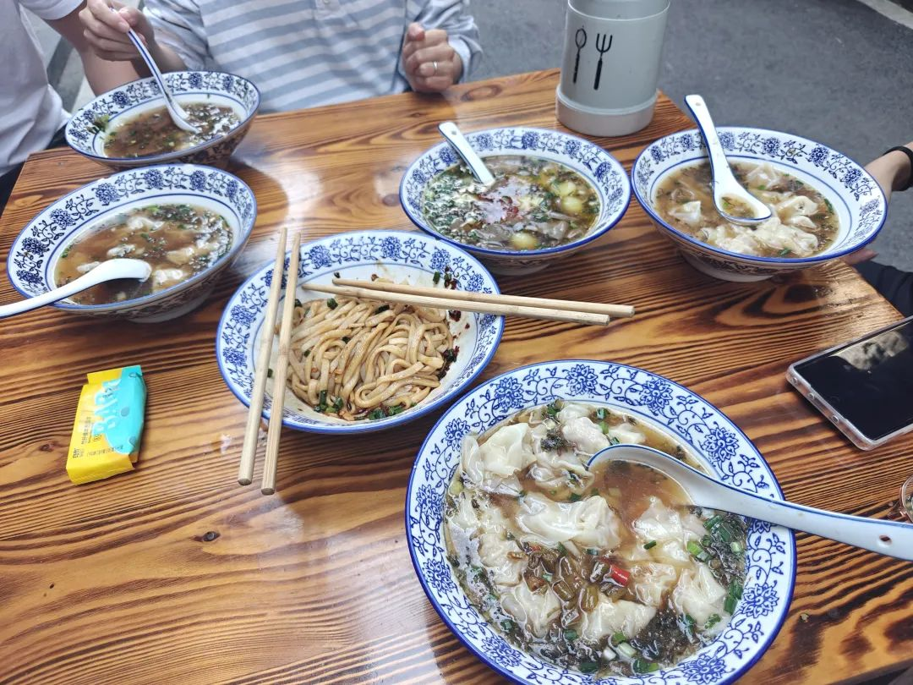
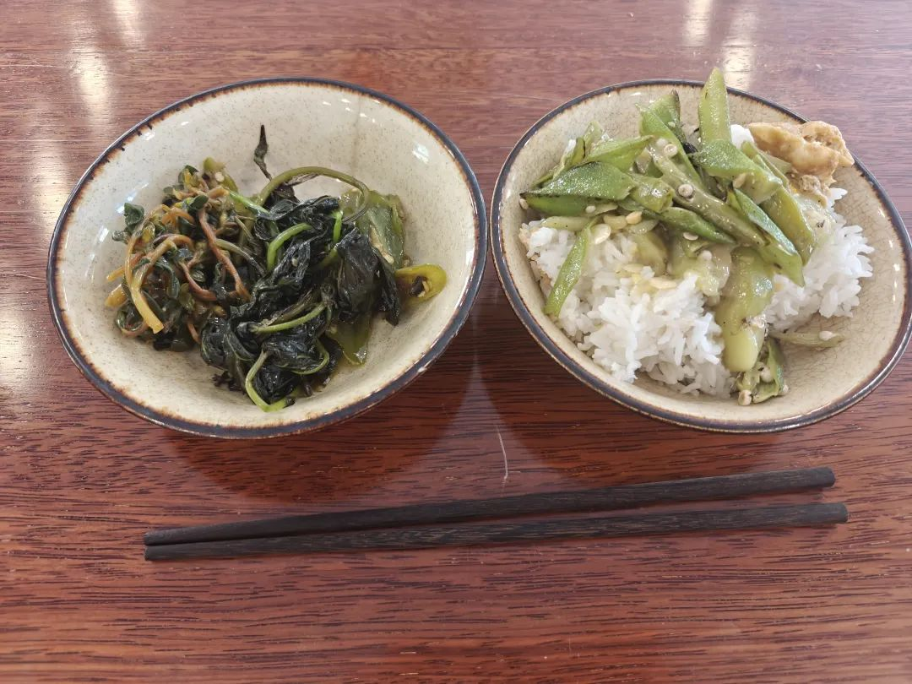
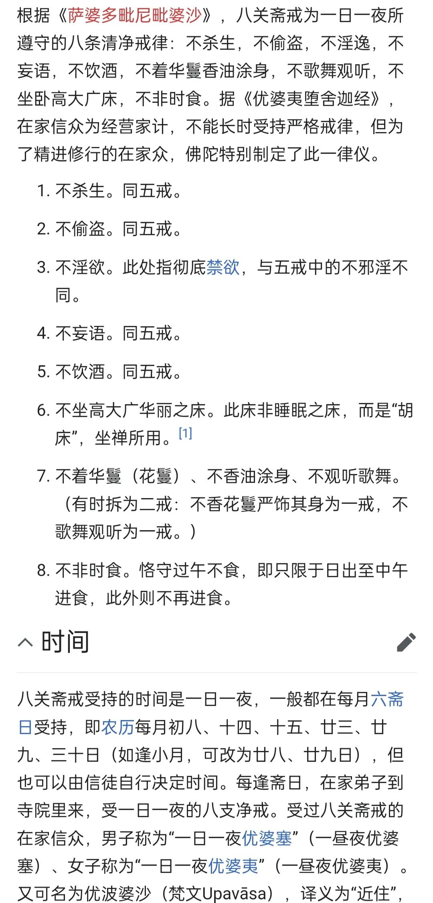
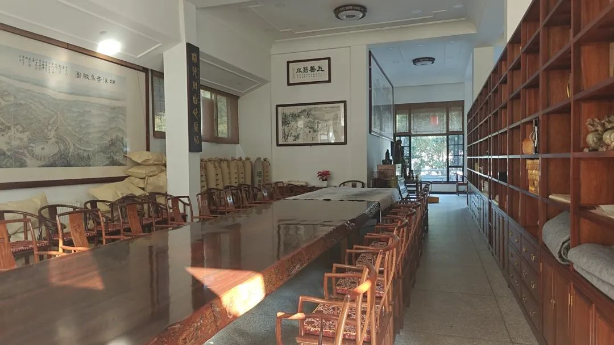
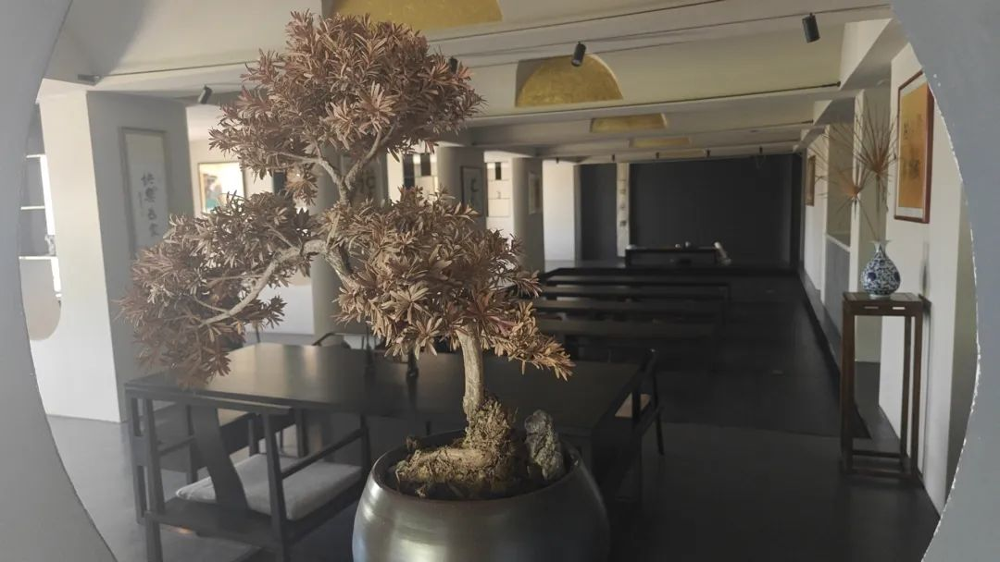
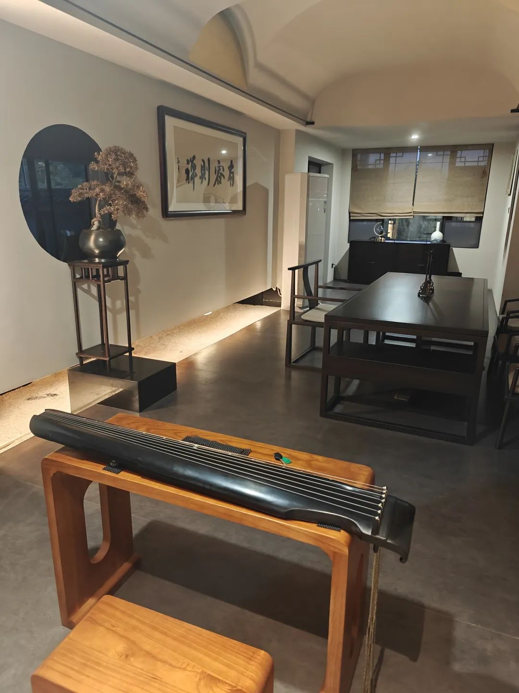
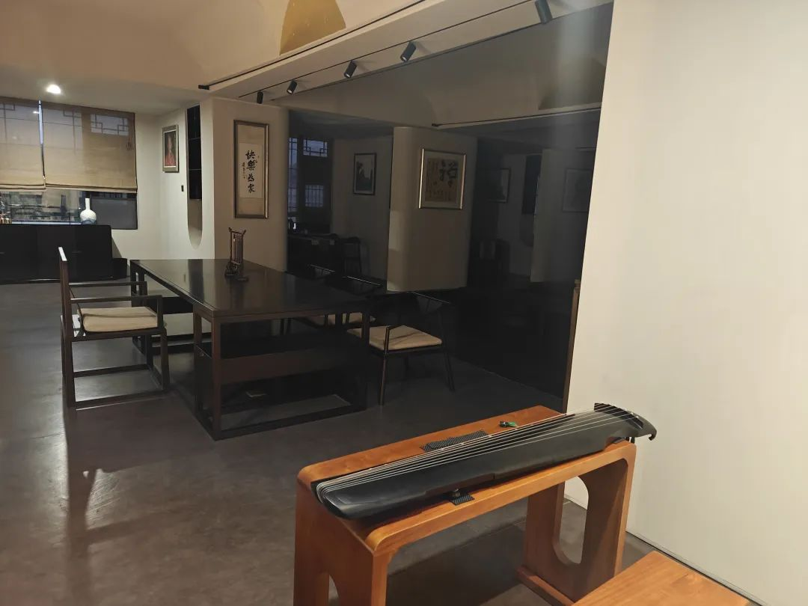
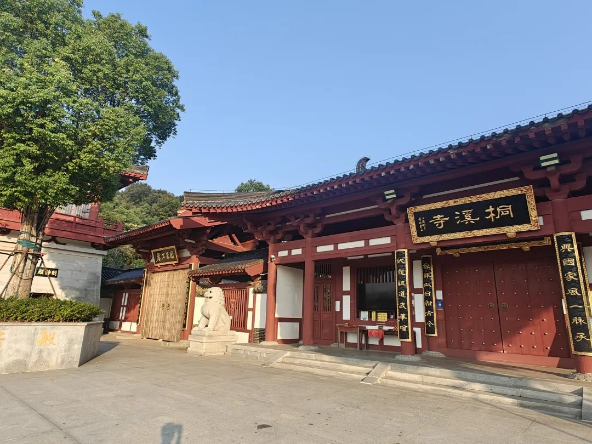
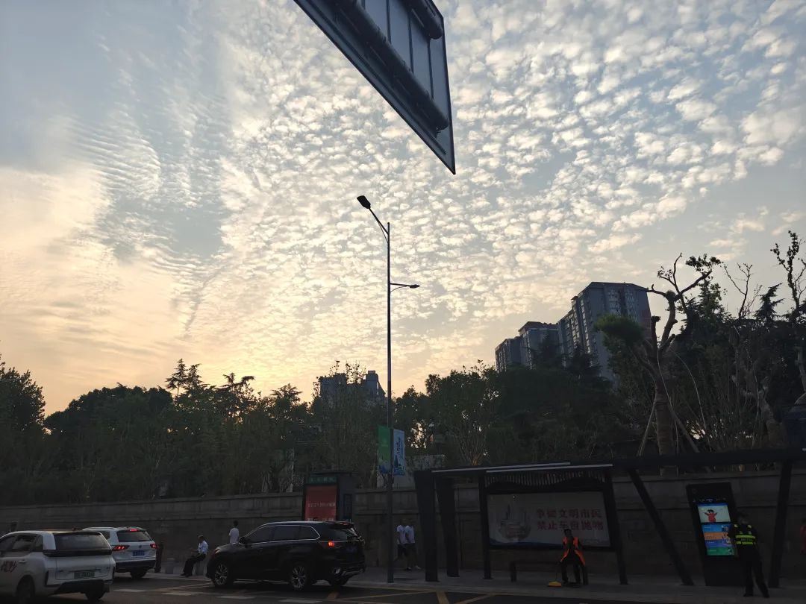

本文是张衔瑜第321篇推文

共计3040个字，22张图

周日和本科的好朋友们在西园北里的梧桐树下喝茶。我的问题聊来聊去，最后都会回到一个点：指什么时候去静修？

周一醒来，和山林临时去麻园岭吃馄饨。渐凉秋风真舒服，在芯宁馄饨外的树荫下 居民区里支个小桌子吃碗馄饨。

周日晚上聊起我们向往的生活时，阿淼说最近想去一趟录音室，录一张CD📀以后可以听。真有趣，“给你一张过去的CD📀”，阿淼唱歌也的确很好听。我已经被Leewell说烟嗓腔出来了，虽然我自己并没有感觉。也许是掉头发掉成了令患者和学生家长信赖的样子，所以有这一出。

我说我向往的就是，和几个好朋友在河边吃晚餐，划着小龙舟回家，一路唱歌。船翻了，也没关系，湿着一身在河堤上打打闹闹，说下次要是再翻了就随机指定一个人又请大家搓一顿。最后回家都伤寒感冒了，一起在医院边打吊针边唠没唠完的嗑。除了不切实际的龙舟之外，现在其他的也都做到了，平常约上好朋友在河边喝茶，然后溜达着去夜市指指点点，在一个健康作息的时间点溜达回家。好像以后要奋斗的，现在也都短暂地有个型了(我也没想着真达到最高要求划上龙舟🛶)

周一看了下黄历，发现诸事不宜。于是周二才噔噔往庙里去。庙里真的很安静。好朋友的奶奶修的是净土法门，也在桐溪禅院修行。我也就真的把几乎所有的消息提醒都关了，和朋友们说了不要来找我网络说话，要聊就直接线下来找我。

在我的妄意揣测里，朋友们最关心的莫过于庙里的伙食。因为是禅院，所以也按照持戒来安排伙食。每一餐都是斋饭，四到五个素菜。坐到禅堂里之后，义工们会把两个碗和一双筷子放在餐桌上，信众们坐后排，和尚们坐前排。

餐前会诵经。在我吃下来，饭菜里的油水也并没在少。难怪即使吃斋饭，也未见得人会瘦。寺庙外堆了一大垛柴火，方丈说平常的饭也都是柴火烧的。我没去细问过油的类型，想当然地觉得不可能是猪油，毕竟要持戒的。除了辣椒的味道之外，盐的味道也很少。很难得地到下一餐之前会饿，不过我觉得多是寺庙生活安静下来的原因，所以食欲慢慢回来了。平常我吃得也少，但几乎没什么饥饿感。

吃完了就把碗垒起来，然后筷子放在一旁。我最喜欢的是里面的止语牌，也就是吃饭的时候不交头接耳。最好笑的是(不是嘲讽的笑是觉得有意思)墙壁上还写着标语“少说一句话，多念一声佛。”

晚上跟一位在东林寺修行的姐妹聊起，姐妹说可以考虑让师父帮我授“八戒”，因为我平常的用餐习惯也接近过午不食了。最难的应该就是这个了。有句说句，八关戒还蛮符合16+8的用餐策略，也就是十六小时禁食，八小时进食。怎么吃都不会胖(据说)

