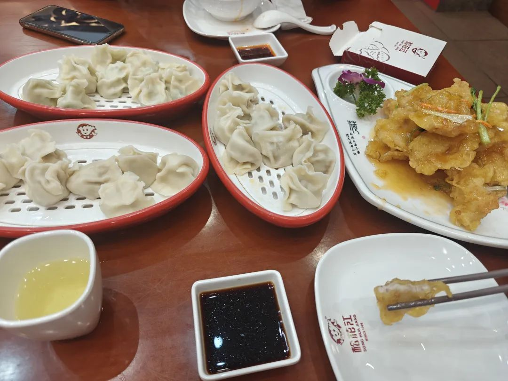
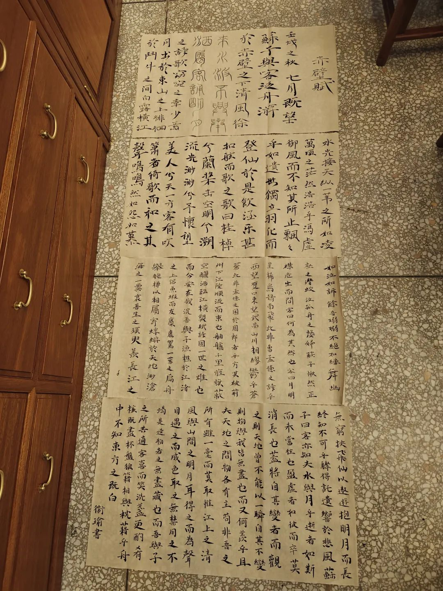
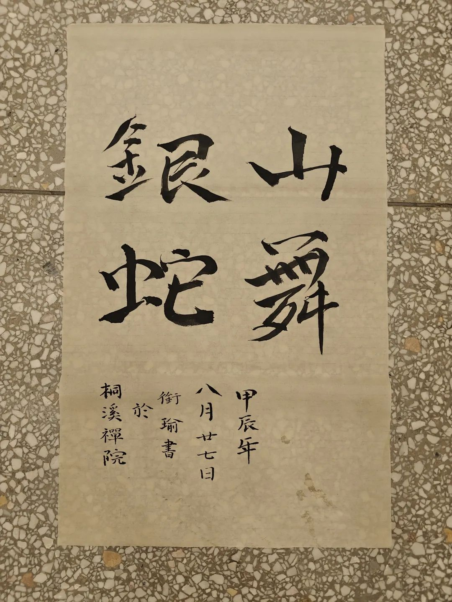

本文是张衔瑜第322篇推文

共计3237个字，2张图

《瓦尔登湖》的结尾这样说：

只有我们醒着时，

天，才是真正的破晓。

日出未必意味着光明，

太阳也无非是一颗晨星而已。

The light which puts out our eyes is darkness to us.

Only that day dawns to which we are awake.

There is more day to dawn.

The sun is but a morning star.

在庙里又多待了几天，回去了一次。出世的场地未必不入世，入世的人未必不在炼出世心。

又吃了一顿饺子。松花江饺子馆。白菜猪肉还不错，好吃但是太贵了。下次应该不会去了。

早一段时间前，和在投行工作的根基吃晚餐。聊起现在的经济形势，又稍微过细点地说起了消费者购买决策理论。断章取义地说，消费需要，不管是主动或者被臆造，引导了消费行为。具体地，经济预期决定着当下的消费行为。如果一个人对自己未来的经济预期保持乐观，那当下的消费行为也会激进起来；要是对未来预期心如死灰，当下的消费行为也会自然地变得保守。

很多因素影响着消费决策，好像一整条铰链系统，这只是抽离出来的链条之一。不管人怎样被冲昏头脑，消费行为都会从统计上回归经济预期。于是，在普遍唱衰的时候，以一般消费水平为基准，其消费行为自然也会变得紧缩。

这就是一个简单的知行模型。芜杂世界是各种链条和思维模型的总和。世界是个巨大的化工厂，所有人都在塔釜里面转来转去。

每天过着寺庙的静修生活，我期待在这里得到什么呢？这其实是一个功利而现实的想法。我们都明白人不能努力睡着，就像那张“快速等待”的沙雕图一样，除非上药物硬性分段。我起初想的是来这里安静一下。往高了说，我能回答“我的原则是什么？”这一终极问题；往小了说，我能让自己变得不那么浮躁，就像师姐阐发的，恢复一点生活的秩序。

迈步每天，就像一个急匆匆赶路的人，但是又不停地要求自己慢一点慢一点。

多快好省。又快又好。写下这些我都噗嗤想笑。不是嘲讽。荒谬感还是时不时地产生着。

这几天每天干到凌晨三四点，为了把一篇论文改好。还蛮累的。早上六点半的早餐，中午十一点四十的午餐，晚上五点四十的晚餐。好的是，也许是因为吃斋饭，每餐到饭点前半小时一小时就会开始觉得饿。感觉是个好事。

空余时间就在练练字，聊聊天，下下棋。字练得越来越好了，下图的赤壁赋分别是第一天开始写，到最后一天。明显地看到越来越工整了。买了个打格子的工具，图里还没用上。

庙里的扫地老师傅问我会不会下象棋。我说，也会。他问我什么水平，我油腔滑调地说公园水平，就是公园里下象棋的水平。老师傅说，那很好啊，晚上来试两把。然后晚上我连输三把。今晚带了包芙蓉王过去请老师傅指教，然后我们其他三个人分工：另一个老和尚和我一起动脑，还带了个兄弟去给老师傅打岔。三个人加在一起，终于下赢了老师傅。

i人指数变高了很多。偶尔也会看微信，不过大多数时候都穿着没有口袋的裤子，带包手帕纸和房门钥匙就出门了。

也不是在家不能安静。寺庙多少有点上学的感觉：一边是卧室，下楼就在书画院写写字聊聊天，出门可以烧个香或是去找人下棋。今天把搓坨子的工具也带到了庙里。搬工具上楼的时候，觉得这里越来越像我的另一个工位了：一直有科研的活要干，又一直有各种琴棋书画的东西每天占据着我的其他生活。当下一阵警惕。很容易又回到被各种填满的生活了。也许这是我没绕开的一个坎。就像前几天月球笔记里，谈出行时说的那样。

聊天里也很有意思。寺庙是个出世的场所，但出世的场所未必都是出世的人。也可以说，全都不是。有人的地方，就有江湖。

人们来求的，已经自己有了；人们来求的，自己还没有。

和自己讨论起一个议题：社会与复杂。这时候我暂且把悟已往之不谏那篇里关于健康/畸形和强大/弱小的讨论放了一下。之所以真进了空门的人，即使命盘拿出来 卦师看不准，是因为没再持续社会化了。没进入社会化的人，成为童限；进入社会化后，有先民 不论过程 已经总结了一套草蛇灰线的预测术；当社会化停滞停止，波动也就随之消弭。也许我现在想的，也就只是其中一层，过了朴素和第一层，也许更往上还大有操作空间。好像有点摸到墙壁了(笑

住持说我对知识的渴望太多，要俗气一点，下下象棋就很好，别整天琴棋书画。住持又解释，说念佛的人都讲究一个农禅并重，以前既有这方面的指导，也有这方面的现实需要，现在看来也是不能总把理论悬在空中 要当个俗人搞点生活。这和之前李○○说的不谋而合。

觉得现在这个天气，坐地铁就是浪费生命。以后可能要少说这样的话。多讲讲，更要多想想每天怎么过。

昨天摘抄了一段话：

虚假自我（False Self）它描述的是个体为了适应社会环境、满足他人的期望而发展出的一种行为模式。这种模式可能与个体的真实感受、需求和愿望相冲突。虚假自我的形成往往是在个体成长过程中，为了获得爱、认可或避免惩罚，而逐渐学会压抑自己的真实情感和需求，遵循社会规范和他人期望行事。

去条件化（Deconditioning）则是一个过程，通过这个过程，个体试图摆脱那些强加于自己的外部规则和期望，重新连接自己的内在感受和真实需求。这是一个自我探索和自我实现的过程，目的是达到更加真实和自由的自我表达。

个体深刻满足感和幸福感的行为不仅让人感到愉悦，而且有助于个体的自我认同和自我实现。

每个圈子有每个圈子的气场，就像每组谈话的氛围一样，由所有人一起组成。所以回到说搞点俗事，科研人员是由世俗智力定义的上升通道，而后人为圈养的一些头衔。在决策上，科研人员往往会依赖自己的智力，以证据为导向而做出决策。当我上述虚假自我和无条件化摘抄下来的时候，就知道这已经踩在了跷跷板上——一端是各种抽象名词，一端时各种生活琐细，生活自己走在中间，好像两边都有悬崖也都有浅勾。我蒙着眼，想睁开但心浮气躁地想扯掉眼罩 就像被鬼压床的人心里急得乱跳但四肢僵硬 动不了一点。

老师傅跟我下玩棋，自嘲说自己是初中文化，象棋只是个爱好，比不得胡荣华王天一，但是爱看他们下棋。回头又抬一手说你们学历高肯定反应快，随便点点就能自己想出棋路来。我说这完全没有，学术也就跟个手艺活一样，跟村里的木匠师傅没什么区别，主业选在这也只不过是在另一条路上炼丹罢了。回想这番对话，也许看起来好像很完整，但其实我们谁也没有说服谁，只不过是棋后一个没有深层建树的闲谈。老师傅不会因为我戳破了学术的窗户纸而对学历这些的祛魅，我也做不到那么自然地拐到“俗务”的视角。

这种思路差异我还能举出来很多例子。譬如很多人找我聊的录取率，我说这和这条路的含金量是两码事，很努力未必不是很努力的在走下坡路。弯了一辈子的腰未必是在挺直，也许用力用成了坐位体前屈，然后有一天嘎嘣了。又譬如别人和我说，给你转个东西，你转给那个谁谁看一下。我说我不转。对方说看不看是那个谁谁的事，和我无关。我反问，这样的话那就不是那个谁谁的事，因为你转给那个谁谁看只是为了满足你自己的责任感正反馈。

由此，我才解释：看起来好像每个人都在自己的行进轨道上，大家可以因为各种各样的事聚到一起，又因为多种多样的原因而走散。但只要真的想想自己在干什么并要动动手脚往旁边走一脚或跳一跳，那种感觉就像鬼压床了，动弹不得。

由此，我才在备忘录里写：人们来求的，那人已经得到了；人们来求的，那人永远也不会有。

所以，半写长沙聊天半写武汉之行的那篇很精彩才会叫作很精彩。

所以，才会写多快好省和又快又好的时候，发出一阵荒谬感的笑。我觉得还是蛮搞笑的。人们说四十岁惊鸿一瞥，我现在好像听闻了又见到了太多人的故事，而后拨开罩子一看发现尽是黄泉路。

话也说回来，虽然昨天我把改好的论文发给导师了，但今天一看邮件，又得返修。我装作没看到(倒也不会永远装着没看到)

就先该吃吃该喝喝吧。把论文写完，然后有什么就去做什么好了。在家也能写字，在哪也能找到练琴的下棋的吃饭的喝茶的。出世的场所在这里就是能集中一点的喝茶聊天写字，因为他们每天专注的就是这些内容。虽然我每天的主业还是写论文，但至少写了论文，各种事情也很集中。

出世的场所里，能教我的事情可能不多了。我所说的最高目标也没指望在这里完成。但安静的目标做到了一些，以前可能有每百公里十个油，现在至少最近城区开车的油耗都不到每百公里八九个油，最低的单边几十公里降到了每百公里六七个油。

附今天晚餐后写的大字(小字忘记拍了但这里的小字写得我也挺满意(指现在的水平里

