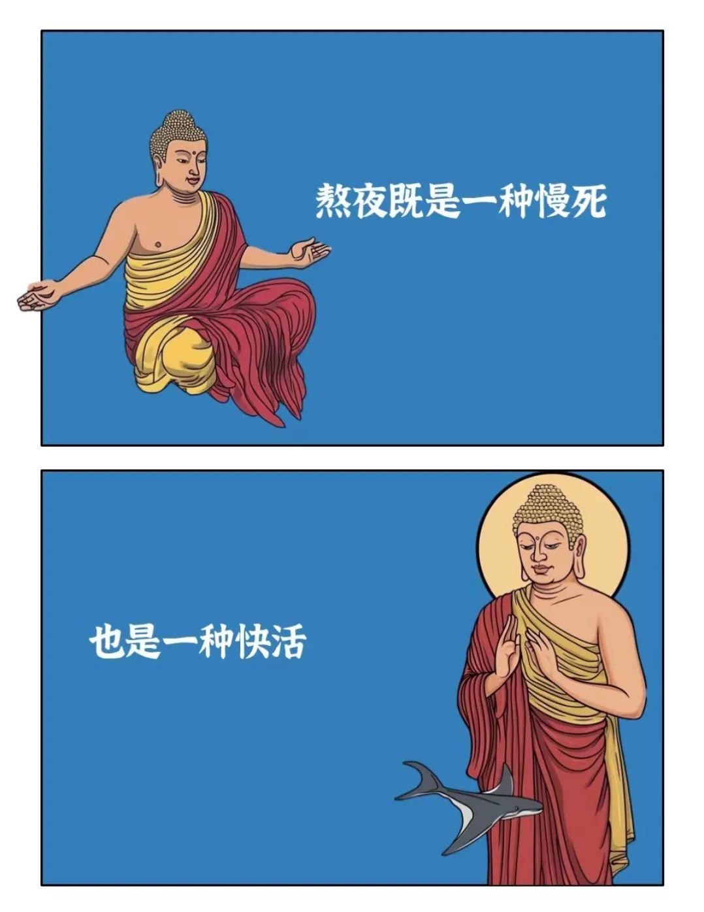

本文是张衔瑜第327篇推文

共计1881个字，1张图

把所有快递都拆开，盒子给店铺老板，袋子扔掉。各种小东西都放进新拿的袋子里。袋回家之后，昨天的袋子还放在柜子上。

没去动它。看到里面很多东西就心生厌恶。虽然也的确都是我买的。买了一些没用的东西。一本书「我的阿勒泰」也许也不会看。有点想看，但不会真的看。为了想看的买单罢了。

又上了一趟岳麓山。Ricky的脚力很好。我们从小路上山，几乎拉练到就剩下爬山和聊天的力气了。是今年上岳麓山里强度最大的一次。

盲审意见回来了。系里给通知也很好笑，有点像之前寄送银行卡 先寄一封信“我们要给你邮寄卡片了噢”，然后才姗姗来迟我实际想要的东西。在等确认答辩时间，估计又得等两周，

改了改毕业论文。属实是积重难返了。也好，花一段时间去证明一些事是不能做的，或者说现在够不着的。是过去四五年的常态。

又去了一趟桐溪寺。住持打趣说早上刚想起我，中午我就来了。也顺势应下了，说这就是缘分。

沿着大王山走了一圈。醒着的时候人还是醒着的，睡着的时候就已经睡着了。指曾国藩墓。

浅休息了一下，去聊课题。确认了很多我做不到的事。也许以后也会这样，想认为一些事是好的，但其实纰漏很多。尽善尽美是不可能，即使完全看起来完全点击正交的东西，写起代码来也会往各个方向泻水置平地 各自东西南北流。拟行路难。

去琴房祛了一会儿班味。弹琴可以让人短暂逃避一些闹腾。旁边天心阁公园总放一些让我听不到琴声的公园须知，那也无所谓吧，外边再吵也不如科研圈 开个精神化工厂 什么味道都在。老师弹了一首「良宵引」，是我很喜欢的一首古琴曲。后来边弹边问我，为什么「鸥鹭忘机」这么仙和空灵的名字，却有这么华丽的走手音呢？我说我不知道。我只感觉去体味琴趣是一件很让人羡慕的事情。

就事论事地说，摸索阶段 如果不是经验老到的人可以一眼看出什么东西做得什么东西做不得，(我不是为自己开脱) 而是当时的自我见识不足以让我做出这个做不做得的判断。所以等知道这件事的时候，它已经成了一个教训。

今天也跟朋友打了一个很妙但其实不太恰当的比方。就好比这个月要结婚了(天方夜谭 就只是举个例子)，既有感情的成分 也有收回份子钱的现实需要。请柬已经发出去了，前期各种磨合也都花了心思气力磨合好了，有妥协有不甘有开心有成就，但也什么都融洽了。

问题就在一瞬间都爆发。按照原来的思路里一切都顺利的情况下，反思发现虽然一切都表面和谐，但细究下来左右都是坑 从最开始的假设到后期的展开到终极的落地。哪哪都是问题。于是意识到，这婚是有名无实了。就在原本历经不少困难而最终扯证要进入下一段的时候，意识到，这是尽力维护了但畸形发展的闹剧。

仪式还是得办，现实需要上的收回份子钱也会促成这个仪式。但心里已经知道这是没谱的事。仪式转背之后就是离开，因为现在就已经离心离德了，只是因为现实需要而低头领受了

也不是不能挽回。做的思路都没有错，但细究下来每个地方都是问题。所以可以按照这个思路，比如换个城市，然后从各种现实需求到搭建和这个城市的情绪联结全部都重新来一遍。也许再来一遍会更快也更好，但婚期已经定了，是要花大力气的事 约等于做不了。

这时候是什么心态呢？就是我现在的感受。

早上学了一会儿，觉得想不明白，就把压力转嫁给了导师。过了一会儿，觉得刚刚没讲完整，于是给相关的人也提了个醒。下午又学了一会儿，跟经常说话的朋友也提了一嘴。朋友不在东八区，给我转了两百块钱让我去买两包和天下抽一抽。他先去睡着了。我去拿了两包白壳子，回了张照片。

学不动了。在犹豫白天能做点什么。夕阳前赶到了熙台岭。天心阁角度的楼顶已经被社区锁了起来。原来吱呀作响的门被撬走了。剩下一个被钥匙锁着的楼顶。

幼幼小学旁的whatever咖啡还是一脸滂臭。转身，在白沙蒸饺店坐走了四桌客人。找了个天井休息着。不管改不改，都已经积重难返了。还好我不会沿着这个项目继续做。既没有一点兴趣了，也没有能卖身支持继续做的资金投入。所以，去仪式上答辩答辩只答不辩完成了。

历史书上寥寥几笔，就是人的一生。一些教训说出来，即使前因后果全部详尽，也不过几个小时就能说明白的事。当事人却要花以年为单位计算的时间来得到这个结论。

所以命理因果一点地说：容易得来的 也会容易失去，因为不知道怎么来的 也就不知道会怎么溜走。很多经验是不可得的经验，是一柄放在一臂距离歪的利刃。你知道手臂一伸，就可能被刀給割伤。可只有手上出血了才会意识到刀有这么锋利 手有这么羸弱。

人无法从历史里获得任何教训。字能看懂，但是起来的连贯程度就像每个字都要查字典的小学生。去经历，就是逐字逐日查黄历的推演。

太离谱。事理上完全认识，情理上完全走背。累了，今年先这样。

来张我私藏的垃圾图。

