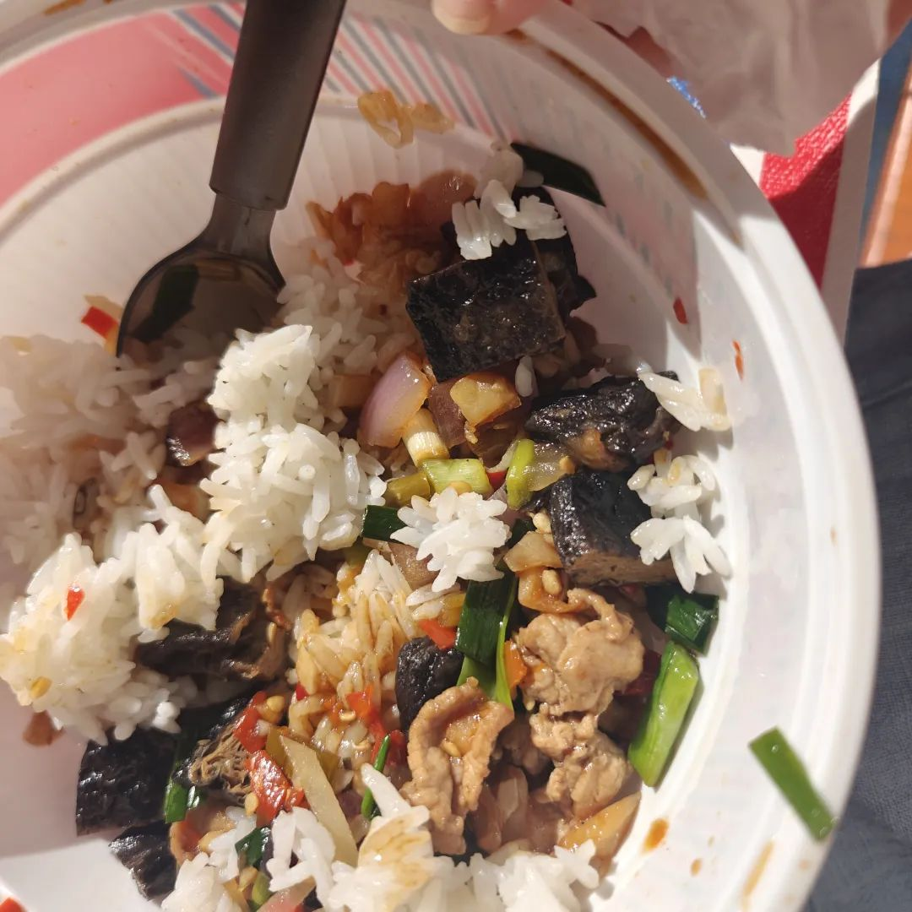
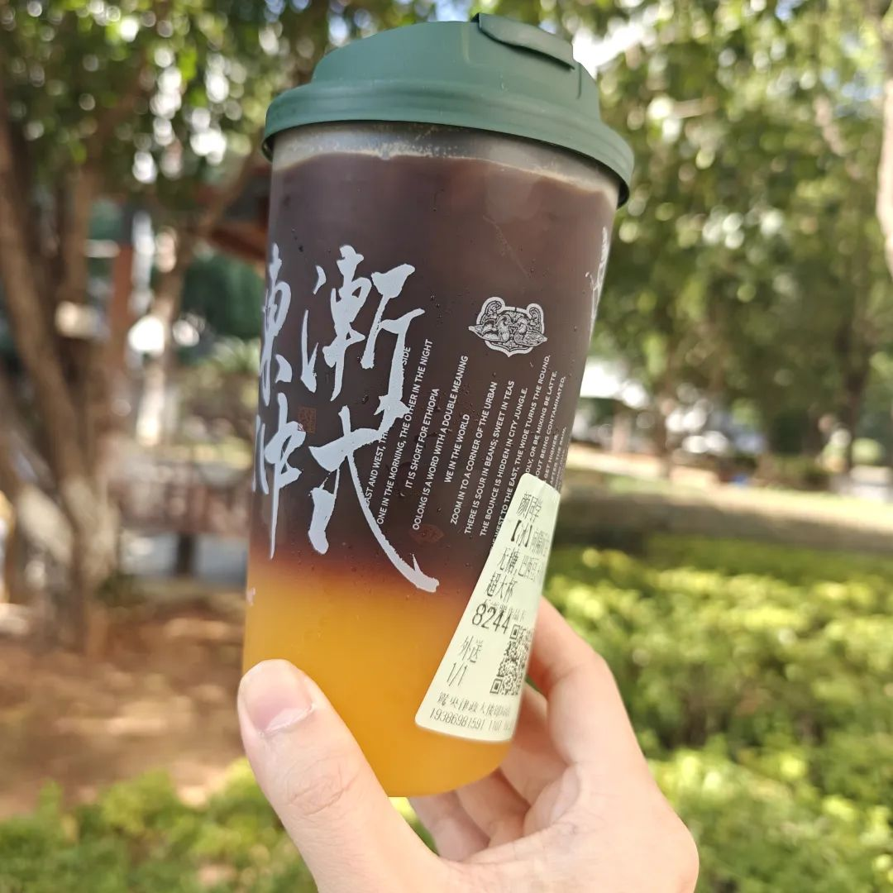
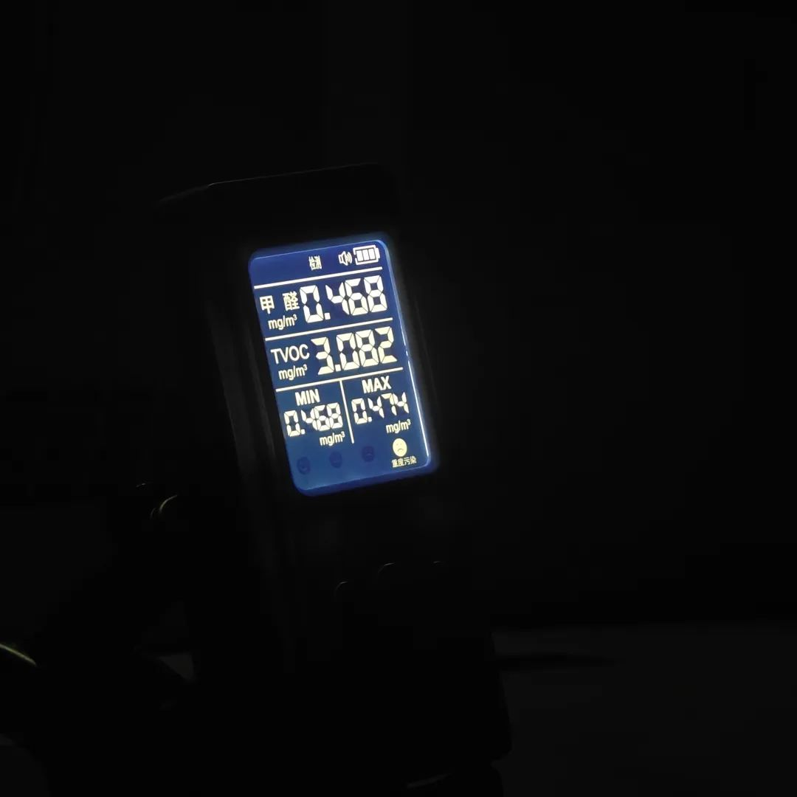
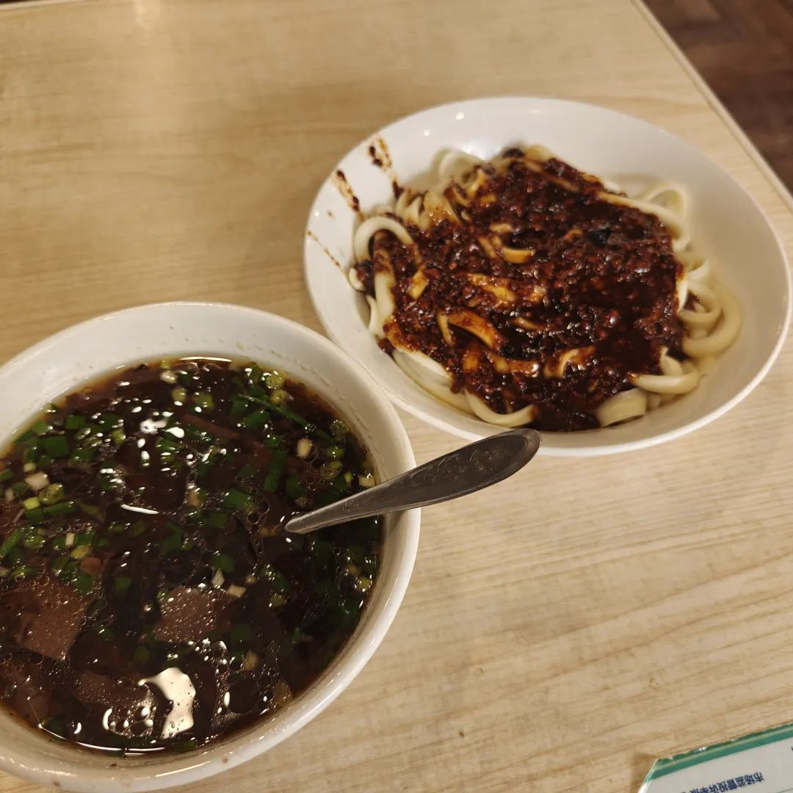
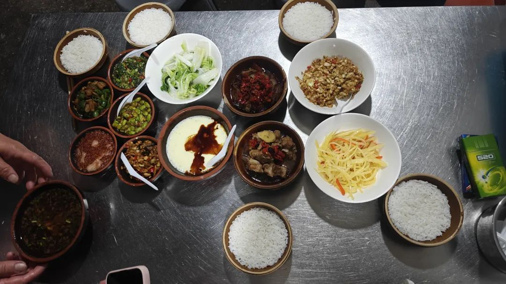

本文是张衔瑜第328篇推文

共计2375个字，7张图

最近备忘录里都是空的。意味着什么也没写下来。照片倒是拍了一些。存也存了一些离谱的图。比较现实生活充实(？)也许可以这么说。换成现在充电也可以。

想到了一些还不错的点子。但是因为不想让这些点子变得太现实，于是决定先停留在这里。

就好像有一个绝妙的料理点子。我们先假定梅菜扣肉以前从来没有人做过。那么现在我是第一个想到扣肉底下可以垫酸菜，饿哦觉得这么配起来一定好吃好看好闻。于是因此沾沾自喜。现实来说，只要料理就没有不失手的。所以有人约去一起做手工 制备酸菜，或者遛弯走过去菜市场的时候，也会问一下三肥两瘦的多少钱。

可以终于也没有做。很小的原因是因为对做出这道菜信心有限。另一方面是，在幻想中，这道菜可以随时改动。可如果真的既制备了酸菜，也买到了肉，上蒸锅然后处理。从菜上桌，到入口，到变成黄金，就是这道菜逐渐凋零，这个点子逐渐凋亡的渐进。

我不是说世俗化不好。而是有些点子，在我脑海里像的时候还不错。但只要一落地，事情就会变得固定。期待一些妄以揣测的可能性。即使是幻想，白日梦，似乎也不是什么很过分的事。于是留了一些我甚至不愿意写下来的小剧场。

所以每天还是每天一样。我不会真的去做料理。也不会真的去做那些也被我通过了可行性分析地路子。

阳光很好的中午，吃午餐。

学弟寄来了江苏的螃蟹。不错，不愧是蟹产丰饶的地方。

Zhi带来了酸柑可乐Lime Cola，外包装看起来就很好笑。实际上也就像封面上那台西部片的小车。

女儿带来了有趣的加热套。尽管没什么人理会。我觉得很有趣。把烟放进加热器里，尔后加热。这样拿出来甚至都还是完整的一根。而且不会有什么烟气。

选了个好日子去灰了根雪茄。灰了一根丘吉尔尺寸的黄鹤楼雪之梦3号。刚开始的时候我在想怎么这么拉啊？还怕被我派茄的朋友说我派这么拉的。过了几口之后，豁然开朗。木质和朗姆酒香味开始出现，空灵的烟气就像有灵魂的灵气一样到处逃逸奔散。还不赖。前中段很稳定，到后段明显茄衣质量开始下滑，出现断了之后续不上的问题。朋友也称赞了一会中调，找到了一些不同的呼吸方式一起探讨。尤其在后段开始生津，以前我没把这和道家的吐纳养生联系起来。后段还是有点醉。灰完后一天都远离尘世。能拿下一根丘吉尔的，应该都有些故事，不然一个半小时不能只是干瞪眼。我是拿不动了，丘吉尔完全给我探到了底。还在想那一盒大罗卜图怎么画。

和77在江边坐了会儿。终于手机里有除了机票比价截图之外的东西了。浏阳河边坐下来，叫停或者不叫停旁边拿着扩音喇叭唱歌的游民。77带了两大乐扣盒的水果。我从旁边农贸市场拿了很便宜但很辣的毛豆。大辣条可能会让小学生脆弱的喉咙噎到，可对于成年人来说刚刚好从地上捡起来吃。

阳光了一下午。人也变得阳光了。从吃完午餐，坐到夕阳下山。又一次人生作弊。第一次坐在河边感觉吃的东西怎么吃也吃不完。水面上有鱼翻动和好看的日光金光。金色时刻，对岸三个钓鱼佬等距地走过，脸全都朝向河中。很有电影感。

答辩时间就在钝刀子割肉。我完全不知道这人存的什么念头。跟兄弟打电话，兄弟看见我在抽十块钱一包的烟，赶紧给我转了两百给我，让我去买两包和天下来帮在美国抽不到的人来抽。

于是我录了个在琴房弹琴的小视频。发过去。

每天去琴房的路上，路过了一个中俄交流的服装食品博览会。占了一块我在这二十几年了都没有发展起来的事实上也还不错的地块。

也进去看了下。内容除了一小块进出口贸易的展柜之外，其他的就像小农博会。现在我都很少去逛农博会了。一堆卖各种中药方剂的人，热情招徕的样子就像倒过去二十年 他们也还是这样。带着不听哦几个。

脑海中浮现过一群骆驼商人。但是听不到一点驼铃声。写到这里的时候睡着了。做梦也没有梦到骆驼。

和朋友看完了《美丽心灵》，一部安利朋友强推的电影。可也许是01年的电影，现在看来常常出戏。经常被各种瞟学的电影分析手法而搞得没有什么具体看电影的心思。我说这种就像我已经看到那里有只脚了，脚刚刚抬起来，就知道那里要脱鞋。可惜后来都成了等这只鞋子落下，鞋子也真的落下了。

朋友问，你能忘记这些电影和文学批评手法，而关注一点里面的感受变化吗？我说，我也没有感受到。描述为，对演员的要求过高。仅仅通过妆造布景，而非情节冲突或演员水平的改变，我体会不到那些感受。

因为太出戏。所以我没有很多好话说。唯一印象感受的是Alicia喝完水之后又把杯子砸掉。 就像，看了一部样板戏但是美国版。

去爬岳麓山。我知道红叶是骗人，但也同意了被去骗一骗。没有红叶，快跑。

倒是走到了如愿茶坊，或者叫能量谷，或者叫省美协创作基地。是很僻静的地方，就在岳麓山下。之前研究禅修的时候曾经看到过这里，我还在纳闷怎么我逛过这么多次岳麓山了但从来没有发现过这里。实际上就在蟒蛇洞底下不远，因为林子掩映着所以见不到。

游客很多。上中下依山势有几个区域。上势不错。底下的水死了，有一些蚊虫。从湖大稻香村/红叶村这条线上去的。标记地点是湖大维修二队。

小测了一下甲醛浓度。半定量结果看起来触目惊心，比国标多了近五倍。

想去浏阳吃蒸鸽子。可是和之前说过的一样，感觉吃到了就不灵了。现在还是灵的灵的。

又去催答辩时间了。很烦这些人就是因为一个人才不配位也德不配位，要做的事情结果卡着一堆人。干不了活可以把聘书合同扯了当柴烧给我去温洗脚水。之前骂另一个人，说他配得上官能失调拉在床上，被护工拿着鞋拔子底每天狂抽。这个人着实配不上这么高的待遇，但未必不像要转几次车时候每班公交车都先走而且不在地图上标明的那种烦躁。能让没有工作能力的人在关键位子上待很久，周围的土壤自然也生长不出来什么作物。

现在只要一想起以前实验室楼下用来打饭的饭盒都觉得胃口大减(本来也没多少)。就是那种塑料勺子刮食品纸盒的声音，幻听的时候就催着我赶紧扔掉扔掉手里的食物，吃多了要得病。

于是去局关祠找点不会错的食物吃一吃。刀削面和小钵子蒸菜。最近还想吃芋头娃娃菜汤。

