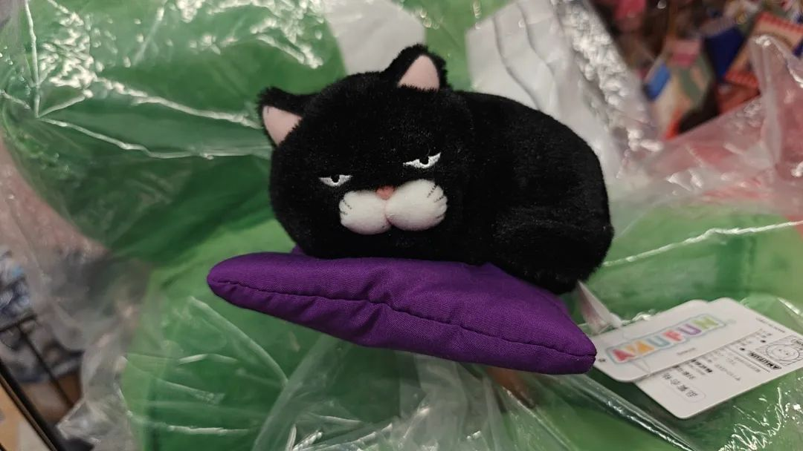
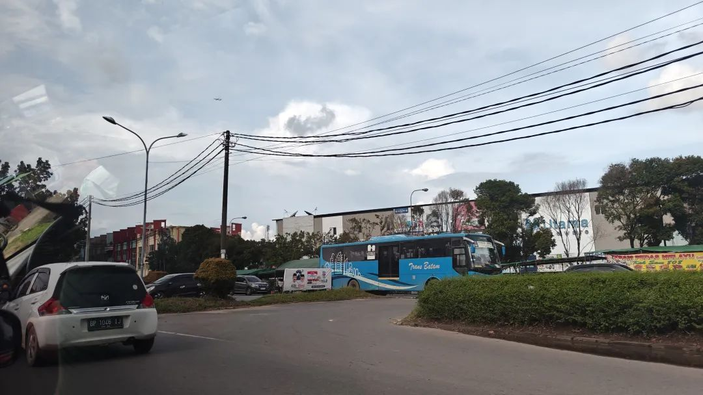
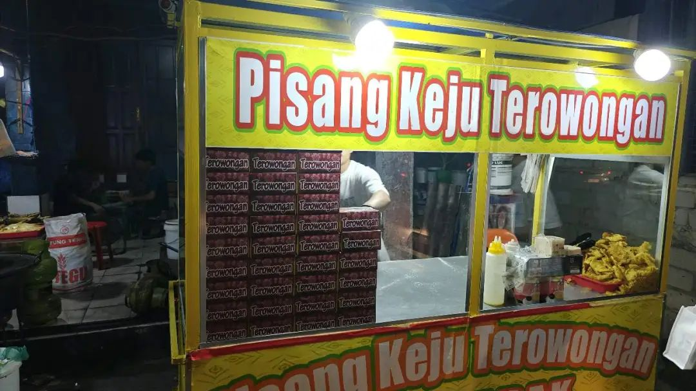
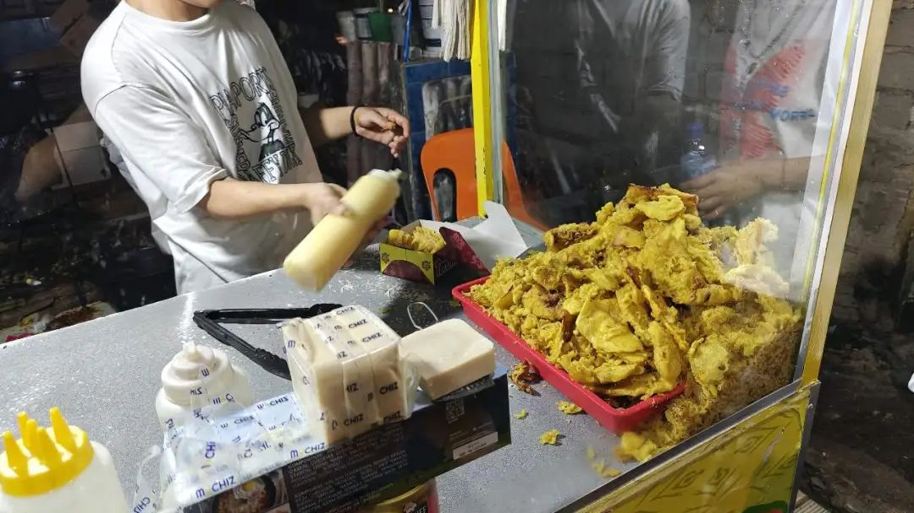
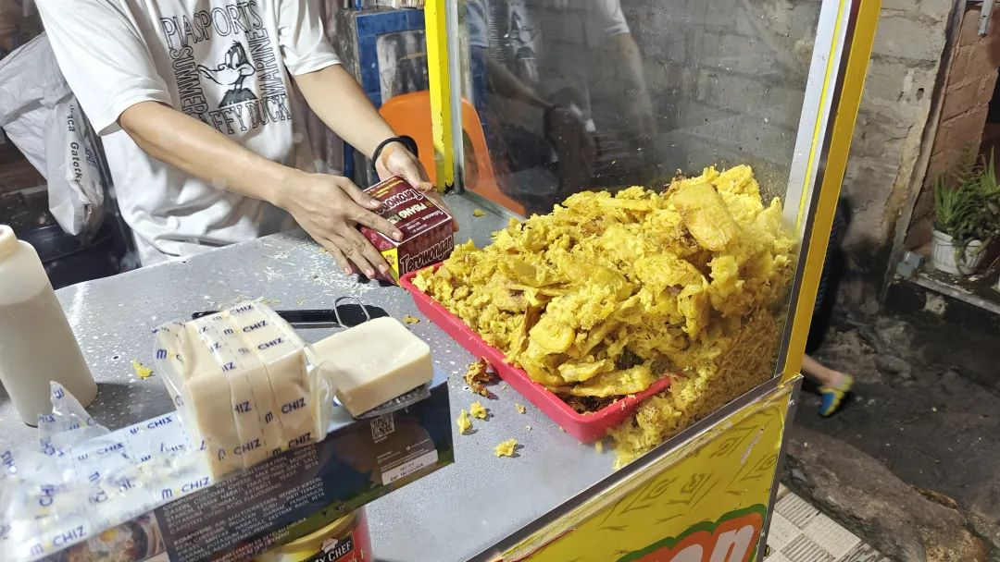
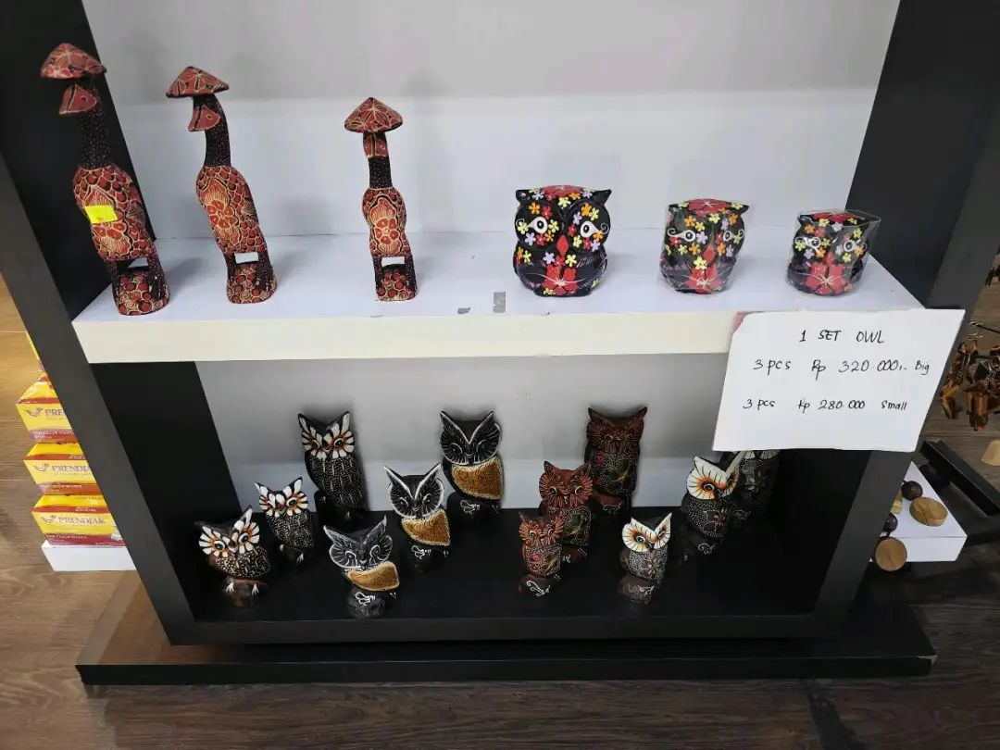

本文是张衔瑜第329篇推文

共计3778个字，77张图

上周四博士答辩完后，(这个过几天再写)，和朋友们说了很多关于好运的话，而后回房间呼呼大睡。

睡到差不多醒来，已经快到傍晚了。新加坡大雨。看时间差不多，下楼买了个金文泰商场看上很久了可一直没有买过的披萨角。毕竟一盘披萨吃不完，但偶尔吃上个一角还是不错的。现在我的食量也就是其中一个角。

新加坡在大雨。我想花点时间探索每次在实验楼上都会眺望到的地方，潮汐也想出去走走，于是在巴淡岛的范畴内统一。

在怡丰城旁的港湾码头取了船票。和潮汐去旁边超市逛了会儿，就一起过了海关。船是当天倒数第二班，九点四十。印尼挺有趣的，过去得往前倒一个小时时差。等于过去之后，坐了一个多小时的船，结果当地时间还才九点五十。

船上人很少，但冷气开得很足。本来也听不懂马来语，就随他们在那说什么。船绕着圣淘沙岛的南边一直航向东南。如果是白天的话，我想，应该风景挺不错的。而且也路过圣约翰到(或者叫谷歌地图上的 棋樟岛)，像远眺就够了的样子。

在巴淡岛码头下船，小小的入境大厅，弄不明白我们的身份。本说新加坡长期签证可以直接走不用印尼签证，后来一番交涉，又去交了五十新的落地签(就在巴淡岛的话 也可以理解成登岛费)。挺随意一海关，完全没什么威仪。印尼护照是浅蓝色的，看起来很海洋。

离开大厅后，随手打了个gojek去名古屋nagoya，不清楚为什么要这么命名。按说以前印尼是荷兰殖民地。也许廖内群岛有些不知道的历史。

印尼的街道看得人很迷茫。之前在想是不是租个车玩，看到街道又试着脑补了一下自己开车，决定放弃。倒不是完全难到不能开，而是路况和地图让人没什么开车的兴趣。出门是来观光旅游，而不是跟导航掐架，担心车子抛锚。

Harper酒店在名古屋很现代化的片区。相比之下，除了这几个酒店围成的片区，其余地方看起来比新加坡落后起码四十年。全季水平，也是全季价格，印尼的消费我觉得倒也不便宜。

潮汐生日，也在犹豫要不要去吃点传统中餐。选了一家烧烤店，进门当地时间十一点，老板也在打盹儿。

转去一家足够亮堂的地方，发现最亮的地方不是yellow酒吧而是路边摊。抱着试试看的心情坐下了，开始谷歌翻译印尼语到中文的菜单。印尼小哥看到两个明显正经华人坐到店里，也是一脸疑惑。当地人英语水平令人着急，以致于我想表达一个学人精 看旁边人桌上点什么就找他们点什么 都表达不明白。不过也没关系，翻译至少能在纸上勾一勾。当时菜单的翻译也很好笑。任何一个会中文的人看到都会觉得爷爷的爷爷的爸爸烤馕饼。

根据常年点椰浆饭和理学院楼下印尼餐的印象，点了炸鸡腿卤鸡腿ayam和炒饭炒粉mee huen。炸鸡的锅烧热了一锅老油。几乎不能细想里面有些什么。炒粉端上来又撤下去，原因是开始敲的鸡蛋碎在了碗里。虽然两个INFJ都想得很夸张，但其实吃起来还挺正常。至少是，推荐品尝级别。尤其是炒饭nasi，吃起来其实还不错，毕竟热锅猛油。

一边印尼小哥上菜的时候，边上边腼腆地笑。我说你先别笑，请把点菜的单子拿过来，告诉我哪个是哪个。虽然我现在也没有记住，但当时也随手把买的Forte烟递了两根过去。

吃了一顿十几万夜宵大餐，但是印尼盾。其实换算过来，人民也就五十左右。看到附近有家蜜雪冰城，点了两杯喝的，反向留学了一下，花了两万六印尼盾，大概也就十块钱，和国内价格相仿。

在印尼真的会被钱币数字带的零搞得很无语。真不怪别人数学差，而是这个币种就没法好好断句和算数。烟店老板用中文和我说，你看我们这里也有中华烟，只要八万。的确不贵，外贸版的中华不到四十。只是我根本不会买罢了。

印尼打车挺便宜的，和我在长沙每次打特惠车的价格差不多。只是路上实在很懒得弄，城市基建不知道是什么部门在负责。

去吃了很多人推荐的四方缘点心。菜单上有中文，装潢也很南洋花砖，吃起来也要素齐全。但总觉得被一代断代的印尼华人影响得很深。需要找经理才能勉强英语沟通，剩下的都是和马来语也不同的印尼语。也可以看他们贴在厕所里的告示，左右都证明他们的中文水平在我们看来翻译腔浓浓。事实上后来去按摩店，按摩店一位会中文的印尼华人员工在介绍产品时，同样也在用重复而累赘的句子，虽然流利 但明显不是中文为第一母语的说话方式。一代印尼华人，在七十年代受了太多苦。

午餐后，随便找了个地图上看起来像海滩边的地方。叫车过去的路上，司机用翻译软件问我们有没有确认过下车的地点，我用英语回 我们只是想找点有水的地方，然后他就按导航开进了一个乡村里。

海边的鹅就像假的。一个小小湾，挂着船。时不时有本地人骑着摩托车来。我尝试问其中一个印尼人，是否能从海岸线走到那边去，最后用手语说明白了，他说不行 得骑摩托。又解释了些什么，我没听懂，就随手递了两根烟。

溜达了会。很乡村的地方，连给摩托车加油的油站都破破烂烂。成罐的由放在店里，看起来根本不怕有人偷，也不怕出事。也许本地人比较松弛。每天礼拜五次，应该没有多少人会接受罢。

问潮汐，还去另一个海滩吗？潮汐说，来了 就去。我擅长提供选项但选择困难晚期，有搭子能做选择真是太好了。于是打了另一辆车去二三十公里外的地方. 。去程是八万一，回程是七万。这是巴淡岛我最推荐的地方。

Tangga 1000 Taman Habibie

4WVX+W8V, Tj. Pinggir, Kec. Sekupang, Kota Batam, Kepulauan Riau, Indonesia

进去有道门票。司机没有交，但找我们收了点。也是在地图上随便劝一下就去了。跟司机简单说，在这等我们二十分钟，我们待一会儿就走。把我们送到城里，给你返程是多少钱就多少钱。司机犹豫了一下，我递了根烟。司机说不抽不抽，你们别太久，我等等。下车后，本来我想着去看，他打翻译软件问能不能给他买杯咖啡，然后在便利店里自己挑了杯咖啡在旁边等我们，跟其他人聊得似乎挺开心。

当时能见度还不错。根据方位，能直接看到新加坡的东海岸公园。很难想象巴淡岛的人对这种对面崛起一座座高楼而自己住在外面大雨里面小雨的房子里是什么心情。其实也不难想象，我觉得他们也不太在意。

我们在海边挑了个小蓬子坐下来。一些说不上名字的虫子飞来飞去。想捕捉但没捕捉到。植物是厚藤。

如果可以，在海边坐着很安静恬适。可以在这样的海边做一整天。也有一些本地人在旁边坐着。未必在想什么或者在吃什么，就坐着发呆。说什么或者不说什么地坐着，就已经要接近我在浏阳河边坐着时候的感觉了。大海更壮阔，热带的风也更和煦。

我把这里标记为这次巴淡岛之行，最值得去的目的地。

和司机说可以走了。司机也挺开心，有咖啡喝，也有回程的钱赚 还不走平台。从这里开出去也得好一会，不如拉一单回市区。

司机顺手开进了旁边的加油站等加油。这边明显不如马来西亚方便刷卡。问了问油价，95#的油一万印尼盾每升，约合人民司四块六；国内刚下八块；马来西亚差不多三块二；新加坡十八多。

于是有这张图，打了个七万块的出租车。也许日元用起来也是这种感觉罢。

Spring Massage按摩手法，不如新山泰皇鼎。贵一些，而且手法比较粗糙。除了放石头的更传统按摩 以及巴厘岛的六个半小时按摩之外，不然没什么必要在印尼尤其是巴淡岛体验按摩。

吃了个西式晚餐。然后转去了旁边小小心意。西餐做得也像印尼餐一样惹人发笑，主要是各种和鸡有仇。

小小心意是家伴手烘焙坊。吃到了斑斓蛋糕。我对印尼华人的印象也就全在这斑斓蛋糕了。而且试吃装就已经完全足够点下我对这个食物的馋。虽然招牌写着小小心意，但没有能说中文的。有趣的是在店里等车，店员就不停的给我们试吃各种，于是吃到了有意思的鱼皮，又买了一些。

喝了杯紫色的色素水来对抗甜腻带来的冲击。问店员，这会是什么呢？店员说是柠檬水。我说可别骗我了，柠檬水都是澄清透明的。他说先是蓝色，后是紫色，至于为什么或者加了什么，他也不明白(也许知道 但是英语水平说不明白)。作罢。

去了潮汐此行的心愿目的地，炸香蕉。频繁加入灵魂酱汁和灵魂起司奶酪，看得我们在旁边啊？啊？啊？

路边摊的店员已经炸好一块块薄薄的香蕉。拿起纸盒，把炸的薄香蕉片装入盒中。至半满多，加入不知名的两种酱料两次，一层厚厚的奶酪。又如法炮制一次，直至纸盒呕吐。前场炸香蕉亮堂堂，后场两个印尼男子躲在阴暗的角落里剥香蕉。只靠大路路灯的背街小巷里，几个小孩穿着跟合身不沾边的衣服，拿着和自己脚尺寸无关的人字拖，玩着对前方扔去，又跑去拾捡的游戏。

炸香蕉的味道，要努力辨认并且先验性地说这里是炸香蕉，才能知道这是炸香蕉。

在旁边的小巷子里抄近道溜达了一会儿。

和潮汐聊聊的结论是，巴淡岛也许不会再来了，但很久以后也说不定。可就算再来，走过的小巷子也就只是小巷子。就像这次意识到的很多见面的人，都说不定见过了最后一面。这片区域和挂着商品 抱着小孩坐在店门口 交叉的电线杆，也就见到最后一面了。

买了点印尼色彩缤纷的特产。传得很火，但也就一般。

清晨，巴淡岛大雨。坐车去巴淡中心港口。被问，还有什么关于印尼的心愿没有了吗？我想了想，只差一件窗帘布的新衣服。但是没买到，也没关系。

在港口逛了逛。被所有有关食物和颜色的东西刺激到。印尼的传统食物，看到则已经绝杀我的任何胃口。

船运很不错。意味着即使全船都装满了，但我们还是找到了靠左舷窗的位置。从巴淡岛到新山的巴西古当。巴西是Pasir，应该是马来语里沙滩的意思。所以是某个滩。

左舷可以看到樟宜机场一大片填海造陆的坪。也看到了拖沙子的船。会看到乌敏岛，转手发给了四年前一起到乌敏岛的朋友。旁边还看到大德光岛，应该是新加坡另一片未探索过的区域(也不好奇)。

到新山就像回家了。也敢开车，也什么都熟悉了。要不是这里离新加坡太近，不然在我的备选城市名单里，这里会和盐城一起出现。
