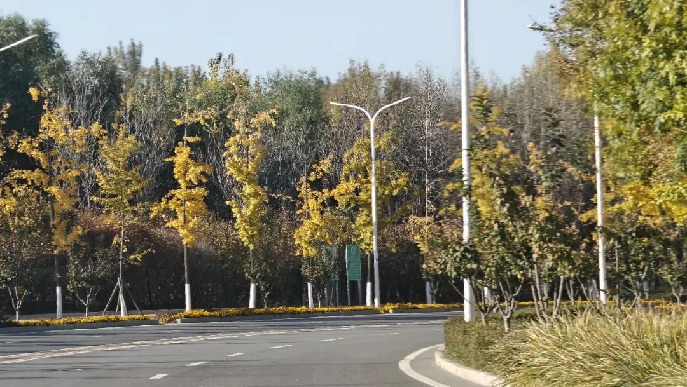
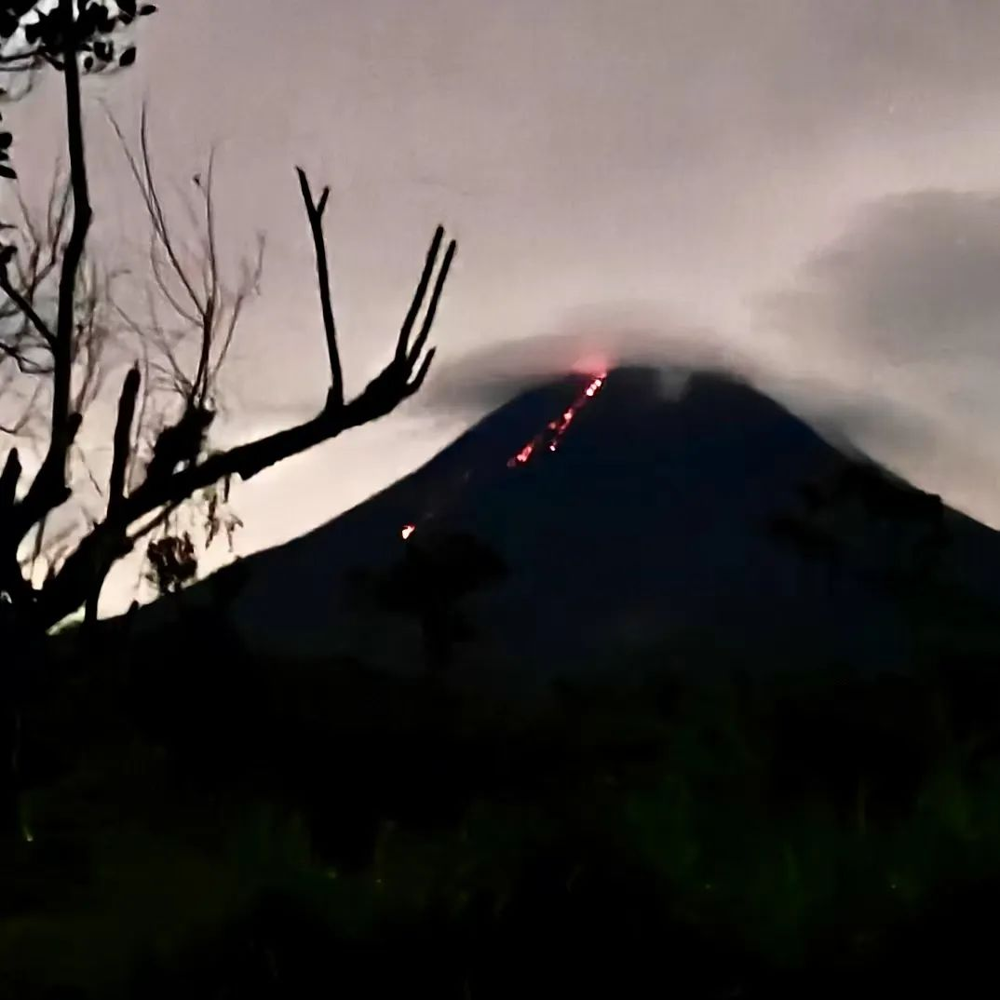

本文是张衔瑜第334篇推文

共计10025个字，100张图

比起睡着，

你更喜欢 片面地醒着。

——寸铁/腰

2024年是有很多好故事可以说的一年吗？

感觉今年选100图，虽然好看的有一些，但会很挣扎于我所感受到的是环境底噪又或一次随机事件？是一个谁来看了都说好的东西，还是我小心带着蛋糕到位子上，路人走过 高情商地象征性说了句好特别啊，我还得把人打发走，才对镜子小声说句生日快乐。

人有悲欢离合，月有阴晴圆缺，此事古难全。

古难全不意味着悲欢离合都与我无关，阴晴圆缺都成了一句玩笑。其含义在好好珍惜所期待的，随Ta去吧那些留不住的。

好事发生时，人会很开心。写下来，这些好话都成了历史的挽联。

人一定要在自己活着的时候办追悼会，毕竟人们把最多的好话都留在了追悼会。听不到那么多人，交情甚笃或素昧平生，给自己说好话，听不到总归太可惜。

今年以来，内向的程度不断加深。现在见到人都想绕着走。

一月 。

从原来的住处搬出来。如果我去搞一个学校的后勤，至少不会让本就没有的学校声誉因为后勤而继续塌房。好朋友老板凉去了土耳其看热气球。我也想住到热气球上面去。直接一个火箭🚀放到土星🪐，你好我系外星人👽

摄于我住的小房间。挺无聊一房间。从实验室视角看，每天朝九晚一，早上坐在那就到晚上了；从房间里看，这个人八点钟醒来，两点钟之后还会再出趟门。

谁会觉得这样的生活是有趣的呢？

跟之前的屋主简单地在WhatsApp上交流了一番。

对方作为Bespoke租房公司，想再诈骗我两个月的租金。可那里根本就不是人能住的地方。利用外国人初来乍到就尝试拿捏🤏🏻别人，我不提级是因为太忙了。这种事要放在博一，说什么都要当个新奇体验来试着玩一下，最次也就是被沆瀣一气地强制执行了两个月的钱而已。这次直接把对方恐吓走了，对它其实没什么损失，对我也就时间经济。

拿着两个整椰子上了直落布兰雅，新加坡南部山脊之一段。2024年1月7日。

好朋友 阿吉吉吉 过生日。设计的这么多个坨子里，最好玩的就是这个吉吉国王坨子。从各个角度看去都是阿吉。

元旦节后， 淡滨尼海军 和我分别找个合适的店去大吃特吃。我找的是潇湘楼， 淡滨尼海军 找的学校里的娘惹自助。

后来又和好多人来重复过这家店，图里是和女儿一起来。是那种看到样子闻到气味也想不出来是什么味道的娘惹菜。如果难吃，那也就只是黑暗，不会被反复留意。

但关键是，这家还挺好吃。

二月 。

快过年了。准备了一些年货。二月似乎跟篆刻有不少联系。这个是自己刻好的“福”字，然后盖上金色的印泥。红色衬底，让金福变得越发喜庆了。

也不知道切蛋糕是什么习俗。吃不下多少，于是在盘子上写写画画。

后来我把这个盘子拿个好几个人看，你觉得这个好看嘛？你觉得我画得好不好？大家只以为是我又随机点一个人起来开玩笑。

可我的确觉得这个盘子也还不错，是花了点心思在的。虽然是一些食用色素吧，承载在一次性餐盘上，但我觉得好看的时候这个就是很好看。为此不惜在年末100图再次把这个盘子拿出来炫耀一番。

要是还觉得不好看就算了。现在这个盘子也已经早就回收利用（或者没有回收利用）变成别的东西了。

被导师强制休假了。虽然圣诞节、元旦节、春节的前一天，还都来查我的岗，并且给我发邮件: You cannot graduate unless you work every day (你将不能毕业，除非每天都工作). 但三月份见进展持续走低，于是被强制休假。

休假嘛，和朋友们会合才是正经事。在上海被 嘎嘎 和 寿司 接到。新加坡太热，而上海还冷着。于是拜托带来了厚厚的衣服。冷空气和热水澡，令过了一年半夏天的我感慨还是有四季的地方好。

回长沙，参加了两位好朋友的生日聚会： 兰师傅 的农历生日和 豆老师 的阳历生日。于是跟着前后脚打了一通宵麻将。以及，凌晨点了个冰皮蛋糕给深夜贰伍捌，令刚从新加坡回来的我大受震撼。

只是一会会儿没回长沙，真的有这种断电了还打着手电贰伍捌的人啊？

四月 。

返校。

再不返校，又得被说“你将不能毕业，除非工作每一天”了。这种奇怪的中文硬直译真的很夸张。

到学校之后，正经事做了些，不正经的也没少干。

哥印拜陀空军 为了欢迎我回来，特别叫后厨加了致死量的印度飞饼。这个还好，至少给了刀叉。等到 小彭 后来愈发抽象，一起去的餐馆也开始默认不给我刀叉和筷子了。第二张图就是大家一起去的泰米尔日历里的新年，总之我是手抓的（就不必上图了）

同桌，也就是 蒙古海军 ，每天问：“我们在等什么呢？”有时候会直接上真东西，有时候也看看别人演的。图为王天一快出事的时候，一边吃泡面一边看大战许银川。

这步才到两边上正马，我觉得欠点意思。

五月 。

现在说起五月我都有点两眼一蒙。说不定就把不在五月发生的事情挪到了五月。

五月吃了很暴躁的泰餐。好久没去后街了。后街泰餐Grab竟然有了中文翻译（谁知道这个南泰愤怒到底有多愤怒）（菜品都是新币，比人民币近年来大多五比一，顺便看看价格）（好像还没加服务税和消费税，一共19%）

没事咯。菜品太贵了我们就自己做。这次聚会的背景是系里大家都交论文的交论文了，待交论文的也快了。总之，再聚得这么齐也有些难度了（一堆人比如我就不会去毕业典礼）所以能聚到一起的时候大家都一起来。

博士生涯里，那个确定我可以毕业的科研发现，等到五月了才做出来。

是一些盲目自信和运气。如果这个没做出来，铁定延毕了。而且，最后一个实验也是等到了交论文的最后一周才做出来。如果做不出来，就交不上了（虽然不至于延毕但是得延时）

一步步踩点。

图里我是给 小彭 打下手。比如准备培养液，拿耗材什么的。毕竟我手在超净台上时，没法拿手机。

也想了想，100图里是直接放我的实验现象还是放一张我在博士论文里画的那些漂亮的图。

最后，给了一张实验室里做实验时的图。

试用了一下理光GR2，也是我老早就想用的一款机器。理光的高对比度胶片的确很好看。

六月 。

图很少，是因为我没怎么拍。认错。

有些图没有什么内容比如实验现象，有些图无论谁想刻意回避，还有些我征询意见之后，让我不用放到100图里。

今年选照片不同于以往，要么从很多里面选出来很少的，要么很少有几张照片，别的没得选（选不到同一个层次）。今年是字面意义上的很难选，或者不想回看。

假装这里有图，placeholder只是并没有出现在可以微信划来划去的一张张图里。也就不用一刀一刀又划在空气中。

总是一坐在办公桌前就忘了时间。如果不被打扰，所有的时间精力都在办公桌前。每天消耗到保留一个凌晨一点可以跑步去赶末班车的精力。事实上常常会在回去之后还觉得可以继续干活。成了一种干活的病态。

看了几部杨德昌。

《一一》这部电影里，我把NJ简南俊提着礼物在门口驻足的这张被截图了下来。其他的故事都在电影里。很显然，讲故事的能力还得看台湾手术师。

女儿又到新加坡。

上次没跑过的地方是黄金大厦和哈芝巷。黄金大厦这个楼梯，路过一次就要转一次（当然也没什么机会路过也挺远的而且我也不怎么看电影了）

做实验做得头晕眼花。

在楼下看到外卖的车上有好看的挂饰。于是跟超人说：“捞一下兄弟，捞一下，捞捞，多涝啊”

七月 。

人和事情都开始进入暴躁阶段。就像老歌剧里的《快给大忙人让路》，不管说什么我都：“别瞎闹，我赶着毕业！”

只是每天还是累得头晕。没有一个事情是省心的。越到这时候，越抽象。整个七月就是满脸问号的七月。

每天能量都很高。但是虚高。由精力撑起来的。人生有一段这样的经历就足够了，从事业到生活，每一个都兵荒马乱的。

等高效液相色谱的时候写下了这一段。

八月。八月从七月底开始。在 小船 的楼下改他的毕业论文格式。改到坐在楼下，聊很远很远的事。

和 登登 出发去新山吃饭，本想着和 阿吉 还有 Kong Kong 一起去吃已经反复吃过好多次的隆盛。可是！！！！ Kong Kong 的师兄指出了我们方案里的不合理之处（笑的 这说法太科研了）师兄说当然吃海滨楼啊！ 登登 和我试一试，确实啊！！

海滨楼的辣椒螃蟹改变了我以往对这道菜的看法。以前我觉得这道菜不好吃，结果八月我都交毕业论文了，却在一个月之内三次造访这家店！海滨楼，值得我一直打感叹号的海鲜店！给每一个会和我线上或者线下聊天的跟新加坡新山有关的人都推过这家店。

和爸妈一起自驾环游西马来西亚。一大圈，八天七夜，两千三百五十九公里。 开车开得我人都蒙了。

把脚撂在波德申的海边休息。终于有点休息的样子了。

怡保，一个被提到过很多次的地方。墙绘很好看，比很多西马攻略上说好看的地方都要好看。这里的人说话也很好听。

槟城停了三个晚上。

开车去关丹的动物保护海龟海滩。是这次环岛旅行上，见过最漂亮的海。

广州见。

淡滨尼海军 在后座看着 蒙古海军 监督我开车。第一次摸半幅的方向盘，也第一次开电车。大家多少都有点紧张。我是不太紧张（毕竟智己有那个撞得稀烂的实验）（大概意思就是什么样的墙可以直接撞过去而车子基本完好）为了避免路怒症，我们把群名改成了不说脏话 说脏话要吞一千根针（认真且郑重）

和 Yuma 一起去探 Jody 曾经住过的地方。Jody在曾经游泳🏊🏻‍♂️的泳池和假山，留下了这张梦核。长大后的 Jody 对小时候的一切还感觉熟悉吗？这得问 Jody 本人才知道了。

淡滨尼海军 不愧是军部出来的。探了探 蒙古海军 的鼻息，给我打了个手势。

我不会那么莽撞，于是请示了一下顺德区出入境管理局。回复说可行。

我：“那，行！”行是行走的行。

和 淡滨尼海军 凌晨四点从顺德出发珠海拱北口岸。等拍这张照片的时候， 蒙古海军 还在睡梦中。

澳门莲湖庙里神龛蒲团上的小猫。小猫当了我好久的头像。

杀回顺德，又闪击中山。

中山吃这么好的吗？！粤菜早茶不可思议嘞

不是 登登 来了我都不敢进这样的酒店(笑)广东认知概念里的酒楼真是祛除班味的好地方。

夜跨深中通道，和 Jody 再会。又在广州送走两位海军，继续和 登登 探索未知的广东。前出云浮罗定、肇庆、江门，看看那里有什么(看看电车能跑多远)。于是余有叹焉，当自驾有瘾的时候，感觉几百公里就是指哪打哪。另，广州荔湾广场很怨(没必要放图吓人了)

九月 。

回长沙。 登登 也来和大家一起来聚会。吃过烂屋子后，打完德扑后，去楼顶聚会。九月，长沙楼顶也已经不那么热得发慌了。

之后，和几个认识了半辈子的朋友一起去了忘浮沉。我们给不愿透露姓名的铁子解决了一个当晚遇到的麻烦（这也是我们都没有想到的）

我们能有什么想不开的呢？直接送到颐尔康，按按摩就什么都想明白了。

买了一个巨好看的史迪仔杯子。

血盆大口<<.👄>>就跟上图里那只猫一样。

蛮喜欢这个杯子的。现在还在我手边。

是该切入今年新的正题了。早就说要去庙里或者道观里待一会。在广东时，去了解过一下肇庆四会的六祖寺。六祖寺好严格。去他们那，每一分钟都计算好了。佛祖也掐表读数。

应该干不动这个六祖寺的禅修。于是选择回长沙找更随缘的地方。

云麓宫的小狗说：“这里白天来玩的人太多了，你在这里也会把心玩野的。”

道长说：“你不要总想着自己内向所以怕别人。把那些当做外物，外物怎么能扰乱你的心呢？”又问我要不要来过几天的送寒衣的节日法会，说信众们会来，但你不要怕。

我不怕我不怕。

十月 。

兜兜转转了一整个月找地方，最后落脚了桐溪寺的桐溪禅院。

寺庙里的僧众和义工们都对我很好。除了外菜勿入，想弹琴的时候就去琴房，想练字的时候就来铺纸。

虽然我的问题在这里也没想明白，但至少知道了即使托付给宗教信仰也不会真正改变现在的状态。宗教场所提供了一个很方便的静心场地，这已经足够了。

这和悟明白了什么一样重要。

静修了一段时间后，知道既然我的事本不和寺庙有关，那就向外走，去找答案。

答案也许在音乐里。 花墙乐队 不回应我和 豆 穿的粉色鞋子。

答案也许在酒里。我不喝酒，就看着 11 喝。我喝点无酒精特调。

答案也许在北京。

低温的日子，和 根基 、 二喜 一起去汤泉店。太狠了，北京的汤泉店怎么这么狠，地下一层地上五层直接给南方人的眼睛都打开了。

连连和朋友们约去沈阳的行程（虽然到现在还没约上）（但总有一天！沈阳我必冷天冲）

经 Jody 的推荐，去了天津茱莉亚音乐学院。音乐学院把我那些乱弹琴变成了一段可以复刻的乐谱。往常都不知道自己弹了些什么东西。现在可以大方地说，你看，就是底下这一段。大儒为我辩经。

导师的导师在科研会议上摇来了诺奖得主和给诺奖颁奖的委员会主席。主席给我颁发了一枚瑞典的唇烟，放在嘴唇底下，不用点燃。这是我迄今为止，离获得诺奖最近的一次。

回了北京，和 吃姜高手 在温榆河旁小坐。聊了些同样玄之又玄的内容。

故都的秋呐～越来越接上了国内的地气。

今年最搞笑的图，是回长沙后和 11 在熙台岭拍的这张龇牙咧嘴的招牌。笑得人也龇牙咧嘴。

月底万圣节。拿了两个大黑塑料袋扮演学术垃圾（也不算扮演）

一起出街的朋友觉得好玩，套上了我备用的塑料袋子。

霍，出门碰到两个盒子。

姐妹问：“你们也是垃圾盒嘛？”

对方义正言辞：“不，我们是乐高。”

十一月 。

越来越自在。

觉得待得几乎已经作弊般地提前过上了我想要的生活。也许这样的生活在退休之后，但我现在正在河边喝喝茶。

Memory 带了刚洗好的水果，我去买七块钱毛豆和九块钱瓜子。如果碰到了不好玩的广场舞扰民，那也没关系，打电话给12345市长热线，就说热心的长沙市民不能被闹心。

练了两个月的古琴课结课了。之所以去练古琴，一方面是古琴本身是个非常安静的乐器，另一方面 教我的古琴老师也常常抽烟。

在他的视角里，烟带有灵性，因为烟往上走，比空气还要轻。烟和音乐一样，会去缥缈的地方去。所以《鸥鹭忘机》。

很快就被召唤回了学校。因为毕业答辩时间定了下来。

中转福州，见到 金鱼 和 洋哥 。烟台山好玩的，是一年半之前夜袭平潭岛返回福州后错过的地方。聊了很久最近也在准备的东西，琢磨合计了一晚上。到福州，就像返回了一个检查点。

后来翻图，问无性别商店到底是什么商店呢？ 被窝探险家 说了真话，是个衣服店。听起来是很好闲逛的店。留待下次再返回检查点。

在长沙养得好好的，一到新加坡就被夸“不上班的人就是精神好。”

等过几天，接到了新加坡的地气，人就又开始变得紧紧张张，什么活都要忙起来了。

不断不断地清东西，谎称“把好运送给想接好运的人”。这些东西再怎么说，也是一件又一件买回来的，是我一个个选好了才挑回来的。

最受欢迎也是我最看重的，还是这几本书。一本也不打算带回家。邀请拿书的朋友写读后感，一个也没有写。不过当时也邀请几个人留了便条给我(物证+)(笑)

答辩的前二十分钟，还在改PPT致谢。致谢是整个答辩最难的部分。至今还没写博士毕业的那篇（但总有一天会写完的，既然证还没有下来，那还可以再拖一拖）

去答辩的路上，司机问，穿得这么正式，是干嘛去呢？我说，去毕业。车后座上的花好好看啊，可以玩一玩吗？

拿着玩了玩。

答辩主席看到一房间的人，说，自疫情以来，就没有见过哪个博士候选人的最终答辩会有这么多人来听。主席轻点了一下系里的秘书，说应该给我们一间教室来组织这场答辩。

我起初也以为是一间教室，开始摇人。后来因为地方不够，甚至退了一些邀请。最后满满一屋子，或站或坐，很谢谢大家支持。我之后，就都改教室，也全系通知了。

另附一张毕业答辩中的Gallery。写致谢和写前面的一样久。

答辩完，出去逛。那些四年以来没有来得及探索地方，都去探索探索。首站，和绿老头 潮汐 一起去了印尼的巴淡岛。很老头乐的照片。

十二月 。

完全结束了跟新加坡的房屋租赁合同。开始四处游荡。

和 爪 、 痞老板 一起逛柬埔寨。刚写过的那篇柬埔寨的推文里说得太全面了。但那也只是现在的我感受很深。写100图的目的，是为了选择今年最有感触的一百张图，记录下来，即使说过一次，也还要再说。

吴哥窟内圈的女王宫，沉浸的微笑被时间剪了指甲。

印尼能夸的很少。除了我这里提到的，别的都无可夸。

今天打开小红书，里边收到的评论和私信都还全是关于我写了一篇给6.5h按摩的自来水。

另外，全景列车和雅加达唐人街都可以夸一下。建议以后的印尼行程改为巴厘岛落地，搞六个半小时按摩，然后瞬移到雅加达或者泗水，接着坐完全景列车，最后从不是日惹的任何一站直接飞走。

泰国的磁场远没有印尼那么混乱。

去的国家总会慢慢变多，私以为很难有像印尼那么乱的地方。也许因为有曼谷本地人 陈爱璇 在接我们，也许这儿本来就挺好的。

郑王庙会大大方方地说欢迎来到精彩泰兰德（而不会）（算了不拉踩印尼了）（就大方表扬泰国）小乘佛教的建筑艺术。

曼谷去大城府阿瑜陀耶的开窗火车我也很喜欢。也许过几年高铁拉通，占线了之后，就看不到这样的景致了。

湄南河的景色很好，看过的绿老头们都赞不绝口。

去泰国的朋友们一起在大头贴前留下了这组图。给新加坡的生活作了一个完整的告别留影。（亦即已经瘦了三十斤的我， 小彭 大概也比今年年初瘦了二十斤以上）（大家就什么锻炼也不做，纯搞科研就会哐哐往下瘦）（当然我下半年也没怎么很认真搞科研 就是知道下一餐还有吃 这一餐就不会狠狠骗自己了）

回国了。和年初搓的小石头一起去拜访了原版，泉州开元寺西塔放心石。小石头已经很久不用了。放在包里，很放心。

去了太多太多地方。大箱子的内胆已经扯烂了，被我收到了角落里，等猴年马月再来修。 登机的小箱子还能再战。看外边这些旅行后的易碎贴，这已经是一个脆弱到只要风一吹就会烂的箱子了。

战功赫赫。功勋卓著。

2021-2024纪念册。

回了长沙。感觉长沙好冷好冷。也许是因为瘦太多。觉得今年是过往好多年里，可能从初中以来，最冷的一个冬天。

去参考参考别人都在穿什么吧。听说东茅街茶馆已经开了半年，那现在应该没有刚开业网红店时的那般手忙脚乱了。好好好，长沙人民红心向党。

昂 说少搞点卷烟，多搞点烟斗。我觉得有很多道理，于是就变出来了一个大力水手玉米斗。两个月前和 兰师傅 、 豆老师 去烧的烟灰缸，一个月前已经成型出来了。这就拿来试用一下。完全到位合理。

2024年的100图很混乱，是写100图以来最难以操作的。

可能也意指今年，不管好坏，但都足够精彩。

只有足够精彩，足够丰富的一年，才会让人迟疑。一年怎么有这么多的事，怎么这么混乱。

所以，今年也没有像往年一样，选出我最喜欢的五张图。题图选的是我觉得很惬意的河边喝茶。这样的生活已经发生了好多遍。每一遍我都很喜欢：就在河边坐着，嗑瓜子嗑累了起来伸个懒腰。找点芝麻豆子茶喝一喝。

有这样的生活，就是我慢慢养神的生活。

好在有生活。避旧谶。避重就轻。

不是像述职报告那样，一年年地只顾着把所有方面都说到。没有说过的，100图外的那些天，那些天也成为了这一年不是吗？每一天都是一天，不是一直重复着重复，是新鲜着新鲜。

收束图，在泰国素万那普机场拍的一张告示。

无论我们遇到什么困难，都

《不能再这边等！》

旅途愉快，

铁石心肠的 我和雨和你。

——寸铁/腰

2024年12月31日

张衔瑜

于 湖南长沙
