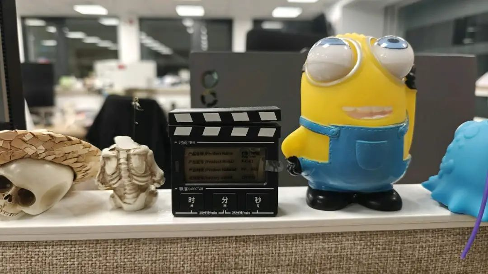
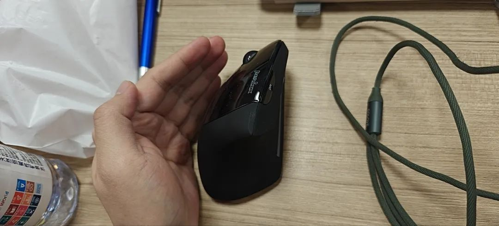
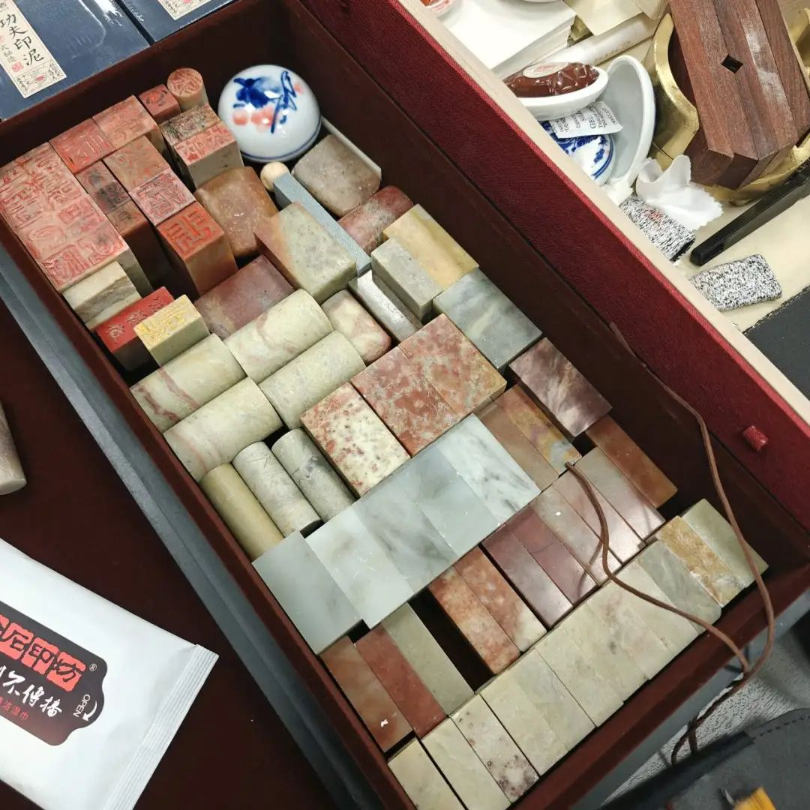
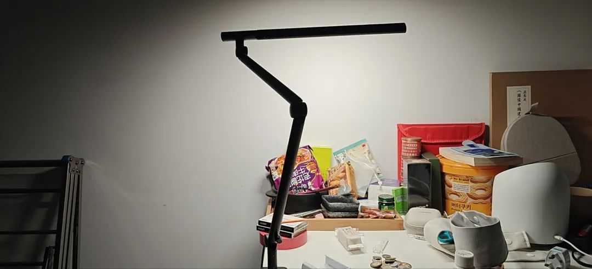
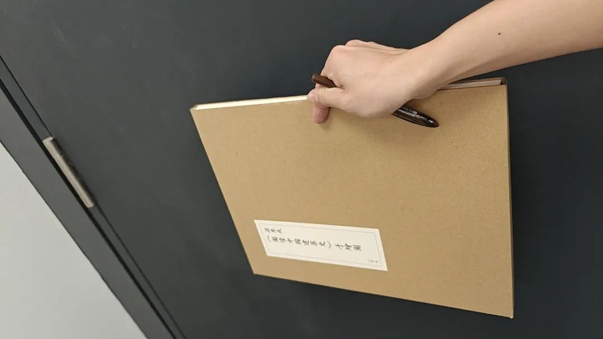
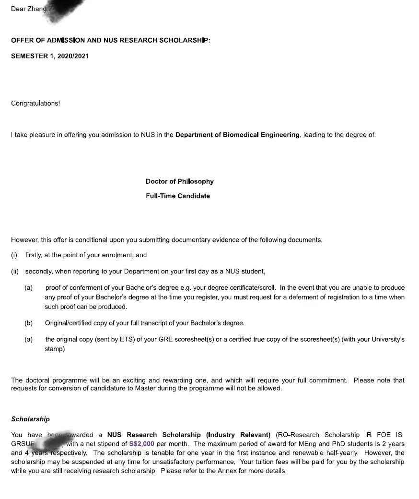
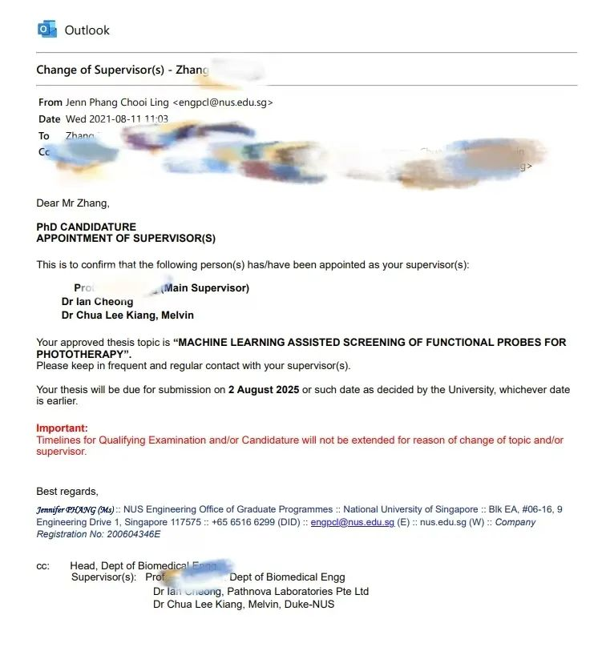
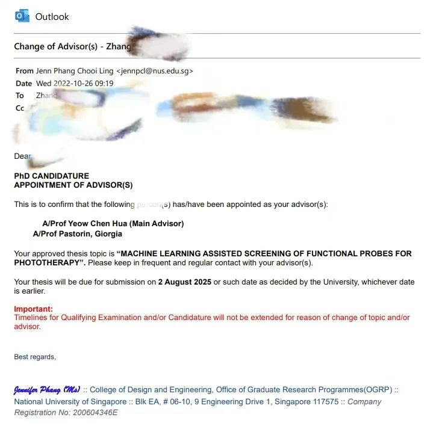
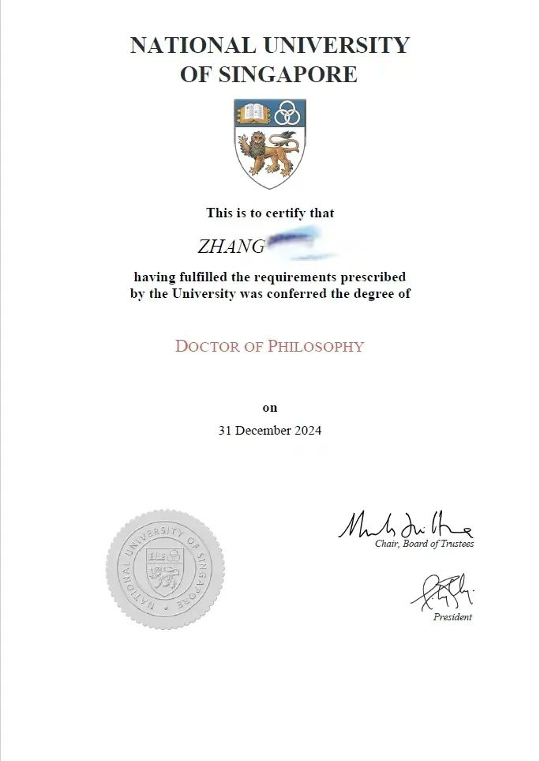
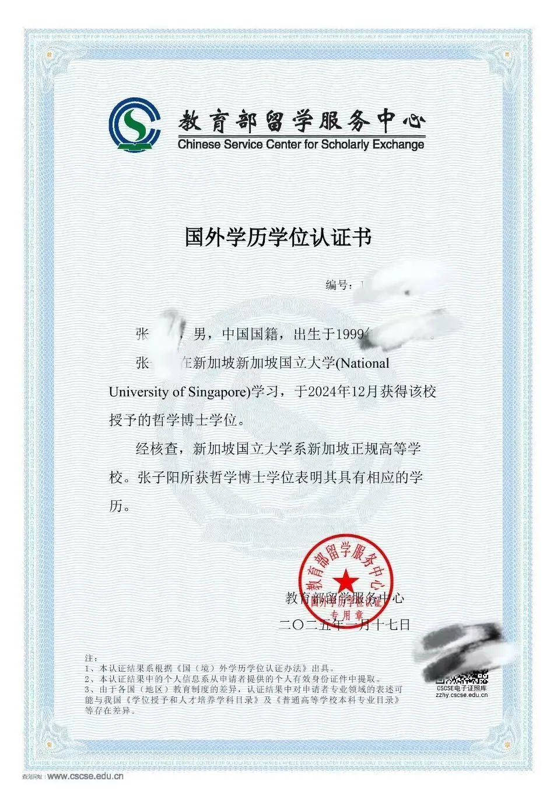

Thanks to [合作导师] and [主导师], my two co supervised groups. The complicated BME workflow cannot work without your support in such a limited period, so as to the collaborators from many facilities. Thanks to my friends support all the way. And special thanks to [前合作导师], my previous cosupervisor, without you, my first two year of PhD would be far more tough than it was there. General thanks to my family members and other friends. Although not specified all the names here, your kindness has never been forgotten.

During my PhD, I experienced a vibrant tapestry of life's highs and lows alongside the academic challenges. The pandemic, standing up against oligarchy, gathering with friends and traveling with loved ones are memories that defined these past four years. The experiences in the past four years has surpassed any previous period in my life. Indeed, time is flying fast. I will always remember what I've came across. This is life. No matter regretful or joyful, all these experiences are precious and have shed my naivety. Though I'm still a bit afraid of foreseeable life uncertainty and absurdity, the past four years already made me more determined.

I'm lucky because of the people I've met. If I can commit any academic progress, that should all credit to you people. But If there are drawbacks or anything unclear in my defense, I should take all the responsibility and that's about time to move for the Question and Answer session.

Hope we can explore further.

