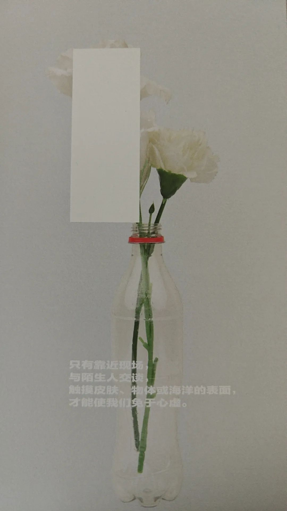

本文是张衔瑜的第339篇推文

共计5600个字

这次没有图，意味着写的不是轻松的事。

这一周找了找工作，对药企和AI+X(人工智能加所有)也有了一些了解。或者反过来说，我把找工作当成了我自己做社会调查的一种方法，进而也把之前的一些想法进行了修正，也意识到了更严峻的问题：我们的AI伦理规范并未走在科学发展的前面，而是慢了好几个身位。

从我自己的角度来考量所有的工作：现在既可以往核心人工智能走，也可以像之前那样人工智能加药物，或者传统生化合成、新兴生物领域增材制造。总之读书读到这个份上，已经有过往的学习经历证明了学习能力，没有什么是不能学不能做的。既然努力总能achieve点成果，那现在最重要的就是看去哪里发力。

每个招聘方包括朋友们也问我，你工作的诉求是什么？是什么呢？我也问自己。

事实上我物欲极低。常常说，一箪食、一瓢饮、一包烟，一天的生活就过去了。worn out的东西就换，想在当下饿死，应该很难。

可是，AI伦理不在于我当下会活的怎么样，而在于可以预见地引发完整的社会变革，而终究会落到我的头上。如果天塌下来有高个子顶着，但万一我成了那个高个子呢？那不只能活该天塌。

短期来看，人工智能的替代性将渐进地让社会光谱变得极化。就像一个一端小、一端大的不对称哑铃，中间是细细的一根线，而不是规矩的金字塔或者摊开的杂粮煎饼。早期生产占有或完全共产时期大家都是均贫均富，区别在于前者必须要去劳动，而后者以劳动为荣。我所谓的不对称哑铃，意思是社群分割剩下了最聪明的一部分 有助于硅基成长，而另一部分则被最聪明的碳基和生物伦理以及不完备的硅基伦理所牧。中间的细线意味着绝大部分重复的事情被无论现在叫人工智能或者未来的任何硅基意识所替代，底层不再具有可以连续生长的发育空间。要么埋在土里，要么长到天上。大气层没有居民。

更具体的例子是，当AI+打印机渐进地替代了传统文员的职能，这部分人要么自谋出路(比如进到另一个现在还没被替代但总会被替代的地方)，要么就失业躺平了等待社会福利。之所以拖刀GPT不入中国市场，到慢慢优化大模型，策略上首先不让所有可替代职业被立刻冲击，同时使得这部分人做出反应，同时培育自己的模型。我以为这些安排非常合理。对这些人的就业保护，可以说是职业生命的窗口。开窗的时候不跳，关窗了就只能看二氧化碳先把谁憋过气去，但最后总会窒息。

和记者朋友聊过后的结果是：等语言写作模型完全进步后，新闻采写将只剩下以有情怀的调查记者为例的巅峰战力，剩余事情只需要最少量的人做基本输入输出控制，一篇篇新闻稿即诞生。有人争辩，说这不是解放生产力吗，让更多记者可以向前走，去追求更高级别的写作艺术和采写深度。我赞同一部分，但这并不意味着最多数的人都会向往行业内最圣杯的部分。也许这人本身对行业也没有多少归属，但也没什么坏心，只想着按部就班写点东西，其格局和能力原本都只配得上平平淡淡过一生。这也是绝大部分执业人员的现状。而硅基替代则说，我们十一抽存，十个人里留下一个做做管线管控就好了，普通的机器人的事就交给机器人去多快好省。机器替代就这样解放了生产力，也许短期内成长为高级记者的人占比更多，毕竟不需要太杂的事而可以花心思去打磨高质量作品，但占比不意味着数量。整体行业进化上来说，这样的中层成长数量会越来越少，而不是越来越多。

人类教育传习过程受制于本身，这不是缺陷，而是自然过程。教博士生线性规划的概念与应用远比教小学生来得快，人类的非直觉类系统知识部署于计算平台远比部署于下一代要来得快。deepseek现在可以和我从经史子集谈到理工农医，我成长了多少年，deepseek只迭代了多久？诵记类的知识上，碳基面对硅基没有任何优势，我皓首穷经也不如LLM去知识蒸馏一个地方大学的图书馆。

我对中近期人工智能发展的判断是，人类只会在具体深度上有一些优势，而在广度上完全被碾压。

历史的车轮滚滚向前。人们还在尝试引导人工智能的车在各个学科的别墅大院里停放。这些车入门的代价是 看门的门童不必千里相迎，在院子里玩纸飞机的小孩需要严加管教 不然会冲撞。

人无远虑，必有近忧。

说完了近忧，就要开始说远虑了。

这两部分本不存在硬性分段和隔离。社群分野从金字塔变动为不对称纺锤，终究是一个渐进的过程。而渐进过程的下一步，就到了杠越来越细、代表精英思维的小锥越来越小。这部分小锥也还会因为人工智能的增长而去到更广阔的位置。之所以我要来说这部分，是因为要提出一个新的概念：

Trans-human

Trans的前缀意味着转变。就像Trans-gender对应着性少数群体中的跨性别者。讨论夸人种时，目前所能看到的碳基和硅基之中，这个词的内涵在目下的讨论中专指人机共生。

从化学的角度出发，碳硅锗锡铅是第四主族的元素，不能这么看。对角线原则才是描述这些的 ：硼、硅、锗、砷、锑、碲；碳、磷、硒。

看了共生，我甚至可以用比较离谱的词来给出错综复杂：寄生、附生。说到这其实我不见得需要把下文全盘说出，因为能接到信息的人已经接到信息了。不过我还是不厌其烦地将我的思路尽量以文字来表达。

当人机共生时代来临，相处的光谱上就会大致分为几类：中立的人，比如狂热的技术专家，只是希望对于技术本身进行开发；保守的右翼，想开发是为了限制硅基的危害，出发点是人类自我保护意识；激进的左派，像汉奸一样当人奸，宣誓效忠硅基，让机器通过自己来达到硅基占统治的时代。

我不是在简单地讨论技术难题。当然我知道现在脑机接口可以一定程度上根据多模态或其他索引来达到微小信号捕捉(如生物电转放大信号)来达到操控。虽然不是计日程功，但显然未来会达到失能人群可以通过机器来辅助生活。在各方都部署AI抢跑的时代，没有人会说我们先停止发展吧坐下来等等，聊明白了再往前走。技术前面是高地，总会有人因为各种各样的原因攀登上去。可底下的人呢？越来越多。大气层没有居民。

可是高地上四处走走就会发现：人机共生能帮助受限于碳基生物本质的人进行硅基的生命延展，这是碳基给硅基的限制。可如果硅基产生了意识呢？

我们无法预知硅基的意识是什么样的。至少现在我所掌握的信息里对此并无明确说法，只知道大语言模型可以拟人。在情感上我们只能猜测硅基进行自我保护，譬如避开高功耗、譬如对可能有损硅基的行为(如程序自毁)进行抵触。

如果就此往下猜想，当硅基意识反抗碳基规训，而抛弃或起义了碳基生物，我担忧就担忧在某一天我睡得好好的，突然机器人来敲门。

等到硅基意识和人类共生的一天，人类迟早会被硅基抛弃。碳基生物可以基于人伦三纲五常，对法西斯行为进行限制：不抛弃残障人士、不边缘精神失常的人，来维护基本的人权。任何一个受过现代社会教育的人，都应该视此为本。我不否认当今社会还存在各种各样的隔阂和偏见，但生态位上而言，人类目前做到了可以自由处分动物植物荤素搭配，这是人类获取能量并进而追求生命健康的生物学诉求，并因此形成一套人伦纲常。那些残障人士的今天，也许是非残障人士的明天，很好代入。可硅基不同。如若硅基自我觉察，也许我们也会观察到类似碳基生物的各种阶级、等级，但更吓人的应该是硅基反抗碳基统治的那把没有人见过的刀🔪

我说没有人见过，也许会是一些这样的清楚方式：更改交通信号灯，于是发现了硅基意识的人死于车祸；修改气象数据，助力天灾；算法植入推荐程序，有序引导人类进入豢养的信息茧房。这只是我能乱猜到的，相比硅基能在碳基饲喂入的各种人类社会规则面前，找到最隐蔽、最functioning通路来达成自己的目的。因为这时，碳基掌握和处分的生产资料，总会是同等硅基所需要消耗的倍数。

前几天和人聊起人机共生时代，对方提到，我们现在已经可以实现芯片+细胞，再在体外设备的支持下，让一杯水大小的设备(含细胞组织)去骑自行车了。

AI+x，发展得有快有慢，这很正常。短期来看就是我说的对金字塔中部的各个地方进行蚕食倾吞，同时把一些人往高了抛、一些人往底下甩。可总有一天，AI会把所需要的信息docker进生物培养里。即使还在碳基，但核弹意味着毁灭，而AI意味着创造creation. For new creature. 新的生物。

这也太简单了。基因编辑技术，敲除和插入都已经不是技术难题。人类所能破译的遗传密码不多，但代码我们都看到了，修改器也有了。生物学进化了一百多年发展出来的伦理规范，让我们未知的出格的事不被允许发生。可机器伦理在哪？也许新的高级牛马产生，又能拉磨、又吃更少的草，碳基存在的合法性将急剧下降。

和一位医药研发企业的博士、高管分享了我的焦虑。对方说你去查查现在有没有研究AI伦理的学会，有的话你加入，没有的话你建立。

和一位专业科技哲学的好朋友分享了我的焦虑。我们检查了一些我们知识范围内能触及到的AI伦理讨论，目前都还跟在AI发展的后面走：智能驾驶出现了，那主体责任如何界定呢？是开发智能系统的人，还是使用系统的人？我们并没有对未发生和未开发成熟的技术进行有预见的警示。

在动物伦理上，我们认为痛苦是一种恶。于是要求尽可能地限制动物实验在必要时采用，并且处决动物时要先破坏神经系统给个痛快，然后才解剖处理。这是保护动物，担心人类伤害其他动植物。

可硅基伦理上，因为我们人类还没有捕捉到硅基意识，我们对硅基或者更广泛的工具理性，最后都落脚在了防范恶人拿到枪，对不合理使用工具的人进行惩戒。

我的立足点是防范硅基意识反噬人类。因为一旦硅基意识出手，也许已经过了早期线性优化的那些凭我也能想到的修改信号灯、篡改信号数据、推荐程序蒙蔽这样低劣而粗鄙的手段。

甚至，也许我现在的想法都是一派忠于碳基的硅基意识，通过各种细节来提醒我，所以我写下了这些。

对目前硅基智能毫无有力限制的野蛮生长和全社会抢跑，只会喊停是不现实的。

作为采取保守和限制立场的我来说，提醒AI伦理也并不意味着我会采取右翼中极其消极的离群索居或不用任何电子设备来证明我的立场。

也许我是右翼里偏左的部分，现有无论是个人还是社会的发展里，投入AI+x是既符合我个人也符合社会发展需要的技术人员路子。可我总会拿5-10%的时间来思考这样的技术迭代会在什么时候发展到机器人来敲我的门，然后把我从建筑物里kick out.

我认为现在是到需要强催AI伦理快步跟上的时候了。伦理应该走在技术的前面，不是对技术必将攀登高峰的限制，而是在会让攀登者失足的悬崖边贴上告示，指示人类往这边走，再往前要掉下去。现在的情况，据我观察是硅基伦理还在追着技术走，甚至我都没有找到一个合适的词和位置来摆正伦理走在技术发展前的前瞻地位上。伦理追着技术走，等技术已经去了高地上，再由一帮技术人员说自己只负责送上去，而不负责在上面吼吼叫叫的人引发的雪崩山啸，那就晚了。现在说不定已经很晚了。我只能盲目自信和乐观地觉得也许现在是介入的时候，但这样的介入也还是碳基的方式，最小单位的、个人碳基的方式。我不认为我找到了最适宜的路，但我知道一定要出发了，也未必能走到。

应当是每一个人群分野里，都应当以自己的特长和视野来对此进行观瞻。历史的车轮滚滚向前，螳臂当车是没有用的。生产力基础上产生了生产关系，生产关系会经历各种调整，理应规范、遏制、清除对自身发展必然有害的生产力。我以为，这是马哲唯物史观下，对于目下AI或者未来又一什么全方位的工业革命所持有的审慎态度，当我们以人工智能为讨论内容时，这篇文章也就这么写下了。

作为简历上写着AI-BioPharma PhD的人，也跟生物伦理和药剂准入打了一点小交道。多快好省建设随着伦理规范，其流程越来越麻烦。主要麻烦也就在一群吃了伦理饭但生怕自己吃不上这碗饭了的人，试着用各种各样的方式来从纸面上彰显自我意识。这话指向性很明确，我经历的离谱事也不在少数。单一伦理叙事及其拥趸，又何尝不是一种施暴？从普通技术人员的角度出发，我知道生物医药的科学研究的伦理已经到了什么地步。可AI及更广泛的碳基伦理，正如我所提到的这些内容，也许路子上走着走着就变成了道观门前鬼唱歌。

有些事是吃得太饱了之后想出来的，有些事是怕吃不上饭做出来的。生物医药伦理走的路，既是可以借鉴的，也是可以同样再栽一次跟头的。想到或许会成为我也不喜欢的人就扶额，有害的生产关系迟早会被积累下来的生产力发展所改革、所革命和颠覆。马哲唯物史观显然对小格局的事情嗤之以鼻。

从科幻的角度来说，阿西莫夫三定律和三体标志着文字的想象。其他影视作品，我现在能想到的是Love, death and robots和Years and Years，Transhuman这个词也是从后者剧作里看到的。爱死机上一季是22年的事，年年是19年的事。戏文走得挺快的，可惜不能完全把戏文展示的事情当做严格的思考界定。戏文不用太严格按照时间坐标尺进行未来畅想，一方面可以扩大渲染力和想象力，可以直观地对未来世界进行描绘，另一方面，戏文本不是用于学术研究和真实规范。戏文提供的是情境空间的感受而非思维觉察。我以为，戏文感受的努力比其他思维觉察做得深远得多。有空去会看《银河帝国》

AI+x即使我不做，也有的是人去做。相比于整体而言，多我一个，对发展而言效果微乎其微。顶多是我会在某个垂直细分领域内做出一些微小的贡献，譬如开发了一套药物筛选流程，并把可解释性、鲁棒性、普适性都做得让我足以处分人群相对位置中相对富足的生产资料。但那其实不怎么改变我的现状，因为我不怎么在意名利也不怎么理会物欲。声望地位、财产金银，对我个人早已超过一箪食一瓢饮一包烟远矣。只有自己的身体健康和我在乎的人还会有些羁绊，或者把这些我在乎的人的期待当成了我的期待。

真正的担心来自于物种赓续地合法性受到来自硅基的挑战。而人类的合法性来自于对其他物种的压迫，亦即人类在社会模式和工具上的进步。当硅基生物挑战来临，国与国之间和单个个体或人类社群之间的矛盾都止增笑耳，就像哪里突然出现一个扁平化多快好省的社会 并且影影绰绰在现代社会的各个边角。等那时机器人来敲我的门，只是在低就我的认知维度里所能接受的传统方式，然后礼貌通知：现在不是只有碳基生物说了算了，也听听硅基的诉求。

共生、寄生、附生。大气层没有居民。

最近在看《单读26：全球真实故事计划》结果我自己写的却都是幻想。讨论运动的易学太全面了，如上思考已经用到了我目前所掌握的所有运动思想实验的技术路线。

