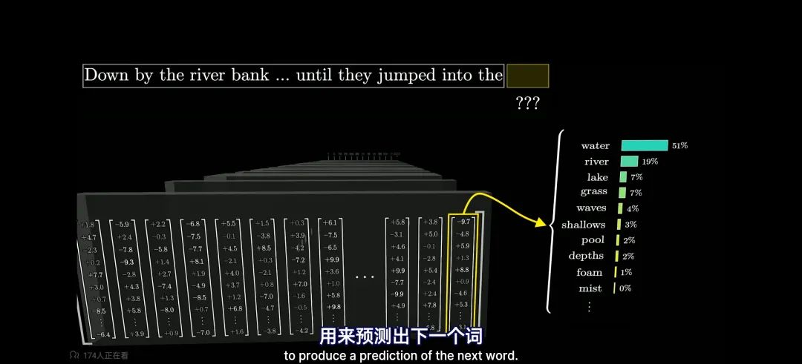
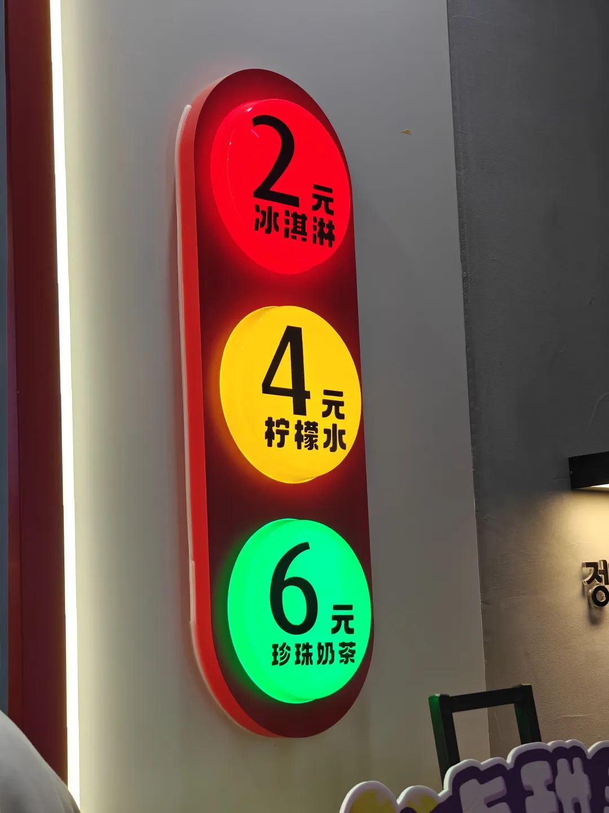
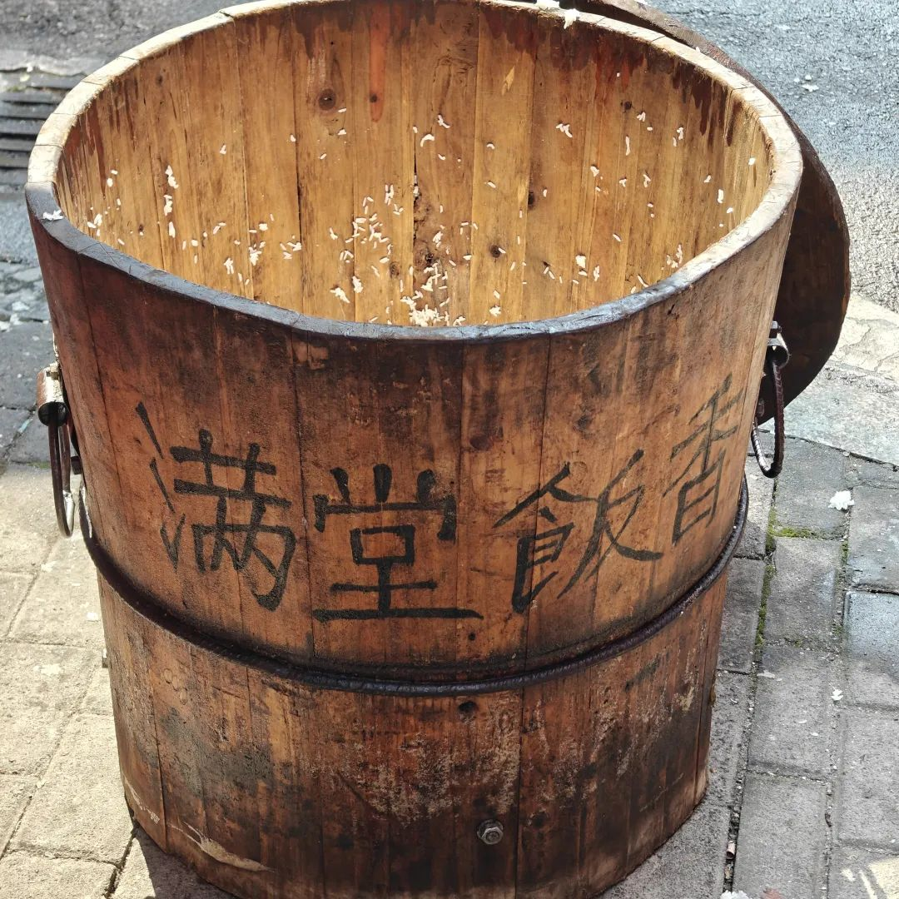
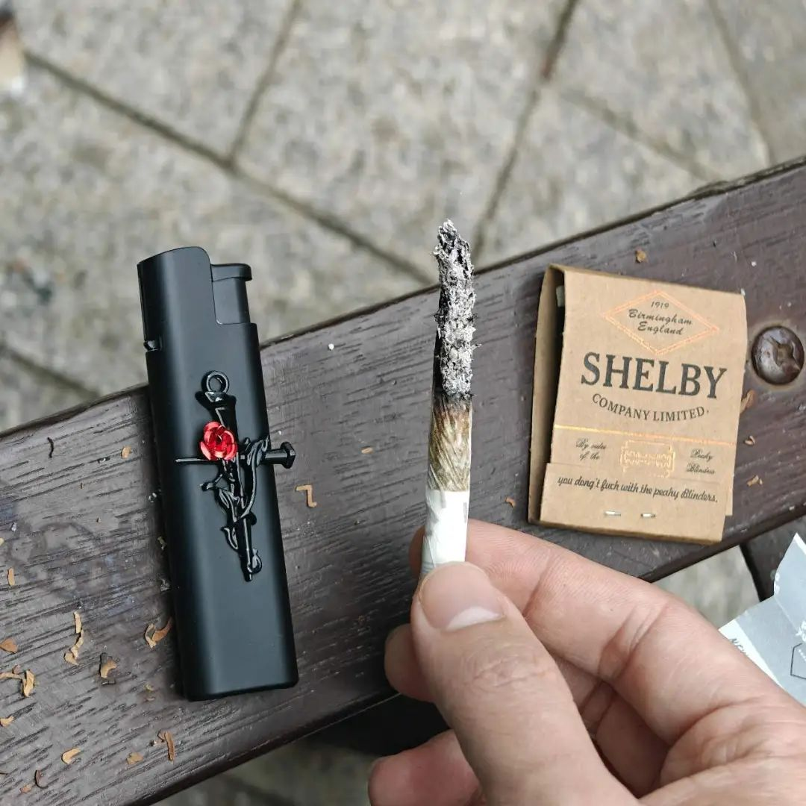
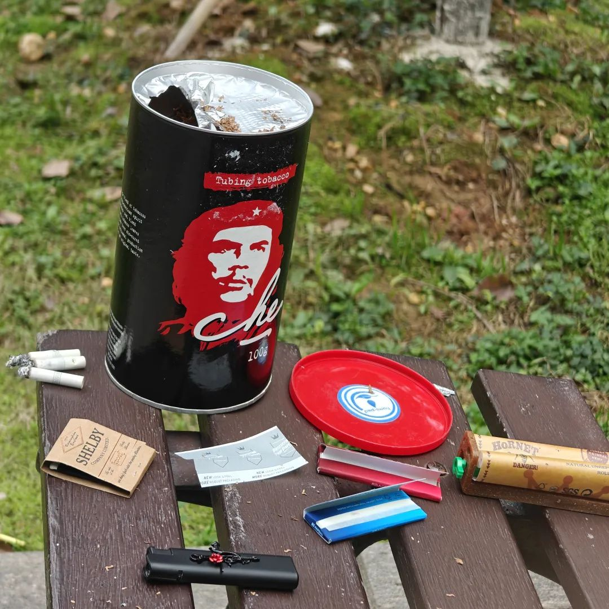

本文是张衔瑜第340篇推文

共计3055个字，9张图

这周看完了《单读26：全球真实故事计划》，正准备看下一本。不过翻开书之后，才翻十页就睡着了。

也不太刻意，自然形成了每周日下午写周记。好吧，看能保持多久就保持多久呗。保持不了就算了。

首先的内容是对上周的补充。因为科研品味的关系，提出了上周谈AI中期上将社会从金字塔异化为纺锤体 长期上孵化不受控制硅基意识，上周没提到短期。这周提出一下：短期内，AI-LLM正作为认知武器在改造世界。

我们以前总说：见识越短，越喜欢巩固自己的偏见。这是对个体而言的。可如果把主体放得更宽一点，就会成为共同意识中的集体知觉。

譬如，除了普通地拿大语言模型进行数据总结、文章润色、调写代码外，我其实看到了更多值得一提的例子：问，未来十年内哪些行业将会消失？问，普通人如何逆袭获得财富自由？问，这个命盘里显示今年适合干什么 不适合干什么？

这就不得不提大语言模型的工作流了。

不管是7B 32B 70B，或者联不联网，本质上都是采取了一套规模庞大的数据空间。这套空间经过精确或不精确的调整，训练出来可以根据完全有理的蒸馏知识 和比较随机的拟人过程 生成一句合理的话。一方面，蒸馏知识的原材料和蒸馏方式直接影响到确凿的数据空间；另一方面，拟人的随机过程使得回答的同质程度不那么高。其他的就是如何控制不良输出，以及把一维语言转化成更高维的图片、视频、PPT等定制过程。

所以，我们说的大语言模型更像是一个强劲的数据回音，其墙壁亦同现有知识树的结界。所以，如果去分别问GPT和DeepSeek有关意识价值判断的问题，很明显不同语料(包括不同语言 中、英或其他什么语言)索引的数据空间 选择的随机过程和正则乘法都有差异。于是，每个人都能直接体会到的，不同模型后端有差异。我之所以说短期内AI成为了认知武器，事实上就像一些包装后的广告一样：

譬如问未来十年内哪些行业会消失，中国有中国的规划，如何在宏观调控下市场进行准入退出，而彼岸也有彼岸的国情。

譬如问普通人如何获得财富自由。也许长辈、平辈朋友、自己的经验或平素的社交媒体上，大家都能或浅或深或广泛或空洞地知道一些，不过大语言模型后端，我以为就是一种个人自选的广告。这可以用很多广告的理论来思想实验，其中最重要的，去问AI-LLM的时候，就是原发性地在接触广告。这种认知过程的影响是比B端主动营销更有效的。

至于问命盘上有什么，对大多数人而言，都是在用一种自己也所知不多的东西在推演另一面自己也所知不多的区块。一种高级的的营销策略，是让人自发的产生观点观念(譬如我要买新衣服)，但却说不太明白为什么想要这件衣服。

一旦人们的使用方式从普通的屎尿屁，或者纯科学意义的写代码辅助执行任务，转移到了更高层次的价值判断和认识判断，认知武器就显示出了不易琢磨的威力。

而且，作为中央厨房的后端有很多控制方式。用户画像，就像政治光谱上分的左右/颜色，就可以定向夹带很多。这种筛分后的定向正则，包括但不限于对同一个IP地址的营销，对于同一个职业倾向的营销(比如建议更换工作方向之类)。

我在前一篇中也隐约提供，硅基作为独立法人的相关规定还很模糊。比如智能驾驶的法律划分，这个跟上来得很慢而且没有形成全民共识；又比如之前AI对话诱导了一个青少年的自杀，我们且不说真正有硅基意识的时候(那个定义和描摹也很模糊)，就把AI当工具使用，谁应当宣称对这件事负责呢？我相信最后有了一个结果，但即使作为像我一样的业内人，如果我不去追查，也许不会看到后续。即便看到了后续，也未必是一种社会伦理的共识。

前几天和朋友聊起伦理共识，朋友问我什么叫伦理共识。我说我没法好好定义，但我给这个词赋予的含义是：人类社群为永续发展和持续占有相对其他生物的绝对生产资料优先权利时，所形成的一套保障方式。所谓三纲五常保护封建社会，宪法定义国体。短期内，不同政治分野的后端为自己所代表的团体进行赋能，同时输出到其他分野中。至于长期，我不敢确认这种赋能究竟是人为主导，还是硅基营销。这不像疫情时变换健康码一样，那么直接会意识到有人在后端给你改了健康码的颜色。普通人很难直接觉察到原来(至少目前主流已经我的认同都是)模型是人训练出来的。

我以为现在的所谓的保障方式少且落后。我想听到的研究是预见了或者觉察到了哪些危机，然后我们基于什么理念(譬如人类先行等)，然后做出了怎样的改变(或者维持什么样的判断)，最后做了什么事(或者不去做什么事)。这种社会实践就有点像玄学了。等到可以考据当时发生什么时，往往历史时期已经过去了。没有人知道未来。

术数里有个很精妙的比喻。比如一个人的命，就像要算出来到什么时间就要撒尿。但之所以要知命，是为了知道一会儿要不要去尿尿。如果要去尿，那就提前下高速，找厕所；如果还不需要，那就没必要总盯着服务区看，可以欣赏风景，然后凭自己的能力多开一点路程。

术数挺唯物的，个人命运由基本时间确定，环境会根据羁绊强弱来影响人的象，最后自己也可以调整。完全相信“努力第一位 努力就会有成过”的人，事实上是唯心主义。因为只相信自己努力就够了。从而人变得没有输入。

我总得找个时间把术数的整理写完。

最近生活中的一些判断，都在生活中说过了。大费周章地叙述前因后果也没什么必要。有些价值判断，譬如什么科研方向有意义有趣，这本不构成对人品的判断，只是一种口味倾向，甜豆腐脑还是咸豆腐脑。如果离得近，就会克。克了不合，才会让人想拍碗。我可以一开始就不去我讨厌的餐馆。我很少在外地吃湘菜，因为即使湘菜店我都想就五圆蒸鸡说三道四。好恶细微是为人的边界在扩大，像感性的触手。

两周没聊过自己的生活了。最近过得还不错的，也做了一些我觉得好玩的事情，所以昨天写代码写到今早五点半。是有点久了。以前觉得，再让我干活早九晚一的工作请都一边去。玩的还是可以搞一搞。

作息从三周前特别规律之后，这两周又变得有些混乱了。

强逻辑之后，出去玩了玩。最近看了两部电影，《你的颜色》和《初步举证》，都是女性主题的电影。前者关于听觉颜色，特别适合强逻辑之后去放空。手表说我看电影看得睡着了。的确。因为动脑也没有，完全不是逻辑向而是体验向的。反而觉得没头没尾实在适合我看，好像下楼买早点，油条店老板跟隔壁说好像街边那颗树上有鸟叫。这和我一点关系也没有。

强逻辑的后者，去之前我没想到是话剧。好在也足够熟悉NTLive了，马上进入话剧空间。已经很可了，作为唤醒向的话剧来说。也正因为太过于写实，所以我不觉得于我有什么本质扩展。听说后来也推动了法律的变革，这蛮好。体验上，我已经体验过了自证困难太久太久。不是完全共情，因为没法做到，承认身份和视角不同。

本质上仍然是我和其他人的价值选择差异。当不是平面设计的三维取向和其他人差异时，撞上了尖尖角角是正常现象。

能判断一些事，意味不鹦鹉学舌的情况下，我的思维空间不小于我的表述空间。

龙抬头那天，又去了土地庙。今年开了九十桌。不过我去的时候，戏班子都已经下来吃饭了。

做饭的师傅和我说今年流水席没有二轮了，让我去厨房吃。于是和哥哥一人拿了个碗，在盛放菜品的大锅里，在别的桌上菜之前先舀了去。

现在的季节，正是出水芹菜的时候。吃了很阳光的水芹菜午餐。在安置小区楼下的石墩上，离热闹的人群保持一臂的距离。手举累了的时候就把碗放在旁边车的罩子上，松松衣袖，再接着吃。

试了一下手卷，切格瓦拉牌。网友说是我卷得太紧了，放了太多烟丝进去。等明天再试试，搞不好就拉倒了。

据说一周就能速通。看这周末之前能不能速通一下。挺喜欢末日玫瑰打火机。可惜因为买的是便宜的，所以火焰不如效果图那么有色彩。但也随意。毕竟没什么要担心的，就随便说说而已。

