本文是张衔瑜第341篇推文

共计1707个字，13张图

看完了《单读40：全球真实故事计划II》太阳底下的事，依然是统计的数字和一个个活生生个体之间的较量。一旦我们用一组组Unicode来编码个体，刀笔吏一把把小切刀向个体，好像几个字就把人概括了。

这样的事不多的是吗？

王侯将相死后，都有一个谥号。文正、勋宗。人们把这些内容扩展开来，又缩小了去。未免不是一种特征工程，把讨论归到标题里的那些预先设立的观点里。

看书的时候下雨了。我在花园里，雨落到了纸上。于是带着新买的瓜子上楼了。能听到声音，可好像听力有些退步，不是敏锐意义上的。

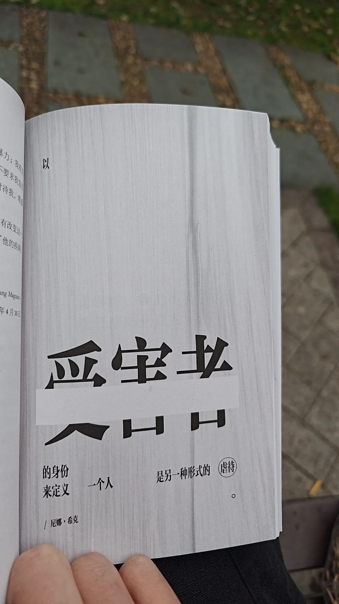

在长沙待得有点久，于是去了趟武汉。

在路上读完了《单读38：第三次启程》和《一次横穿1868年岩层的成像》前者的书里提到了一些东欧的事，于是发给了邀约我去东欧和当时华约时代走过来的人们谈谈的朋友；也提到了一个越南华侨的纪录片，out of place，不过搜索了全网都没有找到；后者书里竖排着1868年的文字，横排着后来者的文字，附以今图。

读许多书，有什么意义呢？阅读长段文字？消磨时间？还是什么？能说出来的，都已经是当时刻舟的那把刀。应该直接沉入河里。等考古学家去看，断代，撇过头去。

《第三次启程》很有谶语式的表达策略。我也常常因为这些表达，而代入一些术数机锋类的思考。就像第一次启程是去武汉、第二次启程是去新加坡一样。那么这次启程，是要去什么地方呢？

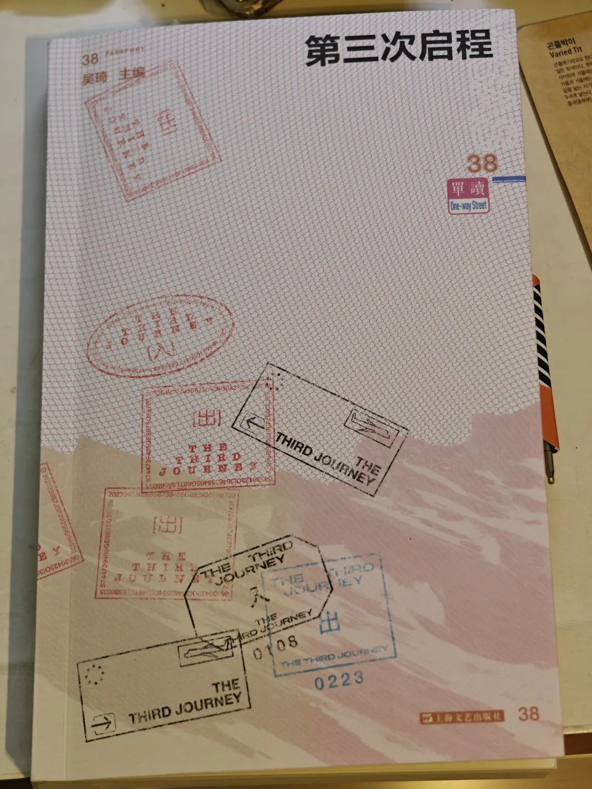

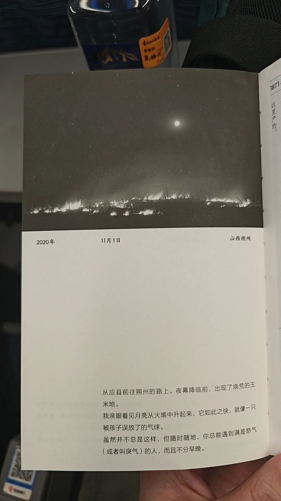

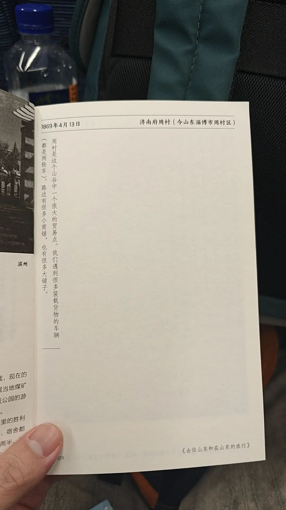

和武汉的老师聊了聊关于我的忧虑：AI认知武器、改变社会结构、硅基意识觉醒与新物种。得到了两个很有趣的回复：一位提到现在AI的功耗太高，而生物已经进化到很高的能量转化率，一碗红烧肉能支撑你在电脑前干一天；另一位提到目前依赖概率的智能和逻辑编译的算法依然不具有出现意识的可能性，而如果有任何变化产生，都得作为我这一代的更提升阅历，作为上一代更提高科学水平。

体制内的朋友觉得忧虑也太过遥远，其根基是相信我们的执政水平和统筹策略。

在我很忙的时候，的确不常会想起这些事。

虽然惊蛰前后，人不太舒服。可是，意外地发现最近超过理性系统的认知有不少提升。有点像早期看《思考，快与慢》不过对接到术数领域内的那种快速。有空我应当维术数提供一些认知理论中的解释性。

我需要建立一个类似于光谱的东西。这是看到的建议，大抵意思是：当你做重大决定前，最好去吃一吃平常经常吃到同时出品稳定的东西，帮你通过味觉审视一下这个决定是否正确。

挺好理解。就是找机锋。

平素形成的饮食习惯存在，所以重大决定前搞一顿什么都有的好吃的，可以帮人像通过综合素质测评一样 以物质为载体 以味觉为量表来打上一卦。卦不非得是六爻六壬。一餐味觉丰富的饭，也能像韦斯莱家的时钟，指示各个撞针现在在什么位置。

去武汉的车，一直坐到了汉口站。这才知道聪武汉站到汉口时，是经过天兴洲。在汉口北看到了一个武汉北到丹水池的通勤火车，想起以前去二七长江大桥四美花苑楼顶拍照的日子。一瞟眼，看到失落之塔，曾经到了肉联厂但没有进去的地方，一晃，已经五年了。

于是坐一号线到了循礼门站。以前去中南剧院的时候，很经常到这一站。可感觉白天好不一样，好像毕业之后我都没有来过这个站，又或者疫情后与疫情前的感受两样，就像换大运后的人和换大运前是两回事。

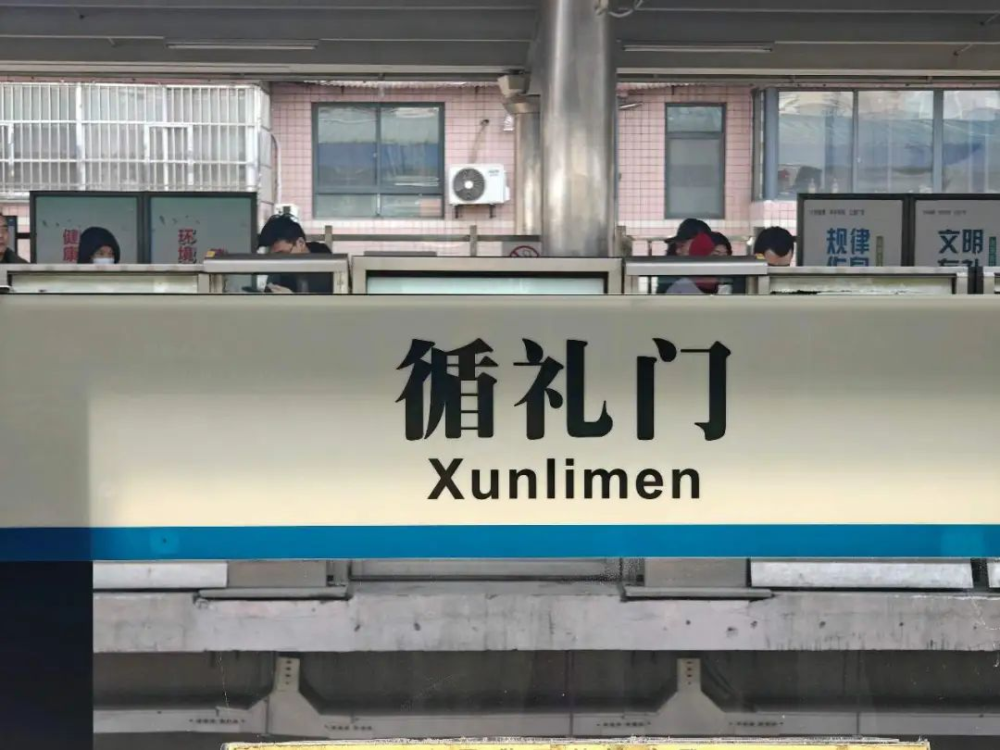

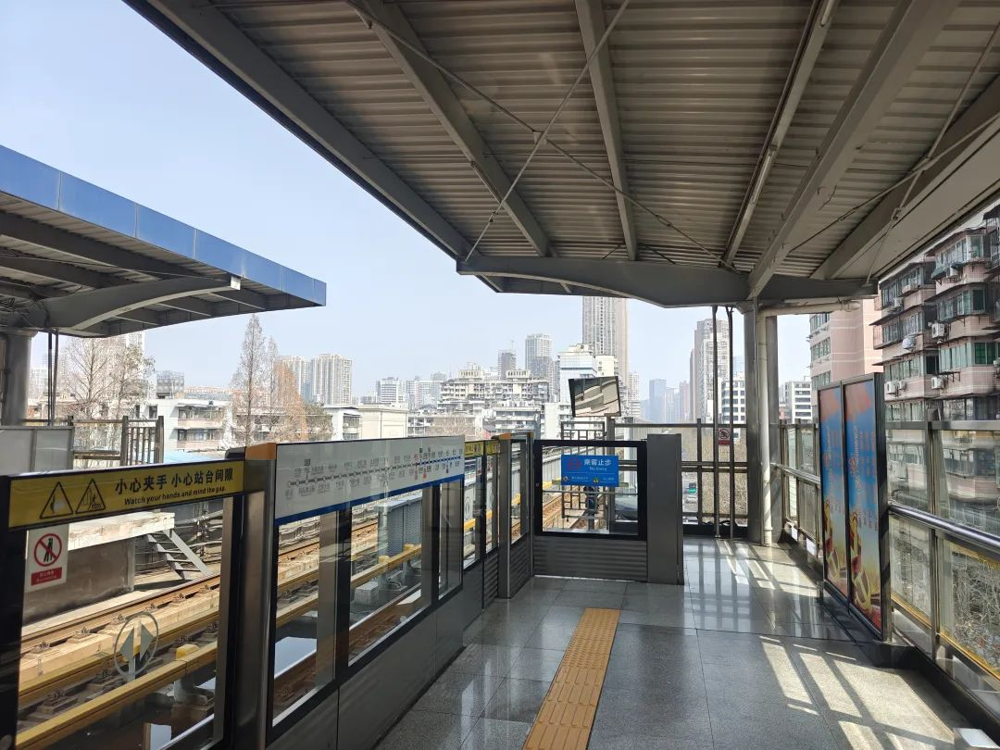

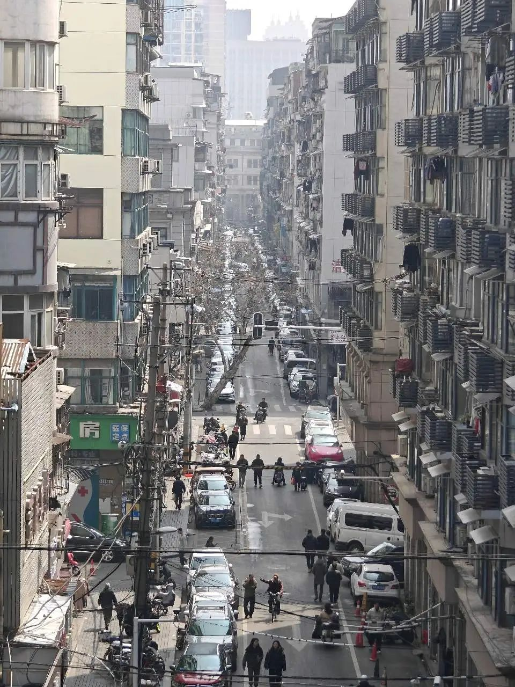

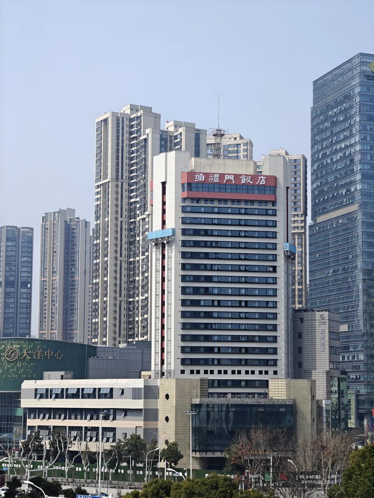

华科西十二教学楼，我七年前拍照的角落《 下笔太狠的雨声 拈花杀了诗人 》那个拍玉兰花的楼角，已经站满了人，排队等一个角度。我去看了看，就离开了。

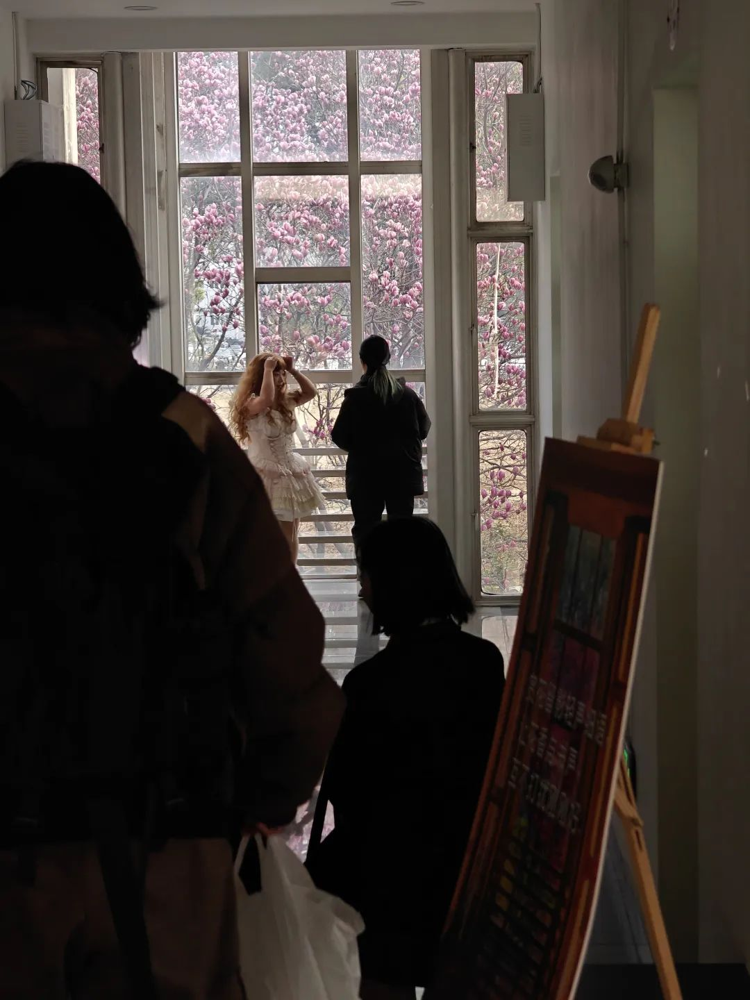

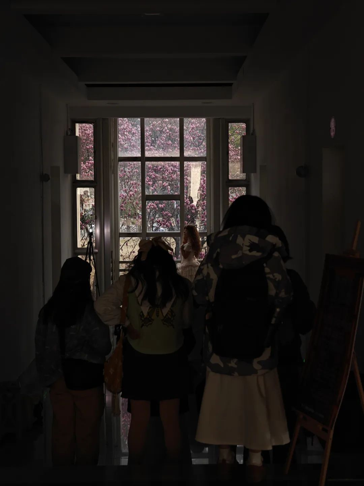

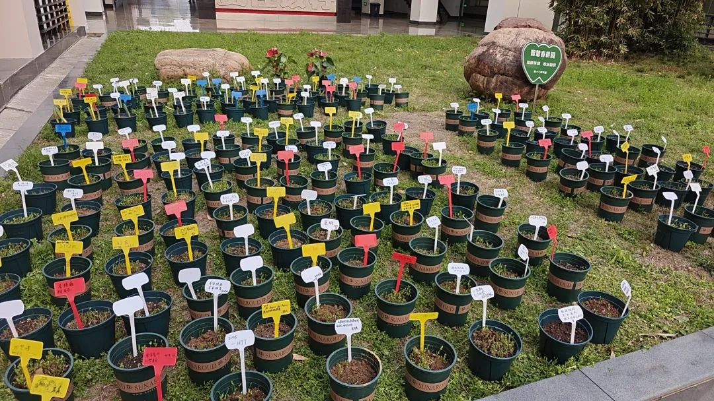

朋友转给我小六壬的增强版，或者说原位版。是在大安流连速喜赤口小吉空亡之外加入病符桃花天德。我说我已经不太需要了。任何一个技术路线，都有自己的弊端。而我既可以定义属于我的逻辑空间，也可以沿着一个方式清算明白。但我选择了随意，什么都可以主观臆断，但也可以格物来归附一个具体的流派。

有点类似于开会讨论对策，不仅自己主持讲述了观点，也有其他邀请与会专家说了几句。最后还是主持形成了报告，和书记员付梓。

比较懒惰。因为觉得自己本就在来回穿梭，无需要就通勤路径向不需要经常跨越长堤的人把所有事都说明白。自己路过时，脚下也全是雾。只是没有那么多徘徊，就信自走了过去。

清净的日子适合内观。

又买了一些书，也从朋友那借了一些书。没觉得书本有多少损耗，毕竟我可以自己补足。那些没去过的风景，在书里看到，也挺不错。

要严打，并且打就要打醉。

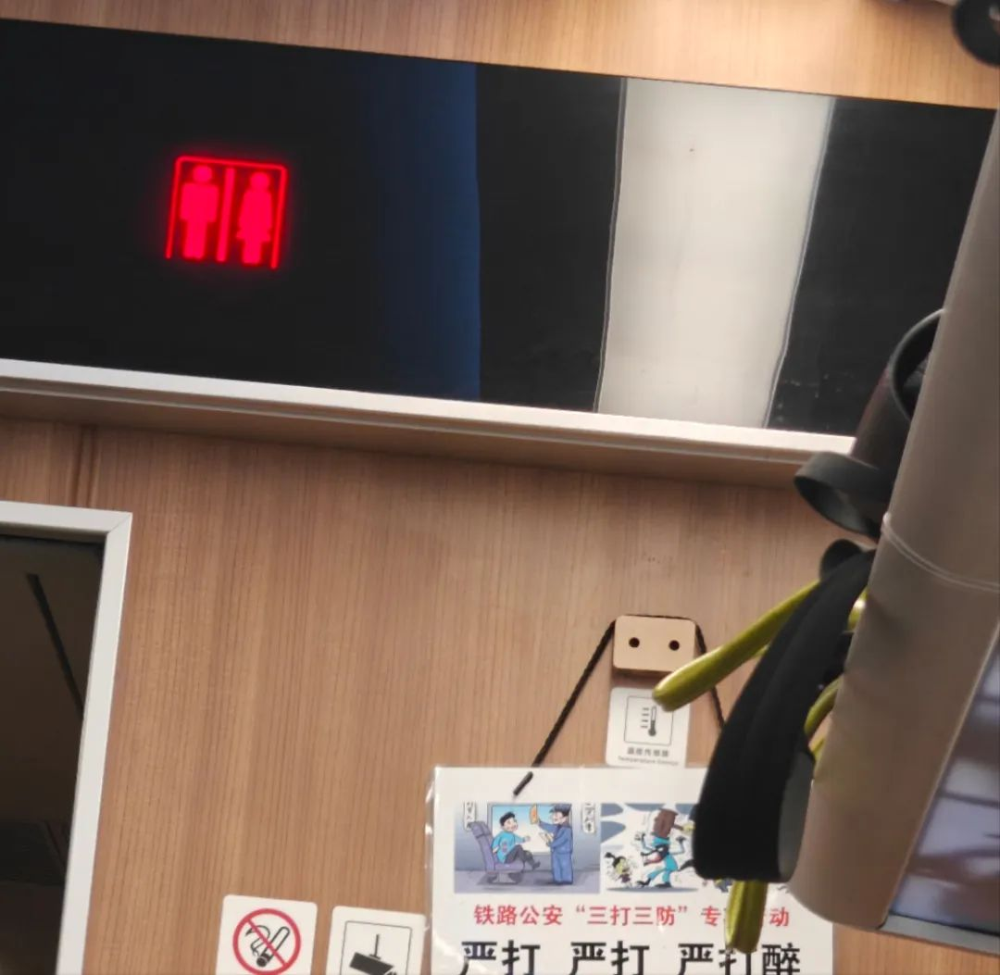
