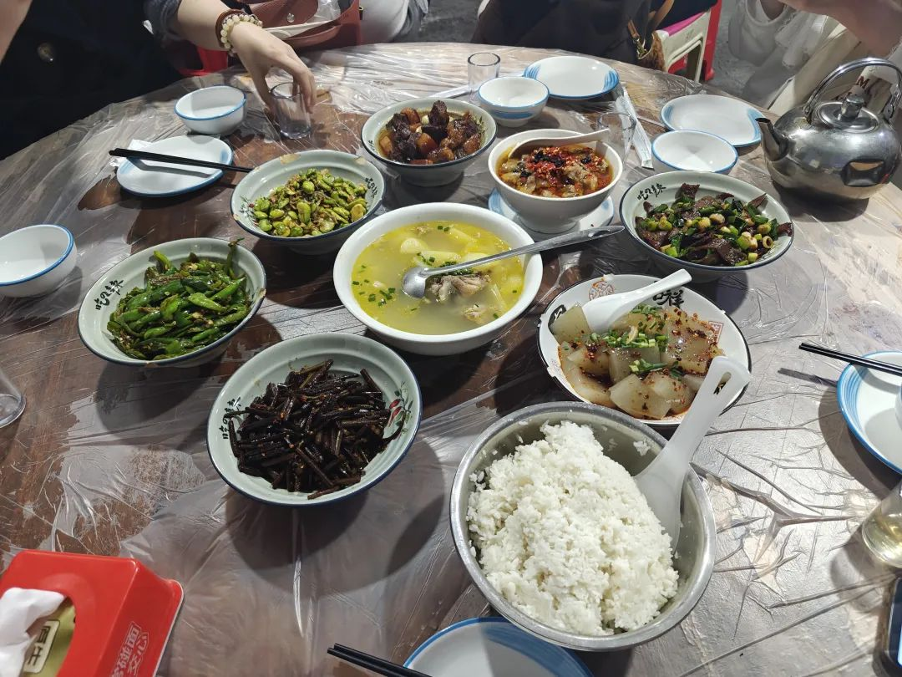
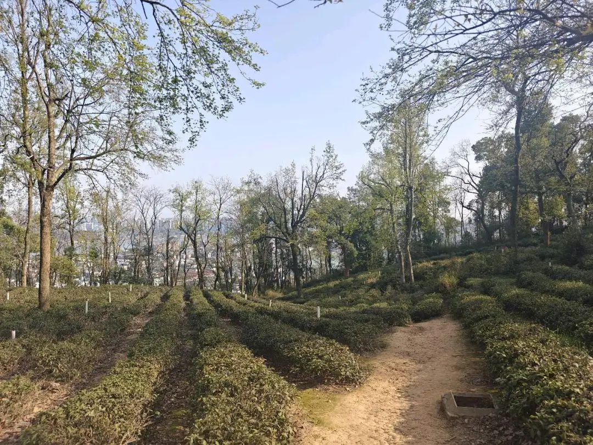
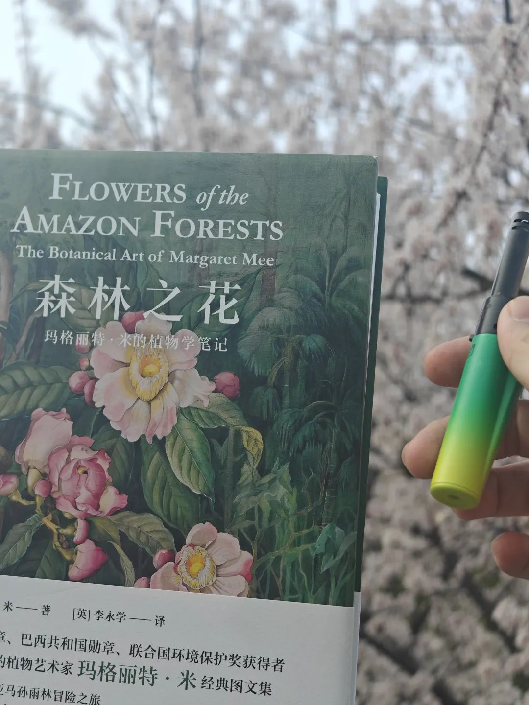
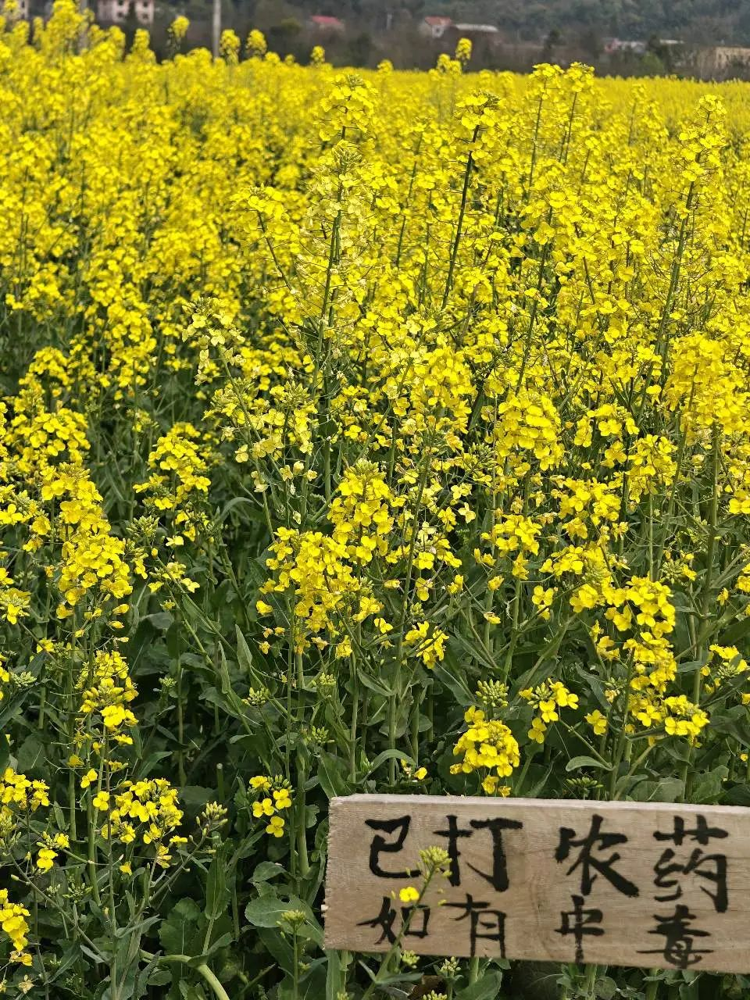
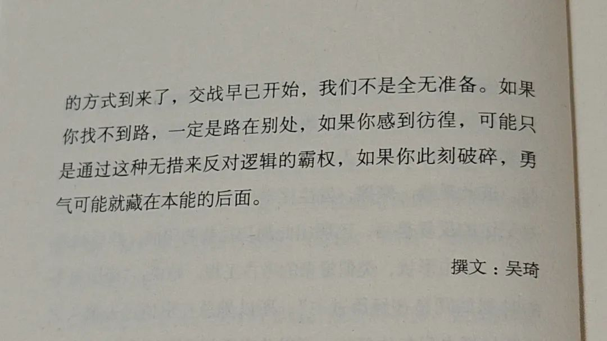

本文是张衔瑜第343篇推文

共计1528个字，5张图

这周读的书是《单读36：走出我房间》算是读书比较少的一周。有一些小说、随笔和影像。诗歌不在我读的范畴内，目前没有兴趣去理解抑扬顿挫的错落感。从这本书里读到了一句据说是马克思的话“借由工作，个人的实质扩散到了社群与世界当中”我以为说得很好，不管着是不是假托马克思说得。

这周看了电影《诡才之道》一个台湾的喜剧鬼片，但是讽刺着现实的内核。挺有趣的，看的时候和朋友不住感慨“这对吗？”挺有意思的，利用鬼界来泛化个人追求。利用的结构也很巧妙，是最近看过的电影里轻巧但又深重的电影，设计上的小瑕疵并不掩盖内核。更像是林正英电影里为了提醒这不是符的主动破相。

这周和老马以及旧识新识朋友一起去吃了豹子岭。马师傅去大西北太久了，已经被羊臊子腌入味了，必须要吃点猪来解一解。于是搓了六个人九个菜的局。豹子岭的红烧肉不愧是长沙最好吃的红烧肉，完全值得所有夸赞(甚至吃完之后又点了一份又吃完了)

长沙天气很适合出行。于是春分正当时去了岳麓山。从超算溜达上，一个人在万景园溜达闲逛，幻想是不是有机会做个守林护林员。不过真的在乡村选调的朋友提醒，森林防火时工作量可不小。我只是叶公好龙。

溜达到下山，和兰师傅拍了一组照片。好久没有合作了，兰师傅拿了一本《森林之花》，我拿出了草木色的打火机。

烤点肉吃。

长沙的油菜花也开得不错。家庭出游一起去含浦的油菜花地坐一坐。

我在树荫底下躺好，调整肚子和手臂，充分接地气地零压力躺在草地小土塅旁。游客行走、或骑车路过，偶尔也会听到零碎声音这儿躺了个人。我哪管那么多，直接躺了接地气。

山中日月长，无关乎电子产品时，时间流逝变得可感。因为我们躲在水塔下，而太阳会改变日照方向。不一会儿，太阳就从挠我的脚变成烤我的膝盖。半截入土前，是半截被太阳晒。于是往塅上再挪半个身位，等太阳再来追我。

有其他人从我脑后走过。我能完全听到草触碰橡胶或皮质鞋底的声音，两种声音不同。

最近一周的主要时间都在创业。创业很合理，因为这是最大调动主观能动性，也最符合个人喜欢的生长模式的行为。

一个接一个地确认了很多细节。反复的推敲当中，像所有周围来帮忙的全部显化了，都想着怎么把事情做起来做完整做漂亮。挺有意思。

昨晚突然看到校友会的消息，于是今天决定去校友会看看。意外地遇上了五年一度的长沙校友会大聚。意外地发现原来校友资源是这样一回事，也有点感慨，像一些新的世界一角掀开。事上练。至于时机，也很凑巧。有点像，就该让这事在这时候发生。

如果早一周，我都准备不清自己的思路，也整理不明白到底需要些什么帮助。如果早一个月，如果早一年，无论在哪个时候，都没有在现在好。就像老踩点艺术家，自己一边努力，又一边精准地踩上了一个又一个点。

有点像加速器，就要在锻炼了一堆各种各样的本领之后，突然在集中的一段时间来一个大放送，然后一遍遍拷问每一个过往是在为现在的事做下什么铺垫。挺有趣。倒要看看这里面有多好玩。

类似的闯入事件几乎每天都在发生，同时我自己的生活节奏依然按照自己的想法在规划和执行。感觉最近连新陈代谢速度都变快了，也许这就是换上了一套新皮肤的感觉。

