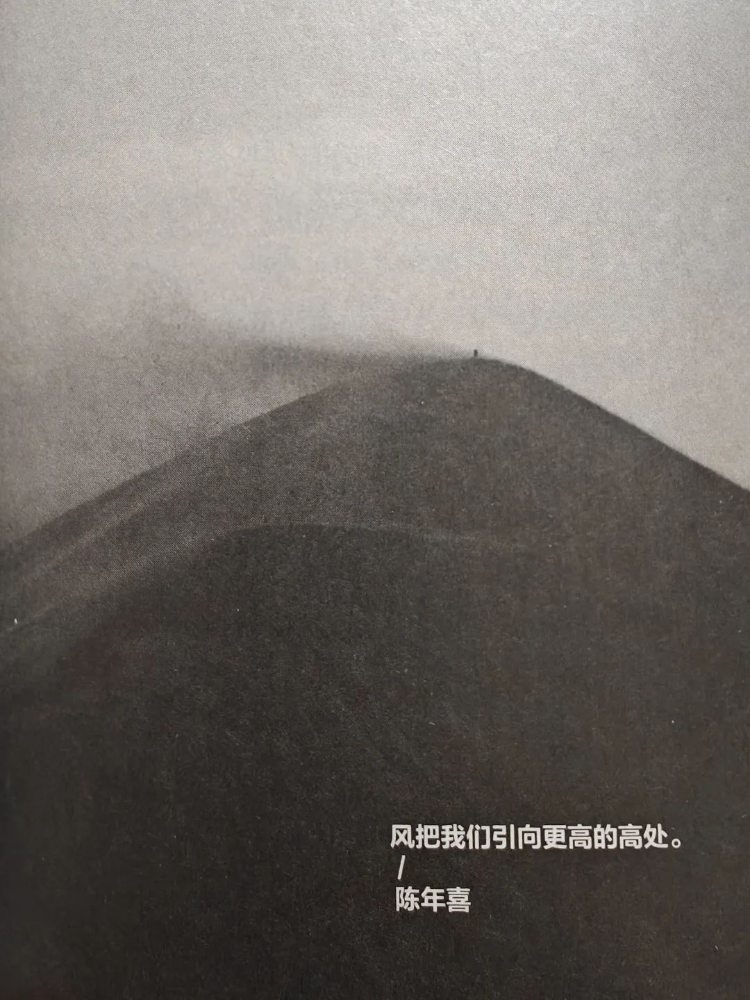
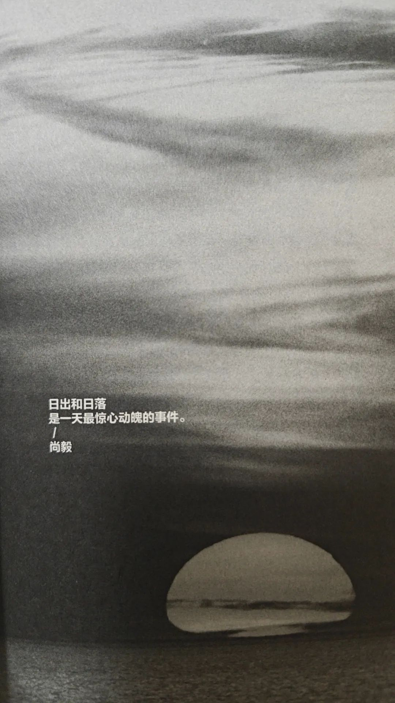
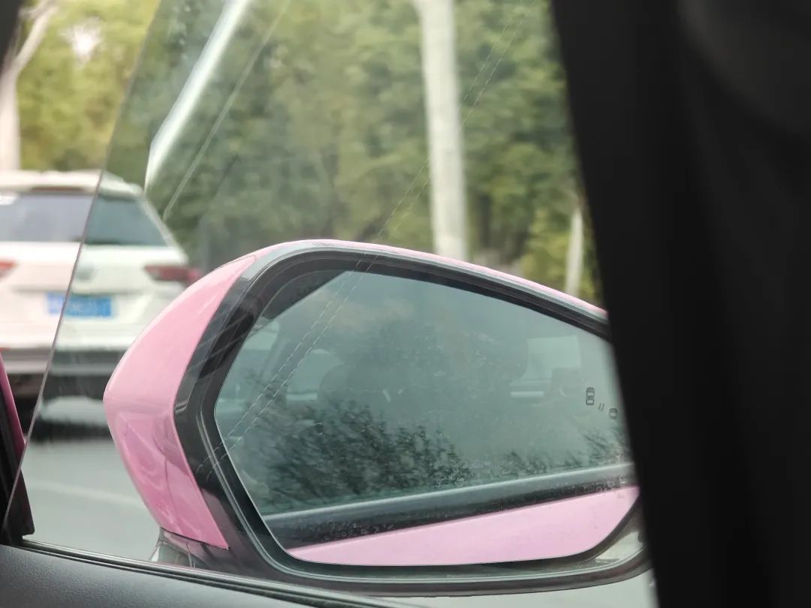
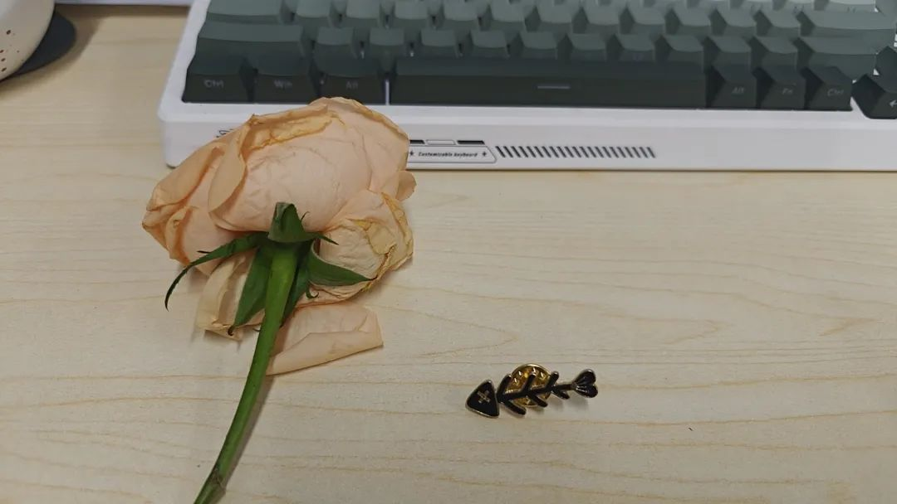
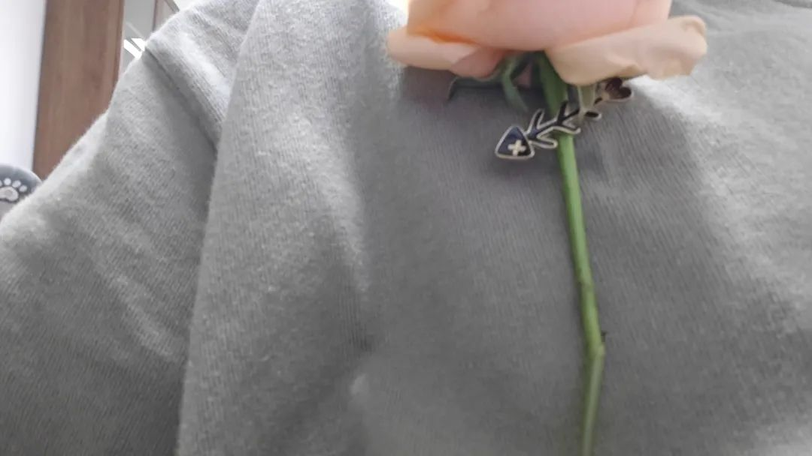
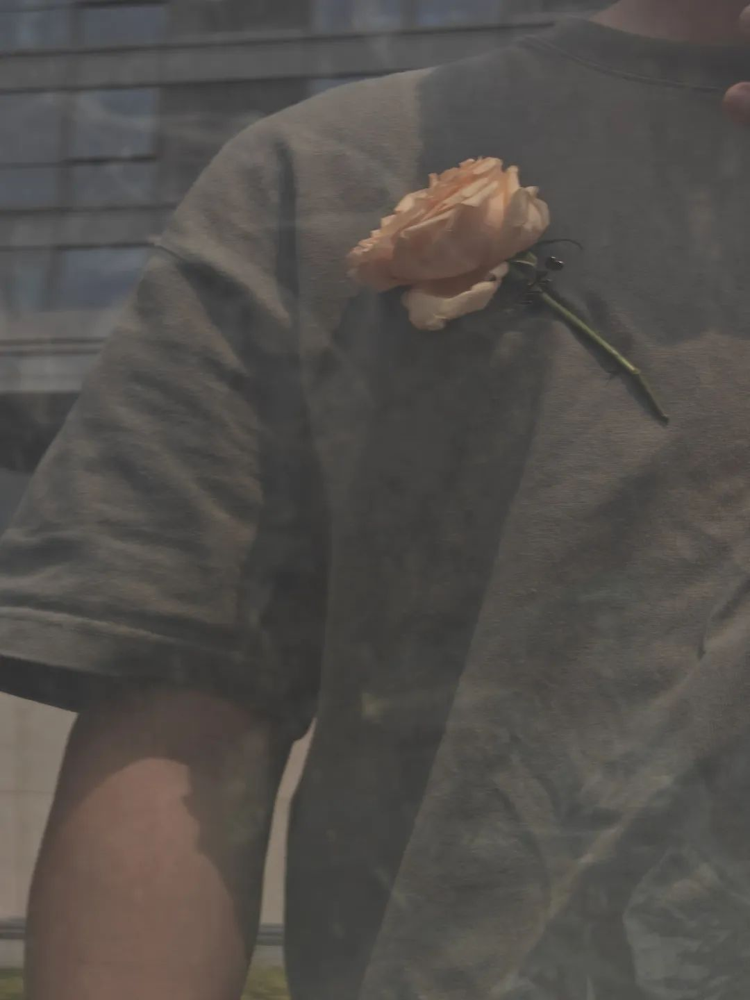
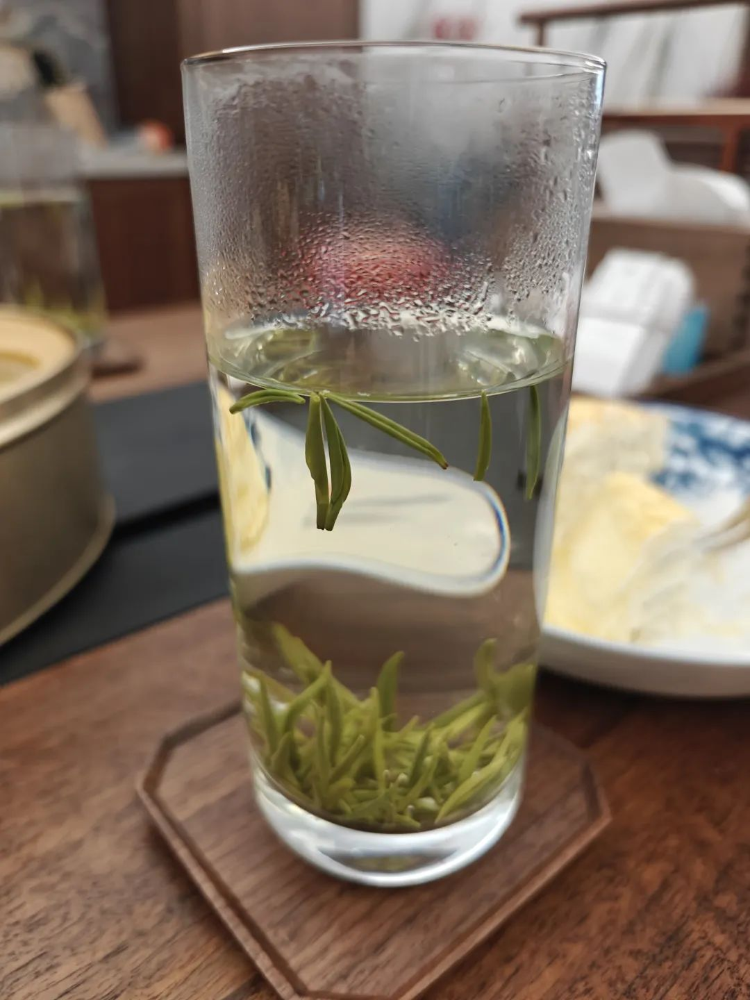
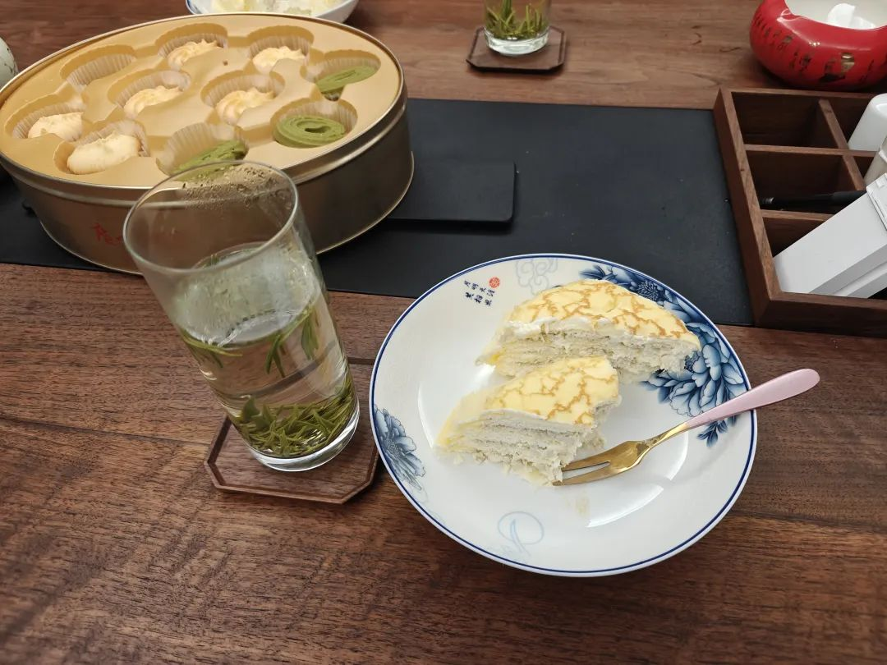
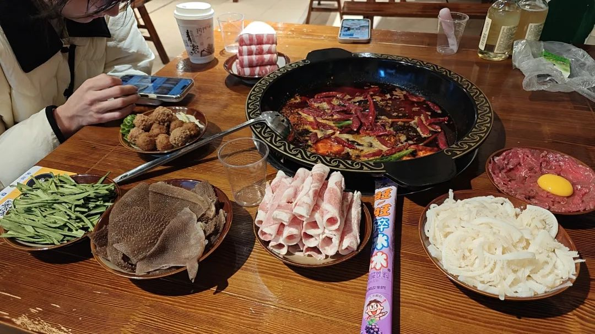

本文是张衔瑜第344篇推文

共计2200个字，12张图

有个很精妙的比喻形容春如四季的天气。说长沙就像剩饭剩菜，被天气热了冷，冷了热。我以为很是巧妙。于是记下来。

最近这周看完的书是《单读30：去公园和野外》，上周六晚读完。按照一般在周末写周记的自然而然形成的规律来看，这周不太规律。

我知道是什么原因又让我写周记随笔的时候变慢了。靡不有初，鲜克有终。虽然各种事情的开始都像不错的样子，可一旦考虑要画上句号了，事情就会变得不那么轻巧。即使是已经知道事情怎么发展才是正确的，可一些决断终于不那么容易作出。而反思，才是根据那一刻的行为来查找想法的一个引子。这种查找，是认识世界，也是改造世界的开始，尽管主体是平平无奇的自己。

这本书我不太喜欢。因为有些无聊，可能是这么多本单读看下来，最没什么劲的一本。之所以这种看它，是因为上周看的是《走出我房间》，取了个谐音梗，那么去哪呢？《去公园和野外》。是这么构思的朴素逻辑，也是这么安排的读书顺序。从科研做事的习惯来说，即使一本再不喜欢的书，潦草地翻完也是翻完。

这么本书最吸引我的是一些插页。刚刚甚至想到了之前我自己印的那本影集。等以后我要是自己出书，也想参考这种模式：

还挺好看的。等以后整理整理自己写过的各种同一主题内容时，如果是文字类书籍，那也想加入这样的设计(虽然大概率还是受出版商的制约)

这周做的事情不太多。虽然几次被人说，要合理描述自己的工作量。不过公众号就是我写给自己看的。说每天做了些什么，完全是一件主观评价的事，更像情绪上认定有没有达到预期。

也还是做了很多。今天把工位搬回家了，这样就可以极大减少通勤时间。单兵作战的日子里，就是该保证最多的时间投给值得努力的事去。

一个新发现。Psycho-geography 心理地理学，就是风水堪舆的一个注脚。

这周看了一些有关顺风车的内容。

打到了一辆粉色的哪吒。看起来挺有意思，大概也是某个通勤上班的人，下班了顺手一带。

坐顺风车的那天晚上去参加了一个小的创业者互助会，也有些其他的专业人士，所以也可以说是论坛。其中有位创业者，我们大概简单地贴标签，是年长一轮的极客。和另外两位创业者，还有极客，在路边溜达。极客说写代码写累了，出来活动活动很快乐。

突然，极客和我都见到了地上掉了一块钱。

另外两位做餐厨创业的人都走过去了。也许是没看见。但极客和我都看见了。我看了看附近有很多中学生，是那种卖小玩意儿的校门口摊位。我说，应该会有拾金不昧的中学生吧？如果真的被需要的人捡走了，也挺好。于是我走过去了。极客看了看，也走过去了。等走出十几步，极客像是经过了几个呼吸的思想斗争，又拉住我，转过身去“我觉得还是不好。你想想钱上面是谁的头像，我感觉很不好。”虽然极客和我的时薪，算到每一分钟，都不止一块钱。但极客内耗了一会儿，决定了返回回去。

我笑了笑，便问，你这到底是很节俭型创业，还是真的因为感觉很不好所以才回去？顺口接的词句，如果不是刻意防范，不然很容易被卦师作为取象识别的参考。

极客和我返回了那一块钱在的地方。是个烤肠摊子门口。长沙刚刚下过雨，所以地上时中学生们踩过又溅起的人行道脏水，一些小泡泡像田间水蛭，没有脸，形貌混沌。极客和我看了两圈。我说，大概象只出现一次，上次没有抓到，就抓不到了。极客说，那好，没事，只要不在地上就行。

几个呼吸间的时间，我们也不过走出去十几步，又折返了十几步。一块钱被捡走了。于是又笑到，商机又何尝不是这样呢？

次日，去见合伙人的路上，看到了一束掉落的香水玫瑰。昨天的一块钱我没有捡，后来我也有点反思，觉得现在要有些创业者意识，而不是纯学生或者弘扬佛法/道法/阿尔法的行为范式，于是捡起了那朵花。

等午餐的时候，我从包里拿出了一个鱼骨别针。是之前想弄一个张衔瑜本命别针的时候存在包里的。

穿过了玫瑰/月季的花枝，别在了左胸前。深绿色的圆领短袖上衣配浅粉色的香水玫瑰，或许是月季，我分不太清。挺好看的。也许不是玫瑰，不然花枝上就可以直接用玫瑰刺。也可能花店剪掉了。搞不懂。

作为胸花来看，我挺喜欢。

有一些关于岳麓山的讨论，但是还没有成型。也不适宜在公开场合讨论。留下仅开发者可读的引子，以后再说。

用GPT生成了新的牛顿头像。不过只有不超过五个朋友之前来和我说，看到牛顿换了吃的草和面向的方向。新换了吉卜力风格的牛顿。但总是是真，各个细节都不太对劲。虽然在用，但打算换了。

工作日真的在工作，周末倒也真的在休息。

去了七立方马王堆茶馆。不知道和东茅街茶馆有没有联系，但吃起来是大减配版的东茅街茶馆。东茅街茶馆也未必做得多好。可能决策部没什么文艺青年，或者文青占比过低。

马王堆茶馆至少半年内我都懒得去了。希望它最好别叫马王堆茶馆。除了把这三个字挂在内景装饰之外，没一个值得用马王堆名字的点。

图也不放了。

去烈士公园溜达了。

日历上写着，下周五是清明节。到了我比较喜欢的节日了，不吵又不闹。周末接到了去品明前茶的邀请。明前茶、雨前茶，意思是清明之前，或谷雨之前。看名字，是春分后最近的节和气，也是春季的最后一个月。

物候是传统理论中最具智能体意味的学术成就。明前、雨前，这都是月将的戌将时间。

晚上吃饭前，很想吃旺旺碎冰冰(曼德拉的问题)。于是买了一根。乐尔乐超市实惠得很。图为搞不好火锅的新店。趁夏天到来前，还算凉爽的天气。

一些特别的记号，就会让人想起历史上的今天。历史不会重演，但历史总在重演。

跑到银河系驻东长街办事处，营业了两个小时。苦主原来这么苦。众生皆苦。离苦得乐。
