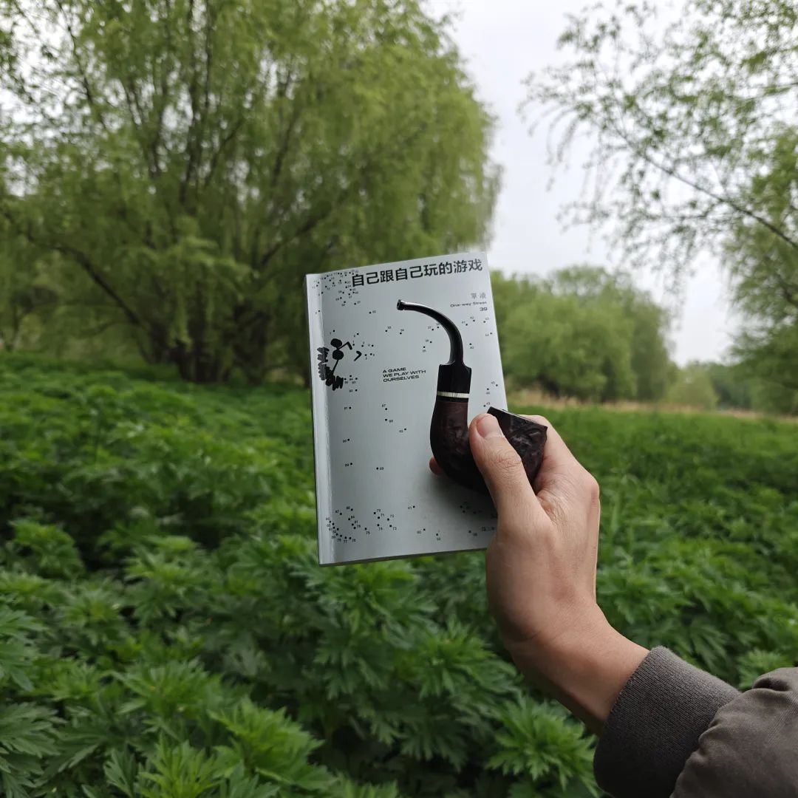
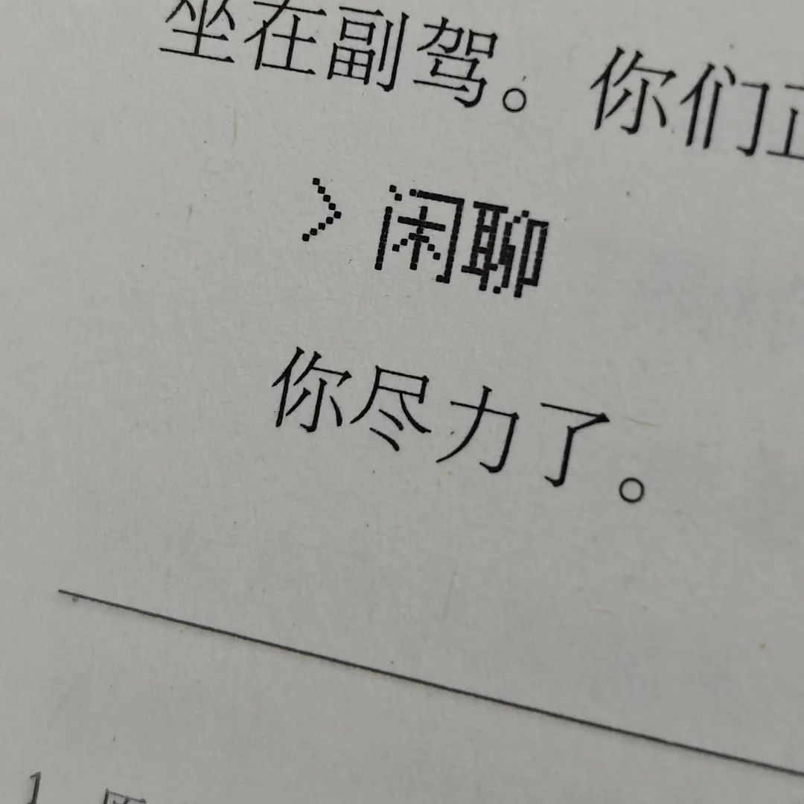
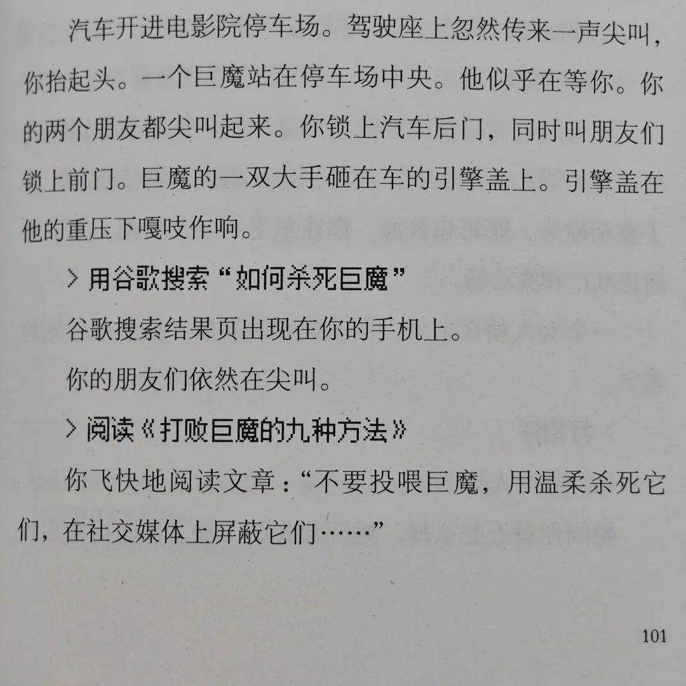
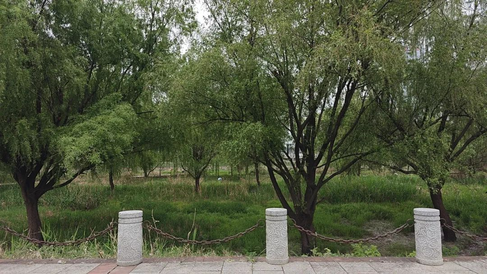
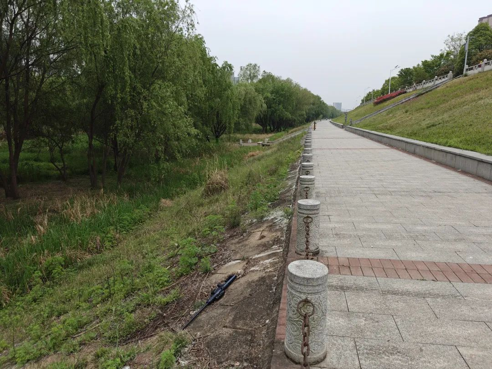
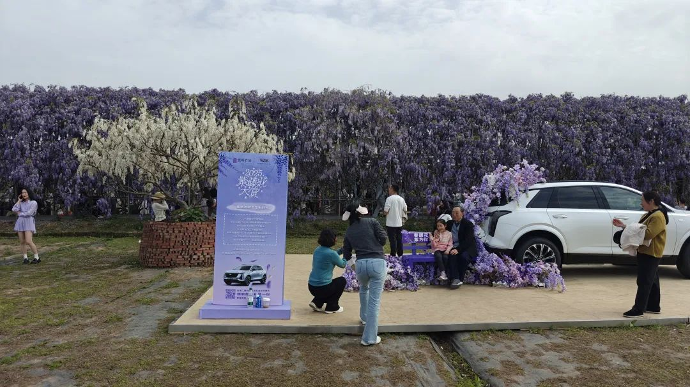
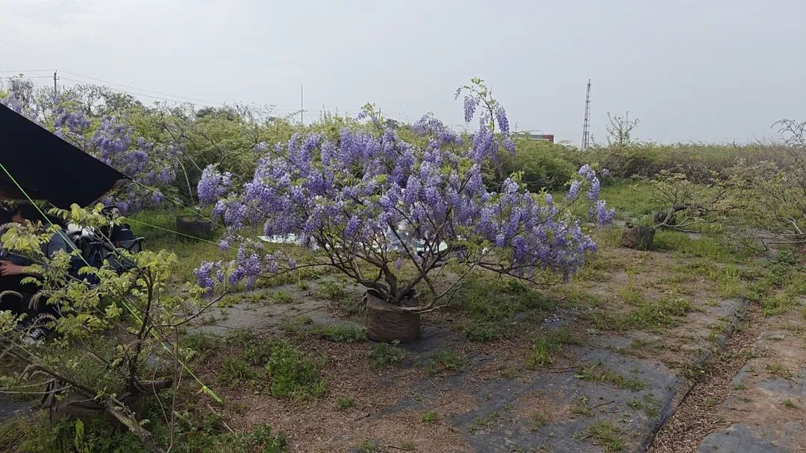
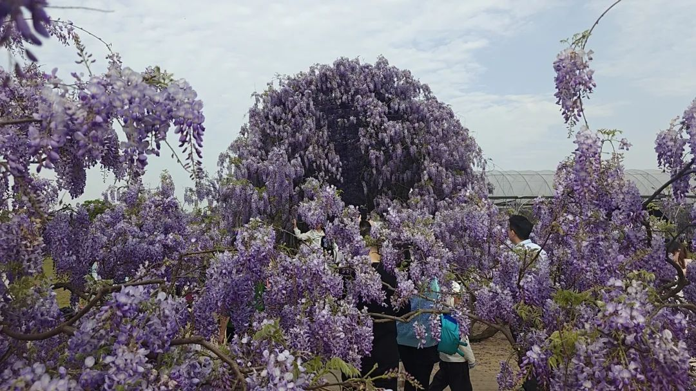
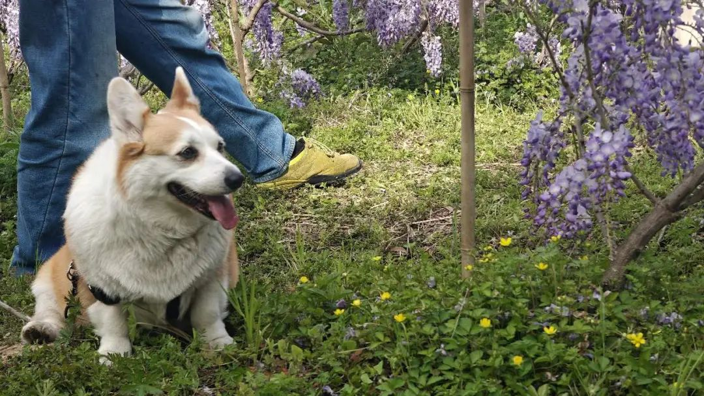

本文是张衔瑜的345篇推文

共计1877个字，10张图

写完代码后，转头来写公众号。像两个世界，分享着我的精力。虽然很多看起来互不相干的事都在试着把我的时间划得七零八落，让人总没个停歇，但还好。看网络小说的年代，有个词叫七窍玲珑心。虽然七件事不见得同时出现，可现在脑子里要想的又何止七件事。

照例上交每周阅读报告。上交是乱说的，不用交给谁。有些退休了的老干部们也喜欢用公文化的表达。我也想退休。

『单读39：自己跟自己玩的游戏』清明节出去踏青的时候，就带着这本书和我一起走。

一些人去了山里，在山里看已经故去了的人。我没这么做。我和生者待在一起。

事死如事生，是一个好习惯。可事生者也很重要。何不把事死时的那份心放到生者身上来？死者已经死去。我无意于比较到底去敬重死者还是敬重生者更为重要。因为不管怎么样，逻辑上都有瑕疵。每个人都终有一死。

所以，仅仅说成，即便以后事死时不去，也可以坦然地说，没关系，生前已经料理了。我觉得就足够了。

和奶奶外婆在黑石渡的浏阳河边溜达。虽然还在开福区，可河边没什么人。是难的找到还在二环内，游客几乎没有，绿化成茵，剥离了吵闹，还随时有花坛边缘可以休憩的地方。长沙市里找不到比这里更妙的平衡了生活气同时又适合老年人稍微走动一下的地方了。

年前第一次来这附近，看到一些小朋友在放烟花。我们没买到烟花，就走了。元宵节晚上骑车经过，想着什么时候一定要来一次。清明节来了。

为了的修河堤而推下水的滩涂淤泥上，栽种了很多柳树。柳树退出了芦苇荡。外婆说，以前浏阳河的水面要比现在宽。上世纪的舞厅建在河边的圆形堡垒上，毛笔写就的红纸黑字，遮盖了浅黄色油漆刷过的格子玻璃外墙。

走走停停，停停走走。清明节下午，在这待了四个半小时，走了不到四公里，看完了半本书。等下次印摄影集的时候，也想借鉴下图这样的表达方式。

上周就说不能老看『单读』，也要读一些其他的书。于是这周勉强自己，看完了一本『南美怪谈』讲的是南美洲自创世纪开始的各种神话故事，包括自然界风雨雷电、生活喜乐、部落家国等无所不包的主题。

草草地翻过去了。和看单读里的诗歌差不多速度。一些小故事还挺有趣的，只是作者喜欢解读，也许是有别的意图。我倒是愿意看简单纯粹的故事，而不是像这样的『伊索寓言』每个故事都要告诉我一个什么道理，像解释中心思想的语文课。难道没有中心思想和修辞手法，这篇文章和我就一点连接也没有吗？

话说回来，南美洲的神话与我脱节还是挺大。倒不失为了解南美洲人思维的一个窗户。翻了翻扉页，同系列还有一本讲中国精怪的。改天买来读一读。

紧张的事很多。但尽量不那么紧张。毕竟，读博最后两个月的工作强度和情绪强度已经把我拉满了，人生再不需要用那样的强度来试探自己的极限。

尽量休息休息。有时间就出去走一走，看看花草藤萝。祖辈现在去吃湘菜店，已经要嘱咐店家少放辣椒了。于是午餐选了湘菜店，晚餐就去吃椰子鸡。至少先把嘴巴送到南方沿海去。

隔天，去看了紫藤萝瀑布。初一学这篇课文事，寝室前就有一株紫藤萝瀑布。又在花海里重读了宗璞的这篇文章，觉得还是很有代沟。也许代码写得太久了，不习惯那种说话方式。

农场花海里，虽然跟一直求出片拍照的人没什么干系，可出来之后如果不在开车，就觉得有些头疼。也许花粉过浓不是什么好事。

晚上和朋友聚会完，在长沙打车，打到了一辆可以唱KTV的比亚迪宋。而且放的时陶喆。

情绪已经留在朋友圈了，不加赘述。等写今年100土时再来回味这一部。

刚刚本来想提一嘴这周写的另一篇信息密度极高的『科学的尽头是玄学吗？不，是真相。』可应该在公众号已经零散写过几次了。没有去查证的心思，于是也只是记之而去。

也许以前的公众号里还会偶尔提及，最近在搞玄学的时候又有了什么新发现。最近其实也有，比如步罡和旬首空亡。可因为把这些放到前台了，所以也懒得再在公众号里占篇幅。

有重要的事情时，每天的奔头都很明确。所以那些事，都不想带到生活中来。不然，一点独立性也没有了。最不喜欢喝粥，也不想把生活、工作煲成了一锅粥。

一周，很快就过去了。

今年已到农历三月，几乎每周都读了一本书，写了一篇周记。好像一些久远的生活习惯又回来成了更有规矩的常态。这样挺好。也算是找到了生活和工作的平衡。尽管千丝万缕的关系未必能被粗糙的两个词汇框架分开，但至少能说出这是一个颜色，那是另一个颜色。

这已经足够好了。我挺满意的。就是时间上有很多紧迫感，因为不知道这样还能保持多久。可无论能保持多久，都不应因为那将来未来的改变而导致现在好好过生活的任何动作走形。需要有一些秩序感。而现在不是一点也没有。现在的秩序感还挺友善的，不冰冷淡漠。
