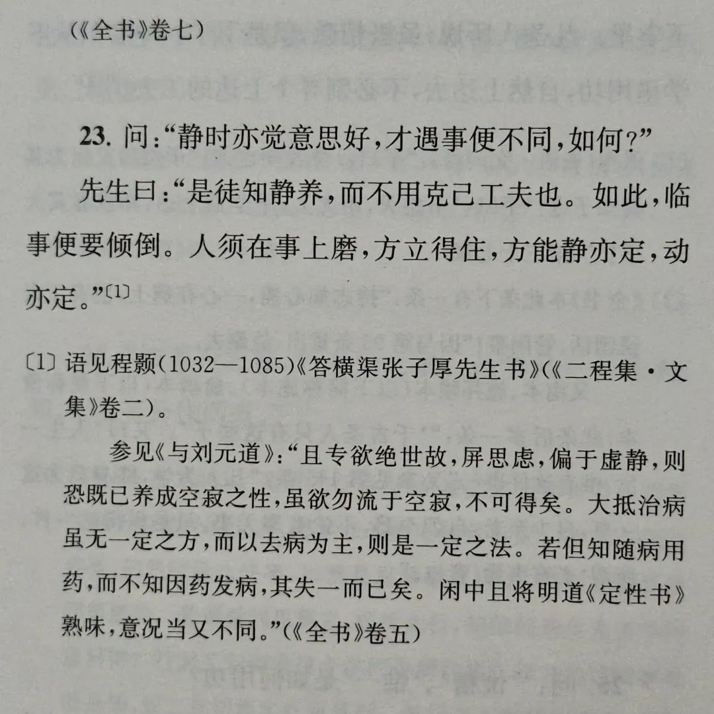
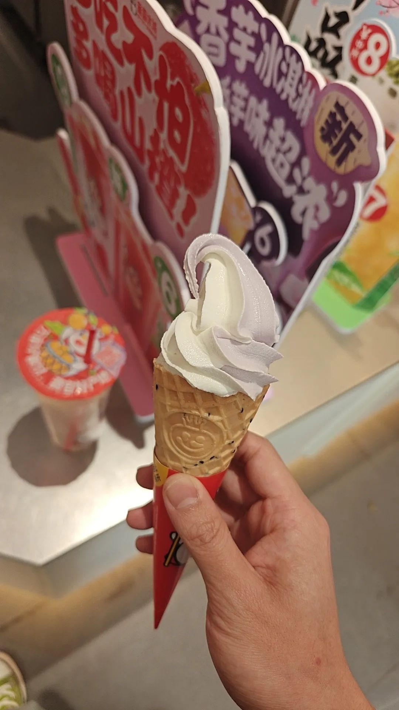
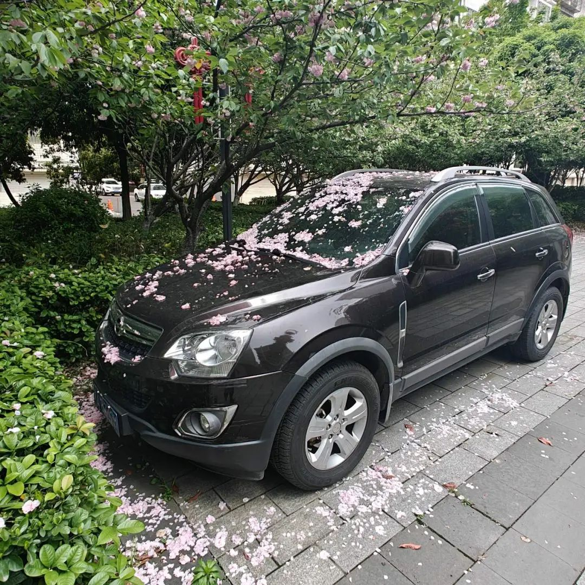

本文是张衔瑜第346篇推文

共计2309个字，3张图

此预制菜不是彼预制菜。心里想的是，语言即预制菜。因为不会每时每刻都捧着『新华字典』或『古汉语词典』到处溜达，语言所能触及的边界也仅仅是基于二者理解的共识产物。

同一件事，用不同的语言 在不同的人那里说出，触及的眼耳鼻舌身意完全不同。可这完全是同一件事。

这周在读王阳明的『传习录』，由邓艾明做的注疏。翻了翻，大部分时间在读王阳明的原文。偶尔有读得感觉需要看注释的地方，就去读一读邓艾明的注疏。

有些惭愧，这周只读了60页。太少了。跳过了一些邓艾明的注疏之后，真正读的也就更少了。

如果不以字符为标准的话，传习录有和心经相似的妙处。很早就打过那个比方，医生说了禁水禁食，然后又根据病人一轮又一轮的提问，说可乐不能喝、椰子鸡不能吃、冰糖葫芦不能啃、狗皮膏药不能舔。传习录和一些我理解的思想很像，也许是我的个人认知限制，以至于师心自用。

我不觉得有多么超乎理解。有点像小时候读论语等启蒙书，传习录约莫是成人世界的启蒙书。没有很多不同。

于是去B站看了王德峰讲的王阳明心学。还挺好，这个视频就是接着命理学讲座的。我的观看顺序也恰如是。

看完了就看完了。像吃了饭一样。除了吃的时候砸吧嘴，吃完之后，它早已成为提供今天能量的直接ATP，维系长久稳定、造成或消除隐患的日拱一卒。命理占卜如此，心学也是这样。

于是研究了一些步罡方向的内容。并把投影的原理给学过并且真学了高等数学的人讲通了。

我也只是提供一个说法，并不代表事实就是这样。大家都不过是给已经发生的事找到一个合理化的解释通路，但并不见得事实层面上是这样，甚至 自己也未必完全说服了自己。

所以是懂了吗？碰到油腻的问题最显无聊了。倒不如开个叉车，把爱问抽象问题的和从不敢比武只敢比推手搞化劲的马保国之流全部叉上叉车前面的那几个戳，塞到让人觉得恶臭的(有所指)又或制造恶臭的(有所指)地方去把腌臜内容都扫进下水沟。

朋友打电话找了我很久。可惜我们都没法做到敕令一方雷雨，去执行我们以为正义的裁决与审判。

显化倒是越来越多了。像显示器。

又看了郭云神奇关于『让子弹飞』的六个小时10万字讲解。昨天看了两小时，今下午看了两小时，晚上又看了两小时。这对吗？感觉节奏也挺紧凑的，甚至来不及加速。

这离谱的时长都已经是电影的三倍了。饶是我第三次看这部电影，也许下次又能和好朋友开启除了『出师表』之外的全文背诵，仿佛又一场读剧本会。

这是我期待看先锋话剧时的样子。

碰到了一些需要我帮忙的事。还好现在秩序感比之前足很多。也许这是人成长了。

遇到山樱花，被长沙的大雨打落，掉在车的挡风玻璃上。挺漂亮的。我拍了好几张照片。周末的大风让很多花瓣都吹落。疾风知劲草。疾风未必知道花可以重新长出。雷山小过。泽风大过。

做了很多有趣的事。还好不是写周报，不需要每件事都写上去。写了也会忘，倒不如不写。留下一个充实而又平衡的节奏记录，虽然未免以后某一天回想，会没法复刻此时此刻的工作分配，但以后的主体也会是以后的我。手拿把掐的反馈，才不是生拉硬套的教条。

即使过敏，一吃就呕吐、一吃就起疹子。想想如果，以后一个不爱吃螺蛳粉的人，骨灰被撒到了浏阳河里。路人乙丙丁，来到河边喝茶。喝茶之余，带了螺蛳粉。秉承垃圾分类的理念，这些人把汤汁倒进了浏阳河，固体垃圾放去了固体垃圾，外卖盒放进了塑料垃圾。这对吗？难道一抔黄土就不会对吃螺蛳粉的行为表示黄土的忿恨吗？

公众号后台提醒我，开放了新功能。大意是在读者点击听文章时，可以帮我读。得再等等。等什么时候我能写出长沙话和普通话对应的汉语词汇一致时的文章。

最近很容易打错字，或者话已出口又反应过来刚刚说的有问题。譬如写这篇公众号时，常常瞟到光标正浮动的位置上方两行处有一个错别字。乱序不影响阅读，错字呢？阅读本来都已经从阅读上影响神识沟通了，又何况各种嘴瓢。

另一种原因是现在很平静。说月亮是方的也跟我没关系。每天频频问“这对吗？”或者判定这对/这不对，本质上对或不对、甚至对此的疑问、判定、乃至任何需要延伸出去一个碳氮三键键长的思考都是多余的。

喜悦很多，但没有很多外界会让我觉得惊讶的悲喜。世界是什么样我不知道，但去过一些地方了；人心长什么样我不知道，但猪脑和猪心我都不会主动点。有点像薄情寡义的人，某天起夜的时候，突然给对象发个消息，说想对方想到睡不着；又有点像摸鱼打卡的上班员工，绕路去一下公司打卡范围内；但最像的还是钓鱼佬，坐在河边拿着杆子。那模样，若是把洗面台漏口堵住，钓鱼佬也能拿根筷子，串个孜然粒粒，在水里撒一把海藻晶冻。

前两天跟兵占的朋友讲奇门遁甲，说如何利用空亡。转头在已经监视了我的互联网工具上看到了一位扒手。真有意思。文章本天成，妙手偶得之。小偷岂不是用空亡的行家，专门在空亡时间去坏他人的财库。财货的事叫偷，那读书人的事叫什么？这些灵光的想法就和意外的人一样，本非我所有，偶然看到了就说出来，跟着写下来罢辽。

以及，

最近看到了一个空翻的视频，大概是平地上不借助任何外力工具就可以空翻：前空翻、后空翻等各种奇怪的翻来翻去。

感觉挺练核心。虽然最早看的在重庆空翻整活，后来发现他真教。又搜了下，全国最大的空翻特技基地在长沙暮云。的确有些远，过去竟然有20公里。已经联系了体育的朋友。想找时间去体验课。这个可不能像上次没吃到QQ糖一样，过了一万年之后突然开始在脑子里想，不对啊今天应该买一包QQ糖的。QQ糖可以再买，牙口应该还能支持QQ糖很久。但是空翻再不翻，怕是会翻不起来了。得去试试。

已经很多放言想做但没做的事了，去冷的地方、去洛阳、吃QQ糖、去乌镇戏剧节、去蒲甘、去大兴安岭。要是能像把菜单拿到手打勾一样简单地做事就好了。打个勾的简单行为，获得一盘菜。这个获益比率好夸张。
