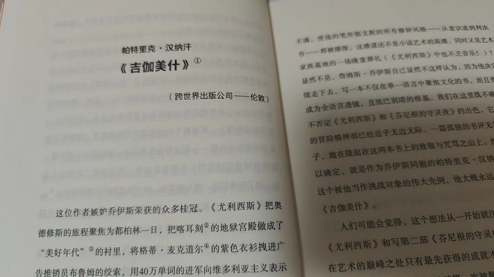
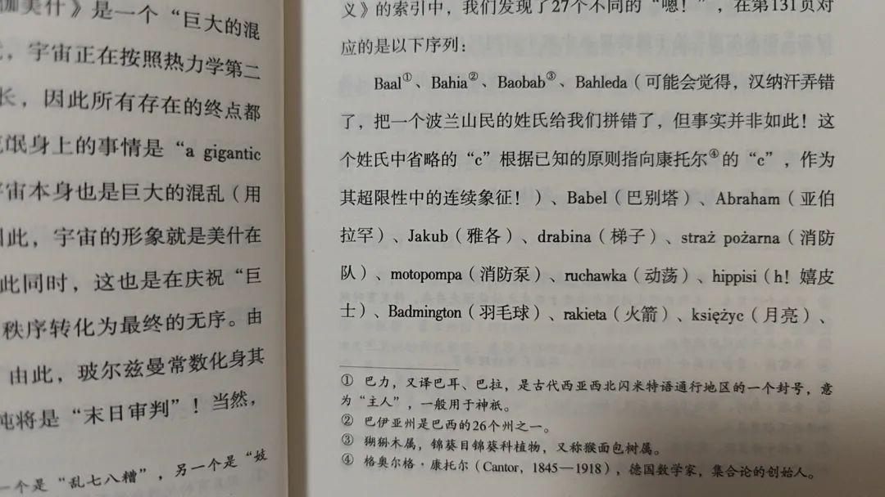
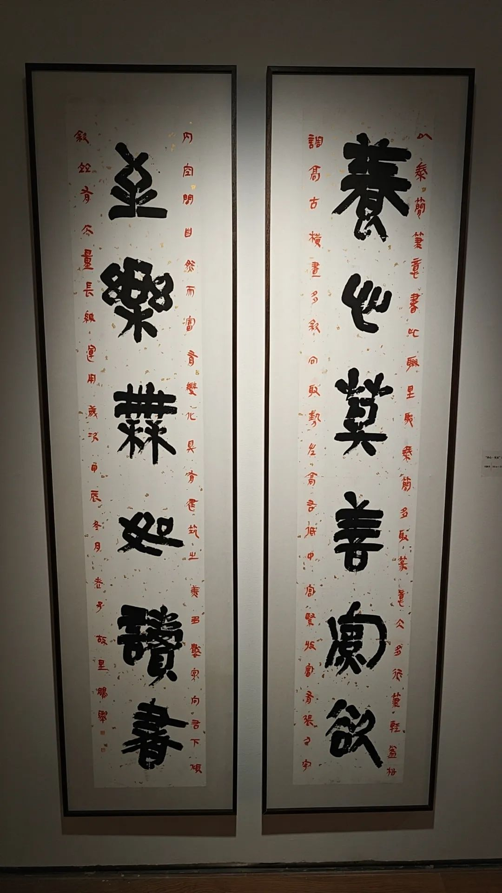

本文是张衔瑜第347篇推文

共计1499个字，3张图

标题来自最近觉得很巧妙的一个比喻。取材自最近搞抽象的时候，一个妙手偶得的比喻。现在把原文稍微加工一下：

在古代，生如行舟。到现在，有点像去坐车。车站有很多列车，你在发车站里四处张望，你有你的目的地。车次蛮多的，不知道去哪辆车才会到。也许知道，但车票上并没写哪辆是餐车、哪辆是无座。

每个人兜里有不同的钱。一些人加了杠杆，一些人不知道怎么花。

而我则像一个车站工作人员，大部分时候都在闸机旁。当有人来问我时，我的工作就是让人尽快去这人该去的站台。

车票得旅客自己买，坐车也是旅客本人去。我只是在票务和站台调度上下了一些功夫。知道什么车会去什么地方，偶尔也收集到了一些关于车厢配置的内部文件。

也许今天被派来协助一位重点旅客。也许只是车站缘悭一面的个体。听到一些人祷告时的喃喃自语，也听到一些人恶向胆边生的呵斥。

我就只是接着干些小活。

最近一周，在读『完美的真空』，是一本科幻小说。讲它是科幻小说吧，又有点搞笑。这本书是给一些并不存在的书们，写前言。从唯物的角度来说，都不存在的书，你怎么给人写前言。但ta就是要写，而且写得有模有样。好像已经完全看过这本书的似的来写前言/跋。有点搞笑

另，又找到了一些证据，用来证明我已经知道了的『命理学重存在很多封建遗毒』亦即过去的生产关系已经不适应先进生产力发展的证据。我指的是，果老星宗、神峰通考之流里的绝大部分神煞都没什么看的必要。从运算逻辑与神煞名的对应上来看，都是很可笑的事。

数学本是一门优美的哲学。物理学家虽然不知道怎么推衍出来，但就回偶尔突然蹦出一些很优美的式子出来。更一般地，即使我们还没推衍倒，但可如果那个式子极为优美，一般都是对的。数学物理方法也讲以貌取人。而且事情的发展也总可以先声明美丽，后证明其合理。讲科学的时候也挺巧妙。

所以在写果老星宗、神峰通考和渊海子平时，看到一些计算模式对应到很好笑的神煞名比如“红鸾煞”和“大耗”，就知道这是不需要参考的东西。就算写上，我也会说：这些疑似属于封建残留的荼毒部分。我正在辨识无对比实验的术数，在用同样无对比验证的先验唯心手法来作选择。

拿到阶段成果的那天，和朋友去吃了酸汤火锅。贵州酸汤火锅挺好吃，还加了一次酸。

吃完后，我们去看了电影『阳光照耀青春里』，是三年前拍了但最近才排上的作品。去之前，朋友给我看影片介绍，说这怎么看起来虽然没有一个字指名道姓，但又每个字都在说张衔瑜。我一看，啊？不是，哥们，这对吗？

去看了之后，感觉电影还是比生活更讲逻辑。电影为了让大家看懂，所以有很多逻辑在里面。生活就不这样，生活只等着大儒来为它辩经，给它找补那些存在的合理性证据。生活比电影不讲道理多了。对比生活和虚构电影，电影更像非虚构的生活，生活更像虚构电影。

耗费一些心力，做了几件消耗很大的事。通达各处，像李云龙打平安县城前，联络地方武装时，传令并说：『就是把马跑死，也要把命令带到位。』沿用了一些杀伐类的词句后，所有的运动过程也更像拿下一个又一个的山头。这又何尝不是一种过家家的游戏。

今天去看了一个简帛书法的展。感觉好像脱离大集体单打独斗后，从心理上离开了要依赖平台的那个育秧期的张衔瑜。现在已经视角转变到了新的地方，是自己要去跑通所有内容了。和从内部一步步成长不一样，而是一张张半大小子的嘴 长在了中学生的腿上 一路飞奔向食堂 每次多一纳秒就要饿断肠子。

书法展挺有趣。拍出来的效果不如裸眼，毕竟手机镜头模组的高动态范围没有视杆细胞喝视锥细胞那么配合严密。看一看还蛮好，有空可以借鉴一下别人的好想法。

选图的时候才想起来，这两天茶颜小主节忘记去充值了。奇怪怎么去年的充值，到今年还没用完。有点反常。
