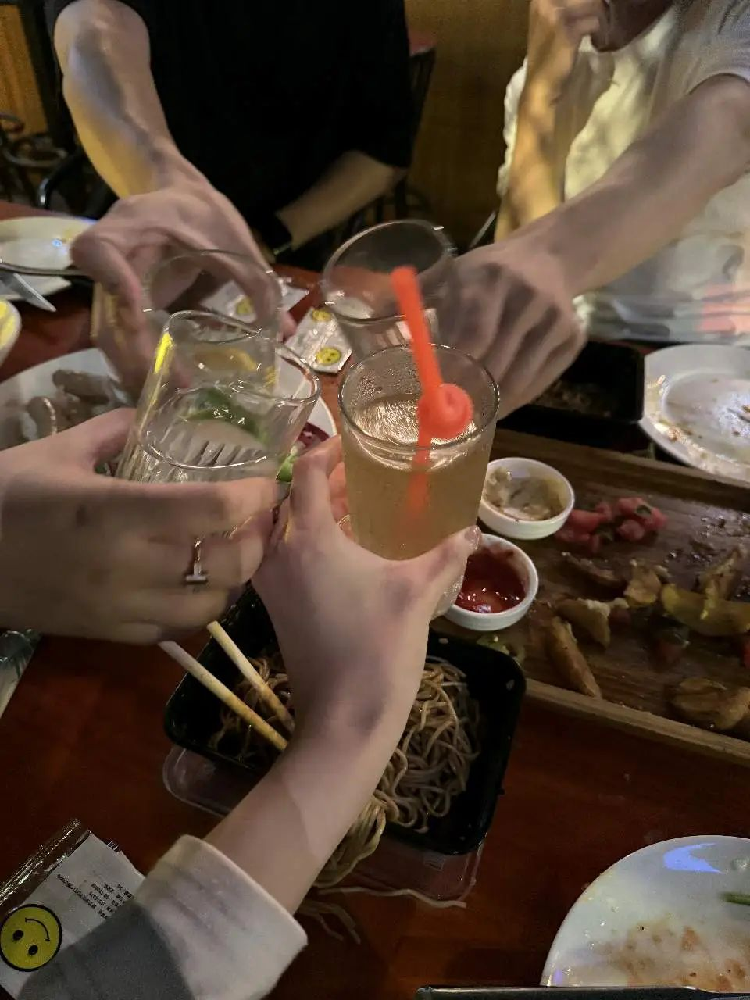
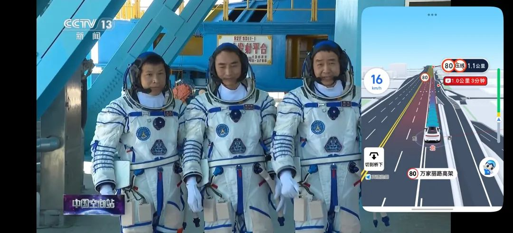

本文是张衔瑜第348篇推文

共计4580个字，6张图

这周有些惭愧。一本书没有读完。这周开始的时候打开了一本讲塞尔维亚和黑山——前南斯拉夫的一本书。作者遣词造句的油腻水平和我很像，但是因为没看完，所以下周再说。

周三去了一个公益讲座，是个非常成功的系列。主办方要做的事很多，与会人员倒很轻松，只用会后交一份报告心得感想一类的笔记即可。内容体裁均不限。

第一次去讲座的时候，没有交报告。确实没写，只把笔记留在了OneNote，这次好好写也并不会把上一次的补起来。内外耗不解决问题，先把当前的问题解决了。

——————————

心理学讲座

中学生厌学问题

『 要点实录 』

事实与分析：

1. 生理性别与厌学表达显著相关，男童厌学情绪表达高于女童。

2. 教育内卷是极限运动。涉及对人口趋势的基本判断。论述了学习行为与自我效能认知间的关系。教育内卷作为极限运动，常常伴随自虐心理。

3. 抑郁症(愁-仇)已出现年龄倒挂情况。涉及温床效应与诈病。

4. 成功体验伴随内驱力的唤醒。责任常常是外驱力。

判断与行为：

1. 名位区分：学渣改称学瘫，学霸改称学嗨。须进行日常口癖的修正。

2. 厌学与拒校的心理原理不同。

3. 如何处理？淘宝闪光点、寻找突破口。

『 我的视角 』

近五年内阅读了《红书》、《蛤蟆先生去看心理医生》、《社会心理学》、《怪诞行为学》，更久前阅读过《思考，快与慢》、《自卑与超越》、《乌合之众》、《人性的弱点》、《梦的解析》、《给教师的100条建议》。计划阅读罗兰米勒的《亲密关系》。

『 我的直观体验 』

讲座幽默风趣，与听众互动频繁。讲师善于基于自我成长史进行情境导入，从个人生活和工作经历判断出历史与社会的变化，并进行指导、矫正。有很多take-home notice，也有心理学原理的归纳总结，节奏把握十分巧妙、适合与会家长群体来学习有关孩童厌学情绪的纾解。

由于我长期从事自然科学研究，故而对信息密度极高的场合较为熟悉。这一讲座中有不少和听众进行共情沟通的部分，也许是心理学原理在演讲与口才中的体现，对我启发很大——亦即，知识层面上，如何将抽象的理论做到具体可触达；体验层面上，如何在情绪沟通后整理形成行之有效的抽象准则。讲座技巧对平常总在推导一些抽象公式的自然科学背景人士而言，是一次很及时的启发。

即，理论可以风趣地表达。

『 多余的话：关于心理学与精神卫生 』

生物医学中做队列分析时，常用“选入标准”与“选出标准”。

与精神科的主任医师交流后，我得知，对精神卫生科而言，精神病的准入标准为各类量表、诊疗意见、疑似器质性病变的查体结果等。准入标准意味着这些人会被认为具有精神障碍。

而即使有精神障碍，也未必会被认定为精神病。精神类疾病的准出标准为，如果此人可以正常执行基本的社会生活、功能各项基本完好，则不应被认定为精神病。

讲座中提到了对焦虑、抑郁、躁狂、双相的不同心理咨询策略。这符合厌学主题——在需要讨论厌学的情形下，通常情况还没有严重到精神分裂或更后期的住院矫治。讲师在咨询时也从环境下手，提到了不要用污名化的“渣”来形容低成就、低动力的学生。要求改用“瘫”等词汇。我以为这是很巧妙的心理咨询建议，是很见功夫的对“消除病耻感”的体现。从易经原理上来看，名位相符才会家和万事兴。频繁使用词语本质失当的叫法，只会加剧割裂，例如言之凿凿的中国病毒西班牙流感之论。

从个人角度看心理咨询，我认为心理咨询是一种健康的生活方式，就像去定期检查口腔或留意面部气色。这次讲座方式是极适合唤醒来访者主观情绪的交流方式。

『 多余的话：关于厌学情绪 』

讲座当前厌学情绪归结了几个原因：性别因素(疑似指出当代中国中小学教育的去雄属性，这一主题也在郑强教授的有关讲座中体现)、人口因素的教育内卷(举例了中考人数1200万与高考人数1300万含复读)、家庭因素(即个案中长辈与晚辈的代际沟通)。

从性别上看，教育是否不利于男生？这个问题也许可以更反过来表达为，性别差异是否在投影于应试教育时，存在显著差异？这样一来，得首先提炼普遍的性别差异，于是讲师举例了不同学历层次中的男女对比：越往高学历层次，女性比例越高。

我没有去查证性别数据。在我的高等教育信息茧房里，性别差异似乎更明显关于学科差异。男女比例似乎与学科情绪体验更相关。自然科学内，如药学系常常女生比例过半，医学院常常对半开，化学和信息科学常常男生比例过半。

从人口上看，内卷是否是厌学的来源？答案是肯定的。我想，这是厌学来源的表现形式。同样重要的，内卷involution和剧场效应均指向存量博弈。应试，如中高考分流，是相对公平的人才选拔手段。存量为是入学名额和与之相配的教育资源。从心理学视角看教育军备，也许家家有本难念的经，于是讲师举例了书中关于学生从不同科目分次入手的例子。

从我个人角度出发。中学应试似乎只是我习惯努力的一个侧面。宕开一笔的意思是，从秉性上而言，也许一些人的厌学来源于对各类需要努力事物的厌恶，而碰巧，现在需要努力的任务是学习。中学尚且是合适的发现同时也合适进行行为矫治的时间，有一定矛盾程度的环境、同时有塑造空间的个人。在这个维度上，矫正中学生因为面对内卷环境而生的厌学时，也许很容易因学生的广普厌恶而把判断偏向性下在了内卷的环境。故而我以为，判断厌学来源于内卷，是需要下功夫的。

于是涉及到了最后一个方面，家庭因素。讲师给了许多在场家长可以直接打包带回家的建议，譬如不要说xxx 建议改为xxx，很多示警且要求家长朋友们记录在册。这都是十分具体而恳切的建议。

家庭影响的厌学情绪，也许本质上可以表达为代际差异，或更通俗的代沟。依唯物主义基本原理，生产力决定生产关系，生产关系反作用于生产力。两代人所处的是不同生产力水平所造就的生活环境。当新兴一辈入学，长辈如果以自我成长时期的社会经验来同步现下的孩童成长，无异于刻舟求剑和好心办坏事。当这些过去的经验开始不假合理改变地限制现今生产力时，矛盾自然地由厌学、拒校等情绪与行为展现出来。

这未必指是家庭问题，也可能代沟又变为了不同社会阶层间的接触，如贫苦孩童进入富家学校、典型高干子弟进入著名风气混乱学校，大家都会受不了。只不过我后者的举例很显性，而生产力引导的家庭代沟更隐蔽。也许代沟的引导也会是家族业力，不一而足。

切身亦现实地来说，在新近结束的博士生涯中，我也观察到了研究生群体中的厌学现象，并尝试了一些非诊疗的介入。

更具体地，我在研究生课程上担任助教，负责单元实验教学，并指导辅助一些研究生进行部分实验。这一群体的社会关系相对于中学生而言更复杂，其厌学情绪常常包含其他社会期待的映射与自我欲望开始超乎能力限度的割裂感。性别因素更多转为社会期待的生理角色之一部分，内卷因素进一步加大，家庭因素变得在部分群体上更严峻了起来。

由于我的例证仅限于个人经验认知，不具备科学调查、取样的专业性，故止笔于此。仅作个例分析。

『 关于教育 』

在教育的主题下，讲师以自我经历讨论了素质教育与应试教育。作为90后，我们只能以各类叙述和统计数据来揣测60年代发生的事。

倒是想在此提及讲座中的另一个关键词“成功体验(用户体验)”。我以为，当今应试教育先行的反馈通路无法给普罗大众以类似素质教育的成功体验反馈，本质上不是应试或者素质的差别，而是有没有一种方式能让学生感觉到自己被关注、被疼爱、被了解理解和看到、或者更抽象地 被当成大人般尊重和平等对待。这或许是教育心理学中极其重要的调动情绪的一环。

另，教育的目的未必需要强依赖教学而达成。作为2018年入行的AI从业者，AI至今的发展速度已经令我作为业内人都常常感到吃惊。能做题会做题也许还可以作为区分人与人循规蹈矩之执行能力的标准，但另一个区分维度也已被提至台前：创造力的强弱。

论语八佾中有言，子曰：射不主皮，为力不同科，古之道也。其引申义为，君子有志于射箭，是在意箭靶和它背后地箭靶，至于力量大小不同，古代流传下来的箭术要求的就是尽可能像箭靶(修身)去靠近，重点在取靠近箭靶而不是比别人的环数有多大差异。讲座后，我和以前高中的老师也交流了有关家庭教育的命题。讲座中凝练出的“厌学不等于拒校”，这点重要地直指厌学是否时厌倦了应试、又或同时厌倦了去学校场地，分科来的、或是完全讨厌信息输入。因材施教，因地制宜，或者根据病人进行精准医疗、个性化干预订制，都得找到病根了，然后才能手到病除。

教育作为人类的传承工程，学校作为培养学生的场所、教师作为灵魂工程师，学生们有童蒙在，倘若被人才分流的阶段应试手段而弄得喧宾夺主了，我以为，那将没有赢家。

我现在没有小孩。但如果我以后有小孩，小孩向我宣称自己找到了比去学校更合理的学习方式，同时保持健康的学习态度和学习行为，我会觉得这时候的拒校行为是对学校地真情流露。只要ta能找到更有意思的路，并且自己不被路径依赖和绩优主义所束缚。但着通常需要更大的觉醒和明悟，或者需要更敢决断同时愿意负责的父母。这是我觉得我还做不到同时应当努力的方向。

『 更多余的话 』

所有我上述的引申反思与补入记录，虽然在谈论心理卫生—中学生厌学—教育，其本质内核和讨论当代职场里，心理卫生—厌恶工作—劳动，同样适用。主体会增长年岁，情境会变化，一些边缘因素进来又出去，内核总是相同。

一堂讲座指向了中学生厌学问题，我想，这也指代着一类事的发展本质。

更具有普遍性地，应对这些发展中的“厌学”类矛盾，我以为，只是一句话——党指挥枪。

——————————

本来也很简单。厌学情绪是其中一个投影，可能来自很多地方。或者说得更大，任何有关“厌”的情绪都是一个投影侧面。要么从生理病理切入，做生理类的介入；要么从情绪上纾解，比如咨询；但最切住病源，我以为就是回答一句话“人民军队为谁而战？”如若对一个object省厌，那说明还没弄明白为什么有这个object，也许根本不需要这个object。可如果需要，弄明白了真需要，那怎么着都会想办法过去的。

所以说，党指挥枪是对的，然后才有枪杆子里出政权，这句话也是对的，因位这两句话可以现实成立串联关系。读毛选原典就像和人交流比对信息一样，觉得真理本来就是这样的。而毛选又更有事有料，也有文采。本自具足。提炼哲学才是面对一件事切中肯綮，把握病源的方法。

想了这些很高远的事，也要搞点自然生活。从讲座下来后，临时起意和三位好朋友去了小联合国。经小联合国代表致函张衔瑜的勒令，迫于淫威，现记录其他三位列席代表的名单，他们是：豆、信、兰(排名依据抵达小联合国开会地点的先后顺序)(因为前几次公众号里都是朋友说、朋友问之类的，都没有写朋友们的名字了，于是被质问为什么没有名字)

还蛮自在的。一直在玩火柴。

在未请求使用权的情况下，借一张兰师傅的图。很奇怪最近手上瘦得青筋暴起，也没有做任何除了走路之外的其他运动，只是在打代码。要不就是在头脑风暴里划小船。难道打代码也能练成武曲体质吗？我想是没道理的。

觉得养生完了没有运动。于是安排了中医养生排浊气运动。

这么说也做了点运动，去KTV唱了会歌，竟然有2000+ kcal，不理解 这个有氧强度。

长沙的物价真的没得说，60块钱可以买两份炒饭、一份凉面、一份凉皮、一大锅热卤。问题就是吃完之后消化道都来表示存在感了(笑)

一周一记的最后，恭喜神舟二十号航天器圆满发射载人航天任务，顺利进行空间站对接。预祝神舟十九号乘组返回顺利。

图为神舟二十号发射负两小时的时候，我在开车的路上听新闻时的截图。

