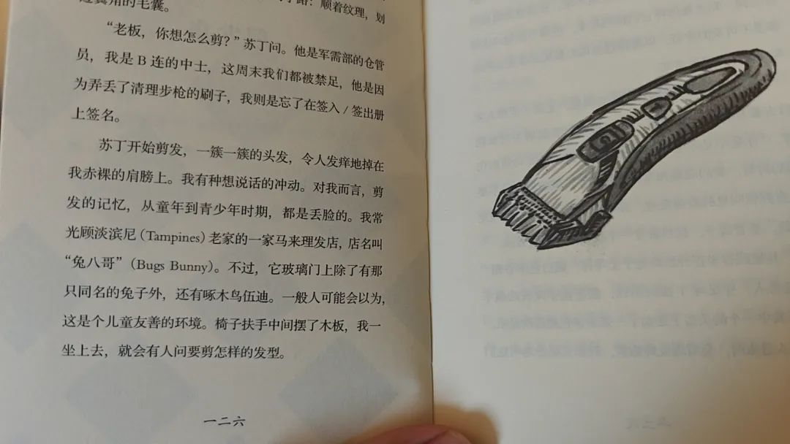
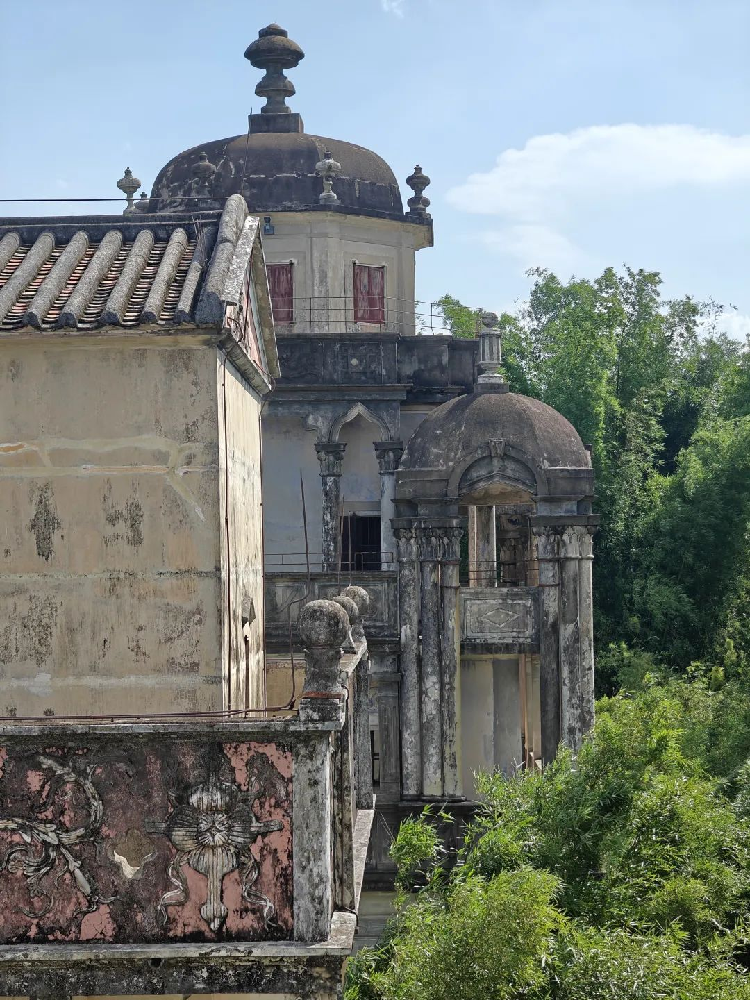

本文是张衔瑜第353篇推文

共计2637个字，44张图

上周宣称要读完的『十三邀』并没有读完。因为周五紧急开拔大湾区。

在深圳清湖的酒店里，和Master Jody的一次晨读中读完了『马来素描』是一个新加坡的马来族写的事关马来族如何在新加坡生存的微小说合集。也是迦梨计划的书。

以往读有关新加坡的内容，要么读的是新加坡华人、要么是一些大陆华人去新加坡后写的。这本马来素描是第一次读到马来族写有关新加坡民族融合，作者亚非言，译者是马来西亚的华人(不得不说大马华人的中文行文完全没有收到国籍的限制)

这本书读着读着就让人想起戴着宋谷帽的马来人。在意识到华人有向英语语言的让渡时，马来族也遇到了一样的语言忘却问题。只不过我们一直会对本民族人的用语和遣词造句的出入更敏感，并不意味着其他族裔在民族融合中不会遇到类似的问题。

民族融合时的种种困境，说到底是文化之争。好朋友Jayden对新加坡的民族融合中的文脉很感兴趣，于是把这本书送给了登登当出行礼物。

睡前阅读读完了一本『室内流亡』，是一本诗集。诗集也可以不用太风花雪月。至少取物象时，完完全全可以用现代城市生活方式所涉及的方面来处分下笔物象。

我认为这对的。于是送给了新朋友Aoki

还读了一本很绿老头的书。以至于读这本书的时候，感觉很多遣词造句完全就像一个拿着我的公众号内容训练了大模型，然后在特定主题下进行生成的模样。

『体内火焰』作者陈思安。看作者介绍，在话剧舞台上已经有大量实践经验。可能我们爱搞话剧的人总这样。离题万里。

也是一些小篇章的合集。我很喜欢这篇用感受来讲偷子的文章。我应该会把这本书一直保留，因为很多页翻开，我也觉得可以接着这个话题往下写很多。

是我读完后会很受启发的书。灵感启发，思路打开，大脑褶皱抹平。

交稿完了这次读的三本书，可以接着谈大湾区的事了。也简单带过一下上一篇到这一篇中的长沙三天，每天都好像做了很多事。吃了一些饭。

工作间隙，芒种那会儿去了一趟李公庙(没想到也跟上工没两样)(看河对面正好也坐了一个人 :3 在照片里很有呼应感)

周五干完活，就去了大湾区。之所以标题没有题名留下尬走的足迹，是因为没有出门旅游的实感。

没有实感之处在于，好像就回着回着消息、上地铁了；回着回着消息，上高铁了；回着回着消息，在深圳的巴基斯坦肠粉店里坐着了。仿佛没有空间变换的感受，一个个事情处理过去，就移形换位到了大湾区。

图为中巴友谊长存的巴基斯坦肠粉店

跟凉茶店老板胡闹后，回房间开始上工。

因为还有更多活要干，于是和Jarvis取消了出门用餐的计划，改在房间里，节约更多的时间和人待在一起而不是在奔波上。

这次有点失策，还好补回来了。竟然犯了没带电脑适配器的错。还好深圳电子产品够多。

芒种后，作息变得规律了很多。早早睡，又早早自然醒。晨读过，在清湖溜达。很神奇的事情是，有缘相见的朋友也会扎堆出现。

就像一定会和清湖产生链接一样。

去吃了顿王忠圈。

在皮卡丘本丘那里得知，王忠圈、逍遥镇就是漯河胡辣汤的顶流。要不就得到方中山了。

我点了一只Python，菜蟒，然后在厨台上拦腰折断之。

边工作边跨过深中通道。

去了开平的赤坎，是一个华侨城。成利隆的沙姜鸡很好吃。和服务员讲普通话的沟通效率，不如直接对菜单上指指点点。

老少皆宜的餐厅里，观察到很多全家出动来吃饭，即使快中午一点也还是一座难求。新进门的外向人往往要被一路的乡亲夹道欢迎。让人回想到在长沙的老区里和长辈出门的局促，总要从一家门口唠到另一家门口。

家禽也是禽。

开平属于江门市。听说开平有一些碉楼，和Jody, Yuma一起上任鹅城——准备去让子弹飞的拍摄地。据说村落共同抵御外侮的格局也建成于清末民国初年。

除云南大理、印尼日惹是我去过并认定为不推荐朋友去的地方外，开平碉楼在的这个村落(而不是指开平全境)也被我认为是不推荐朋友去的地方。

存了很多图片，但感觉发出来有点过分。有一些是碉楼现任管理人员手写的，有些约莫是交于其他人做的野生口述史(记录水平我们先放下不谈)

因为太不合理，于是我给朋友打比方说『就像一只臭鼬，跑到人家里，然后放了个响屁』我离开了，大家都自在。

可以对比上图中的样子和这张图里的天色变化。不一会儿，整个村里下起了一片限定局域的雨。虽然没近身，但远处观望起来，村子的四周像龙吸水的天柱，蔚为壮观、精确制导。

在村子里偶遇了我自己(指现在的微信头像还是牛吃草时会顿一下的牛顿)

夜探中山。

一桌只要有人拿出电脑，我就也想拿出电脑。我拿出电脑，干多久的活就说不好了。

但海港城依然是好吃的，到底是中山市的精致粤菜顶流。

飞鸟也是禽。

杰登杰登，捷足先登。

中山还是太有内秀了，每次都会发现让人眼前一亮的馆子。这下谁不心存疑惑，到底中山人民每天吃多少？

图摄于爱群早茶店，人气极旺。灯光内饰配色恰是正派广东风格里的早茶店面风格。

心心心心

去中山博物馆了解了伶仃洋的历史。发现干什么都得跟够抽象的人一起玩才好玩。

也到孙中山纪念馆翠亨村接受一点熏陶。多苍劲有力的字和意：『革命尚未成功，同志仍需努力』

个人生活之上，孙文完全对得一名起理想主义者——有志与力又不随以止。不是在十字路口指挥交通转来转去，而是朝着认为正确的道路上走下去，一直走一直走。

去了崖口村佬少爷晚餐。脆皖鱼，好吃，据说是吃蚕豆长大的鱼。杰登严选。

崖口村的海也是杰登严选。在海边隔海相望深圳宝安机场的六边飞行，一个个亮点都代表飞机从深圳启航，飞向世界各地。

也许每架飞机也带着很多人的理想。图中简单的一条灯带，就是深中通道的大桥。

见了一位很理想主义的创业前辈。之前2018年在科发过一个社会奖学金，我拿了其中一份。基金会赠了一些加盖章的书给大家，也是我上个月赠书时 唯一一组另盖了一个章的书。

重新定位一些状态。

科里的先锋，应该是传承了工科精神里把图纸转为工件的执行力与品控，外加思辨逻辑和洞悉。算来算去，还是回到了王安石的游褒禅山记，有志与力，又不随以止。

要兼顾的事太多了。没有什么不是不能一下把事情击垮的。太多人净想着拿着摧毁的锤子，随处找可以冒尖的事出来然后抡上一下，然后靠着要砸不砸的锤子挣钱。

世界总是很荒谬的，才觉得事和人有定准。

