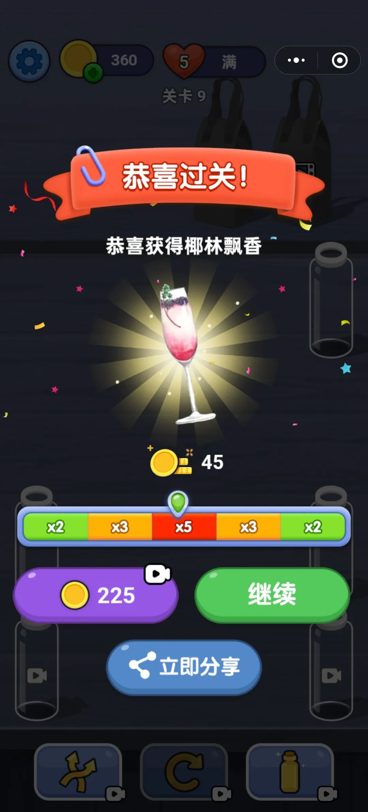
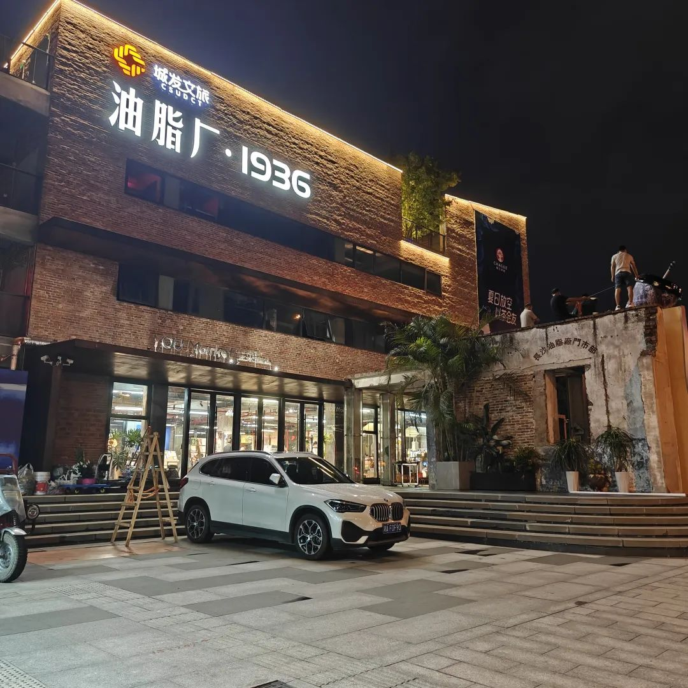
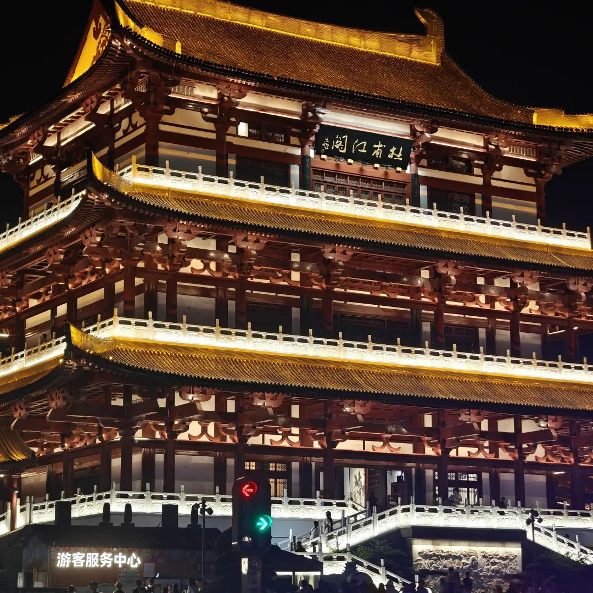
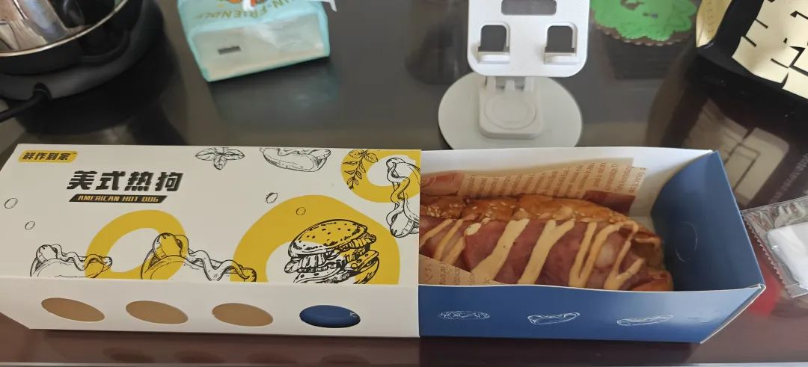
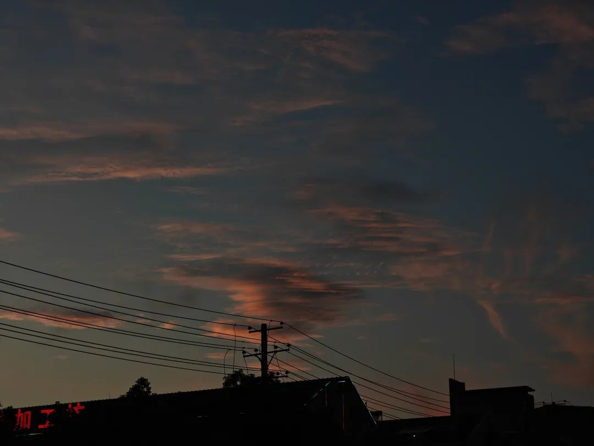
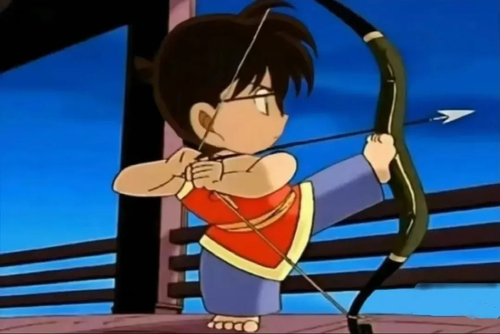

本文是张衔瑜第360篇推文

共计1207个字，8张图

本来想把360这个编号留给八周年的，不过361也不错。八周年也是一笔烂账。从开始只有两千字，现在已经缝缝又补补写到九千多字了。如果不是我自己手打的而且机器一般不会出现字数统计上的差错，否则很难相信每天要说出多少废话。

比较想摘抄下来最近在『资本论』里读到的话，于是有了这一篇：

资本家知道，一切商品，不管它们多么难看、多么难闻，在信仰和事实上都是货币，并且是把货币变成更多货币的奇妙手段。

看完第六章了。

下一章是第七章『剩余价值率』

看得也是真的慢。

不想写书评就写影评呗。(其实都不想写)

今晚去看了一部电影，陈佩斯导演编剧的『戏台』我觉得还不错，作为编剧可以把人物形象在自己的统筹调度里包圆了。

美学性很浓，人人都是在自我认知里给舞台上搬上一幕大戏。规则都是为执拗让步，而执拗是拜经历和认识所赐。主流和小众的区别只在圈地自萌的人多少。怎么治疏？这问题抛给有视野又有技术的人去想。

出电影院就碰到查酒驾的。我自然没喝酒。但免不了停好车后想去喝一杯。最后没去。

标题Perplexity指代的 大语言模型中的困惑度。很多人现在想把人工智能就等同于大语言模型。笑。大语言模型是实现路径之一。

之前提到过，大语言模型本质上是象征着逻辑的超参数层(代码)，加上概率论的抽样选词。困惑度指向后者。现在看到的网页版大语言模型也是一个字一个字地跳出来，本质上是在根据词库里蒸馏训练出的语料，来一个个预测后面该说什么话。至于下一个词怎么说，该说哪个词，这里就是困惑度。

下个词该说什么呢？说这个词的时候有亲疏远近地想起过去说的话吗？

所以我拿困惑度作为这一篇的标题。

控制不了的环境噪声一再影响着主体性。有点像我这几天在看的阿肯色州缉捕分析，前车客体如果comparatively过重、则后车主体无法利用牵引来绑定。

害。看来看去都一样。

为了强制岔开思路，玩了半个小时小游戏。获得了一杯椰林飘香。

最近长沙大雨很多，每天时不时就要来一阵。和杀手在浏阳河边小坐，溜达着，也 变清醒了些。

又一天眼见大雨要来，急忙戴上隐形下楼，连手机也都装进了防水袋。走出门却不下雨了。在鸭子铺桥下听划龙舟的人打了一分钟鼓。怎么不跟神霄派的人学学风雷鼓跟祖庭请一下愿？遂离去。

左眼感觉隐形时隐时现。就像脑雾少隐而常现一样。溜达到了灵官渡。看了看油脂厂原址上新建的片区。没什么意思，因为什么都没有。

杜甫江阁人还是很多。赶紧离开。

和好朋友们在北辰玩飞行棋和大富翁。解决情绪很重要。解决完情绪就解决一下信息，比如去哪吃个早饭。

看了一些道奇地狱猫的视频，主播总在说甜甜圈。搞得人突然想吃点pizza或者热狗🌭，于是像庞麦郎一样说『这是梦的，这不是真』醒来觉得还是得吃，于是下了一单。

都不够我看完一期小约翰的视频。

最近拍了一些好看的云。也不怎么好看，就是看到了打算拍下来。放上了，又删掉了一些。有什么好看的呢(摊手)

想去听08.08的长沙本能实业。

把生活缝合起来。结果缝成了下图(第一眼看的时候甚至没有多少违和感)

