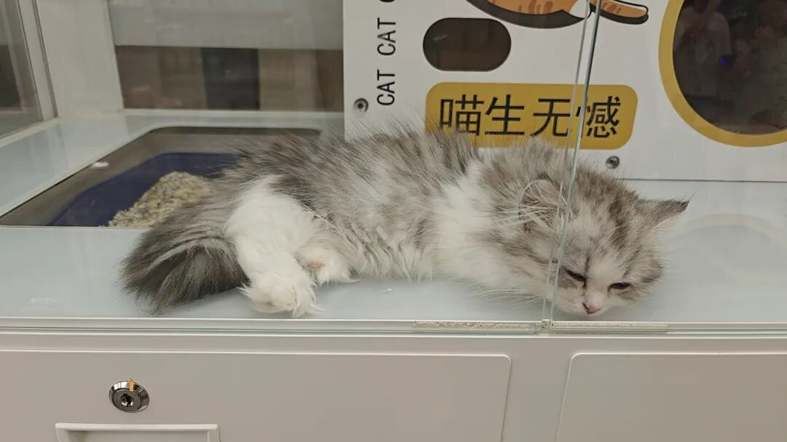

本文是张衔瑜第370篇推文

共计2850个字，14张图

坍缩的同时伴随着溶解。一个状态被观测，观测意味着坍缩，坍缩指向溶解。

状态在溶解。因为观测了。

上一周的周记没写。无事，这一周补起来。最近每天醒了就在干活，吃饭五分钟解决。已经快忘记非虚拟世界的事了。仿佛每天挂在网上。

可能是一种奇怪的焦虑。所以才会一直挂在网上。好在的确有一些产出。尽管我总是指手画脚的那个人，至少有半蠢不蠢、只要给token就忠心耿耿的AI模型。跟AI过算了。

AI还能帮我整理文章。上次的文章编号还是错了。现在对了，这是第370篇。

背后骂人固然不好。

但当面骂人更让人受不了。

媚俗也是媚雅。

好了又拖了一周。张衔瑜啊张衔瑜，今年的周更习惯难道要在9月断开乎？

这周在读《单读33：多谈谈问题》谈了很多好问题。环保、优绩主义。这一本可能是我看这么多本单读以来，最喜欢的一本。

这周还在西西弗书店等人的时候，看了几页罗翔今年新作序的《刑法学讲义》，只看了序和最后页。摘抄了一段话：

在利益导向的世界，很多人不再认为存在真理，在他们眼中只有利益，而无正义。他们人生唯一的信条就是利益最大化，“天下熙熙皆为利来，天下攘攘皆为利往”。所谓“没有永远的朋友，只有永远的利益”，人际交往的目的就在于寻找人脉。人被物化为资源。在这些人看来，法律不过只是保护利益的一种工具，与正义无关。然而，人的利益取决于其价值观（value），人们常见的错误就是混淆利益与价值观的关系。人类的利益依赖于其价值观，而不是价值观依赖于利益。如果认为人根据利益来确定其价值观，那是动物世界的法则，而非人类社会的规则。一如孔子所言：“君子喻于义，小人喻于利。”我始终认为，法律并非纯粹利益权衡的工具，它依然要追求公平和正义，满足人心深处对公义价值观的渴望。

我觉得这很对。不管谈何种利益，其背景都有我们认定这件事有利。所以在具体认定上，是价值观先行。而如果是建筑价值观的方式，这是靠不同先导利益来互相交流。

是需要反思我们如何建造构筑利益了。不然，只会一切逻辑都正确，最后的行动是掐了鲁迅的烟。

我去办了一些版权登记。

我还蛮喜欢的。给自己的创作经历进行锚定。可以是一个奖项，也可以一段登记证书。今天打电话给了版权登记中心的人，明天去领纸质证书。

以前觉得，信息的东西，不管是算卦还是其他的理性咨询，都是只要准了就好。

比如一个人来诊病，你说，吃点西瓜。对方真的去吃了点西瓜，病好了。回头不管谁说，你都可以自辩“就说好没好吧，好了就行！”

现在觉得不能这样。这只是一个医生、卦师的一厢情愿。陈寅恪说：“同情之理解。”会有高于信息之上的内容，不由二元论的“信息/情绪”相左。

罗翔的书里也提到了这一点：

布利丹毛驴效应,说的就是一只完全理性的驴恰处于两堆等量等质的 干草中间将会饿死，因为它不能对究竟该吃哪一堆干草做出任何理性的决 定。因此，由知识而带来的理性需要节制。不少法律人都带有一种强烈的 识傲慢，却不愿意为了法治的理想伤及自己的一点利益。

这么一想，即使是信息，也未必能接收。我理解的是一种耗损。修剪苗圃里 “口诀是南不留上，北不留下，东不留低，西不留高，去直留斜，大枝亮膛，小枝闹嚷” 记一下重点。东南西北，一个不留。

一味地信息增加，无非增添的是声量。增添声量并非增添逻辑。这值得警醒。

最近碰到有人给我发消息。我没回(在忙别的事，比如睡眠)。看完下来，发现最后竟然问题已经解决了。我说，这不对，我成什么信仰标志了，谁来，说完话，就自动把问题解决了。这不好。立生祠的话，死得太不光彩了。建议是打开我的聊天框就得付款(笑)

佛门也犯世俗里的错。究其根本，也许本就是世俗中的事，只不过披了佛门的袈裟。

初代打工人会对打工赋魅，就像初代使用工业品的人会攒塑料袋。到了二代就不会了。因为这是初代，是初代借以辨识自己和其他人的生物标志物。当这种标志物溶解在社会里了之后，标志物便再也不能区分这个人了。二代于是开始寻找新的标志物，直到自己成为初代。

这就是为什么，社会会存在一代又一代人的思维导图：上一代是成家立业，这一代是活出你自己。变来变去，说是社会主旋律。怪不得鲁迅要夜里翻书。

骄兵必败，败兵必哀，哀兵必胜，胜兵必骄。如此生活三十年，直到松软可口。

明天要跟以前一起换着学习机看玄幻小说的朋友会面。玄幻小说嘛，无非中学时代看的唐家三少、天蚕土豆、辰东、血红。回头想起最近看的书，以及我的人类学研究肇始。突然有点警觉：

原来玄幻小说，讲的就是优绩主义。

优质本身没有错。优绩主义不等于倒向劣质。我理解的是名位相称。而这种相称有共识标准。最后是社会生产力发展阶段的共识。

可以对易的操作，意思是交换。跟一个搞玄学的朋友说，如果人有那种有声有色有缘分的善良，也许是等到自己六十岁的时候，把一生中最大的遗憾和快乐，都存档给下一个甲子对应生辰的人。

因为朋友搞玄学，我默认这位朋友认可玄学的现实指导意义。也就是我比喻的，算命就像查征信。去找和自己同年庚的人，是互相校正。而找到下一个甲子同八字的人，也许是給对方的慰藉。我认为这是一种善良。

很可惜，八字并不是严格六十年就会再出现一次。有时候是一百二十年，有时候是一百八十年。想积累这等数据，需要先有认同，尔后有传承，最后有缘分。

我提了一点：在说命理学的时候，朋友首先就已经有时空的概念了。至少认可了时空是连续的，已经认为时空不坍缩不溶解，被人类捕获的信息就是事实信息。时空有先后。可是时空有先后吗？

麻布袋绣花。

——一句长沙谚语。

在网上邻居的公众号看到一句话：

『 停止过度放大“思考”在决策中的作用——行动，让环境的反馈（代替心智）去决策。 』

我理解这是对过虑者的救赎。心智决策，无论于情于理，最后都要落到环境上。环境才是和主体同级别的概念，主体下面采用于情、于理。

所以我还是想找大师给我理一遍有关我说预测过剩而验证稀缺的这件事。很多有差别的概念，最终让语言语义变得模糊不清。这不好。

好的是最近的胡思乱想写了邮件来表达。坏的是，邮件被我一个凌晨手滑而没保存下来。这很坏了，让人一下子吓得清醒了。

上次开始就没怎么谈生活。这次来谈谈生活。

生活还是不错的。

去看了《坏蛋联盟2》，说要看看第一部，但是没有看(也是没有去找资源的意思)(待办事项已经收得比鹅城的税还远了)

吃个甜品先

七夕和铁子们去了猫鱼辣椒，才知道小林子冲开了这么有意思的艺术街区。很妙，会在外摆的地方放蜡笔小新。为我们的友谊干杯🍻

又去长沙北站吃了一次角落湾。老长沙的记忆会有很多那一代的共识。发展太快的地方，共识容易消弭。谈不上好坏。因为人似乎只能接受？

有朋自远方来。来了就补补。

我只能看到我视角里的世界。白沙井我去了那么多次，这次远方朋友说：猪被挂到墙上了。

微信名叫刘顿之后，已经两次被人直接说『诶是本家噢』或者『刘博士好，幸会幸会』卯金刀就卯金刀吧。生活增添一点乐子不是也蛮好。

小猫知道自己是小猫吗？如果不接受自己是小猫呢？人又怎么知道自己是人呢？

粉是粉

虾是虾

肝不是肝 (这会儿姓颜)

大象画蚂蚁🐜

龙卷

风🌪️🌪️🌪️🌪️

摧毁 (到底为什么)

停车🅿️🅿️🅿️🅿️

场
