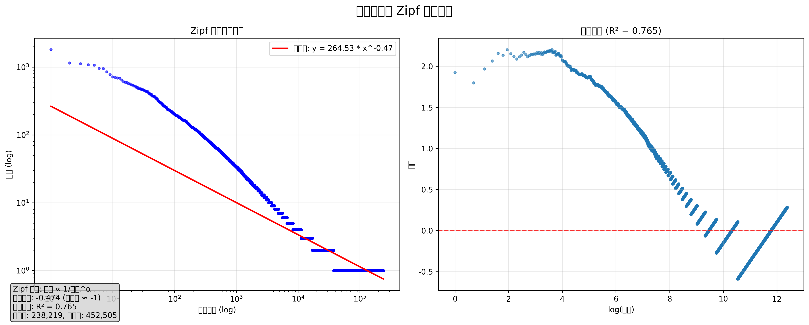

# 中文语料分析报告

## ⚙️ 分析参数

- **语料目录**: /home/runner/work/scrape-my-wechat-official-account/scrape-my-wechat-official-account/Wechat-Backup/文不加点的张衔瑜
- **TF-IDF 参数**: min_df=5, max_df=0.85
- **N-gram 长度**: 2
- **每年关键词数**: 50

## 📊 语料概览

- **总文章数**: 368
- **总词汇数**: 238,219
- **总词频**: 452,505
- **年份范围**: 2017 - 2025
- **覆盖年数**: 9 年

## 🔥 整体高频词汇 (Top 50)

| 排名 | 词汇 | 频次 |
|------|------|------|
| 1 | 时候 | 1,812 |
| 2 | 就是 | 1,150 |
| 3 | 一些 | 1,125 |
| 4 | 我们 | 1,082 |
| 5 | 觉得 | 1,068 |
| 6 | 不是 | 958 |
| 7 | 知道 | 952 |
| 8 | 现在 | 851 |
| 9 | 生活 | 779 |
| 10 | 地方 | 718 |
| 11 | 看到 | 705 |
| 12 | 一样 | 691 |
| 13 | 这样 | 688 |
| 14 | 这些 | 646 |
| 15 | 只是 | 608 |
| 16 | 开始 | 599 |
| 17 | 朋友 | 593 |
| 18 | 于是 | 574 |
| 19 | 事情 | 564 |
| 20 | 很多 | 549 |
| 21 | 一点 | 546 |
| 22 | 感觉 | 528 |
| 23 | 出来 | 525 |
| 24 | 时间 | 505 |
| 25 | 这里 | 503 |
| 26 | 他们 | 483 |
| 27 | 张衔 | 481 |
| 28 | 长沙 | 481 |
| 29 | 不会 | 470 |
| 30 | 还有 | 464 |
| 31 | 也许 | 463 |
| 32 | 一下 | 455 |
| 33 | 问题 | 447 |
| 34 | 的话 | 446 |
| 35 | 虽然 | 437 |
| 36 | 起来 | 433 |
| 37 | 东西 | 433 |
| 38 | 最近 | 413 |
| 39 | 那么 | 411 |
| 40 | 一种 | 401 |
| 41 | 不能 | 399 |
| 42 | 有些 | 399 |
| 43 | 这么 | 377 |
| 44 | 一次 | 376 |
| 45 | 这种 | 375 |
| 46 | 一起 | 371 |
| 47 | 真的 | 369 |
| 48 | 最后 | 366 |
| 49 | 共计 | 355 |
| 50 | 一直 | 348 |

## 🎨 整体词云

## 📅 年度词频分析

### 2017 年

**高频词汇 (Top 20)**:

| 排名 | 词汇 | 频次 |
|------|------|------|
| 1 | 我们 | 139 |
| 2 | 时候 | 93 |
| 3 | 奶茶 | 88 |
| 4 | 就是 | 72 |
| 5 | 只是 | 69 |
| 6 | 这样 | 62 |
| 7 | 现在 | 59 |
| 8 | 张衔 | 57 |
| 9 | 实验 | 57 |
| 10 | 出来 | 54 |
| 11 | 看到 | 52 |
| 12 | 不是 | 49 |
| 13 | 还有 | 48 |
| 14 | 雅礼 | 48 |
| 15 | 他们 | 47 |
| 16 | 不会 | 47 |
| 17 | 进行 | 47 |
| 18 | 觉得 | 44 |
| 19 | 今天 | 43 |
| 20 | 有些 | 42 |

**2017 年词云**:

### 2018 年

**高频词汇 (Top 20)**:

| 排名 | 词汇 | 频次 |
|------|------|------|
| 1 | 时候 | 207 |
| 2 | 这些 | 127 |
| 3 | 知道 | 118 |
| 4 | 一些 | 113 |
| 5 | 地方 | 106 |
| 6 | 只是 | 104 |
| 7 | 就是 | 102 |
| 8 | 不是 | 98 |
| 9 | 事情 | 93 |
| 10 | 这样 | 92 |
| 11 | 看到 | 90 |
| 12 | 觉得 | 86 |
| 13 | 张衔 | 80 |
| 14 | 现在 | 78 |
| 15 | 长沙 | 76 |
| 16 | 开始 | 73 |
| 17 | 生活 | 73 |
| 18 | 时间 | 66 |
| 19 | 一点 | 64 |
| 20 | 一样 | 63 |

**2018 年词云**:

### 2019 年

**高频词汇 (Top 20)**:

| 排名 | 词汇 | 频次 |
|------|------|------|
| 1 | 时候 | 499 |
| 2 | 就是 | 308 |
| 3 | 生活 | 303 |
| 4 | 知道 | 276 |
| 5 | 我们 | 274 |
| 6 | 不是 | 268 |
| 7 | 觉得 | 261 |
| 8 | 这样 | 207 |
| 9 | 一些 | 205 |
| 10 | 现在 | 186 |
| 11 | 一样 | 179 |
| 12 | 只是 | 177 |
| 13 | 这些 | 174 |
| 14 | 一点 | 171 |
| 15 | 事情 | 168 |
| 16 | 的话 | 150 |
| 17 | 他们 | 143 |
| 18 | 那么 | 142 |
| 19 | 看到 | 141 |
| 20 | 不会 | 141 |

**2019 年词云**:

### 2020 年

**高频词汇 (Top 20)**:

| 排名 | 词汇 | 频次 |
|------|------|------|
| 1 | 时候 | 121 |
| 2 | 我们 | 99 |
| 3 | 生活 | 77 |
| 4 | 张衔 | 64 |
| 5 | 推文 | 63 |
| 6 | 朋友 | 62 |
| 7 | 本文 | 61 |
| 8 | 共计 | 61 |
| 9 | 本文张衔 | 61 |
| 10 | 张衔推文 | 61 |
| 11 | 推文共计 | 61 |
| 12 | 一些 | 54 |
| 13 | 长沙 | 53 |
| 14 | 知道 | 52 |
| 15 | 现在 | 50 |
| 16 | 就是 | 49 |
| 17 | 觉得 | 46 |
| 18 | 不是 | 44 |
| 19 | 张图 | 43 |
| 20 | 他们 | 42 |

**2020 年词云**:

### 2021 年

**高频词汇 (Top 20)**:

| 排名 | 词汇 | 频次 |
|------|------|------|
| 1 | 时候 | 237 |
| 2 | 觉得 | 160 |
| 3 | 就是 | 153 |
| 4 | 一些 | 136 |
| 5 | 看到 | 128 |
| 6 | 地方 | 108 |
| 7 | 知道 | 108 |
| 8 | 不是 | 105 |
| 9 | 这里 | 94 |
| 10 | 于是 | 88 |
| 11 | 感觉 | 86 |
| 12 | 开始 | 86 |
| 13 | 现在 | 84 |
| 14 | 一样 | 82 |
| 15 | 我们 | 79 |
| 16 | 时间 | 76 |
| 17 | 这些 | 76 |
| 18 | 这样 | 73 |
| 19 | 还有 | 72 |
| 20 | 长沙 | 69 |

**2021 年词云**:

### 2022 年

**高频词汇 (Top 20)**:

| 排名 | 词汇 | 频次 |
|------|------|------|
| 1 | 时候 | 169 |
| 2 | 一些 | 113 |
| 3 | 觉得 | 102 |
| 4 | 我们 | 91 |
| 5 | 知道 | 86 |
| 6 | 就是 | 77 |
| 7 | 现在 | 72 |
| 8 | 不是 | 64 |
| 9 | 事情 | 63 |
| 10 | 开始 | 63 |
| 11 | 这里 | 62 |
| 12 | 时间 | 61 |
| 13 | 一样 | 58 |
| 14 | 长沙 | 57 |
| 15 | 朋友 | 55 |
| 16 | 地方 | 54 |
| 17 | 感觉 | 52 |
| 18 | 于是 | 47 |
| 19 | 这样 | 45 |
| 20 | 看到 | 44 |

**2022 年词云**:

### 2023 年

**高频词汇 (Top 20)**:

| 排名 | 词汇 | 频次 |
|------|------|------|
| 1 | 时候 | 159 |
| 2 | 就是 | 159 |
| 3 | 一些 | 127 |
| 4 | 我们 | 109 |
| 5 | 觉得 | 94 |
| 6 | 不是 | 92 |
| 7 | 东西 | 73 |
| 8 | 知道 | 73 |
| 9 | 这些 | 68 |
| 10 | 一样 | 68 |
| 11 | 现在 | 66 |
| 12 | 地方 | 66 |
| 13 | 比如 | 62 |
| 14 | 这种 | 61 |
| 15 | 看到 | 60 |
| 16 | 朋友 | 59 |
| 17 | 出来 | 56 |
| 18 | 不同 | 55 |
| 19 | 只是 | 53 |
| 20 | 于是 | 52 |

**2023 年词云**:

### 2024 年

**高频词汇 (Top 20)**:

| 排名 | 词汇 | 频次 |
|------|------|------|
| 1 | 时候 | 238 |
| 2 | 觉得 | 174 |
| 3 | 我们 | 163 |
| 4 | 一些 | 158 |
| 5 | 就是 | 143 |
| 6 | 朋友 | 141 |
| 7 | 于是 | 136 |
| 8 | 现在 | 135 |
| 9 | 知道 | 132 |
| 10 | 不是 | 125 |
| 11 | 地方 | 111 |
| 12 | 一样 | 110 |
| 13 | 感觉 | 98 |
| 14 | 看到 | 97 |
| 15 | 生活 | 92 |
| 16 | 也许 | 92 |
| 17 | 新加坡 | 89 |
| 18 | 这样 | 86 |
| 19 | 很多 | 86 |
| 20 | 东西 | 85 |

**2024 年词云**:

### 2025 年

**高频词汇 (Top 20)**:

| 排名 | 词汇 | 频次 |
|------|------|------|
| 1 | 一些 | 181 |
| 2 | 现在 | 121 |
| 3 | 不是 | 113 |
| 4 | 也许 | 104 |
| 5 | 觉得 | 101 |
| 6 | 很多 | 100 |
| 7 | 朋友 | 94 |
| 8 | 时候 | 89 |
| 9 | 就是 | 87 |
| 10 | 我们 | 83 |
| 11 | 于是 | 80 |
| 12 | 生活 | 79 |
| 13 | 知道 | 65 |
| 14 | 一样 | 62 |
| 15 | 最近 | 61 |
| 16 | 时间 | 61 |
| 17 | 本书 | 60 |
| 18 | 地方 | 57 |
| 19 | 不同 | 55 |
| 20 | 这样 | 55 |

**2025 年词云**:

## 📈 Zipf 定律分析

根据 Zipf 定律，词频与其排名呈反比关系（f ∝ 1/r^α）。理想情况下，拟合斜率应接近 -1。

**解读**: 语言风格体现了典型的长尾分布特征，少数高频词承载主要语言信息，大量低频词丰富表达的细节和个性。

---

*报告生成时间: 2025-08-29 01:58:53*
