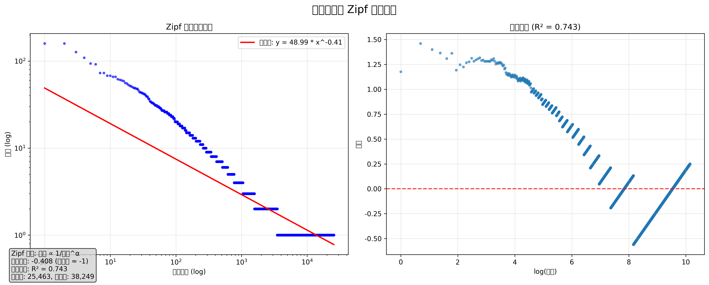

# 中文语料分析报告

## 📊 语料概览

- **总词汇数**: 25,463
- **总词频**: 38,249
- **年份范围**: 2023 - 2023
- **覆盖年数**: 1 年

## 🔥 整体高频词汇 (Top 50)

| 排名 | 词汇 | 频次 |
|------|------|------|
| 1 | 时候 | 159 |
| 2 | 就是 | 159 |
| 3 | 一些 | 127 |
| 4 | 我们 | 109 |
| 5 | 觉得 | 94 |
| 6 | 不是 | 92 |
| 7 | 东西 | 73 |
| 8 | 知道 | 73 |
| 9 | 这些 | 68 |
| 10 | 一样 | 68 |
| 11 | 现在 | 66 |
| 12 | 地方 | 66 |
| 13 | 比如 | 62 |
| 14 | 这种 | 61 |
| 15 | 看到 | 60 |
| 16 | 朋友 | 59 |
| 17 | 出来 | 56 |
| 18 | 不同 | 55 |
| 19 | 只是 | 53 |
| 20 | 于是 | 52 |
| 21 | 一点 | 51 |
| 22 | 最近 | 50 |
| 23 | 这里 | 49 |
| 24 | 语言 | 49 |
| 25 | 他们 | 48 |
| 26 | 虽然 | 48 |
| 27 | 感觉 | 46 |
| 28 | 好像 | 44 |
| 29 | 问题 | 44 |
| 30 | 生活 | 43 |
| 31 | 内容 | 43 |
| 32 | 事情 | 42 |
| 33 | 这样 | 42 |
| 34 | 一种 | 41 |
| 35 | 一起 | 40 |
| 36 | 彭蕤 | 39 |
| 37 | 很多 | 39 |
| 38 | 的话 | 37 |
| 39 | 抽象 | 37 |
| 40 | 有些 | 35 |
| 41 | 开始 | 34 |
| 42 | 起来 | 34 |
| 43 | 不能 | 33 |
| 44 | 长沙 | 33 |
| 45 | 描述 | 33 |
| 46 | 一直 | 32 |
| 47 | 今天 | 32 |
| 48 | 完全 | 31 |
| 49 | 进行 | 31 |
| 50 | 方式 | 31 |

## 🎨 整体词云

## 📅 年度词频分析

### 2023 年

**高频词汇 (Top 20)**:

| 排名 | 词汇 | 频次 |
|------|------|------|
| 1 | 时候 | 159 |
| 2 | 就是 | 159 |
| 3 | 一些 | 127 |
| 4 | 我们 | 109 |
| 5 | 觉得 | 94 |
| 6 | 不是 | 92 |
| 7 | 东西 | 73 |
| 8 | 知道 | 73 |
| 9 | 这些 | 68 |
| 10 | 一样 | 68 |
| 11 | 现在 | 66 |
| 12 | 地方 | 66 |
| 13 | 比如 | 62 |
| 14 | 这种 | 61 |
| 15 | 看到 | 60 |
| 16 | 朋友 | 59 |
| 17 | 出来 | 56 |
| 18 | 不同 | 55 |
| 19 | 只是 | 53 |
| 20 | 于是 | 52 |

**2023 年词云**:

## 📈 Zipf 定律分析

根据 Zipf 定律，词频与其排名呈反比关系（f ∝ 1/r^α）。理想情况下，拟合斜率应接近 -1。

**解读**: 语言风格体现了典型的长尾分布特征，少数高频词承载主要语言信息，大量低频词丰富表达的细节和个性。

---

*报告生成时间: 2025-08-29 01:40:52*
