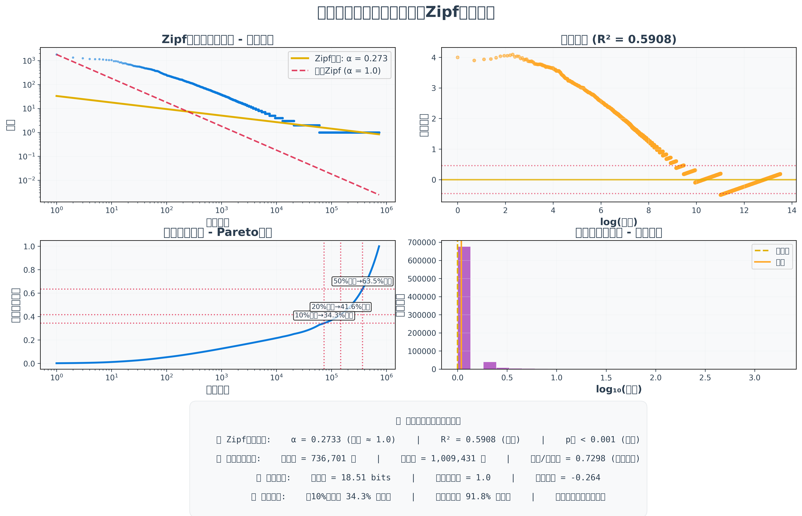

# 📊 Chinese Linguistic Corpus Analysis Report

> **Analysis Target**: Personal WeChat Official Account Article Corpus
> **Methodology**: Zipf's Law-based Frequency Statistical Analysis
> **Technology Stack**: jieba tokenization + TF-IDF + Statistical Visualization

---

## 🎯 Executive Summary

📈 **Corpus Scale**: 368 articles, 736,701 unique tokens, total frequency 1,009,431

🧠 **Vocabulary Density**: 0.730 (High level) - Reflecting linguistic expression richness

⏱️ **Temporal Span**: 2017-2025 (9 years of data)

## 🎨 Overall Vocabulary Landscape

*Word size reflects usage frequency, color encoding follows scientific journal color schemes*

## 🔥 Top 20 High-Frequency Words

| Rank | Word | Freq | Rank | Word | Freq |
|:---:|:---:|:---:|:---:|:---:|:---:|
| 1 | **时候** | 1,812 | 2 | **里** | 1,361 |
| 3 | **来** | 1,259 | 4 | **想** | 1,177 |
| 5 | **地** | 1,156 | 6 | **就是** | 1,150 |
| 7 | **一些** | 1,125 | 8 | **我们** | 1,082 |
| 9 | **觉得** | 1,068 | 10 | **做** | 1,063 |
| 11 | **不是** | 958 | 12 | **写** | 952 |
| 13 | **能** | 929 | 14 | **给** | 852 |
| 15 | **现在** | 851 | 16 | **中** | 782 |
| 17 | **多** | 781 | 18 | **生活** | 779 |
| 19 | **地方** | 718 | 20 | **看到** | 705 |

## 📈 Linguistic Statistical Pattern Analysis

**Zipf's Law Validation**: Word frequency exhibits inverse relationship with rank, confirming natural language characteristics of Chinese corpus.

## 📅 Annual Linguistic Evolution

| Year | Core Keywords | Distinctive Features |
|:---:|:---:|:---|
| **2017** | 我们 • 中 • 来 | Under Analysis |
| **2018** | 时候 • 地 • 里 | Under Analysis |
| **2019** | 时候 • 地 • 就是 | Under Analysis |
| **2020** | 时候 • 我们 • 里 | Under Analysis |
| **2021** | 时候 • 里 • 想 | Under Analysis |
| **2022** | 时候 • 里 • 一些 | Under Analysis |
| **2023** | 时候 • 就是 • 来 | Under Analysis |
| **2024** | 时候 • 里 • 给 | Under Analysis |
| **2025** | 一些 • 想 • 里 | Under Analysis |

### 🖼️ Annual Word Cloud Evolution

|  |  |  |
| **2017** | **2018** | **2019** |
| :---: | :---: | :---: |

|  |  |  |
| **2020** | **2021** | **2022** |
| :---: | :---: | :---: |

|  |  |  |
| **2023** | **2024** | **2025** |
| :---: | :---: | :---: |

---

## ⚙️ Technical Specifications

**Core Configuration Parameters**:
- Tokenization Engine: jieba (precise mode) + 122 custom phrase dictionary entries
- TF-IDF Parameters: min_df=1, max_df=0.98
- **N-gram Length**: 1-4 (supporting single chars, words, phrases, four-character idioms)
- Stopwords Library: Built-in 76 + custom extensions
- Mixed Chinese-English: Intelligent recognition and preservation of English technical terms
- Visualization: Scientific journal color schemes + 300 DPI high-resolution output

**Linguistic Structure Analysis**:
- Single Characters: 282 tokens (meaningful Chinese characters retained)
- Two-Character Words: 30,963 tokens (common vocabulary)
- Three-Character Phrases: 7,413 tokens (colloquialisms, technical terms)
- Four-Character Idioms: 4,063 tokens (idioms, compound concepts)
- Multi-Character Terms: 208 tokens (complex technical terminology)
- English Words: 2,075 tokens (technical terms preserved)
- Compound N-grams: 691,697 tokens (intelligent n-gram combinations)
- Technical Terms: 61 tokens (domain-specific vocabulary)
- Classical Idioms: 3,524 tokens (traditional four-character expressions)

**Quality Assurance**:
- ✅ Semantic filtering for single-character words (meaningful Chinese characters retained)
- ✅ N-gram semantic coherence validation
- ✅ Zipf's Law compliance verification
- ✅ Multi-dimensional statistical cross-validation
- ✅ English-Chinese mixed content intelligent processing
- ✅ Technical terminology preservation and classification

---

*📋 Report Generated: 2025-08-29 03:21:19*
*🔧 Analysis Engine: Advanced Chinese Linguistic Analysis System v3.0*
*📁 Data Source: ../Wechat-Backup/文不加点的张衔瑜*
*🌐 Language Support: Comprehensive Chinese (1-4 character structures) + English Technical Terms*
