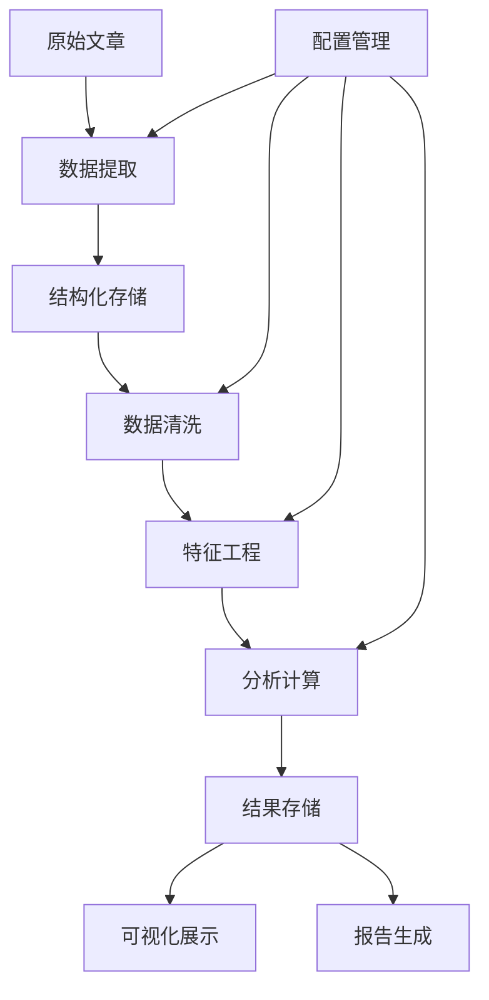
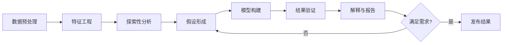

# 📚 项目方法论 (Methodology)

## 📋 目录

- [1. 概述](#1-概述)
- [2. 研究方法论](#2-研究方法论)
- [3. 技术方法论](#3-技术方法论)
- [4. 数据收集方法论](#4-数据收集方法论)
- [5. 分析方法论](#5-分析方法论)
- [6. 质量保证方法论](#6-质量保证方法论)
- [7. 伦理与隐私方法论](#7-伦理与隐私方法论)
- [8. 可持续发展方法论](#8-可持续发展方法论)

---

## 1. 概述

### 1.1 项目定位

本项目采用**混合研究方法论**，结合技术工具开发与人文社会科学研究，旨在构建一个完整的个人写作语料收集、保存、分析与再利用的系统。

### 1.2 核心理念

- **自反式研究** (Reflexive Research): 研究者即作者本人，通过技术手段对自身长期写作进行系统性回顾与分析
- **由浅入深** (Progressive Deepening): 从即时获得感的表层分析逐步深入到认知模式、价值观演化等深层研究
- **兴趣驱动** (Interest-Driven): 以研究者的兴趣和好奇心为导向，而非外部评价标准
- **技术赋能** (Technology-Enabled): 利用自然语言处理、数据可视化等技术手段辅助人文研究

### 1.3 研究对象

- **主要对象**: 个人公众号《文不加点的张衔瑜》2017-2025年累计80万字、近400篇文章
- **时间跨度**: 8年连续写作记录
- **内容特征**: 个人日记型公众号，涵盖生活感悟、学术思考、社会观察等多元主题
- **数据形态**: HTML、Markdown、JSON元数据、图片资源

---

## 2. 研究方法论

### 2.1 自反式个人社会现场研究

#### 2.1.1 理论基础

基于社会人类学的"田野调查"方法，将个人写作空间视为一个"社会现场"，通过长期观察与记录，形成对个人成长、社会变迁、价值观演化的深度理解。

#### 2.1.2 核心特征

- **双重身份**: 研究者既是观察者也是被观察者
- **时间维度**: 利用8年写作历程的时间深度
- **情境嵌入**: 每篇文章都嵌入在特定的时间、地点、社会情境中
- **关系网络**: 关注"自我-他者-情境"的三元关系

#### 2.1.3 研究层次

```
个体层次 → 关系层次 → 社会层次 → 时代层次
   ↓         ↓         ↓         ↓
内心对话   人际互动   社会参与   时代回应
情感变化   关系演化   价值判断   历史见证
```

### 2.2 混合研究设计

#### 2.2.1 定量研究组件

- **文本统计**: 词频分析、文本长度变化、主题分布
- **时间序列**: 写作频率、情感倾向的时间变化
- **网络分析**: 人物关系网络、概念共现网络
- **机器学习**: 主题建模、情感分析、写作风格识别

#### 2.2.2 定性研究组件

- **主题分析**: 对重要概念和价值观的深度阐释
- **叙事分析**: 个人成长故事的结构与演化
- **现象学分析**: 对生活体验和思想变迁的描述与理解
- **批判性分析**: 对社会现象和时代特征的反思

### 2.3 分阶段研究策略

#### 阶段1: 即刻获得感 (1-2周)
- **目标**: 快速获得可见成果，建立研究信心
- **方法**: 词频统计、年度盘点、主题词云
- **产出**: 直观的数据可视化与基础统计报告

#### 阶段2: 认知与成长挖掘 (2-3周)
- **目标**: 深入分析个人发展轨迹和认知模式
- **方法**: 情感分析、价值观提取、关系网络分析
- **产出**: 成长轨迹图谱与认知模式报告

#### 阶段3: 语义检索与RAG (2-3周)
- **目标**: 构建智能问答系统，实现语料的语义化检索
- **方法**: 向量化检索、知识图谱构建、RAG系统
- **产出**: 可交互的个人知识问答系统

#### 阶段4: 个性化模型训练 (3-4周)
- **目标**: 训练具有个人写作风格的语言模型
- **方法**: 小样本学习、LoRA微调、风格迁移
- **产出**: 个性化AI写作助手

---

## 3. 技术方法论

### 3.1 技术架构原则

#### 3.1.1 模块化设计
- **单一职责**: 每个模块专注特定功能
- **松耦合**: 模块间通过标准接口通信
- **可替换**: 支持算法和工具的灵活替换
- **可扩展**: 便于添加新功能和分析维度

#### 3.1.2 可复现性保证
```python
# 配置文件标准化
config = {
    "data_source": "Wechat-Backup/",
    "analysis_params": {
        "tokenizer": "jieba",
        "min_word_freq": 5,
        "max_features": 10000
    },
    "reproducibility": {
        "random_seed": 42,
        "version_control": True,
        "environment_snapshot": True
    }
}
```

#### 3.1.3 渐进式开发
- **最小可用产品** (MVP): 先实现核心功能
- **迭代增强**: 基于使用反馈持续改进
- **向后兼容**: 保证历史数据和分析结果的可用性

### 3.2 技术栈选择

#### 3.2.1 核心技术栈
```yaml
数据处理:
  - Python 3.9+
  - Pandas, NumPy
  - JSON Schema验证

自然语言处理:
  - jieba (中文分词)
  - pkuseg (备选分词)
  - scikit-learn (机器学习)
  - transformers (预训练模型)

可视化:
  - Matplotlib, Seaborn
  - WordCloud (词云生成)
  - Plotly (交互式可视化)
  - D3.js (复杂网络图)

Web界面:
  - Streamlit (快速原型)
  - Gradio (高级交互)
  - FastAPI (API服务)

存储与检索:
  - SQLite (结构化数据)
  - FAISS (向量检索)
  - Elasticsearch (全文搜索)
```

#### 3.2.2 工具链集成
```bash
# 开发环境
pip install -r requirements.txt
pre-commit install  # 代码质量检查

# 测试环境  
pytest --cov=analysis/  # 单元测试
pytest-benchmark  # 性能测试

# 生产环境
docker-compose up  # 容器化部署
```

### 3.3 数据流设计



---

## 4. 数据收集方法论

### 4.1 数据获取策略

#### 4.1.1 技术路径
```python
class DataCollection:
    """数据收集方法论的技术实现"""
    
    def __init__(self):
        self.rate_limiting = True  # 访问频率控制
        self.error_handling = True  # 错误恢复机制
        self.data_validation = True  # 数据质量校验
    
    def collect_with_ethics(self):
        """遵循伦理规范的数据收集"""
        return {
            "respect_platform_rules": True,
            "avoid_overload": True,
            "preserve_privacy": True
        }
```

#### 4.1.2 质量控制流程
1. **预检验证**: 确认目标文章的可访问性
2. **增量收集**: 只获取新增或更新的内容
3. **完整性检查**: 验证文本、图片、元数据的完整性
4. **重复性检测**: 自动识别并处理重复内容
5. **格式标准化**: 统一数据格式和编码

### 4.2 数据结构设计

#### 4.2.1 元数据标准
```json
{
  "article_id": "unique_identifier",
  "title": "文章标题",
  "publish_date": "2024-01-01T00:00:00Z",
  "url": "https://mp.weixin.qq.com/s/...",
  "content": {
    "html": "原始HTML内容",
    "markdown": "转换后的Markdown",
    "plain_text": "纯文本内容"
  },
  "metadata": {
    "word_count": 1500,
    "image_count": 5,
    "tags": ["生活感悟", "旅行"],
    "location": "北京",
    "mood": "positive"
  },
  "technical": {
    "collection_time": "2024-01-02T10:30:00Z",
    "source_version": "v1.2.0",
    "quality_score": 0.95
  }
}
```

#### 4.2.2 目录结构规范
```
Wechat-Backup/
├── 账号名称/
│   ├── YYYY/                    # 年份目录
│   │   └── YYYY-MM-DD_标题/     # 文章目录
│   │       ├── article.html     # HTML格式
│   │       ├── article.md       # Markdown格式
│   │       ├── meta.json        # 元数据
│   │       └── images/          # 图片资源
│   ├── _index/                  # 索引文件
│   │   ├── 目录.md             # 时间序列索引
│   │   └── 合集.md             # 主题分类索引
│   └── _state.json             # 收集状态记录
```

### 4.3 数据验证与质量保证

#### 4.3.1 多层级验证
```python
def validate_data_quality(article_data):
    """多层级数据质量验证"""
    checks = {
        "schema_validation": validate_json_schema(article_data),
        "content_integrity": check_content_completeness(article_data),
        "encoding_consistency": verify_text_encoding(article_data),
        "image_accessibility": validate_image_links(article_data),
        "metadata_accuracy": cross_check_metadata(article_data)
    }
    return all(checks.values())
```

#### 4.3.2 质量监控指标
- **完整性率**: 成功收集的文章比例
- **准确性率**: 元数据与实际内容的匹配度  
- **一致性率**: 数据格式的标准化程度
- **时效性率**: 数据收集的及时性

---

## 5. 分析方法论

### 5.1 多维分析框架

#### 5.1.1 语言学分析维度
```python
class LinguisticAnalysis:
    """语言学分析方法论"""
    
    dimensions = {
        "lexical": {           # 词汇层面
            "frequency": "词频统计",
            "diversity": "词汇多样性", 
            "growth": "词汇增长曲线",
            "collocation": "词语搭配"
        },
        "syntactic": {         # 句法层面
            "sentence_length": "句子长度分析",
            "complexity": "句法复杂度",
            "patterns": "句式模式识别"
        },
        "semantic": {          # 语义层面
            "topics": "主题建模",
            "sentiment": "情感分析",
            "concepts": "概念抽取",
            "relations": "语义关系"
        },
        "pragmatic": {         # 语用层面
            "discourse": "话语分析",
            "style": "写作风格",
            "register": "语域识别"
        }
    }
```

#### 5.1.2 时间序列分析
- **趋势分析**: 识别长期发展趋势
- **周期性检测**: 发现重复出现的模式
- **突变点识别**: 标记重要的转折时刻
- **季节性分析**: 分析季节或时期性特征

#### 5.1.3 网络关系分析
```python
def build_relation_networks(corpus):
    """构建多种关系网络"""
    networks = {
        "co_occurrence": build_word_cooccurrence_network(corpus),
        "semantic": build_semantic_similarity_network(corpus),
        "temporal": build_temporal_evolution_network(corpus),
        "social": extract_social_relation_network(corpus)
    }
    return networks
```

### 5.2 计算方法与算法选择

#### 5.2.1 基础统计方法
- **描述性统计**: 均值、中位数、标准差、分布形状
- **相关性分析**: Pearson、Spearman相关系数
- **假设检验**: t检验、卡方检验、ANOVA
- **回归分析**: 线性回归、逻辑回归、时间序列回归

#### 5.2.2 机器学习方法
```python
class MLAnalysis:
    """机器学习分析方法集合"""
    
    @staticmethod
    def unsupervised_methods():
        return {
            "clustering": ["KMeans", "DBSCAN", "HierarchicalClustering"],
            "dimensionality_reduction": ["PCA", "t-SNE", "UMAP"],
            "topic_modeling": ["LDA", "NMF", "BERTopic"],
            "association_rules": ["Apriori", "FP-Growth"]
        }
    
    @staticmethod  
    def supervised_methods():
        return {
            "classification": ["RandomForest", "SVM", "XGBoost"],
            "regression": ["LinearRegression", "Ridge", "LSTM"],
            "deep_learning": ["BERT", "GPT", "T5"]
        }
```

#### 5.2.3 可视化方法
- **统计图表**: 直方图、箱线图、散点图、热力图
- **时间序列图**: 折线图、面积图、多维时间图
- **网络图**: 力导向图、树状图、弦图
- **地理可视化**: 地图标记、热力地图、轨迹图
- **交互式图表**: 可缩放、可筛选的动态图表

### 5.3 分析流程标准化

#### 5.3.1 标准分析流程


#### 5.3.2 可复现性保证
- **版本控制**: 代码、数据、配置的版本管理
- **环境记录**: 完整的依赖和环境信息
- **随机种子**: 固定所有随机过程的种子
- **执行日志**: 详细记录每次执行的参数和结果

---

## 6. 质量保证方法论

### 6.1 多层次质量保证体系

#### 6.1.1 数据质量保证
```python
class DataQualityAssurance:
    """数据质量保证体系"""
    
    def __init__(self):
        self.validation_rules = self.load_validation_rules()
        self.quality_metrics = self.define_quality_metrics()
    
    def comprehensive_check(self, data):
        """全面质量检查"""
        return {
            "completeness": self.check_completeness(data),
            "accuracy": self.verify_accuracy(data),
            "consistency": self.ensure_consistency(data),
            "timeliness": self.validate_timeliness(data),
            "validity": self.check_validity(data)
        }
```

#### 6.1.2 分析质量保证
- **方法论验证**: 确保分析方法的科学性和适用性
- **结果一致性**: 不同方法得到的结果应该相互支持
- **统计显著性**: 确保统计结论的可靠性
- **效果量评估**: 不仅看统计显著性，也关注实际意义

#### 6.1.3 代码质量保证
```yaml
# .pre-commit-config.yaml
repos:
  - repo: https://github.com/psf/black
    rev: 22.3.0
    hooks:
      - id: black
  
  - repo: https://github.com/pycqa/flake8
    rev: 4.0.1
    hooks:
      - id: flake8
      
  - repo: https://github.com/pycqa/isort
    rev: 5.10.1
    hooks:
      - id: isort

  - repo: local
    hooks:
      - id: pytest
        name: pytest
        entry: pytest
        language: system
        pass_filenames: false
```

### 6.2 测试策略

#### 6.2.1 单元测试
```python
import pytest
from analysis.pipeline.tokenize import ChineseTokenizer

class TestChineseTokenizer:
    """中文分词器单元测试"""
    
    @pytest.fixture
    def tokenizer(self):
        return ChineseTokenizer()
    
    def test_basic_tokenization(self, tokenizer):
        text = "我今天去了北京大学"
        tokens = tokenizer.tokenize(text)
        assert isinstance(tokens, list)
        assert len(tokens) > 0
        assert "北京大学" in tokens
    
    def test_empty_text(self, tokenizer):
        result = tokenizer.tokenize("")
        assert result == []
    
    @pytest.mark.parametrize("text,expected_length", [
        ("简单测试", 2),
        ("这是一个更长的测试句子", 8)
    ])
    def test_tokenization_length(self, tokenizer, text, expected_length):
        tokens = tokenizer.tokenize(text)
        assert len(tokens) == expected_length
```

#### 6.2.2 集成测试
- **端到端测试**: 从数据输入到结果输出的完整流程
- **性能测试**: 确保系统在大数据量下的性能表现
- **兼容性测试**: 验证不同环境下的运行一致性

#### 6.2.3 验收测试
- **功能验收**: 所有预期功能正常工作
- **性能验收**: 满足性能指标要求
- **用户验收**: 符合实际使用需求

### 6.3 持续监控与改进

#### 6.3.1 监控指标体系
```python
class QualityMonitoring:
    """质量监控体系"""
    
    monitoring_metrics = {
        "data_pipeline": {
            "collection_success_rate": "> 95%",
            "processing_time": "< 1 hour per 100 articles",
            "error_rate": "< 1%"
        },
        "analysis_pipeline": {
            "analysis_completion_rate": "> 98%",
            "result_consistency": "> 90%",
            "performance_degradation": "< 5%"
        },
        "user_experience": {
            "response_time": "< 5 seconds",
            "visualization_load_time": "< 10 seconds",
            "error_recovery_time": "< 1 minute"
        }
    }
```

#### 6.3.2 反馈与改进机制
- **用户反馈收集**: 系统化收集使用反馈
- **性能趋势分析**: 持续监控系统性能变化
- **问题根因分析**: 深入分析问题产生的根本原因
- **改进措施实施**: 基于分析结果制定改进计划

---

## 7. 伦理与隐私方法论

### 7.1 研究伦理原则

#### 7.1.1 基本伦理原则
- **自主性原则**: 尊重研究对象（作者本人）的自主决定权
- **有益性原则**: 确保研究对社会和个人有积极意义
- **无害原则**: 避免研究过程对任何人造成伤害
- **公正性原则**: 公平对待研究中涉及的所有人群

#### 7.1.2 自反式研究的特殊考虑
```python
class EthicalConsiderations:
    """伦理考虑框架"""
    
    def __init__(self):
        self.principles = {
            "self_determination": "研究者对自己数据的完全控制权",
            "privacy_protection": "对涉及他人信息的隐私保护",
            "transparent_intent": "研究目的和方法的完全透明",
            "beneficial_outcome": "确保研究结果的积极意义"
        }
    
    def evaluate_research_ethics(self, research_plan):
        """评估研究计划的伦理合规性"""
        checks = [
            self.check_consent_adequacy(research_plan),
            self.evaluate_privacy_risks(research_plan),
            self.assess_potential_harms(research_plan),
            self.verify_beneficial_intent(research_plan)
        ]
        return all(checks)
```

### 7.2 隐私保护策略

#### 7.2.1 数据去标识化
```python
class PrivacyProtection:
    """隐私保护实现"""
    
    def anonymize_personal_data(self, text):
        """个人数据匿名化处理"""
        patterns = {
            "names": r"[某][某某]",           # 人名模糊化
            "locations": r"[某地]",           # 地点模糊化  
            "organizations": r"[某机构]",      # 机构名模糊化
            "dates": self.fuzzy_dates,        # 日期模糊化
            "identifiers": r"[ID]"            # 标识符移除
        }
        return self.apply_anonymization_patterns(text, patterns)
    
    def fuzzy_dates(self, date_str):
        """日期模糊化处理"""
        # 将具体日期转换为时间段
        # 例如: "2023年3月15日" -> "2023年春季"
        pass
```

#### 7.2.2 敏感信息识别与处理
- **自动识别**: 使用NLP技术自动识别敏感信息
- **人工审核**: 对自动识别结果进行人工复查
- **分级处理**: 根据敏感程度采用不同的处理策略
- **访问控制**: 对不同敏感级别的数据实施访问控制

### 7.3 透明度与可解释性

#### 7.3.1 方法透明度
```markdown
# 研究透明度声明

## 数据来源
- 所有数据均来源于研究者本人的公开发表内容
- 未使用任何第三方私人数据或受保护信息

## 分析方法
- 所有分析代码开源，可供审查和复现
- 使用的算法和模型均有详细文档说明
- 参数设置和决策过程完全透明

## 结果解释
- 提供分析结果的详细解释和潜在局限性
- 明确区分客观发现与主观解释
- 承认并讨论方法的局限性和偏差可能性
```

#### 7.3.2 算法可解释性
```python
class ModelExplainability:
    """模型可解释性工具"""
    
    def explain_prediction(self, model, instance):
        """解释单个预测结果"""
        return {
            "feature_importance": self.get_feature_importance(model, instance),
            "local_explanation": self.generate_local_explanation(model, instance),
            "counterfactual": self.find_counterfactual_examples(model, instance),
            "confidence_interval": self.calculate_confidence_interval(model, instance)
        }
    
    def explain_model_behavior(self, model, dataset):
        """解释整体模型行为"""
        return {
            "global_feature_importance": self.global_feature_analysis(model, dataset),
            "model_bias_analysis": self.detect_potential_biases(model, dataset),
            "performance_analysis": self.comprehensive_performance_evaluation(model, dataset)
        }
```

---

## 8. 可持续发展方法论

### 8.1 长期维护策略

#### 8.1.1 技术债务管理
```python
class TechnicalDebtManagement:
    """技术债务管理策略"""
    
    def __init__(self):
        self.debt_tracking = {
            "code_quality": self.monitor_code_quality,
            "documentation": self.track_documentation_coverage,
            "test_coverage": self.measure_test_coverage,
            "dependency_updates": self.monitor_dependency_health
        }
    
    def debt_assessment(self):
        """定期技术债务评估"""
        assessment = {}
        for debt_type, monitor_func in self.debt_tracking.items():
            assessment[debt_type] = monitor_func()
        return assessment
    
    def prioritize_debt_payment(self, assessment):
        """优先级技术债务偿还计划"""
        # 基于影响程度和修复成本制定偿还计划
        pass
```

#### 8.1.2 版本管理与向后兼容
- **语义化版本控制**: 遵循SemVer规范
- **API稳定性**: 保证核心API的向后兼容性
- **数据格式演进**: 渐进式数据格式升级
- **迁移工具**: 提供版本间数据迁移工具

### 8.2 社区参与与贡献

#### 8.2.1 开源社区建设
```yaml
# 社区参与策略
community_engagement:
  documentation:
    - 完善的用户指南
    - 详细的API文档
    - 丰富的示例代码
    
  contribution_guidelines:
    - 清晰的贡献流程
    - 代码风格指南
    - Issue和PR模板
    
  community_support:
    - 定期更新维护
    - 及时回应Issues
    - 举办技术分享会
```

#### 8.2.2 知识传承与分享
- **方法论文档化**: 详细记录研究方法和技术实现
- **最佳实践总结**: 提炼可复用的模式和方法
- **案例研究发布**: 分享典型应用案例和经验教训
- **教育资源开发**: 开发教学材料和培训课程

### 8.3 适应性与扩展性

#### 8.3.1 技术架构的可扩展性
```python
class ExtensibleArchitecture:
    """可扩展架构设计"""
    
    def __init__(self):
        self.plugin_system = PluginManager()
        self.extension_points = {
            "data_collectors": [],      # 数据收集器插件
            "analyzers": [],           # 分析器插件
            "visualizers": [],         # 可视化插件
            "exporters": []           # 导出器插件
        }
    
    def register_plugin(self, plugin_type, plugin_class):
        """注册新的插件"""
        if plugin_type in self.extension_points:
            self.extension_points[plugin_type].append(plugin_class)
        else:
            raise ValueError(f"Unknown plugin type: {plugin_type}")
    
    def load_plugins(self):
        """动态加载所有注册的插件"""
        for plugin_type, plugins in self.extension_points.items():
            for plugin_class in plugins:
                self.plugin_system.load_plugin(plugin_class)
```

#### 8.3.2 研究方向的扩展性
- **多领域适用**: 方法论可适用于其他个人写作分析
- **跨语言支持**: 扩展到其他语言的文本分析
- **多媒体扩展**: 支持图片、音频、视频内容分析
- **实时分析**: 从离线批处理扩展到实时流分析

### 8.4 影响评估与优化

#### 8.4.1 影响力度量框架
```python
class ImpactAssessment:
    """影响力评估框架"""
    
    def __init__(self):
        self.metrics = {
            "academic_impact": {
                "citations": 0,
                "academic_mentions": 0,
                "research_adoptions": 0
            },
            "community_impact": {
                "github_stars": 0,
                "forks": 0,
                "contributors": 0,
                "downloads": 0
            },
            "personal_impact": {
                "self_understanding": "qualitative_assessment",
                "decision_making": "behavioral_change_tracking",
                "creative_output": "writing_quality_improvement"
            },
            "social_impact": {
                "methodology_adoption": 0,
                "research_collaboration": 0,
                "public_engagement": 0
            }
        }
    
    def calculate_overall_impact(self):
        """计算综合影响力指数"""
        # 加权计算各维度影响力
        pass
```

#### 8.4.2 持续改进机制
- **定期回顾**: 每季度进行方法论和实施效果回顾
- **用户反馈集成**: 系统性收集和分析用户反馈
- **技术趋势跟踪**: 持续关注相关技术发展趋势
- **方法论迭代**: 基于实践经验不断完善方法论

---

## 🔚 结语

本方法论文档提供了一个全面的、多层次的研究和技术框架，旨在支持个人写作语料的系统性收集、分析和再利用。它不仅是一个技术指南，更是一个研究哲学的体现，强调了技术与人文的结合，个人反思与社会观察的统一，以及可持续发展的重要性。

通过遵循这一方法论，研究者可以在技术工具的辅助下，深入探索个人成长轨迹，理解认知模式的演化，并为更广泛的人文社会科学研究提供新的视角和方法。

### 参考资源

- [项目技术文档](../analysis/README.md)
- [研究计划详情](./FUTURE_VISION.md)
- [质量保证指南](./SOLUTION_SUMMARY.md)
- [伦理和隐私政策](../SECURITY.md)

---

*最后更新: 2025年1月*
*文档版本: v1.0.0*